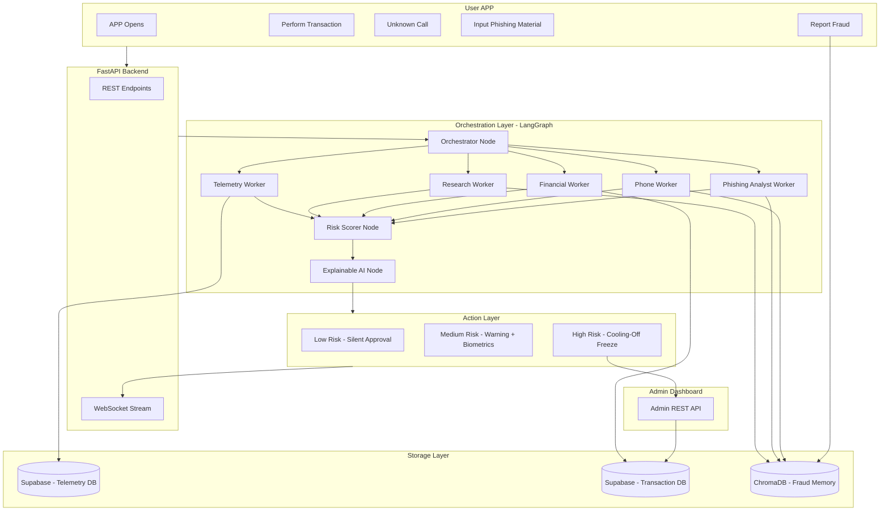

## 用户需求

为 TranSafe 多智能体银行防诈骗系统创建完整的规划文档集，输出到 `agents/doc/` 目录。这是一个 Hackathon 项目，需要一套完整的全功能 demo 支撑材料。

## 产品概述

TranSafe 是一个基于多智能体架构的在线银行防诈骗后端系统。系统通过 LangGraph 编排多个专职 AI Worker，实时分析用户在银行 APP 操作过程中的行为、交易、来电和钓鱼内容，动态评估欺诈风险并触发对应级别的保护响应。系统具备自适应学习能力，能从历史欺诈案例中持续学习新型诈骗手法。

## 核心功能

### 触发器（5类用户操作入口）

- APP 打开时的行为遥测追踪
- 用户执行银行转账/交易时的风险拦截
- 未知来电的实时识别与拦截
- 用户主动提交可疑钓鱼材料（截图/文字/链接）进行分析
- 用户主动举报欺诈案例

### 多智能体编排层（LangGraph）

- **Orchestrator**：根据触发器类型动态路由，决定调用哪些 Worker 组合
- **Telemetry Worker**：分析存储的遥测数据，识别异常行为模式（操作速度异常、设备切换等）
- **Research Worker**：对可疑电话号码/银行账户做背景调查，查询欺诈记录知识库（RAG）
- **Financial Worker**：分析交易历史和模式，识别异常资金流向
- **Phone Worker**：分析来电号码风险，结合来电历史和黑名单
- **Phishing Analyst Worker**：解析用户提交的钓鱼内容，提取欺诈特征

### 三级风险响应（Action Layer）

- **低风险（Silent Approval）**：放行交易，返回评分和可解释性报告
- **中风险（Contextual Warning + Biometrics）**：触发前端警告，要求生物认证确认
- **高风险（Coercion Pause + Cooling-Off）**：强制冻结交易 30 分钟，同时通知用户和管理员，附带 Explainable AI 说明

### 自适应欺诈记忆（Adaptive Mechanism）

- ChromaDB 向量数据库存储历史欺诈案例、诈骗者电话/账号黑名单
- 每次新欺诈事件由 LLM 总结后写入，持续学习新型诈骗话术和手法
- 供所有 Worker 做 RAG 检索

### Admin Dashboard 后端支持

- 欺诈案例列表与详情查询
- 账户冻结/解冻操作
- 统计图表数据（案例趋势、风险分布、Worker 分析结果）

## 文档交付范围

全套 6 份规划文档，输出到 `agents/doc/`：

1. PRD（产品需求文档）
2. 系统架构文档
3. Agent 流程设计文档（含 LangGraph 状态图）
4. API 设计文档（REST + WebSocket）
5. 数据库 Schema 设计文档
6. 部署与配置指南

## 技术栈

| 层次 | 技术选型 |
| --- | --- |
| 语言/运行时 | Python 3.13+，uv 包管理 |
| 后端框架 | FastAPI（REST + WebSocket） |
| 多智能体编排 | LangGraph |
| LLM 推理引擎 | Groq API（llama-3.3-70b-versatile，免费层） |
| 主数据库 | Supabase（PostgreSQL）—— Telemetry DB + Transaction DB |
| 向量数据库 | ChromaDB（本地持久化，Hackathon 友好） |
| 代码质量 | Ruff（linter）、mypy（类型检查）、pytest（测试） |


## 实现方案

文档生成任务无需改动现有代码，目标是在 `agents/doc/` 下创建 6 份结构完整、互相引用一致的 Markdown 文档。每份文档都基于已确认的系统设计决策（LangGraph 编排、Groq LLM、Supabase + ChromaDB 双数据库、5 Worker 架构、三级风险响应）进行详细规范，确保在 Hackathon 实现阶段可以直接作为开发依据。

**关键设计决策：**

1. **Worker 动态路由**：Orchestrator 维护触发器到 Worker 集合的路由映射表。不同触发器并不需要所有 Worker，例如"来电拦截"主要激活 Phone Worker + Research Worker，"执行交易"激活 Financial Worker + Telemetry Worker + Research Worker，避免不必要的 LLM 调用，节省 Groq API 用量。

2. **REST + WebSocket 混合 API**：高延迟的 Agent 分析过程（可能 5-15 秒）通过 WebSocket 流式推送中间状态（Worker 正在分析...）和最终结果，避免前端请求超时；低频操作（账户冻结/解冻、案例查询）使用 REST。

3. **ChromaDB 本地持久化**：Hackathon 阶段使用 ChromaDB 本地模式（`chromadb.PersistentClient`），避免额外云服务费用，且与 Groq 的 Embedding API 集成简单。

4. **Explainable AI 设计**：每次风险评分附带结构化的推理链（各 Worker 发现了什么 + 综合判断逻辑），以 JSON 格式返回，前端可直接渲染为用户可读的说明。

## 系统架构图



## 触发器到 Worker 路由映射

| 触发器 | 激活的 Worker |
| --- | --- |
| APP Opens（遥测） | Telemetry Worker |
| Perform Transaction（交易） | Financial Worker + Telemetry Worker + Research Worker |
| Call Interception（来电） | Phone Worker + Research Worker |
| Input Phishing Material（钓鱼） | Phishing Analyst Worker + Research Worker |
| Report Fraud（举报） | Research Worker（写入 ChromaDB + 触发 Adaptive 更新） |


## 目录结构

```
agents/doc/
├── 01_PRD.md                    # [NEW] 产品需求文档
├── 02_architecture.md           # [NEW] 系统架构文档
├── 03_agent_flow.md             # [NEW] Agent 流程设计文档（含 LangGraph 状态图）
├── 04_api_design.md             # [NEW] API 设计文档（REST + WebSocket 规范）
├── 05_database_schema.md        # [NEW] 数据库 Schema 设计文档
└── 06_deployment_guide.md       # [NEW] 部署与配置指南
```

**各文档详细说明：**

- `01_PRD.md`：产品背景、目标用户（银行用户 + 管理员）、5类用户故事、功能需求清单（按触发器组织）、非功能性需求（延迟 < 15s、Groq API 用量控制）、验收标准

- `02_architecture.md`：整体系统架构图（Mermaid）、各层组件说明、技术选型对比与决策依据（为何选 LangGraph/Groq/Supabase/ChromaDB）、数据流时序图（从触发到响应）、三级风险响应机制说明、Explainable AI 输出格式定义

- `03_agent_flow.md`：LangGraph 状态图（Mermaid）、GraphState 数据结构定义、Orchestrator 路由决策逻辑、每个 Worker 的输入/输出/职责/工具清单、Risk Scorer 评分算法说明、Adaptive Memory 更新流程

- `04_api_design.md`：REST 端点清单（User APP API + Admin API）、WebSocket 协议设计（连接/消息格式/事件类型）、请求/响应 JSON Schema、错误码规范、认证方式（API Key for Hackathon）、速率限制策略

- `05_database_schema.md`：Supabase Telemetry 表结构（telemetry_events）、Supabase Transaction 表结构（transactions、accounts、fraud_cases）、Mock 数据生成策略（Faker 字段映射）、ChromaDB 集合设计（fraud_memory collection：document 格式、metadata 字段、embedding 策略）

- `06_deployment_guide.md`：前置条件（uv、Python 3.13、Supabase 账号、Groq API Key）、依赖安装步骤（pyproject.toml 更新内容）、Supabase 初始化 SQL、ChromaDB 初始化脚本、环境变量配置（.env 模板）、本地运行命令、Hackathon demo 启动检查清单

## Agent Extensions

### SubAgent

- **code-explorer**
- Purpose: 探索 `agents/` 目录下的现有文件（pyproject.toml、main.py），确认项目结构、Python 版本约束和已有依赖，确保文档中的技术规范与实际项目配置完全一致
- Expected outcome: 确认项目基线配置，避免文档中出现与现有 pyproject.toml 冲突的依赖版本或 Python 版本要求

### Skill

- **docx**
- Purpose: 将规划文档以 Word 格式输出（可选），供 Hackathon 评审提交使用
- Expected outcome: 生成格式专业的 .docx 规划文档，包含目录、标题层级和代码块格式