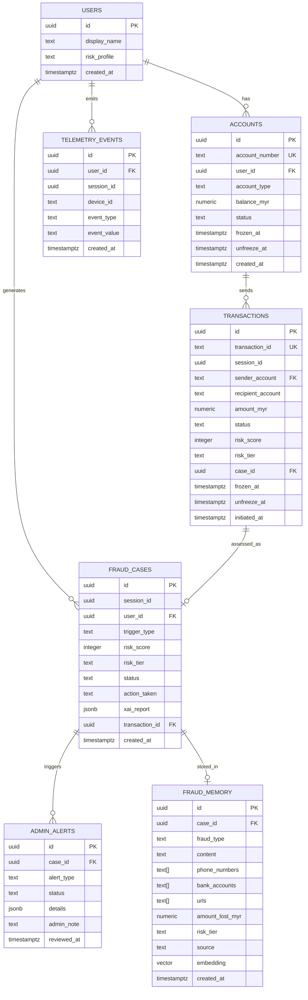

# TranSafe — Database Schema Design Document

**Version**: 1.0.0
**Date**: 2026-07-26
**Status**: Approved for Hackathon Implementation

---

## Table of Contents

1. [Database Architecture Overview](#1-database-architecture-overview)
2. [Supabase — Telemetry Schema](#2-supabase--telemetry-schema)
3. [Supabase — Public Schema (Transaction DB)](#3-supabase--public-schema-transaction-db)
4. [Supabase pgvector — Fraud Memory Table](#4-supabase-pgvector--fraud-memory-table)
5. [Entity Relationship Diagram](#5-entity-relationship-diagram)
6. [Mock Data Generation Strategy](#6-mock-data-generation-strategy)
7. [Supabase Initialisation SQL](#7-supabase-initialisation-sql)

---

## 1. Database Architecture Overview

TranSafe uses a single data store — **Supabase (PostgreSQL)** — for all structured and vector data:

| Store | Type | Purpose | Location |
|-------|------|---------|----------|
| **Supabase** | PostgreSQL | User accounts, transactions, telemetry events, fraud cases, admin alerts | Hosted (free tier) |
| **Supabase pgvector** | Vector DB (PostgreSQL extension) | Fraud memory — historical cases, scammer blacklist, RAG embeddings | Hosted (same Supabase project, `public.fraud_memory` table) |

**Schema separation within Supabase**:
- `telemetry` schema → behavioural telemetry data
- `public` schema → banking mock data (accounts, transactions, fraud_cases, admin_alerts)

---

## 2. Supabase — Telemetry Schema

### Table: `telemetry.telemetry_events`

Stores raw behavioural telemetry events emitted by the mobile app.

```sql
CREATE TABLE telemetry.telemetry_events (
    id              UUID PRIMARY KEY DEFAULT gen_random_uuid(),
    user_id         UUID NOT NULL,
    session_id      UUID NOT NULL,
    device_id       TEXT NOT NULL,
    event_type      TEXT NOT NULL,    -- see enum below
    event_value     TEXT,             -- optional payload
    app_version     TEXT,
    created_at      TIMESTAMPTZ NOT NULL DEFAULT NOW()
);

-- Index for worker queries (user + time range)
CREATE INDEX idx_telemetry_user_session
    ON telemetry.telemetry_events (user_id, session_id, created_at DESC);

CREATE INDEX idx_telemetry_created_at
    ON telemetry.telemetry_events (created_at DESC);
```

**`event_type` allowed values**:
```
APP_OPEN
APP_BACKGROUND
APP_FOREGROUND
SCREEN_VIEW
INPUT_FOCUS
INPUT_BLUR
COPY_PASTE
SCREENSHOT
SCREEN_SHARE_DETECTED
DEVICE_ORIENTATION_CHANGE
BIOMETRIC_PROMPT_SHOWN
BIOMETRIC_SUCCESS
BIOMETRIC_FAILURE
```

**Sample rows**:
```
id                                    | user_id | session_id | device_id | event_type            | event_value   | created_at
--------------------------------------+---------+------------+-----------+-----------------------+---------------+--------------------
b1c2d3e4-...                          | uuid-1  | sess-1     | dev-abc   | APP_OPEN              | null          | 2026-07-26 10:00:00
b2c3d4e5-...                          | uuid-1  | sess-1     | dev-abc   | SCREEN_VIEW           | dashboard     | 2026-07-26 10:00:01
b3c4d5e6-...                          | uuid-1  | sess-1     | dev-abc   | SCREEN_VIEW           | transfer      | 2026-07-26 10:00:45
b4c5d6e7-...                          | uuid-1  | sess-1     | dev-abc   | SCREEN_SHARE_DETECTED | active        | 2026-07-26 10:01:00
```

---

## 3. Supabase — Public Schema (Transaction DB)

### Table: `public.accounts`

Mock bank accounts for the Hackathon demo.

```sql
CREATE TABLE public.accounts (
    id              UUID PRIMARY KEY DEFAULT gen_random_uuid(),
    account_number  TEXT UNIQUE NOT NULL,  -- format: XXXX-XXXX-XXXX-XXXX
    user_id         UUID NOT NULL,
    account_type    TEXT NOT NULL DEFAULT 'SAVINGS',  -- SAVINGS | CURRENT
    balance_myr     NUMERIC(12, 2) NOT NULL DEFAULT 0.00,
    status          TEXT NOT NULL DEFAULT 'active',
    -- status: active | frozen | closed
    frozen_at       TIMESTAMPTZ,
    frozen_by       TEXT,   -- 'system' | 'admin'
    frozen_reason   TEXT,
    unfreeze_at     TIMESTAMPTZ,  -- set for auto-cooling-off unfreeze
    created_at      TIMESTAMPTZ NOT NULL DEFAULT NOW(),
    updated_at      TIMESTAMPTZ NOT NULL DEFAULT NOW()
);

CREATE INDEX idx_accounts_user_id ON public.accounts (user_id);
CREATE INDEX idx_accounts_status ON public.accounts (status);
```

---

### Table: `public.transactions`

Mock transaction records.

```sql
CREATE TABLE public.transactions (
    id                  UUID PRIMARY KEY DEFAULT gen_random_uuid(),
    transaction_id      TEXT UNIQUE NOT NULL,  -- app-generated ID
    session_id          UUID,
    sender_account      TEXT NOT NULL REFERENCES public.accounts(account_number),
    recipient_account   TEXT NOT NULL,
    recipient_name      TEXT,
    amount_myr          NUMERIC(12, 2) NOT NULL,
    currency            TEXT NOT NULL DEFAULT 'MYR',
    description         TEXT,
    status              TEXT NOT NULL DEFAULT 'pending',
    -- status: pending | approved | frozen | cooling_off_expired | completed | rejected
    risk_score          INTEGER,        -- 0-100, set after assessment
    risk_tier           TEXT,           -- LOW | MEDIUM | HIGH
    case_id             UUID,           -- FK to fraud_cases if assessed
    frozen_at           TIMESTAMPTZ,
    unfreeze_at         TIMESTAMPTZ,
    initiated_at        TIMESTAMPTZ NOT NULL,
    assessed_at         TIMESTAMPTZ,
    completed_at        TIMESTAMPTZ,
    created_at          TIMESTAMPTZ NOT NULL DEFAULT NOW()
);

CREATE INDEX idx_transactions_sender    ON public.transactions (sender_account, initiated_at DESC);
CREATE INDEX idx_transactions_status    ON public.transactions (status);
CREATE INDEX idx_transactions_session   ON public.transactions (session_id);
CREATE INDEX idx_transactions_risk_tier ON public.transactions (risk_tier);
```

---

### Table: `public.fraud_cases`

Central record for every risk assessment event.

```sql
CREATE TABLE public.fraud_cases (
    id              UUID PRIMARY KEY DEFAULT gen_random_uuid(),
    session_id      UUID NOT NULL,
    user_id         UUID NOT NULL,
    trigger_type    TEXT NOT NULL,
    -- TELEMETRY | TRANSACTION | CALL | PHISHING | REPORT
    risk_score      INTEGER,
    risk_tier       TEXT,           -- LOW | MEDIUM | HIGH
    status          TEXT NOT NULL DEFAULT 'pending',
    -- approved | pending_biometric | frozen | reported | reviewed
    action_taken    TEXT,
    -- APPROVE | BIOMETRIC_CHALLENGE | FREEZE_30_MIN | MEMORY_UPDATE
    xai_report      JSONB,          -- full XAI JSON from Explainable AI Node
    transaction_id  UUID,           -- FK if trigger was TRANSACTION
    caller_number   TEXT,           -- set if trigger was CALL
    phishing_source TEXT,           -- set if trigger was PHISHING
    created_at      TIMESTAMPTZ NOT NULL DEFAULT NOW(),
    updated_at      TIMESTAMPTZ NOT NULL DEFAULT NOW()
);

CREATE INDEX idx_fraud_cases_user_id     ON public.fraud_cases (user_id, created_at DESC);
CREATE INDEX idx_fraud_cases_risk_tier   ON public.fraud_cases (risk_tier);
CREATE INDEX idx_fraud_cases_status      ON public.fraud_cases (status);
CREATE INDEX idx_fraud_cases_trigger     ON public.fraud_cases (trigger_type);
CREATE INDEX idx_fraud_cases_created_at  ON public.fraud_cases (created_at DESC);
```

---

### Table: `public.admin_alerts`

Alerts generated for HIGH risk events, reviewed by admin.

```sql
CREATE TABLE public.admin_alerts (
    id              UUID PRIMARY KEY DEFAULT gen_random_uuid(),
    case_id         UUID NOT NULL REFERENCES public.fraud_cases(id),
    alert_type      TEXT NOT NULL,
    -- HIGH_RISK_FREEZE | ACCOUNT_ACTIVITY | MANUAL_REPORT
    status          TEXT NOT NULL DEFAULT 'pending',
    -- pending | reviewed | dismissed
    details         JSONB,          -- alert-specific details
    admin_note      TEXT,
    reviewed_at     TIMESTAMPTZ,
    reviewed_by     TEXT,
    created_at      TIMESTAMPTZ NOT NULL DEFAULT NOW()
);

CREATE INDEX idx_admin_alerts_status      ON public.admin_alerts (status, created_at DESC);
CREATE INDEX idx_admin_alerts_case_id     ON public.admin_alerts (case_id);
```

---

### Table: `public.users`

Mock user profiles (pseudonymous).

```sql
CREATE TABLE public.users (
    id              UUID PRIMARY KEY DEFAULT gen_random_uuid(),
    display_name    TEXT NOT NULL,    -- fake name from Faker
    risk_profile    TEXT DEFAULT 'normal',
    -- normal | elevated | high
    created_at      TIMESTAMPTZ NOT NULL DEFAULT NOW()
);
```

---

## 4. Supabase pgvector — Fraud Memory Table

### Table: `public.fraud_memory`

All fraud intelligence (historical cases, scammer blacklist, RAG embeddings) is stored in a single pgvector table inside the same Supabase project — no separate vector database required.

**Embedding model**: Groq `nomic-embed-text-v1.5` — 768-dimensional vectors, cosine similarity.

```sql
-- Enable pgvector extension (run once per Supabase project)
CREATE EXTENSION IF NOT EXISTS vector;

-- Fraud memory table
CREATE TABLE public.fraud_memory (
    id              UUID PRIMARY KEY DEFAULT gen_random_uuid(),
    case_id         UUID REFERENCES public.fraud_cases(id) ON DELETE SET NULL,
    fraud_type      TEXT NOT NULL,
    -- macau_scam | investment_scam | impersonation_scam | love_scam
    -- phishing   | parcel_scam     | other
    content         TEXT NOT NULL,     -- full narrative text used for embedding
    phone_numbers   TEXT[],            -- array of associated phone numbers
    bank_accounts   TEXT[],            -- array of associated bank accounts
    urls            TEXT[],            -- array of phishing URLs
    amount_lost_myr NUMERIC(12, 2) DEFAULT 0.00,
    risk_tier       TEXT NOT NULL DEFAULT 'HIGH'
                    CHECK (risk_tier IN ('LOW', 'MEDIUM', 'HIGH')),
    source          TEXT NOT NULL DEFAULT 'user_report'
                    CHECK (source IN ('user_report', 'system_detected')),
    language        TEXT NOT NULL DEFAULT 'en'
                    CHECK (language IN ('en', 'ms')),
    embedding       vector(768),       -- nomic-embed-text-v1.5 embedding
    created_at      TIMESTAMPTZ NOT NULL DEFAULT NOW()
);

-- IVFFlat index for approximate nearest-neighbour search (cosine)
-- Tune lists based on row count: sqrt(n_rows), minimum 10
CREATE INDEX idx_fraud_memory_embedding
    ON public.fraud_memory
    USING ivfflat (embedding vector_cosine_ops)
    WITH (lists = 50);

-- B-tree indexes for blacklist lookups
CREATE INDEX idx_fraud_memory_fraud_type ON public.fraud_memory (fraud_type);
CREATE INDEX idx_fraud_memory_created_at ON public.fraud_memory (created_at DESC);
```

### Supabase RPC: `search_fraud_memory`

Exposed as a Supabase Edge Function / RPC so the Python backend can call it via `supabase.rpc()`.

```sql
CREATE OR REPLACE FUNCTION search_fraud_memory(
    query_embedding vector(768),
    match_threshold FLOAT DEFAULT 0.75,
    match_count     INT   DEFAULT 5
)
RETURNS TABLE (
    id              UUID,
    case_id         UUID,
    fraud_type      TEXT,
    content         TEXT,
    phone_numbers   TEXT[],
    bank_accounts   TEXT[],
    urls            TEXT[],
    amount_lost_myr NUMERIC,
    risk_tier       TEXT,
    source          TEXT,
    similarity      FLOAT
)
LANGUAGE plpgsql
AS $$
BEGIN
    RETURN QUERY
    SELECT
        fm.id,
        fm.case_id,
        fm.fraud_type,
        fm.content,
        fm.phone_numbers,
        fm.bank_accounts,
        fm.urls,
        fm.amount_lost_myr,
        fm.risk_tier,
        1 - (fm.embedding <=> query_embedding) AS similarity
    FROM public.fraud_memory fm
    WHERE 1 - (fm.embedding <=> query_embedding) > match_threshold
    ORDER BY fm.embedding <=> query_embedding
    LIMIT match_count;
END;
$$;
```

### Python Usage (Backend)

```python
# src/db/vector_store.py
import os
from groq import Groq
from supabase import create_client

supabase = create_client(os.environ["SUPABASE_URL"], os.environ["SUPABASE_SERVICE_KEY"])
groq_client = Groq(api_key=os.environ["GROQ_API_KEY"])


def embed_text(text: str) -> list[float]:
    """Generate 768-dim embedding via Groq nomic-embed-text-v1.5."""
    response = groq_client.embeddings.create(
        model="nomic-embed-text-v1.5",
        input=text,
    )
    return response.data[0].embedding


def search_fraud_memory(query: str, threshold: float = 0.75, top_k: int = 5) -> list[dict]:
    """Semantic search against fraud memory."""
    query_embedding = embed_text(query)
    result = supabase.rpc(
        "search_fraud_memory",
        {
            "query_embedding": query_embedding,
            "match_threshold": threshold,
            "match_count": top_k,
        }
    ).execute()
    return result.data


def add_fraud_memory(case_id: str, fraud_type: str, content: str, metadata: dict) -> dict:
    """Insert a new fraud case into the vector store."""
    embedding = embed_text(content)
    row = {
        "case_id": case_id,
        "fraud_type": fraud_type,
        "content": content,
        "embedding": embedding,
        **metadata,  # phone_numbers, bank_accounts, urls, amount_lost_myr, risk_tier, source, language
    }
    result = supabase.table("fraud_memory").insert(row).execute()
    return result.data[0]


def check_blacklist(phone: str = None, url: str = None) -> list[dict]:
    """Check if a phone number or URL appears in any known fraud case."""
    query_parts = []
    if phone:
        query_parts.append(f"phone number {phone}")
    if url:
        query_parts.append(f"URL {url}")
    query = " ".join(query_parts)
    return search_fraud_memory(query, threshold=0.80, top_k=3)
```

### Field Reference

| Field | Type | Description |
|-------|------|-------------|
| `id` | UUID | Primary key |
| `case_id` | UUID (FK) | Links to `public.fraud_cases` (nullable — pre-seeded data has no case) |
| `fraud_type` | TEXT | `macau_scam`, `investment_scam`, `impersonation_scam`, `love_scam`, `phishing`, `parcel_scam`, `other` |
| `content` | TEXT | Full narrative text used for embedding |
| `phone_numbers` | TEXT[] | Array of associated phone numbers |
| `bank_accounts` | TEXT[] | Array of associated bank account numbers |
| `urls` | TEXT[] | Array of phishing URLs |
| `amount_lost_myr` | NUMERIC | Amount lost in MYR |
| `risk_tier` | TEXT | `HIGH`, `MEDIUM`, `LOW` |
| `source` | TEXT | `user_report` or `system_detected` |
| `embedding` | vector(768) | nomic-embed-text-v1.5 embedding |


## 5. Entity Relationship Diagram



---

## 6. Mock Data Generation Strategy

Use the Python `faker` library to seed the Supabase database with realistic demo data.

### Seed Script Overview

```python
# seeds/seed_db.py

from faker import Faker
from faker.providers import bank, phone_number
import random

fake = Faker('ms_MY')  # Malaysian locale

# ── Users (10 mock users) ───────────────────────────────────────
users = [
    {
        "id": str(uuid4()),
        "display_name": fake.name(),
        "risk_profile": random.choice(["normal"] * 8 + ["elevated", "high"])
    }
    for _ in range(10)
]

# ── Accounts (1-2 per user) ────────────────────────────────────
accounts = []
for user in users:
    num_accounts = random.randint(1, 2)
    for _ in range(num_accounts):
        accounts.append({
            "account_number": fake_account_number(),  # XXXX-XXXX-XXXX-XXXX
            "user_id": user["id"],
            "balance_myr": round(random.uniform(500, 50000), 2),
            "status": "active"
        })

# ── Transactions (90-day history, 5-30 per user) ───────────────
# Mix of:
# - Normal small transfers (RM 50 - RM 500, known recipients)
# - Anomalous large transfers (for demo HIGH risk cases)
# - Night-time transfers
# - Transfers to scammer accounts

# ── Pre-seeded Scammer Data (Supabase pgvector) ───────────────
DEMO_SCAMMER_PHONES = [
    "0161234567",  # Macau scam
    "0197654321",  # Investment scam
    "0123456789",  # Phishing SMS
]

DEMO_SCAMMER_ACCOUNTS = [
    "7653-1234-5678-9012",  # Known fraud account
    "8888-0000-1111-2222",  # Investment scam mule
]

DEMO_PHISHING_URLS = [
    "http://maybank2u-verify.xyz",
    "https://cimb-secure-login.net",
]

# Seed fraud_memory via vector_store helper
from src.db.vector_store import add_fraud_memory

DEMO_FRAUD_MEMORIES = [
    {
        "fraud_type": "macau_scam",
        "content": (
            "Fraud Type: Macau Scam / Impersonation. "
            "Summary: Victim received call from someone claiming to be a Royal Malaysia "
            "Police officer, stating victim's identity was used in drug trafficking. "
            "Caller instructed victim to transfer RM 12,000 to a 'safe account'. "
            "Caller ID spoofed to appear as official PDRM number. "
            "Resolution: Funds unrecoverable. Case reported to PDRM."
        ),
        "metadata": {
            "phone_numbers": ["0161234567", "0197654321"],
            "bank_accounts": ["7653-1234-5678-9012"],
            "urls": [],
            "amount_lost_myr": 12000.00,
            "risk_tier": "HIGH",
            "source": "user_report",
            "language": "en",
        },
    },
    {
        "fraud_type": "phishing",
        "content": (
            "Fraud Type: Phishing SMS. "
            "Summary: Victim received SMS with link to fake Maybank2u login page. "
            "URL: http://maybank2u-verify.xyz — page harvested banking credentials. "
            "Victim's account drained of RM 4,500 within 30 minutes."
        ),
        "metadata": {
            "phone_numbers": ["0123456789"],
            "bank_accounts": [],
            "urls": ["http://maybank2u-verify.xyz"],
            "amount_lost_myr": 4500.00,
            "risk_tier": "HIGH",
            "source": "system_detected",
            "language": "en",
        },
    },
    {
        "fraud_type": "investment_scam",
        "content": (
            "Fraud Type: Investment Scam. "
            "Summary: Victim was recruited into a 'crypto trading group' via WhatsApp. "
            "Promised 30% monthly returns. Victim deposited RM 25,000 in three tranches. "
            "After withdrawal request, contact went silent. Platform disappeared."
        ),
        "metadata": {
            "phone_numbers": ["0197654321"],
            "bank_accounts": ["8888-0000-1111-2222"],
            "urls": [],
            "amount_lost_myr": 25000.00,
            "risk_tier": "HIGH",
            "source": "user_report",
            "language": "en",
        },
    },
]

for entry in DEMO_FRAUD_MEMORIES:
    add_fraud_memory(
        case_id=None,  # pre-seeded, no linked fraud_case row
        fraud_type=entry["fraud_type"],
        content=entry["content"],
        metadata=entry["metadata"],
    )
```

### Demo Scenarios Seeded

| Scenario | Setup |
|----------|-------|
| **HIGH risk transaction** | User `demo_user_1` attempts RM 9,800 transfer to scammer account `7653-1234-5678-9012` |
| **Known scammer call** | Phone number `0161234567` in pgvector blacklist with 3 prior Macau scam cases |
| **Phishing SMS** | Pre-crafted SMS content referencing `http://maybank2u-verify.xyz` (in pgvector blacklist) |
| **Normal LOW risk** | User `demo_user_2` sends RM 150 to a known recipient (repeat transaction) |
| **MEDIUM risk transaction** | First-time recipient + unusual hour, but amount within range |

---

## 7. Supabase Initialisation SQL

Full SQL to run in Supabase SQL Editor to set up all schemas and tables:

```sql
-- ── Create schemas ────────────────────────────────────────────
CREATE SCHEMA IF NOT EXISTS telemetry;

-- ── USERS ─────────────────────────────────────────────────────
CREATE TABLE IF NOT EXISTS public.users (
    id              UUID PRIMARY KEY DEFAULT gen_random_uuid(),
    display_name    TEXT NOT NULL,
    risk_profile    TEXT NOT NULL DEFAULT 'normal'
                    CHECK (risk_profile IN ('normal', 'elevated', 'high')),
    created_at      TIMESTAMPTZ NOT NULL DEFAULT NOW()
);

-- ── ACCOUNTS ──────────────────────────────────────────────────
CREATE TABLE IF NOT EXISTS public.accounts (
    id              UUID PRIMARY KEY DEFAULT gen_random_uuid(),
    account_number  TEXT UNIQUE NOT NULL,
    user_id         UUID NOT NULL REFERENCES public.users(id),
    account_type    TEXT NOT NULL DEFAULT 'SAVINGS'
                    CHECK (account_type IN ('SAVINGS', 'CURRENT')),
    balance_myr     NUMERIC(12, 2) NOT NULL DEFAULT 0.00,
    status          TEXT NOT NULL DEFAULT 'active'
                    CHECK (status IN ('active', 'frozen', 'closed')),
    frozen_at       TIMESTAMPTZ,
    frozen_by       TEXT,
    frozen_reason   TEXT,
    unfreeze_at     TIMESTAMPTZ,
    created_at      TIMESTAMPTZ NOT NULL DEFAULT NOW(),
    updated_at      TIMESTAMPTZ NOT NULL DEFAULT NOW()
);

CREATE INDEX IF NOT EXISTS idx_accounts_user_id ON public.accounts (user_id);
CREATE INDEX IF NOT EXISTS idx_accounts_status  ON public.accounts (status);

-- ── TRANSACTIONS ───────────────────────────────────────────────
CREATE TABLE IF NOT EXISTS public.transactions (
    id                  UUID PRIMARY KEY DEFAULT gen_random_uuid(),
    transaction_id      TEXT UNIQUE NOT NULL,
    session_id          UUID,
    sender_account      TEXT NOT NULL REFERENCES public.accounts(account_number),
    recipient_account   TEXT NOT NULL,
    recipient_name      TEXT,
    amount_myr          NUMERIC(12, 2) NOT NULL,
    currency            TEXT NOT NULL DEFAULT 'MYR',
    description         TEXT,
    status              TEXT NOT NULL DEFAULT 'pending'
                        CHECK (status IN (
                            'pending', 'approved', 'frozen',
                            'cooling_off_expired', 'completed', 'rejected'
                        )),
    risk_score          INTEGER CHECK (risk_score BETWEEN 0 AND 100),
    risk_tier           TEXT CHECK (risk_tier IN ('LOW', 'MEDIUM', 'HIGH')),
    case_id             UUID,
    frozen_at           TIMESTAMPTZ,
    unfreeze_at         TIMESTAMPTZ,
    initiated_at        TIMESTAMPTZ NOT NULL,
    assessed_at         TIMESTAMPTZ,
    completed_at        TIMESTAMPTZ,
    created_at          TIMESTAMPTZ NOT NULL DEFAULT NOW()
);

CREATE INDEX IF NOT EXISTS idx_transactions_sender
    ON public.transactions (sender_account, initiated_at DESC);
CREATE INDEX IF NOT EXISTS idx_transactions_status
    ON public.transactions (status);

-- ── FRAUD_CASES ────────────────────────────────────────────────
CREATE TABLE IF NOT EXISTS public.fraud_cases (
    id              UUID PRIMARY KEY DEFAULT gen_random_uuid(),
    session_id      UUID NOT NULL,
    user_id         UUID NOT NULL REFERENCES public.users(id),
    trigger_type    TEXT NOT NULL
                    CHECK (trigger_type IN (
                        'TELEMETRY', 'TRANSACTION', 'CALL', 'PHISHING', 'REPORT'
                    )),
    risk_score      INTEGER CHECK (risk_score BETWEEN 0 AND 100),
    risk_tier       TEXT CHECK (risk_tier IN ('LOW', 'MEDIUM', 'HIGH')),
    status          TEXT NOT NULL DEFAULT 'pending'
                    CHECK (status IN (
                        'pending', 'approved', 'pending_biometric',
                        'frozen', 'reported', 'reviewed'
                    )),
    action_taken    TEXT,
    xai_report      JSONB,
    transaction_id  UUID REFERENCES public.transactions(id),
    caller_number   TEXT,
    phishing_source TEXT,
    created_at      TIMESTAMPTZ NOT NULL DEFAULT NOW(),
    updated_at      TIMESTAMPTZ NOT NULL DEFAULT NOW()
);

CREATE INDEX IF NOT EXISTS idx_fraud_cases_user_id
    ON public.fraud_cases (user_id, created_at DESC);
CREATE INDEX IF NOT EXISTS idx_fraud_cases_risk_tier
    ON public.fraud_cases (risk_tier);
CREATE INDEX IF NOT EXISTS idx_fraud_cases_created_at
    ON public.fraud_cases (created_at DESC);

-- ── ADMIN_ALERTS ───────────────────────────────────────────────
CREATE TABLE IF NOT EXISTS public.admin_alerts (
    id              UUID PRIMARY KEY DEFAULT gen_random_uuid(),
    case_id         UUID NOT NULL REFERENCES public.fraud_cases(id),
    alert_type      TEXT NOT NULL
                    CHECK (alert_type IN (
                        'HIGH_RISK_FREEZE', 'ACCOUNT_ACTIVITY', 'MANUAL_REPORT'
                    )),
    status          TEXT NOT NULL DEFAULT 'pending'
                    CHECK (status IN ('pending', 'reviewed', 'dismissed')),
    details         JSONB,
    admin_note      TEXT,
    reviewed_at     TIMESTAMPTZ,
    reviewed_by     TEXT,
    created_at      TIMESTAMPTZ NOT NULL DEFAULT NOW()
);

CREATE INDEX IF NOT EXISTS idx_admin_alerts_status
    ON public.admin_alerts (status, created_at DESC);

-- ── TELEMETRY_EVENTS ───────────────────────────────────────────
CREATE TABLE IF NOT EXISTS telemetry.telemetry_events (
    id              UUID PRIMARY KEY DEFAULT gen_random_uuid(),
    user_id         UUID NOT NULL,
    session_id      UUID NOT NULL,
    device_id       TEXT NOT NULL,
    event_type      TEXT NOT NULL,
    event_value     TEXT,
    app_version     TEXT,
    created_at      TIMESTAMPTZ NOT NULL DEFAULT NOW()
);

CREATE INDEX IF NOT EXISTS idx_telemetry_user_session
    ON telemetry.telemetry_events (user_id, session_id, created_at DESC);
CREATE INDEX IF NOT EXISTS idx_telemetry_created_at
    ON telemetry.telemetry_events (created_at DESC);

-- ── Auto-update updated_at trigger ────────────────────────────
CREATE OR REPLACE FUNCTION update_updated_at_column()
RETURNS TRIGGER AS $$
BEGIN
    NEW.updated_at = NOW();
    RETURN NEW;
END;
$$ LANGUAGE plpgsql;

CREATE TRIGGER trigger_accounts_updated_at
    BEFORE UPDATE ON public.accounts
    FOR EACH ROW EXECUTE FUNCTION update_updated_at_column();

CREATE TRIGGER trigger_fraud_cases_updated_at
    BEFORE UPDATE ON public.fraud_cases
    FOR EACH ROW EXECUTE FUNCTION update_updated_at_column();

-- ── PGVECTOR EXTENSION ─────────────────────────────────────────
CREATE EXTENSION IF NOT EXISTS vector;

-- ── FRAUD_MEMORY (pgvector) ────────────────────────────────────
CREATE TABLE IF NOT EXISTS public.fraud_memory (
    id              UUID PRIMARY KEY DEFAULT gen_random_uuid(),
    case_id         UUID REFERENCES public.fraud_cases(id) ON DELETE SET NULL,
    fraud_type      TEXT NOT NULL
                    CHECK (fraud_type IN (
                        'macau_scam', 'investment_scam', 'impersonation_scam',
                        'love_scam', 'phishing', 'parcel_scam', 'other'
                    )),
    content         TEXT NOT NULL,
    phone_numbers   TEXT[],
    bank_accounts   TEXT[],
    urls            TEXT[],
    amount_lost_myr NUMERIC(12, 2) DEFAULT 0.00,
    risk_tier       TEXT NOT NULL DEFAULT 'HIGH'
                    CHECK (risk_tier IN ('LOW', 'MEDIUM', 'HIGH')),
    source          TEXT NOT NULL DEFAULT 'user_report'
                    CHECK (source IN ('user_report', 'system_detected')),
    language        TEXT NOT NULL DEFAULT 'en'
                    CHECK (language IN ('en', 'ms')),
    embedding       vector(768),
    created_at      TIMESTAMPTZ NOT NULL DEFAULT NOW()
);

CREATE INDEX IF NOT EXISTS idx_fraud_memory_embedding
    ON public.fraud_memory
    USING ivfflat (embedding vector_cosine_ops)
    WITH (lists = 50);

CREATE INDEX IF NOT EXISTS idx_fraud_memory_fraud_type
    ON public.fraud_memory (fraud_type);

CREATE INDEX IF NOT EXISTS idx_fraud_memory_created_at
    ON public.fraud_memory (created_at DESC);

-- ── search_fraud_memory RPC ────────────────────────────────────
CREATE OR REPLACE FUNCTION search_fraud_memory(
    query_embedding vector(768),
    match_threshold FLOAT DEFAULT 0.75,
    match_count     INT   DEFAULT 5
)
RETURNS TABLE (
    id              UUID,
    case_id         UUID,
    fraud_type      TEXT,
    content         TEXT,
    phone_numbers   TEXT[],
    bank_accounts   TEXT[],
    urls            TEXT[],
    amount_lost_myr NUMERIC,
    risk_tier       TEXT,
    source          TEXT,
    similarity      FLOAT
)
LANGUAGE plpgsql
AS $$
BEGIN
    RETURN QUERY
    SELECT
        fm.id,
        fm.case_id,
        fm.fraud_type,
        fm.content,
        fm.phone_numbers,
        fm.bank_accounts,
        fm.urls,
        fm.amount_lost_myr,
        fm.risk_tier,
        fm.source,
        1 - (fm.embedding <=> query_embedding) AS similarity
    FROM public.fraud_memory fm
    WHERE 1 - (fm.embedding <=> query_embedding) > match_threshold
    ORDER BY fm.embedding <=> query_embedding
    LIMIT match_count;
END;
$$;
```
