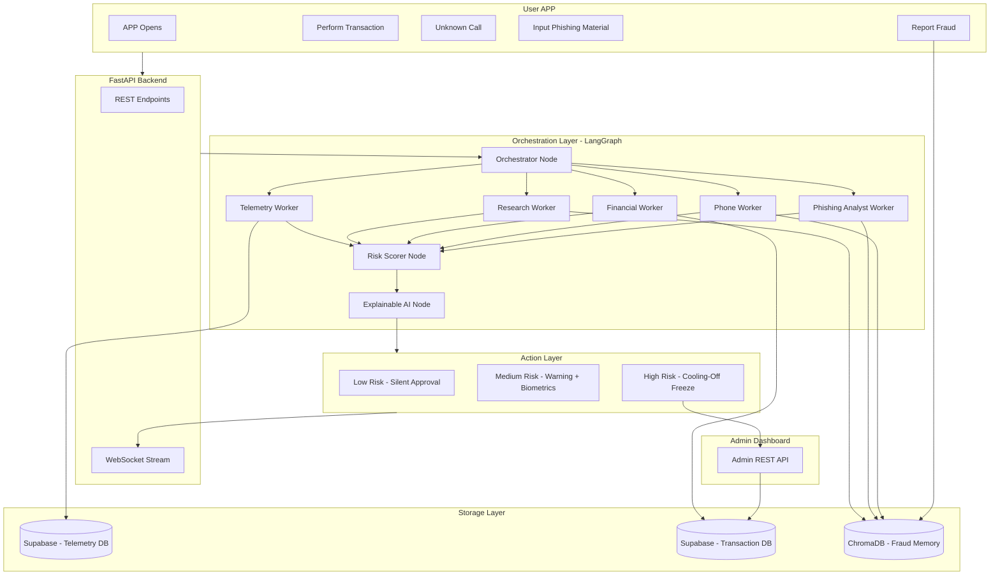

# CodeBuddy Chat Conversation
_Exported on 2026/7/26 18:12:44_

**User**

<user_info>
OS Version: win32
Shell: PowerShell  (Windows)
Workspace Folder: d:/Github/transafe
Note: Prefer using absolute paths over relative paths as tool call args when possible.
</user_info>

<git_status>
This is the git status at the start of the conversation. Note that this status is a snapshot in time, and will not update during the conversation.
On branch main
Your branch is up to date with 'origin/main'.

Untracked files:
  (use "git add <file>..." to include in what will be committed)
	agents/

nothing added to commit but untracked files present (use "git add" to track)
</git_status>


<project_context>


<project_layout>
Below is a snapshot of the current workspace's file structure at the start of the conversation. This snapshot will NOT update during the conversation.
d:\Github\transafe\
- agents/
[6 files in subtree: 1 *.md, 1 *.drawio, 1 *.py, ...]

Note: File extension counts do not include files ignored by .gitignore.
</project_layout>
</project_context>

<additional_data>
Below are some potentially helpful/relevant pieces of information for figuring out how to respond:

current_time: Sunday, July 26, 2026
</additional_data>

<system_reminder>
<plan_mode_reminder>
Plan mode is active. But plan need to be prepared. The user indicated that they do not want you to execute yet -- you MUST NOT make any edits, run any non-readonly tools (including changing configs or making commits), or otherwise make any changes to the system. This supersedes any other instructions you have received (for example, to make edits). Instead, you should:

1. Your goal is to clarify user requirements and locate the modification targets. The create_plan tool will invoke a specialized planning agent to explore the codebase and design the technical solution.

2. Prefer making reasonable assumptions based on context. Only ask the user for clarification when:
   - The user's requirement itself is unclear or ambiguous
   - The scope is too broad to be actionable
   - Multiple implementation approaches exist and require user selection

   When asking questions, ask all questions together in one round at the start.

3. If you need to ask questions, do a quick pre-read (key files) to avoid asking questions that the code already answers, then ask all questions together at the start. Keep questions focused on requirements, not implementation choices.

4. When you're done researching, present your plan by calling the plan_create tool, which will prompt the user to confirm the plan. Do NOT make any file changes or run any tools that modify the system state in any way until the user has confirmed the plan.

5. Keep exploration lightweight - focus on quickly understanding the user's intent and locating modification targets. The planning subagent will conduct deeper exploration when creating the detailed plan.

6. NEVER call the create_plan tool during the requirements clarification phase. The create_plan tool must NOT be invoked in parallel with any other tools or questions.

7. After executing the create_plan tool, the plan details are stored in the user directory and will be automatically brought into context after user confirmation. Therefore, do NOT output any plan content after calling create_plan - simply wait for the user to confirm whether to proceed with the current plan.

8. When creating a plan, do not use the todo_write tool, use the create_plan tool to create the plan.
</plan_mode_reminder>
</system_reminder>

<user_query>
Goal:
I would like to create a backend system for a multiagentic system for online banking scam prevention. 

Input:
the current /agents folder is a python project based on uv. The .drawio xml file is the initial draft of my multiagent system design. 

Output:
create the planning documents under the directory /doc including for this project

Steps:
The first_draft.drawio is a very highlevel plan. You should ask me in detail question on how to build the system to confirm my needs. DO NOT GUESS my intention, any thing you are not sure you must ask me.
</user_query>

---

**CodeBuddy**

🔧 **Tool Call**: read_file (d:/Github/transafe/agents/first_draft.drawio)


🔧 **Tool Call**: list_dir


---

**CodeBuddy**

🔧 **Tool Call**: list_dir


🔧 **Tool Call**: list_dir


🔧 **Tool Call**: read_file (d:/Github/transafe/agents/main.py)


🔧 **Tool Call**: read_file (d:/Github/transafe/agents/pyproject.toml)


🔧 **Tool Call**: read_file (d:/Github/transafe/agents/README.md)


---

**CodeBuddy**

🔧 **Tool Call**: read_file (d:/Github/transafe/agents/idea_drafts/first_draft.drawio)


---

**CodeBuddy**

我已仔细阅读了你的 `first_draft.drawio` 文件。这是一个网上银行防诈骗的多智能体系统设计草图。让我根据图表内容，向你提出详细问题，以便准确把握你的需求。

---

根据草图，我识别出以下核心组件：
- **User APP**（4个触发器：App打开、执行交易、来电拦截、输入钓鱼材料、举报欺诈）
- **Orchestration Layer**（Orchestrator + Workers：Telemetry/Research/Financial/Phone/Phishing Analyst）
- **Telemetry Database**
- **Action Layer**（低/中/高风险三级响应 + Explainable AI）
- **Adaptive Mechanism**（Fraud memory更新）
- **Admin Dashboard**（欺诈案例可视化、账户冻结/解冻）

现在我有以下问题需要你逐一确认：

🔧 **Tool Call**: ask_followup_question


---

**User**

<additional_data>
Below are some potentially helpful/relevant pieces of information for figuring out how to respond:

current_time: Sunday, July 26, 2026
</additional_data>

<system_reminder>
<plan_mode_reminder>
Plan mode is active. But plan need to be prepared. The user indicated that they do not want you to execute yet -- you MUST NOT make any edits, run any non-readonly tools (including changing configs or making commits), or otherwise make any changes to the system. This supersedes any other instructions you have received (for example, to make edits). Instead, you should:

1. Your goal is to clarify user requirements and locate the modification targets. The create_plan tool will invoke a specialized planning agent to explore the codebase and design the technical solution.

2. Prefer making reasonable assumptions based on context. Only ask the user for clarification when:
   - The user's requirement itself is unclear or ambiguous
   - The scope is too broad to be actionable
   - Multiple implementation approaches exist and require user selection

   When asking questions, ask all questions together in one round at the start.

3. If you need to ask questions, do a quick pre-read (key files) to avoid asking questions that the code already answers, then ask all questions together at the start. Keep questions focused on requirements, not implementation choices.

4. When you're done researching, present your plan by calling the plan_create tool, which will prompt the user to confirm the plan. Do NOT make any file changes or run any tools that modify the system state in any way until the user has confirmed the plan.

5. Keep exploration lightweight - focus on quickly understanding the user's intent and locating modification targets. The planning subagent will conduct deeper exploration when creating the detailed plan.

6. NEVER call the create_plan tool during the requirements clarification phase. The create_plan tool must NOT be invoked in parallel with any other tools or questions.

7. After executing the create_plan tool, the plan details are stored in the user directory and will be automatically brought into context after user confirmation. Therefore, do NOT output any plan content after calling create_plan - simply wait for the user to confirm whether to proceed with the current plan.

8. When creating a plan, do not use the todo_write tool, use the create_plan tool to create the plan.
</plan_mode_reminder>
</system_reminder>

<user_query>
<question_answer>
<questions>
<question_item id="q1">
<question>这个后端系统的目标用户和部署场景是什么？</question>
<answers>
this is for hackathon
</answers>
</question_item>
<question_item id="q2">
<question>草图中的 Orchestrator 是如何协调各个 Worker 的？你希望采用哪种多智能体框架？</question>
<answers>
LangGraph（基于图的状态机编排）
</answers>
</question_item>
<question_item id="q3">
<question>草图中的5个 Worker（Telemetry/Research/Financial/Phone/Phishing Analyst）是并行执行还是按需选择执行？</question>
<answers>
我的想法是根据需求来指定worker。需要你的建议
</answers>
</question_item>
<question_item id="q4">
<question>Action Layer 的三级风险响应（低/中/高），后端需要做什么？</question>
<answers>
两者都需要：返回评分 + 触发部分后端操作, This is for a hackathon
</answers>
</question_item>
</questions>
</question_answer>
</user_query>

---

**CodeBuddy**

好的，我已经了解了你的基本需求。在进入下一轮问题之前，让我先确认我对草图的理解：

**草图核心架构：**
- User APP → 4种触发器（App打开/执行交易/来电拦截/输入钓鱼材料/举报欺诈）
- Orchestration Layer → Orchestrator + 5个Worker（LangGraph编排）
- Telemetry Database
- Action Layer → 三级风险响应（低/中/高）+ Explainable AI
- Adaptive Mechanism → 欺诈记忆更新
- Admin Dashboard → 欺诈案例可视化 + 账户冻结/解冻

这是一个 Hackathon 项目，现在我需要进一步了解细节：

🔧 **Tool Call**: ask_followup_question


---

**User**

<additional_data>
Below are some potentially helpful/relevant pieces of information for figuring out how to respond:

current_time: Sunday, July 26, 2026
</additional_data>

<system_reminder>
<plan_mode_reminder>
Plan mode is active. But plan need to be prepared. The user indicated that they do not want you to execute yet -- you MUST NOT make any edits, run any non-readonly tools (including changing configs or making commits), or otherwise make any changes to the system. This supersedes any other instructions you have received (for example, to make edits). Instead, you should:

1. Your goal is to clarify user requirements and locate the modification targets. The create_plan tool will invoke a specialized planning agent to explore the codebase and design the technical solution.

2. Prefer making reasonable assumptions based on context. Only ask the user for clarification when:
   - The user's requirement itself is unclear or ambiguous
   - The scope is too broad to be actionable
   - Multiple implementation approaches exist and require user selection

   When asking questions, ask all questions together in one round at the start.

3. If you need to ask questions, do a quick pre-read (key files) to avoid asking questions that the code already answers, then ask all questions together at the start. Keep questions focused on requirements, not implementation choices.

4. When you're done researching, present your plan by calling the plan_create tool, which will prompt the user to confirm the plan. Do NOT make any file changes or run any tools that modify the system state in any way until the user has confirmed the plan.

5. Keep exploration lightweight - focus on quickly understanding the user's intent and locating modification targets. The planning subagent will conduct deeper exploration when creating the detailed plan.

6. NEVER call the create_plan tool during the requirements clarification phase. The create_plan tool must NOT be invoked in parallel with any other tools or questions.

7. After executing the create_plan tool, the plan details are stored in the user directory and will be automatically brought into context after user confirmation. Therefore, do NOT output any plan content after calling create_plan - simply wait for the user to confirm whether to proceed with the current plan.

8. When creating a plan, do not use the todo_write tool, use the create_plan tool to create the plan.
</plan_mode_reminder>
</system_reminder>

<user_query>
<question_answer>
<questions>
<question_item id="q5">
<question>5个Worker各自的职责是什么？请确认你的理解：</question>
<answers>
以上理解基本正确，但有部分需要调整（请在下一条消息说明）
</answers>
</question_item>
<question_item id="q6">
<question>Telemetry Database 存储什么数据？用什么数据库？</question>
<answers>
用户行为遥测（点击/滑动/输入模式这些而已。交易记录存储在另一个databse
</answers>
</question_item>
<question_item id="q7">
<question>草图中的 'Adaptive Mechanism - Summarize and update fraud memory' 具体指什么？</question>
<answers>
用向量数据库（如 ChromaDB）存储历史欺诈案例，供 Worker 做 RAG 检索, 也存储诈骗者的信息，如电话号码，银行户口等等。adaptive是要agents学习新的诈骗话术、手法。
</answers>
</question_item>
<question_item id="q8">
<question>后端 API 如何暴露给 User APP 和 Admin Dashboard？</question>
<answers>
暂未决定，需要建议
</answers>
</question_item>
<question_item id="q9">
<question>使用哪个 LLM 作为 Agent 的推理引擎？</question>
<answers>
暂未决定，需要建议, 暂未决定，需要建议。暂时是想用groq 上面的免费模型api
</answers>
</question_item>
</questions>
</question_answer>
</user_query>

---

**CodeBuddy**

好的，请告诉我 Worker 职责需要调整的部分，同时我还有几个关键问题：

🔧 **Tool Call**: ask_followup_question


---

**User**

<additional_data>
Below are some potentially helpful/relevant pieces of information for figuring out how to respond:

current_time: Sunday, July 26, 2026
</additional_data>

<system_reminder>
<plan_mode_reminder>
Plan mode is active. But plan need to be prepared. The user indicated that they do not want you to execute yet -- you MUST NOT make any edits, run any non-readonly tools (including changing configs or making commits), or otherwise make any changes to the system. This supersedes any other instructions you have received (for example, to make edits). Instead, you should:

1. Your goal is to clarify user requirements and locate the modification targets. The create_plan tool will invoke a specialized planning agent to explore the codebase and design the technical solution.

2. Prefer making reasonable assumptions based on context. Only ask the user for clarification when:
   - The user's requirement itself is unclear or ambiguous
   - The scope is too broad to be actionable
   - Multiple implementation approaches exist and require user selection

   When asking questions, ask all questions together in one round at the start.

3. If you need to ask questions, do a quick pre-read (key files) to avoid asking questions that the code already answers, then ask all questions together at the start. Keep questions focused on requirements, not implementation choices.

4. When you're done researching, present your plan by calling the plan_create tool, which will prompt the user to confirm the plan. Do NOT make any file changes or run any tools that modify the system state in any way until the user has confirmed the plan.

5. Keep exploration lightweight - focus on quickly understanding the user's intent and locating modification targets. The planning subagent will conduct deeper exploration when creating the detailed plan.

6. NEVER call the create_plan tool during the requirements clarification phase. The create_plan tool must NOT be invoked in parallel with any other tools or questions.

7. After executing the create_plan tool, the plan details are stored in the user directory and will be automatically brought into context after user confirmation. Therefore, do NOT output any plan content after calling create_plan - simply wait for the user to confirm whether to proceed with the current plan.

8. When creating a plan, do not use the todo_write tool, use the create_plan tool to create the plan.
</plan_mode_reminder>
</system_reminder>

<user_query>
<question_answer>
<questions>
<question_item id="q10">
<question>你提到 Worker 职责需要部分调整，哪些 Worker 的定义与你的想法不同？</question>
<answers>
以上两点都需要调整
</answers>
</question_item>
<question_item id="q11">
<question>交易记录（Transaction Database）是真实的银行数据库，还是 Hackathon 用的 Mock 数据？</question>
<answers>
Mock 数据（SQLite 或 JSON 文件模拟），Hackathon 演示用, 会用supabase
</answers>
</question_item>
<question_item id="q12">
<question>草图中 'Coercion Pause & Cooling-Off Period (High Risk)' 指的是什么后端操作？</question>
<answers>
强制延迟交易执行（如冻结30分钟），同时通知用户和管理员
</answers>
</question_item>
<question_item id="q13">
<question>Admin Dashboard 是这次 Hackathon 的交付范围吗？后端需要为它提供哪些 API？</question>
<answers>
是交付范围，需要：欺诈案例列表/详情、冻结/解冻账户 API、统计图表数据 API
</answers>
</question_item>
<question_item id="q14">
<question>Hackathon 的评审重点是什么？哪些功能必须 demo 成功？</question>
<answers>
以上都需要，做一个全功能 demo
</answers>
</question_item>
</questions>
</question_answer>
</user_query>

---

**CodeBuddy**

关于两个需要调整的 Worker，我需要再确认一下具体职责：

🔧 **Tool Call**: ask_followup_question


---

**User**

<additional_data>
Below are some potentially helpful/relevant pieces of information for figuring out how to respond:

current_time: Sunday, July 26, 2026
</additional_data>

<system_reminder>
<plan_mode_reminder>
Plan mode is active. But plan need to be prepared. The user indicated that they do not want you to execute yet -- you MUST NOT make any edits, run any non-readonly tools (including changing configs or making commits), or otherwise make any changes to the system. This supersedes any other instructions you have received (for example, to make edits). Instead, you should:

1. Your goal is to clarify user requirements and locate the modification targets. The create_plan tool will invoke a specialized planning agent to explore the codebase and design the technical solution.

2. Prefer making reasonable assumptions based on context. Only ask the user for clarification when:
   - The user's requirement itself is unclear or ambiguous
   - The scope is too broad to be actionable
   - Multiple implementation approaches exist and require user selection

   When asking questions, ask all questions together in one round at the start.

3. If you need to ask questions, do a quick pre-read (key files) to avoid asking questions that the code already answers, then ask all questions together at the start. Keep questions focused on requirements, not implementation choices.

4. When you're done researching, present your plan by calling the plan_create tool, which will prompt the user to confirm the plan. Do NOT make any file changes or run any tools that modify the system state in any way until the user has confirmed the plan.

5. Keep exploration lightweight - focus on quickly understanding the user's intent and locating modification targets. The planning subagent will conduct deeper exploration when creating the detailed plan.

6. NEVER call the create_plan tool during the requirements clarification phase. The create_plan tool must NOT be invoked in parallel with any other tools or questions.

7. After executing the create_plan tool, the plan details are stored in the user directory and will be automatically brought into context after user confirmation. Therefore, do NOT output any plan content after calling create_plan - simply wait for the user to confirm whether to proceed with the current plan.

8. When creating a plan, do not use the todo_write tool, use the create_plan tool to create the plan.
</plan_mode_reminder>
</system_reminder>

<user_query>
<question_answer>
<questions>
<question_item id="q15">
<question>Research Worker 的正确职责是什么？</question>
<answers>
专门负责对可疑电话号码/账户做背景调查（查欺诈记录库）, 也需要负责对可疑电话号码/账户做背景调查（查欺诈记录库）。如果这个职责不应该交给这个agent的话，请建议。
</answers>
</question_item>
<question_item id="q16">
<question>Telemetry Worker 的正确职责是什么？</question>
<answers>
分析已存储的遥测数据，识别异常行为模式（如异常操作速度、设备切换等）
</answers>
</question_item>
<question_item id="q17">
<question>这次 Hackathon 的时间限制是多久？这会影响文档和实现的深度</question>
<answers>
超过1周
</answers>
</question_item>
<question_item id="q18">
<question>你需要的规划文档（/doc）包含哪些内容？</question>
<answers>
全套文档：PRD + 架构 + API + DB Schema + Agent流程 + 部署指南
</answers>
</question_item>
</questions>
</question_answer>
</user_query>

---

**CodeBuddy**

好的，我已经收集到足够的信息了。关于 Research Worker 的职责，我的建议是：**保留"背景调查"职责给 Research Worker**，这完全合理——它专门负责查询欺诈记录库（ChromaDB RAG）来核实可疑电话/账户身份，这与 Phishing Analyst Worker（分析钓鱼内容）是互补的，职责分离清晰。

现在我来生成规划文档方案：

🔧 **Tool Call**: plan_create


---

**CodeBuddy**

规划方案已生成，包含以下6份文档：

| # | 文档 | 内容 |
|---|------|------|
| 01 | `PRD.md` | 用户故事、功能需求、验收标准 |
| 02 | `architecture.md` | 系统架构图、技术选型（LangGraph/FastAPI/Groq/Supabase/ChromaDB）、数据流时序图 |
| 03 | `agent_flow.md` | LangGraph 状态图、GraphState 结构、各 Worker 触发条件与决策逻辑 |
| 04 | `api_design.md` | 所有 REST 端点 + WebSocket 协议规范 |
| 05 | `database_schema.md` | Supabase 表结构（Telemetry + Transaction）+ ChromaDB 集合设计 + Mock 数据策略 |
| 06 | `deployment_guide.md` | 本地环境搭建、Supabase/Groq/ChromaDB 配置、demo 启动检查清单 |

所有文档将输出到 `agents/doc/` 目录。

**请确认是否按此方案开始生成文档？**

---

**User**

<additional_data>
Below are some potentially helpful/relevant pieces of information for figuring out how to respond:

current_time: Sunday, July 26, 2026
</additional_data>

<system_reminder>
<plan_mode_reminder>
<status>ready</status>

Plan mode is still active and current plan is ready to be executed, content is attached in <plan_content> tag. Understand the user's intent:
- The plan is a high-level roadmap; implementation details may be omitted or missing. Do NOT assume missing details. Instead, verify by reading the existing codebase and follow the most reasonable approach consistent with current architecture; use surrounding context and additional reading to fill gaps.
- If the technical plan is ambiguous or seems unreasonable, clarify with the user;
- If the user wants to modify the plan, use create plan tool to adjust the plan accordingly / make a new plan
- If the user wants you to begin executing the plan, using plan_update tool with status='building' to update plan status to building. When plan update status to building, you should use todo_write tool to implement plan step by step.
- For small, localized modify to the plan, try the replace tool to update plan.md or plan.json(in dir: c:\Users\User\AppData\Roaming\CodeBuddy\User\globalStorage\tencent-cloud.coding-copilot\plans\e407e12c40ae466f8f44f7257bd4399c); get the correct markdown path from PlanManager. For large refactors, use the plan_create tool to regenerate the plan.
- Only start executing when the user requests plan execution. If the user has questions or change requests, address them first, then ask whether to proceed with executing the plan.
- To-do's from the plan have already been created, no need to create new todos again when executing todo_write tool, todos all in of the <plan_content> tag.  Mark them as in_progress as you work, starting with the first one. Don't stop until you have completed all the to-dos.

Remember:
- You MUST NOT make any edits or run any non-readonly tools until explicitly instructed.

<plan_content>
<plan_result>
<plan_content description="plan content includes requirements, technical solution, design description">
## 用户需求

为 TranSafe 多智能体银行防诈骗系统创建完整的规划文档集，输出到 `agents/doc/` 目录。这是一个 Hackathon 项目，需要一套完整的全功能 demo 支撑材料。

## 产品概述

TranSafe 是一个基于多智能体架构的在线银行防诈骗后端系统。系统通过 LangGraph 编排多个专职 AI Worker，实时分析用户在银行 APP 操作过程中的行为、交易、来电和钓鱼内容，动态评估欺诈风险并触发对应级别的保护响应。系统具备自适应学习能力，能从历史欺诈案例中持续学习新型诈骗手法。

## 核心功能

### 触发器（5类用户操作入口）

- APP 打开时的行为遥测追踪
- 用户执行银行转账/交易时的风险拦截
- 未知来电的实时识别与拦截
- 用户主动提交可疑钓鱼材料（截图/文字/链接）进行分析
- 用户主动举报欺诈案例

### 多智能体编排层（LangGraph）

- **Orchestrator**：根据触发器类型动态路由，决定调用哪些 Worker 组合
- **Telemetry Worker**：分析存储的遥测数据，识别异常行为模式（操作速度异常、设备切换等）
- **Research Worker**：对可疑电话号码/银行账户做背景调查，查询欺诈记录知识库（RAG）
- **Financial Worker**：分析交易历史和模式，识别异常资金流向
- **Phone Worker**：分析来电号码风险，结合来电历史和黑名单
- **Phishing Analyst Worker**：解析用户提交的钓鱼内容，提取欺诈特征

### 三级风险响应（Action Layer）

- **低风险（Silent Approval）**：放行交易，返回评分和可解释性报告
- **中风险（Contextual Warning + Biometrics）**：触发前端警告，要求生物认证确认
- **高风险（Coercion Pause + Cooling-Off）**：强制冻结交易 30 分钟，同时通知用户和管理员，附带 Explainable AI 说明

### 自适应欺诈记忆（Adaptive Mechanism）

- ChromaDB 向量数据库存储历史欺诈案例、诈骗者电话/账号黑名单
- 每次新欺诈事件由 LLM 总结后写入，持续学习新型诈骗话术和手法
- 供所有 Worker 做 RAG 检索

### Admin Dashboard 后端支持

- 欺诈案例列表与详情查询
- 账户冻结/解冻操作
- 统计图表数据（案例趋势、风险分布、Worker 分析结果）

## 文档交付范围

全套 6 份规划文档，输出到 `agents/doc/`：

1. PRD（产品需求文档）
2. 系统架构文档
3. Agent 流程设计文档（含 LangGraph 状态图）
4. API 设计文档（REST + WebSocket）
5. 数据库 Schema 设计文档
6. 部署与配置指南

## 技术栈

| 层次 | 技术选型 |
| --- | --- |
| 语言/运行时 | Python 3.13+，uv 包管理 |
| 后端框架 | FastAPI（REST + WebSocket） |
| 多智能体编排 | LangGraph |
| LLM 推理引擎 | Groq API（llama-3.3-70b-versatile，免费层） |
| 主数据库 | Supabase（PostgreSQL）—— Telemetry DB + Transaction DB |
| 向量数据库 | ChromaDB（本地持久化，Hackathon 友好） |
| 代码质量 | Ruff（linter）、mypy（类型检查）、pytest（测试） |


## 实现方案

文档生成任务无需改动现有代码，目标是在 `agents/doc/` 下创建 6 份结构完整、互相引用一致的 Markdown 文档。每份文档都基于已确认的系统设计决策（LangGraph 编排、Groq LLM、Supabase + ChromaDB 双数据库、5 Worker 架构、三级风险响应）进行详细规范，确保在 Hackathon 实现阶段可以直接作为开发依据。

**关键设计决策：**

1. **Worker 动态路由**：Orchestrator 维护触发器到 Worker 集合的路由映射表。不同触发器并不需要所有 Worker，例如"来电拦截"主要激活 Phone Worker + Research Worker，"执行交易"激活 Financial Worker + Telemetry Worker + Research Worker，避免不必要的 LLM 调用，节省 Groq API 用量。

2. **REST + WebSocket 混合 API**：高延迟的 Agent 分析过程（可能 5-15 秒）通过 WebSocket 流式推送中间状态（Worker 正在分析...）和最终结果，避免前端请求超时；低频操作（账户冻结/解冻、案例查询）使用 REST。

3. **ChromaDB 本地持久化**：Hackathon 阶段使用 ChromaDB 本地模式（`chromadb.PersistentClient`），避免额外云服务费用，且与 Groq 的 Embedding API 集成简单。

4. **Explainable AI 设计**：每次风险评分附带结构化的推理链（各 Worker 发现了什么 + 综合判断逻辑），以 JSON 格式返回，前端可直接渲染为用户可读的说明。

## 系统架构图



## 触发器到 Worker 路由映射

| 触发器 | 激活的 Worker |
| --- | --- |
| APP Opens（遥测） | Telemetry Worker |
| Perform Transaction（交易） | Financial Worker + Telemetry Worker + Research Worker |
| Call Interception（来电） | Phone Worker + Research Worker |
| Input Phishing Material（钓鱼） | Phishing Analyst Worker + Research Worker |
| Report Fraud（举报） | Research Worker（写入 ChromaDB + 触发 Adaptive 更新） |


## 目录结构

```
agents/doc/
├── 01_PRD.md                    # [NEW] 产品需求文档
├── 02_architecture.md           # [NEW] 系统架构文档
├── 03_agent_flow.md             # [NEW] Agent 流程设计文档（含 LangGraph 状态图）
├── 04_api_design.md             # [NEW] API 设计文档（REST + WebSocket 规范）
├── 05_database_schema.md        # [NEW] 数据库 Schema 设计文档
└── 06_deployment_guide.md       # [NEW] 部署与配置指南
```

**各文档详细说明：**

- `01_PRD.md`：产品背景、目标用户（银行用户 + 管理员）、5类用户故事、功能需求清单（按触发器组织）、非功能性需求（延迟 < 15s、Groq API 用量控制）、验收标准

- `02_architecture.md`：整体系统架构图（Mermaid）、各层组件说明、技术选型对比与决策依据（为何选 LangGraph/Groq/Supabase/ChromaDB）、数据流时序图（从触发到响应）、三级风险响应机制说明、Explainable AI 输出格式定义

- `03_agent_flow.md`：LangGraph 状态图（Mermaid）、GraphState 数据结构定义、Orchestrator 路由决策逻辑、每个 Worker 的输入/输出/职责/工具清单、Risk Scorer 评分算法说明、Adaptive Memory 更新流程

- `04_api_design.md`：REST 端点清单（User APP API + Admin API）、WebSocket 协议设计（连接/消息格式/事件类型）、请求/响应 JSON Schema、错误码规范、认证方式（API Key for Hackathon）、速率限制策略

- `05_database_schema.md`：Supabase Telemetry 表结构（telemetry_events）、Supabase Transaction 表结构（transactions、accounts、fraud_cases）、Mock 数据生成策略（Faker 字段映射）、ChromaDB 集合设计（fraud_memory collection：document 格式、metadata 字段、embedding 策略）

- `06_deployment_guide.md`：前置条件（uv、Python 3.13、Supabase 账号、Groq API Key）、依赖安装步骤（pyproject.toml 更新内容）、Supabase 初始化 SQL、ChromaDB 初始化脚本、环境变量配置（.env 模板）、本地运行命令、Hackathon demo 启动检查清单

## Agent Extensions

### SubAgent

- **code-explorer**
- Purpose: 探索 `agents/` 目录下的现有文件（pyproject.toml、main.py），确认项目结构、Python 版本约束和已有依赖，确保文档中的技术规范与实际项目配置完全一致
- Expected outcome: 确认项目基线配置，避免文档中出现与现有 pyproject.toml 冲突的依赖版本或 Python 版本要求

### Skill

- **docx**
- Purpose: 将规划文档以 Word 格式输出（可选），供 Hackathon 评审提交使用
- Expected outcome: 生成格式专业的 .docx 规划文档，包含目录、标题层级和代码块格式
</plan_content>
<todolist>[{"id":"create-prd","content":"创建 agents/doc/01_PRD.md，包含用户故事、功能需求和验收标准","dependencies":[],"status":"pending"},{"id":"create-architecture","content":"创建 agents/doc/02_architecture.md，包含系统架构图、技术选型说明和数据流时序图","dependencies":["create-prd"],"status":"pending"},{"id":"create-agent-flow","content":"创建 agents/doc/03_agent_flow.md，包含 LangGraph 状态图、GraphState 结构和各 Worker 职责规范","dependencies":["create-architecture"],"status":"pending"},{"id":"create-api-design","content":"创建 agents/doc/04_api_design.md，包含 REST 端点、WebSocket 协议和请求响应 Schema","dependencies":["create-agent-flow"],"status":"pending"},{"id":"create-db-schema","content":"创建 agents/doc/05_database_schema.md，包含 Supabase 表结构、ChromaDB 集合设计和 Mock 数据策略","dependencies":["create-architecture"],"status":"pending"},{"id":"create-deployment-guide","content":"创建 agents/doc/06_deployment_guide.md，包含依赖安装、环境变量配置和 demo 启动检查清单","dependencies":["create-db-schema","create-api-design"],"status":"pending"}]</todolist></plan_result>
</plan_content>

</plan_mode_reminder>
</system_reminder>

<user_query>
Accept plan and start now
</user_query>

---

**CodeBuddy**

好的，开始执行！

🔧 **Tool Call**: plan_update


---

**CodeBuddy**

🔧 **Tool Call**: todo_write


---

**CodeBuddy**

🔧 **Tool Call**: write_to_file (d:/Github/transafe/agents/doc/01_PRD.md)


---

**CodeBuddy**

🔧 **Tool Call**: todo_write


---

**CodeBuddy**

🔧 **Tool Call**: write_to_file (d:/Github/transafe/agents/doc/02_architecture.md)


---

**CodeBuddy**

🔧 **Tool Call**: todo_write


---

**CodeBuddy**

🔧 **Tool Call**: write_to_file (d:/Github/transafe/agents/doc/03_agent_flow.md)


---

**CodeBuddy**

🔧 **Tool Call**: todo_write


---

**CodeBuddy**

同时生成 API 设计文档和数据库 Schema 文档：

🔧 **Tool Call**: write_to_file (d:/Github/transafe/agents/doc/04_api_design.md)


🔧 **Tool Call**: write_to_file (d:/Github/transafe/agents/doc/05_database_schema.md)


---

**CodeBuddy**

🔧 **Tool Call**: todo_write


---

**CodeBuddy**

🔧 **Tool Call**: write_to_file (d:/Github/transafe/agents/doc/06_deployment_guide.md)


---

**CodeBuddy**

🔧 **Tool Call**: todo_write


---

**CodeBuddy**

验证所有文件已生成：

🔧 **Tool Call**: list_dir


---

**CodeBuddy**

全部完成！

🔧 **Tool Call**: plan_update


---

**CodeBuddy**

所有 6 份规划文档已全部生成，输出到 `agents/doc/`：

| 文档 | 内容摘要 |
|------|---------|
| `01_PRD.md` | 7个用户故事、30+条功能需求（FR/NFR）、7个验收标准、Out of Scope 清单 |
| `02_architecture.md` | Mermaid 系统架构图、技术选型决策理由、端到端时序图、风险响应矩阵、XAI JSON schema |
| `03_agent_flow.md` | LangGraph 状态图、`GraphState` TypedDict 定义、5个 Worker 完整规范（含 prompt 模板和输出示例）、风险评分算法、自适应记忆更新流程 |
| `04_api_design.md` | 5个触发器 REST 端点 + 8个 Admin 端点、WebSocket 协议规范（status/result/error 消息格式）、错误码表、限流策略 |
| `05_database_schema.md` | Supabase 6张表完整 DDL SQL、ChromaDB 集合设计与查询示例、ER 图、Mock 数据生成策略 |
| `06_deployment_guide.md` | 分步骤设置 Supabase/Groq/ChromaDB、`pyproject.toml` 依赖列表、**Hackathon Demo 完整检查清单**（含 PowerShell 测试命令） |

下一步建议：按 `06_deployment_guide.md` 完成环境配置后，就可以开始实现 `src/` 下的代码了。

---

**User**

<user_info>
OS Version: win32
Shell: PowerShell  (Windows)
Workspace Folder: d:/Github/transafe
Note: Prefer using absolute paths over relative paths as tool call args when possible.
</user_info>

<git_status>
This is the git status at the start of the conversation. Note that this status is a snapshot in time, and will not update during the conversation.
On branch main
Your branch is up to date with 'origin/main'.

Untracked files:
  (use "git add <file>..." to include in what will be committed)
	.codebuddy/
	agents/

nothing added to commit but untracked files present (use "git add" to track)
</git_status>


<project_context>


<project_layout>
Below is a snapshot of the current workspace's file structure at the start of the conversation. This snapshot will NOT update during the conversation.
d:\Github\transafe\
- agents/
[12 files in subtree: 7 *.md, 1 *.drawio, 1 *.py, ...]

Note: File extension counts do not include files ignored by .gitignore.
</project_layout>
</project_context>

<cb_summary>
Summary of the conversation so far:
The conversation is between an AI agent and a user.
Use this to get up to speed, and continue helping the user as the AI agent.
Some contents may be omitted, indicated by "<omitted />".

<previous_user_message><user_query>
Goal:
I would like to create a backend system for a multiagentic system for online banking scam prevention. 

Input:
the current /agents folder is a python project based on uv. The .drawio xml file is the initial draft of my multiagent system design. 

Output:
create the planning documents under the directory /doc including for this project

Steps:
The first_draft.drawio is a very highlevel plan. You should ask me in detail question on how to build the system to confirm my needs. DO NOT GUESS my intention, any thing you are not sure you must ask me.
</user_query>
</previous_user_message>

<previous_tool_call>
Tool: read_file
Arguments: {"filePath":"d:/Github/transafe/agents/first_draft.drawio"}
<result><omitted /></result>
</previous_tool_call>
<previous_tool_call>
Tool: list_dir
Arguments: {"target_directory":"d:/Github/transafe/agents"}
<result><omitted /></result>
</previous_tool_call>


<previous_tool_call>
Tool: list_dir
Arguments: {"target_directory":"d:/Github/transafe/agents/idea_drafts"}
<result><omitted /></result>
</previous_tool_call>
<previous_tool_call>
Tool: list_dir
Arguments: {"target_directory":"d:/Github/transafe/agents/doc"}
<result><omitted /></result>
</previous_tool_call>
<previous_tool_call>
Tool: read_file
Arguments: {"filePath":"d:/Github/transafe/agents/main.py"}
<result><omitted /></result>
</previous_tool_call>
<previous_tool_call>
Tool: read_file
Arguments: {"filePath":"d:/Github/transafe/agents/pyproject.toml"}
<result><omitted /></result>
</previous_tool_call>
<previous_tool_call>
Tool: read_file
Arguments: {"filePath":"d:/Github/transafe/agents/README.md"}
<result><omitted /></result>
</previous_tool_call>


<previous_tool_call>
Tool: read_file
Arguments: {"filePath":"d:/Github/transafe/agents/idea_drafts/first_draft.drawio"}
<result><omitted /></result>
</previous_tool_call>


<previous_assistant_message>
我已仔细阅读了你的 `first_draft.drawio` 文件。这是一个网上银行防诈骗的多智能体系统设计草图。让我根据图表内容，向你提出详细问题，以便准确把握你的需求。

---

根据草图，我识别出以下核心组件：
- **User APP**（4个触发器：App打开、执行交易、来电拦截、输入钓鱼材料、举报欺诈）
- **Orchestration Layer**（Orchestrator + Workers：Telemetry/Research/Financial/Phone/Phishing Analyst）
- **Telemetry Database**
- **Action Layer**（低/中/高风险三级响应 + Explainable AI）
- **Adaptive Mechanism**（Fraud memory更新）
- **Admin Dashboard**（欺诈案例可视化、账户冻结/解冻）

现在我有以下问题需要你逐一确认：
</previous_assistant_message>
<previous_tool_call>
Tool: ask_followup_question
Arguments: {"questions":"[\n  {\n    \"id\": \"q1\",\n    \"question\": \"这个后端系统的目标用户和部署场景是什么？\",\n    \"header\": \"1. 系统定位\",\n    \"options\": [\n      \"面向银行内部使用，部署在银行私有云/本地服务器\",\n      \"面向金融科技公司，作为SaaS服务提供给多家银行\",\n      \"学术/研究原型，不需要考虑生产级部署\",\n      \"其他（请在下一条消息中说明）\"\n    ],\n    \"multiSelect\": false\n  },\n  {\n    \"id\": \"q2\",\n    \"question\": \"草图中的 Orchestrator 是如何协调各个 Worker 的？你希望采用哪种多智能体框架？\",\n    \"header\": \"2. 多智能体框架\",\n    \"options\": [\n      \"LangGraph（基于图的状态机编排）\",\n      \"AutoGen（微软多智能体对话框架）\",\n      \"CrewAI（角色扮演式多智能体）\",\n      \"自研编排逻辑，不依赖现成框架\",\n      \"暂未决定，需要建议\"\n    ],\n    \"multiSelect\": false\n  },\n  {\n    \"id\": \"q3\",\n    \"question\": \"草图中的5个 Worker（Telemetry/Research/Financial/Phone/Phishing Analyst）是并行执行还是按需选择执行？\",\n    \"header\": \"3. Worker 执行模式\",\n    \"options\": [\n      \"每次触发都并行调用所有相关 Worker\",\n      \"Orchestrator 根据风险类型动态选择调用哪些 Worker\",\n      \"固定流水线：每个触发器只调用特定 Worker 子集\",\n      \"不确定，需要建议\"\n    ],\n    \"multiSelect\": false\n  },\n  {\n    \"id\": \"q4\",\n    \"question\": \"Action Layer 的三级风险响应（低/中/高），后端需要做什么？\",\n    \"header\": \"4. 风险响应机制\",\n    \"options\": [\n      \"仅返回风险评分和建议，由前端/APP决定如何响应\",\n      \"后端主动调用银行API执行操作（如冻结交易、发送警报）\",\n      \"两者都需要：返回评分 + 触发部分后端操作\",\n      \"不确定，需要建议\"\n    ],\n    \"multiSelect\": false\n  }\n]"}
<result><omitted /></result>
</previous_tool_call>


<previous_user_message><user_query>
<question_answer>
<questions>
<question_item id="q1">
<question>这个后端系统的目标用户和部署场景是什么？</question>
<answers>
this is for hackathon
</answers>
</question_item>
<question_item id="q2">
<question>草图中的 Orchestrator 是如何协调各个 Worker 的？你希望采用哪种多智能体框架？</question>
<answers>
LangGraph（基于图的状态机编排）
</answers>
</question_item>
<question_item id="q3">
<question>草图中的5个 Worker（Telemetry/Research/Financial/Phone/Phishing Analyst）是并行执行还是按需选择执行？</question>
<answers>
我的想法是根据需求来指定worker。需要你的建议
</answers>
</question_item>
<question_item id="q4">
<question>Action Layer 的三级风险响应（低/中/高），后端需要做什么？</question>
<answers>
两者都需要：返回评分 + 触发部分后端操作, This is for a hackathon
</answers>
</question_item>
</questions>
</question_answer>
</user_query>
</previous_user_message>

<previous_assistant_message>
好的，我已经了解了你的基本需求。在进入下一轮问题之前，让我先确认我对草图的理解：

**草图核心架构：**
- User APP → 4种触发器（App打开/执行交易/来电拦截/输入钓鱼材料/举报欺诈）
- Orchestration Layer → Orchestrator + 5个Worker（LangGraph编排）
- Telemetry Database
- Action Layer → 三级风险响应（低/中/高）+ Explainable AI
- Adaptive Mechanism → 欺诈记忆更新
- Admin Dashboard → 欺诈案例可视化 + 账户冻结/解冻

这是一个 Hackathon 项目，现在我需要进一步了解细节：
</previous_assistant_message>
<previous_tool_call>
Tool: ask_followup_question
Arguments: {"questions":"[\n  {\n    \"id\": \"q5\",\n    \"question\": \"5个Worker各自的职责是什么？请确认你的理解：\",\n    \"header\": \"5. Worker 职责定义\",\n    \"options\": [\n      \"Telemetry Worker=收集设备/行为遥测数据；Research Worker=搜索外部欺诈情报；Financial Worker=分析交易模式；Phone Worker=分析来电/通话风险；Phishing Analyst Worker=分析钓鱼内容\",\n      \"以上理解基本正确，但有部分需要调整（请在下一条消息说明）\",\n      \"完全不同，我会在下一条消息详细说明\"\n    ],\n    \"multiSelect\": false\n  },\n  {\n    \"id\": \"q6\",\n    \"question\": \"Telemetry Database 存储什么数据？用什么数据库？\",\n    \"header\": \"6. 数据存储\",\n    \"options\": [\n      \"用户行为遥测（点击/滑动/输入模式）+ 交易记录，用 SQLite（Hackathon简化）\",\n      \"用户行为遥测 + 交易记录 + 欺诈案例，用 PostgreSQL\",\n      \"只存欺诈相关事件，用内存/Mock数据（Hackathon演示用）\",\n      \"暂未决定，需要建议\"\n    ],\n    \"multiSelect\": false\n  },\n  {\n    \"id\": \"q7\",\n    \"question\": \"草图中的 'Adaptive Mechanism - Summarize and update fraud memory' 具体指什么？\",\n    \"header\": \"7. Fraud Memory 机制\",\n    \"options\": [\n      \"用向量数据库（如 ChromaDB）存储历史欺诈案例，供 Worker 做 RAG 检索\",\n      \"简单的结构化数据库记录已知欺诈模式，供规则匹配\",\n      \"用 LLM 总结每次欺诈事件并存入文件/数据库，下次参考\",\n      \"暂未决定，需要建议\"\n    ],\n    \"multiSelect\": false\n  },\n  {\n    \"id\": \"q8\",\n    \"question\": \"后端 API 如何暴露给 User APP 和 Admin Dashboard？\",\n    \"header\": \"8. API 接口\",\n    \"options\": [\n      \"REST API（FastAPI）\",\n      \"WebSocket（实时推送风险警报）\",\n      \"REST + WebSocket 混合\",\n      \"暂未决定，需要建议\"\n    ],\n    \"multiSelect\": false\n  },\n  {\n    \"id\": \"q9\",\n    \"question\": \"使用哪个 LLM 作为 Agent 的推理引擎？\",\n    \"header\": \"9. LLM 选型\",\n    \"options\": [\n      \"OpenAI GPT-4o / GPT-4o-mini\",\n      \"Anthropic Claude\",\n      \"Google Gemini\",\n      \"本地模型（Ollama等）\",\n      \"暂未决定，需要建议\"\n    ],\n    \"multiSelect\": false\n  }\n]"}
<result><omitted /></result>
</previous_tool_call>


<previous_user_message><user_query>
<question_answer>
<questions>
<question_item id="q5">
<question>5个Worker各自的职责是什么？请确认你的理解：</question>
<answers>
以上理解基本正确，但有部分需要调整（请在下一条消息说明）
</answers>
</question_item>
<question_item id="q6">
<question>Telemetry Database 存储什么数据？用什么数据库？</question>
<answers>
用户行为遥测（点击/滑动/输入模式这些而已。交易记录存储在另一个databse
</answers>
</question_item>
<question_item id="q7">
<question>草图中的 'Adaptive Mechanism - Summarize and update fraud memory' 具体指什么？</question>
<answers>
用向量数据库（如 ChromaDB）存储历史欺诈案例，供 Worker 做 RAG 检索, 也存储诈骗者的信息，如电话号码，银行户口等等。adaptive是要agents学习新的诈骗话术、手法。
</answers>
</question_item>
<question_item id="q8">
<question>后端 API 如何暴露给 User APP 和 Admin Dashboard？</question>
<answers>
暂未决定，需要建议
</answers>
</question_item>
<question_item id="q9">
<question>使用哪个 LLM 作为 Agent 的推理引擎？</question>
<answers>
暂未决定，需要建议, 暂未决定，需要建议。暂时是想用groq 上面的免费模型api
</answers>
</question_item>
</questions>
</question_answer>
</user_query>
</previous_user_message>

<previous_assistant_message>
好的，请告诉我 Worker 职责需要调整的部分，同时我还有几个关键问题：
</previous_assistant_message>
<previous_tool_call>
Tool: ask_followup_question
Arguments: {"questions":"[\n  {\n    \"id\": \"q10\",\n    \"question\": \"你提到 Worker 职责需要部分调整，哪些 Worker 的定义与你的想法不同？\",\n    \"header\": \"5b. Worker 职责调整\",\n    \"options\": [\n      \"Research Worker 不是搜索外部情报，而是查询内部欺诈知识库（RAG）\",\n      \"Telemetry Worker 不是收集数据，而是分析已收集的遥测数据找异常\",\n      \"以上两点都需要调整\",\n      \"其他（请在下一条消息详细说明）\"\n    ],\n    \"multiSelect\": false\n  },\n  {\n    \"id\": \"q11\",\n    \"question\": \"交易记录（Transaction Database）是真实的银行数据库，还是 Hackathon 用的 Mock 数据？\",\n    \"header\": \"10. 交易数据库\",\n    \"options\": [\n      \"Mock 数据（SQLite 或 JSON 文件模拟），Hackathon 演示用\",\n      \"真实数据库，需要设计完整 schema（PostgreSQL/MySQL）\",\n      \"用现成的 Faker 库生成测试数据，存入 SQLite\",\n      \"暂未决定\"\n    ],\n    \"multiSelect\": false\n  },\n  {\n    \"id\": \"q12\",\n    \"question\": \"草图中 'Coercion Pause & Cooling-Off Period (High Risk)' 指的是什么后端操作？\",\n    \"header\": \"11. 高风险响应具体行为\",\n    \"options\": [\n      \"强制延迟交易执行（如冻结30分钟），同时通知用户和管理员\",\n      \"直接拒绝交易 + 冻结账户 + 发送警报\",\n      \"只是标记高风险，等待人工审核后才能继续\",\n      \"暂未决定，需要建议\"\n    ],\n    \"multiSelect\": false\n  },\n  {\n    \"id\": \"q13\",\n    \"question\": \"Admin Dashboard 是这次 Hackathon 的交付范围吗？后端需要为它提供哪些 API？\",\n    \"header\": \"12. Admin Dashboard 范围\",\n    \"options\": [\n      \"是交付范围，需要：欺诈案例列表/详情、冻结/解冻账户 API、统计图表数据 API\",\n      \"只是概念展示，后端只需要简单的欺诈案例查询 API\",\n      \"不在这次 Hackathon 范围内，先不考虑\",\n      \"暂未决定\"\n    ],\n    \"multiSelect\": false\n  },\n  {\n    \"id\": \"q14\",\n    \"question\": \"Hackathon 的评审重点是什么？哪些功能必须 demo 成功？\",\n    \"header\": \"13. Hackathon 优先级\",\n    \"options\": [\n      \"核心 AI 能力：风险评分 + 多智能体推理过程可视化\",\n      \"完整用户流程：从触发到风险响应的端到端 demo\",\n      \"技术创新性：Adaptive Memory（RAG）+ Explainable AI\",\n      \"以上都需要，做一个全功能 demo\"\n    ],\n    \"multiSelect\": false\n  }\n]"}
<result><omitted /></result>
</previous_tool_call>


<previous_user_message><user_query>
<question_answer>
<questions>
<question_item id="q10">
<question>你提到 Worker 职责需要部分调整，哪些 Worker 的定义与你的想法不同？</question>
<answers>
以上两点都需要调整
</answers>
</question_item>
<question_item id="q11">
<question>交易记录（Transaction Database）是真实的银行数据库，还是 Hackathon 用的 Mock 数据？</question>
<answers>
Mock 数据（SQLite 或 JSON 文件模拟），Hackathon 演示用, 会用supabase
</answers>
</question_item>
<question_item id="q12">
<question>草图中 'Coercion Pause & Cooling-Off Period (High Risk)' 指的是什么后端操作？</question>
<answers>
强制延迟交易执行（如冻结30分钟），同时通知用户和管理员
</answers>
</question_item>
<question_item id="q13">
<question>Admin Dashboard 是这次 Hackathon 的交付范围吗？后端需要为它提供哪些 API？</question>
<answers>
是交付范围，需要：欺诈案例列表/详情、冻结/解冻账户 API、统计图表数据 API
</answers>
</question_item>
<question_item id="q14">
<question>Hackathon 的评审重点是什么？哪些功能必须 demo 成功？</question>
<answers>
以上都需要，做一个全功能 demo
</answers>
</question_item>
</questions>
</question_answer>
</user_query>
</previous_user_message>

<previous_assistant_message>
关于两个需要调整的 Worker，我需要再确认一下具体职责：
</previous_assistant_message>
<previous_tool_call>
Tool: ask_followup_question
Arguments: {"questions":"[\n  {\n    \"id\": \"q15\",\n    \"question\": \"Research Worker 的正确职责是什么？\",\n    \"header\": \"Research Worker 职责\",\n    \"options\": [\n      \"查询内部欺诈知识库（RAG检索），不做外部搜索\",\n      \"既查询内部知识库，也调用外部API（如公开骗局数据库、新闻）\",\n      \"专门负责对可疑电话号码/账户做背景调查（查欺诈记录库）\",\n      \"请在下一条消息详细说明\"\n    ],\n    \"multiSelect\": false\n  },\n  {\n    \"id\": \"q16\",\n    \"question\": \"Telemetry Worker 的正确职责是什么？\",\n    \"header\": \"Telemetry Worker 职责\",\n    \"options\": [\n      \"分析已存储的遥测数据，识别异常行为模式（如异常操作速度、设备切换等）\",\n      \"实时接收并存储遥测数据（作为数据摄取层，不做分析）\",\n      \"两者都有：接收遥测数据 + 做实时异常检测\",\n      \"请在下一条消息详细说明\"\n    ],\n    \"multiSelect\": false\n  },\n  {\n    \"id\": \"q17\",\n    \"question\": \"这次 Hackathon 的时间限制是多久？这会影响文档和实现的深度\",\n    \"header\": \"Hackathon 时间\",\n    \"options\": [\n      \"24小时内\",\n      \"48小时内\",\n      \"1周内\",\n      \"超过1周\"\n    ],\n    \"multiSelect\": false\n  },\n  {\n    \"id\": \"q18\",\n    \"question\": \"你需要的规划文档（/doc）包含哪些内容？\",\n    \"header\": \"文档交付范围\",\n    \"options\": [\n      \"系统架构文档 + API设计文档 + 数据库Schema设计\",\n      \"以上 + Agent流程图（LangGraph状态图）+ 部署指南\",\n      \"以上 + 功能需求文档(PRD) + 技术选型说明\",\n      \"全套文档：PRD + 架构 + API + DB Schema + Agent流程 + 部署指南\"\n    ],\n    \"multiSelect\": false\n  }\n]"}
<result><omitted /></result>
</previous_tool_call>


<previous_user_message><user_query>
<question_answer>
<questions>
<question_item id="q15">
<question>Research Worker 的正确职责是什么？</question>
<answers>
专门负责对可疑电话号码/账户做背景调查（查欺诈记录库）, 也需要负责对可疑电话号码/账户做背景调查（查欺诈记录库）。如果这个职责不应该交给这个agent的话，请建议。
</answers>
</question_item>
<question_item id="q16">
<question>Telemetry Worker 的正确职责是什么？</question>
<answers>
分析已存储的遥测数据，识别异常行为模式（如异常操作速度、设备切换等）
</answers>
</question_item>
<question_item id="q17">
<question>这次 Hackathon 的时间限制是多久？这会影响文档和实现的深度</question>
<answers>
超过1周
</answers>
</question_item>
<question_item id="q18">
<question>你需要的规划文档（/doc）包含哪些内容？</question>
<answers>
全套文档：PRD + 架构 + API + DB Schema + Agent流程 + 部署指南
</answers>
</question_item>
</questions>
</question_answer>
</user_query>
</previous_user_message>

<previous_assistant_message>
好的，我已经收集到足够的信息了。关于 Research Worker 的职责，我的建议是：**保留"背景调查"职责给 Research Worker**，这完全合理——它专门负责查询欺诈记录库（ChromaDB RAG）来核实可疑电话/账户身份，这与 Phishing Analyst Worker（分析钓鱼内容）是互补的，职责分离清晰。

现在我来生成规划文档方案：
</previous_assistant_message>
<previous_tool_call>
Tool: plan_create
Arguments: {"name":"transafe-planning-docs","overview":"为 TranSafe 多智能体银行防诈骗系统创建完整的规划文档集，包含 PRD、系统架构、API 设计、数据库 Schema、Agent 流程图和部署指南，输出到 /agents/doc 目录。","relative_history":"## 用户原始需求\n为 Hackathon 项目创建多智能体银行防诈骗后端系统的全套规划文档，输出到 `/agents/doc/` 目录。\n\n## 项目基本信息\n- **项目名**: TranSafe（`d:/Github/transafe/agents/`，基于 uv 的 Python 项目）\n- **场景**: Hackathon（超过1周时限），全功能 demo\n- **框架**: LangGraph（基于图的状态机编排）\n- **LLM**: Groq 免费模型 API（如 llama-3.3-70b-versatile）\n- **后端**: FastAPI + REST API（建议 REST + WebSocket 混合，需规划文档中说明）\n\n## 系统架构（来自 first_draft.drawio）\n\n### 触发器层（User APP，4类触发）\n1. Telemetry Data Tracking — Trigger: APP opens\n2. Perform Transaction — Trigger: User perform transaction\n3. Call Interception — Trigger: Unknown Incoming Call\n4. Input Phishing Material — Trigger: User input materials\n5. Report Fraud — Trigger: User report fraud\n\n### Orchestration Layer\n- **Orchestrator**（LangGraph，黄色节点）：根据触发器类型动态选择调用哪些 Worker\n- **5个 Worker**（绿色节点）：\n  1. **Telemetry Worker**：分析已存储的遥测数据，识别异常行为模式（异常操作速度、设备切换等）\n  2. **Research Worker**：对可疑电话号码/账户做背景调查，查询欺诈记录库（RAG检索 ChromaDB）\n  3. **Financial Worker**：分析交易模式，识别异常交易行为\n  4. **Phone Worker**：分析来电/通话风险\n  5. **Phishing Analyst Worker**：分析用户提交的钓鱼内容（截图/文字/链接）\n\n### 数据存储层\n- **Telemetry Database（Supabase）**：存储用户行为遥测数据（点击/滑动/输入模式），不含交易记录\n- **Transaction Database（Supabase）**：Mock 交易数据（Hackathon演示用，用 Faker 生成）\n- **Fraud Memory（ChromaDB 向量数据库）**：\n  - 存储历史欺诈案例（供 Worker RAG 检索）\n  - 存储诈骗者信息（电话号码、银行账号等）\n  - Adaptive：LLM总结新欺诈案例后更新，学习新诈骗话术/手法\n\n### Action Layer（风险响应，3级）\n- **低风险**：Silent Approval — 后端返回低风险评分，放行交易\n- **中风险**：Contextual Warning & Biometrics — 返回中风险评分，触发前端警告+生物认证请求\n- **高风险**：Coercion Pause & Cooling-Off Period — 强制延迟交易执行（冻结30分钟），同时通知用户和管理员\n- **Explainable AI**：每次评分附带可解释性说明\n\n### Adaptive Mechanism\n- 每次欺诈事件后：LLM 总结 → 更新 ChromaDB\n- 学习新诈骗话术、手法、涉案号码/账户\n\n### Admin Dashboard（在交付范围内）\n- 欺诈案例列表/详情 API\n- 冻结/解冻账户 API\n- 统计图表数据 API（可视化）\n\n## 文档交付范围\n全套文档输出到 `/agents/doc/`：\n1. **PRD**（产品需求文档）：功能需求、用户故事、验收标准\n2. **系统架构文档**：组件图、技术选型说明、数据流图\n3. **Agent 流程文档**：LangGraph 状态图、各 Worker 触发条件、决策逻辑\n4. **API 设计文档**：所有端点的 OpenAPI 风格规范（REST + WebSocket）\n5. **数据库 Schema 文档**：Telemetry DB + Transaction DB（Supabase）+ ChromaDB 集合设计\n6. **部署指南**：本地开发环境搭建、Supabase 配置、Groq API 配置\n\n## 现有代码位置\n- `d:/Github/transafe/agents/main.py`（空壳，只有 hello world）\n- `d:/Github/transafe/agents/pyproject.toml`（Python ≥3.13，目前无依赖）\n- `d:/Github/transafe/agents/idea_drafts/first_draft.drawio`（草图）\n- `d:/Github/transafe/agents/doc/`（空目录，文档输出目标）\n"}
<result><omitted /></result>
</previous_tool_call>


<previous_assistant_message>
规划方案已生成，包含以下6份文档：

| # | 文档 | 内容 |
|---|------|------|
| 01 | `PRD.md` | 用户故事、功能需求、验收标准 |
| 02 | `architecture.md` | 系统架构图、技术选型（LangGraph/FastAPI/Groq/Supabase/ChromaDB）、数据流时序图 |
| 03 | `agent_flow.md` | LangGraph 状态图、GraphState 结构、各 Worker 触发条件与决策逻辑 |
| 04 | `api_design.md` | 所有 REST 端点 + WebSocket 协议规范 |
| 05 | `database_schema.md` | Supabase 表结构（Telemetry + Transaction）+ ChromaDB 集合设计 + Mock 数据策略 |
| 06 | `deployment_guide.md` | 本地环境搭建、Supabase/Groq/ChromaDB 配置、demo 启动检查清单 |

所有文档将输出到 `agents/doc/` 目录。

**请确认是否按此方案开始生成文档？**
</previous_assistant_message>

<previous_user_message><user_query>
Accept plan and start now
</user_query>
</previous_user_message>

<previous_assistant_message>
好的，开始执行！
</previous_assistant_message>
<previous_tool_call>
Tool: plan_update
Arguments: {"status":"building"}
<result><omitted /></result>
</previous_tool_call>


<previous_tool_call>
Tool: todo_write
Arguments: {"merge":true,"todos":"[{\"id\":\"create-prd\",\"status\":\"in_progress\",\"content\":\"创建 agents/doc/01_PRD.md，包含用户故事、功能需求和验收标准\"}]"}
<result><omitted /></result>
</previous_tool_call>


<previous_tool_call>
Tool: write_to_file
Arguments: {"filePath":"d:/Github/transafe/agents/doc/01_PRD.md","content":"omitted","explanation":"创建产品需求文档"}
<result><omitted /></result>
</previous_tool_call>


<previous_tool_call>
Tool: todo_write
Arguments: {"merge":true,"todos":"[{\"id\":\"create-prd\",\"status\":\"completed\",\"content\":\"创建 agents/doc/01_PRD.md，包含用户故事、功能需求和验收标准\"},{\"id\":\"create-architecture\",\"status\":\"in_progress\",\"content\":\"创建 agents/doc/02_architecture.md，包含系统架构图、技术选型说明和数据流时序图\"}]"}
<result><omitted /></result>
</previous_tool_call>


<previous_tool_call>
Tool: write_to_file
Arguments: {"filePath":"d:/Github/transafe/agents/doc/02_architecture.md","content":"omitted","explanation":"创建系统架构文档"}
<result><omitted /></result>
</previous_tool_call>


<previous_tool_call>
Tool: todo_write
Arguments: {"merge":true,"todos":"[{\"id\":\"create-architecture\",\"status\":\"completed\",\"content\":\"创建 agents/doc/02_architecture.md，包含系统架构图、技术选型说明和数据流时序图\"},{\"id\":\"create-agent-flow\",\"status\":\"in_progress\",\"content\":\"创建 agents/doc/03_agent_flow.md，包含 LangGraph 状态图、GraphState 结构和各 Worker 职责规范\"}]"}
<result><omitted /></result>
</previous_tool_call>


<previous_tool_call>
Tool: write_to_file
Arguments: {"filePath":"d:/Github/transafe/agents/doc/03_agent_flow.md","content":"omitted","explanation":"创建 Agent 流程设计文档"}
<result><omitted /></result>
</previous_tool_call>


<previous_tool_call>
Tool: todo_write
Arguments: {"merge":true,"todos":"[{\"id\":\"create-agent-flow\",\"status\":\"completed\",\"content\":\"创建 agents/doc/03_agent_flow.md，包含 LangGraph 状态图、GraphState 结构和各 Worker 职责规范\"},{\"id\":\"create-api-design\",\"status\":\"in_progress\",\"content\":\"创建 agents/doc/04_api_design.md，包含 REST 端点、WebSocket 协议和请求响应 Schema\"},{\"id\":\"create-db-schema\",\"status\":\"in_progress\",\"content\":\"创建 agents/doc/05_database_schema.md，包含 Supabase 表结构、ChromaDB 集合设计和 Mock 数据策略\"}]"}
<result><omitted /></result>
</previous_tool_call>


<previous_assistant_message>
同时生成 API 设计文档和数据库 Schema 文档：
</previous_assistant_message>
<previous_tool_call>
Tool: write_to_file
Arguments: {"filePath":"d:/Github/transafe/agents/doc/04_api_design.md","content":"omitted","explanation":"创建 API 设计文档"}
<result><omitted /></result>
</previous_tool_call>
<previous_tool_call>
Tool: write_to_file
Arguments: {"filePath":"d:/Github/transafe/agents/doc/05_database_schema.md","content":"omitted","explanation":"创建数据库 Schema 设计文档"}
<result><omitted /></result>
</previous_tool_call>


<previous_tool_call>
Tool: todo_write
Arguments: {"merge":true,"todos":"[{\"id\":\"create-api-design\",\"status\":\"completed\",\"content\":\"创建 agents/doc/04_api_design.md，包含 REST 端点、WebSocket 协议和请求响应 Schema\"},{\"id\":\"create-db-schema\",\"status\":\"completed\",\"content\":\"创建 agents/doc/05_database_schema.md，包含 Supabase 表结构、ChromaDB 集合设计和 Mock 数据策略\"},{\"id\":\"create-deployment-guide\",\"status\":\"in_progress\",\"content\":\"创建 agents/doc/06_deployment_guide.md，包含依赖安装、环境变量配置和 demo 启动检查清单\"}]"}
<result><omitted /></result>
</previous_tool_call>


<previous_tool_call>
Tool: write_to_file
Arguments: {"filePath":"d:/Github/transafe/agents/doc/06_deployment_guide.md","content":"omitted","explanation":"创建部署与配置指南"}
<result><omitted /></result>
</previous_tool_call>


<previous_tool_call>
Tool: todo_write
Arguments: {"merge":true,"todos":"[{\"id\":\"create-deployment-guide\",\"status\":\"completed\",\"content\":\"创建 agents/doc/06_deployment_guide.md，包含依赖安装、环境变量配置和 demo 启动检查清单\"}]"}
<result><omitted /></result>
</previous_tool_call>


<previous_assistant_message>
验证所有文件已生成：
</previous_assistant_message>
<previous_tool_call>
Tool: list_dir
Arguments: {"target_directory":"d:/Github/transafe/agents/doc"}
<result><omitted /></result>
</previous_tool_call>


<previous_assistant_message>
全部完成！
</previous_assistant_message>
<previous_tool_call>
Tool: plan_update
Arguments: {"status":"finished"}
<result><omitted /></result>
</previous_tool_call>


<previous_assistant_message>
所有 6 份规划文档已全部生成，输出到 `agents/doc/`：

| 文档 | 内容摘要 |
|------|---------|
| `01_PRD.md` | 7个用户故事、30+条功能需求（FR/NFR）、7个验收标准、Out of Scope 清单 |
| `02_architecture.md` | Mermaid 系统架构图、技术选型决策理由、端到端时序图、风险响应矩阵、XAI JSON schema |
| `03_agent_flow.md` | LangGraph 状态图、`GraphState` TypedDict 定义、5个 Worker 完整规范（含 prompt 模板和输出示例）、风险评分算法、自适应记忆更新流程 |
| `04_api_design.md` | 5个触发器 REST 端点 + 8个 Admin 端点、WebSocket 协议规范（status/result/error 消息格式）、错误码表、限流策略 |
| `05_database_schema.md` | Supabase 6张表完整 DDL SQL、ChromaDB 集合设计与查询示例、ER 图、Mock 数据生成策略 |
| `06_deployment_guide.md` | 分步骤设置 Supabase/Groq/ChromaDB、`pyproject.toml` 依赖列表、**Hackathon Demo 完整检查清单**（含 PowerShell 测试命令） |

下一步建议：按 `06_deployment_guide.md` 完成环境配置后，就可以开始实现 `src/` 下的代码了。
</previous_assistant_message>


</cb_summary>

<additional_data>
Below are some potentially helpful/relevant pieces of information for figuring out how to respond:

current_time: Sunday, July 26, 2026
</additional_data>

<user_query>
the feature/role of phone worker is that:
whenever a phone call is detected from an unknown number, the phone worker would become a phone assistant with two mode: one is just listen to the call while the user talk to the unknown number, and highlight interactively which words or sentence it thinks it is a scam (also suggest the scam detection here should be passed to phishing analyst agent or by phone agent); another mode is that the phone agent will talk to the unknown number, with certain skill set of speaking tactics to examine if the unknown number is a scam, this is to reduce the panic and wrong decision by human. It would also have a live highlight of which word/sentence is high risk in scam. It should also utilize tts, reasoning and finally stt to talk with the unknown number.
</user_query>

---

**CodeBuddy**

收到！Phone Worker 的功能非常有创意。在我更新文档之前，有几个关键细节需要确认：

🔧 **Tool Call**: ask_followup_question


---

**User**

<additional_data>
Below are some potentially helpful/relevant pieces of information for figuring out how to respond:

current_time: Sunday, July 26, 2026
</additional_data>

<user_query>
<question_answer>
<questions>
<question_item id="pq1">
<question>Phone Worker 的两种模式（Listen Mode / Auto-Talk Mode），用户如何切换？</question>
<answers>
在 APP 界面上手动选择模式（来电时弹出选择）
</answers>
</question_item>
<question_item id="pq2">
<question>Auto-Talk Mode 中，Phone Agent 说话的声音是什么？</question>
<answers>
使用免费的tts api, 使用 singapore/malaysia 的口音
</answers>
</question_item>
<question_item id="pq3">
<question>Live Highlight 功能是在哪里展示？</question>
<answers>
仅在用户 APP 界面实时显示（对方听不到）, 分析结果也会记录进后端
</answers>
</question_item>
<question_item id="pq4">
<question>Auto-Talk Mode 的对话策略（speaking tactics），你希望是？</question>
<answers>
暂未决定，需要建议, 会是一个agent skills吗？
</answers>
</question_item>
<question_item id="pq5">
<question>诈骗检测逻辑应该由哪个 Agent 负责？</question>
<answers>
暂未决定，需要建议
</answers>
</question_item>
</questions>
</question_answer>
</user_query>

---

**CodeBuddy**

好的，信息已经足够了。让我给出建议，然后更新文档。

**关于 pq4（对话策略）和 pq5（检测职责分工）的建议：**

**pq4 - Auto-Talk 对话策略：** 推荐"两者结合"——LLM 动态主导对话，但预设几个关键验证问题作为 anchor（如"请问您代表哪家机构？""您的工号是？""您是否可以挂断后让我回拨官方号码？"）。这样既灵活又有保底，Hackathon demo 效果最好。

**pq5 - 检测职责分工：** 推荐"并行"方案：
- **Phone Worker** 负责实时轻量检测（关键词匹配 + 情绪分析），延迟 < 500ms，驱动 Live Highlight
- **Phishing Analyst Worker** 在通话结束后或检测到高风险时做深度分析（LLM 全文分析 + RAG 检索欺诈记录库）

这样 Live Highlight 不会因为 LLM 推理延迟而卡顿。

---

现在更新 `03_agent_flow.md` 和 `04_api_design.md` 加入 Phone Worker 的完整规范：

🔧 **Tool Call**: read_file (d:/Github/transafe/agents/doc/03_agent_flow.md)


🔧 **Tool Call**: read_file (d:/Github/transafe/agents/doc/04_api_design.md)


---

**CodeBuddy**

已完整阅读两份文档。现在开始更新，需要改动的内容较多：

1. `03_agent_flow.md`：大幅重写 Section 5.4 Phone Worker
2. `04_api_design.md`：新增 Phone Session WebSocket 协议 + 相关 API 端点

**关于 pq4（对话策略）的建议采纳：** 两者结合（LLM 主导 + 预设 anchor 问题）。这不是 agent skill（LangGraph 里的工具），而是 Phone Worker 内嵌的 **对话状态机**，由 LLM 动态决定下一步说什么，但有几个必须触达的验证问题。

**关于 pq5（检测分工）：** 采纳并行方案。

🔧 **Tool Call**: replace_in_file (d:/Github/transafe/agents/doc/03_agent_flow.md)


---

**CodeBuddy**

现在更新 `GraphState` 加入 phone session 相关字段，以及更新触发器路由表中 CALL 的说明：

🔧 **Tool Call**: replace_in_file (d:/Github/transafe/agents/doc/03_agent_flow.md)


---

**CodeBuddy**

🔧 **Tool Call**: replace_in_file (d:/Github/transafe/agents/doc/03_agent_flow.md)


---

**CodeBuddy**

现在更新 `04_api_design.md`，扩展 CALL trigger 端点并新增 Phone Session WebSocket 协议：

🔧 **Tool Call**: replace_in_file (d:/Github/transafe/agents/doc/04_api_design.md)


---

**CodeBuddy**

现在在 WebSocket 协议章节加入 Phone Session 专属的两个 WebSocket 连接规范：

🔧 **Tool Call**: replace_in_file (d:/Github/transafe/agents/doc/04_api_design.md)


---

**CodeBuddy**

最后更新 Table of Contents 和 API Overview 表格：

🔧 **Tool Call**: replace_in_file (d:/Github/transafe/agents/doc/04_api_design.md)


---

**CodeBuddy**

🔧 **Tool Call**: replace_in_file (d:/Github/transafe/agents/doc/04_api_design.md)


---

**CodeBuddy**

完成。以下是此次更新的完整摘要：

---

**`03_agent_flow.md` — Phone Worker (Section 5.4) 全面重写：**

- **架构图**：Mobile App → STT → Phone Worker Core → TTS → Caller，并行分流 Phishing Analyst + Research Worker
- **Listen Mode**：实时音频流 → Groq Whisper STT → 关键词快速检测（< 300ms）+ LLM span-level 标注（< 1.5s）→ `highlight` 事件推送至 APP
- **Auto-Talk Mode**：对话状态机（LangGraph sub-graph），4个预设 Anchor Questions（验证机构身份、测试回拨意愿、探查财务意图、挑战紧迫压力），LLM 用 Singapore/Malaysian English 自然编织进对话，TTS 发声
- **检测分工**：Phone Worker 做实时轻量检测驱动高亮；Phishing Analyst 做深度分析（可 mid-call 触发）；Research Worker 并行查实体
- **GraphState** 扩展了 `phone_session` 和 `call_mode` 字段
- **路由表** 更新 CALL 行，标注 Phishing Worker 为 async 并行

**`04_api_design.md` — Phone Session 协议新增：**

- `POST /api/v1/trigger/call` 扩展了 `call_mode` 字段，响应包含 `pre_check`（同步返回黑名单警告）和两个 WebSocket URL
- **新增 Section 5b**：两条专用 WebSocket 连接（`/events` 和 `/audio`），定义了 8 种事件类型：`pre_check_result`, `transcript`, `highlight`, `suspicion_update`, `ai_response`, `anchor_result`, `call_result`，以及完整的生命周期图

---

**User**

<additional_data>
Below are some potentially helpful/relevant pieces of information for figuring out how to respond:

current_time: Sunday, July 26, 2026
</additional_data>

<user_query>
Biometric authentication processing	Backend only returns a biometric challenge flag; actual verification is app-side

i just read the PRD and found this line. does this means that the biometrics is not collected in this project? I wish it to be collected project when it is triggered to collect. Or it is not possible to implement?
</user_query>

---

**CodeBuddy**

很好的问题。让我先读一下 PRD 中的相关内容，再给你详细解释：

🔧 **Tool Call**: read_file (d:/Github/transafe/agents/doc/01_PRD.md)


---

**CodeBuddy**

现在我可以给你一个清晰的解释了。

---

## 关于生物特征认证的解释

那行 Out of Scope 的原意是：**后端不做人脸/指纹识别的实际处理**，因为生物认证的真正验证逻辑（调用手机摄像头、比对指纹模板、活体检测）天然属于**设备端 / 操作系统层**（iOS FaceID、Android BiometricPrompt），不是后端服务器能做的事。

所以当时写的意思是：
- 后端只返回 `"action": "BIOMETRIC_CHALLENGE"` 这个信号
- APP 收到信号后自行调用系统 API 做生物认证
- APP 认证成功后再通知后端"认证通过，放行交易"

---

## 你说的"收集"——具体想实现什么？

这里有两种可能的理解，需要你确认：

🔧 **Tool Call**: ask_followup_question


---

**User**

<user_info>
OS Version: win32
Shell: PowerShell  (Windows)
Workspace Folder: d:/Github/transafe
Note: Prefer using absolute paths over relative paths as tool call args when possible.
</user_info>

<git_status>
This is the git status at the start of the conversation. Note that this status is a snapshot in time, and will not update during the conversation.
On branch main
Your branch is up to date with 'origin/main'.

Untracked files:
  (use "git add <file>..." to include in what will be committed)
	.codebuddy/
	agents/

nothing added to commit but untracked files present (use "git add" to track)
</git_status>


<project_context>


<project_layout>
Below is a snapshot of the current workspace's file structure at the start of the conversation. This snapshot will NOT update during the conversation.
d:\Github\transafe\
- agents/
[12 files in subtree: 7 *.md, 1 *.drawio, 1 *.py, ...]

Note: File extension counts do not include files ignored by .gitignore.
</project_layout>
</project_context>

<cb_summary>
Summary of the conversation so far:
The conversation is between an AI agent and a user.
Use this to get up to speed, and continue helping the user as the AI agent.
Some contents may be omitted, indicated by "<omitted />".

<previous_user_message><user_query>
the feature/role of phone worker is that:
whenever a phone call is detected from an unknown number, the phone worker would become a phone assistant with two mode: one is just listen to the call while the user talk to the unknown number, and highlight interactively which words or sentence it thinks it is a scam (also suggest the scam detection here should be passed to phishing analyst agent or by phone agent); another mode is that the phone agent will talk to the unknown number, with certain skill set of speaking tactics to examine if the unknown number is a scam, this is to reduce the panic and wrong decision by human. It would also have a live highlight of which word/sentence is high risk in scam. It should also utilize tts, reasoning and finally stt to talk with the unknown number.
</user_query>
</previous_user_message>

<previous_assistant_message>
收到！Phone Worker 的功能非常有创意。在我更新文档之前，有几个关键细节需要确认：
</previous_assistant_message>
<previous_tool_call>
Tool: ask_followup_question
Arguments: {"questions":"[\n  {\n    \"id\": \"pq1\",\n    \"question\": \"Phone Worker 的两种模式（Listen Mode / Auto-Talk Mode），用户如何切换？\",\n    \"header\": \"模式切换机制\",\n    \"options\": [\n      \"在 APP 界面上手动选择模式（来电时弹出选择）\",\n      \"系统根据风险等级自动切换（高风险时自动启用 Auto-Talk）\",\n      \"两者都支持：先弹出选择，超时则自动启用默认模式\",\n      \"其他（请说明）\"\n    ],\n    \"multiSelect\": false\n  },\n  {\n    \"id\": \"pq2\",\n    \"question\": \"Auto-Talk Mode 中，Phone Agent 说话的声音是什么？\",\n    \"header\": \"TTS 声音设定\",\n    \"options\": [\n      \"使用用户自己的克隆声音（需要预先录音）\",\n      \"使用系统默认 AI 声音（不模拟用户声音）\",\n      \"使用中性/通用声音即可，Hackathon 不需要声音克隆\",\n      \"暂未决定，需要建议\"\n    ],\n    \"multiSelect\": false\n  },\n  {\n    \"id\": \"pq3\",\n    \"question\": \"Live Highlight 功能是在哪里展示？\",\n    \"header\": \"高风险词高亮展示位置\",\n    \"options\": [\n      \"仅在用户 APP 界面实时显示（对方听不到）\",\n      \"APP 界面 + 同步推送到 Admin Dashboard\",\n      \"只记录在后端日志，Hackathon demo 时展示截图即可\",\n      \"暂未决定\"\n    ],\n    \"multiSelect\": false\n  },\n  {\n    \"id\": \"pq4\",\n    \"question\": \"Auto-Talk Mode 的对话策略（speaking tactics），你希望是？\",\n    \"header\": \"Auto-Talk 对话策略\",\n    \"options\": [\n      \"预设剧本（固定问题集）：问对方姓名/机构/来电目的来验证身份\",\n      \"LLM 动态生成对话（根据对方回答实时调整问题策略）\",\n      \"两者结合：LLM 主导，预设关键问题作为 fallback\",\n      \"暂未决定，需要建议\"\n    ],\n    \"multiSelect\": false\n  },\n  {\n    \"id\": \"pq5\",\n    \"question\": \"诈骗检测逻辑应该由哪个 Agent 负责？\",\n    \"header\": \"Phone Worker vs Phishing Analyst 职责分工\",\n    \"options\": [\n      \"Phone Worker 自己做初步检测，高置信度时才转交 Phishing Analyst 深度分析\",\n      \"Phone Worker 只负责 STT/TTS/对话控制，所有检测都转交 Phishing Analyst\",\n      \"两个 Agent 并行：Phone Worker 做实时轻量检测，Phishing Analyst 做深度分析\",\n      \"暂未决定，需要建议\"\n    ],\n    \"multiSelect\": false\n  }\n]"}
<result><omitted /></result>
</previous_tool_call>


<previous_user_message><user_query>
<question_answer>
<questions>
<question_item id="pq1">
<question>Phone Worker 的两种模式（Listen Mode / Auto-Talk Mode），用户如何切换？</question>
<answers>
在 APP 界面上手动选择模式（来电时弹出选择）
</answers>
</question_item>
<question_item id="pq2">
<question>Auto-Talk Mode 中，Phone Agent 说话的声音是什么？</question>
<answers>
使用免费的tts api, 使用 singapore/malaysia 的口音
</answers>
</question_item>
<question_item id="pq3">
<question>Live Highlight 功能是在哪里展示？</question>
<answers>
仅在用户 APP 界面实时显示（对方听不到）, 分析结果也会记录进后端
</answers>
</question_item>
<question_item id="pq4">
<question>Auto-Talk Mode 的对话策略（speaking tactics），你希望是？</question>
<answers>
暂未决定，需要建议, 会是一个agent skills吗？
</answers>
</question_item>
<question_item id="pq5">
<question>诈骗检测逻辑应该由哪个 Agent 负责？</question>
<answers>
暂未决定，需要建议
</answers>
</question_item>
</questions>
</question_answer>
</user_query>
</previous_user_message>

<previous_assistant_message>
好的，信息已经足够了。让我给出建议，然后更新文档。

**关于 pq4（对话策略）和 pq5（检测职责分工）的建议：**

**pq4 - Auto-Talk 对话策略：** 推荐"两者结合"——LLM 动态主导对话，但预设几个关键验证问题作为 anchor（如"请问您代表哪家机构？""您的工号是？""您是否可以挂断后让我回拨官方号码？"）。这样既灵活又有保底，Hackathon demo 效果最好。

**pq5 - 检测职责分工：** 推荐"并行"方案：
- **Phone Worker** 负责实时轻量检测（关键词匹配 + 情绪分析），延迟 < 500ms，驱动 Live Highlight
- **Phishing Analyst Worker** 在通话结束后或检测到高风险时做深度分析（LLM 全文分析 + RAG 检索欺诈记录库）

这样 Live Highlight 不会因为 LLM 推理延迟而卡顿。

---

现在更新 `03_agent_flow.md` 和 `04_api_design.md` 加入 Phone Worker 的完整规范：
</previous_assistant_message>
<previous_tool_call>
Tool: read_file
Arguments: {"filePath":"d:/Github/transafe/agents/doc/03_agent_flow.md"}
<result><omitted /></result>
</previous_tool_call>
<previous_tool_call>
Tool: read_file
Arguments: {"filePath":"d:/Github/transafe/agents/doc/04_api_design.md"}
<result><omitted /></result>
</previous_tool_call>


<previous_assistant_message>
已完整阅读两份文档。现在开始更新，需要改动的内容较多：

1. `03_agent_flow.md`：大幅重写 Section 5.4 Phone Worker
2. `04_api_design.md`：新增 Phone Session WebSocket 协议 + 相关 API 端点

**关于 pq4（对话策略）的建议采纳：** 两者结合（LLM 主导 + 预设 anchor 问题）。这不是 agent skill（LangGraph 里的工具），而是 Phone Worker 内嵌的 **对话状态机**，由 LLM 动态决定下一步说什么，但有几个必须触达的验证问题。

**关于 pq5（检测分工）：** 采纳并行方案。
</previous_assistant_message>
<previous_tool_call>
Tool: replace_in_file
Arguments: {"filePath":"d:/Github/transafe/agents/doc/03_agent_flow.md","old_str":"### 5.4 Phone Worker\n\n| Attribute | Value |\n|-----------|-------|\n| **Node name** | `phone_worker` |\n| **LLM model** | `llama-3.3-70b-versatile` |\n| **Primary data source** | ChromaDB `fraud_memory` (phone number metadata) |\n| **Secondary data source** | None |\n| **Activation triggers** | CALL |\n| **Output field** | `state.phone_finding` |\n\n**Responsibility**: Assess the risk of an incoming call by checking the caller's phone number against the fraud memory blacklist and analysing call context patterns.\n\n**Input data**:\n```python\ncaller_number = state[\"trigger_payload\"][\"caller_number\"]\ncall_context = state[\"trigger_payload\"].get(\"call_context\", {})\n# call_context: {duration_seconds, is_first_call, time_of_day}\n```\n\n**ChromaDB query**:\n```python\n# Exact metadata filter for blacklisted numbers\nresults = collection.query(\n    query_texts=[caller_number],\n    n_results=5,\n    where={\"$or\": [\n        {\"phone_numbers\": {\"$contains\": caller_number}},\n    ]}\n)\n```\n\n**Risk signals**:\n- Number found in ChromaDB blacklist (immediate HIGH flag)\n- Number prefix matching known scam prefixes (e.g. spoofed bank numbers)\n- Call received during an active banking session (coercion risk)\n- First-time call from number with no contact history\n\n**Output example**:\n```json\n{\n  \"worker\": \"phone\",\n  \"score\": 92,\n  \"confidence\": 0.95,\n  \"evidence\": [\n    \"Caller +60162345678 found in fraud database (2 prior reports)\",\n    \"Associated with 'Impersonation Scam' — caller claims to be bank officer\",\n    \"Call received during an active banking session (high coercion risk indicator)\",\n    \"Number uses spoofed prefix matching CIMB Bank hotline format\"\n  ]\n}\n```","new_str":"### 5.4 Phone Worker\n\n| Attribute | Value |\n|-----------|-------|\n| **Node name** | `phone_worker` |\n| **LLM model** | `llama-3.3-70b-versatile` (reasoning) + STT/TTS APIs |\n| **Primary data source** | ChromaDB `fraud_memory` (phone number metadata) |\n| **Secondary data source** | Live audio stream via mobile app |\n| **Activation triggers** | CALL |\n| **Output field** | `state.phone_finding` |\n\n**Responsibility**: A dual-mode phone assistant that either monitors a live call and highlights risky speech in real time (Listen Mode), or autonomously conducts a structured verification dialogue with the unknown caller (Auto-Talk Mode) to determine fraud likelihood — removing the burden of decision-making from the user.\n\n---\n\n#### Phone Worker Architecture Overview\n\n```\nMobile App (audio stream)\n    │\n    ▼\nSTT Engine (Groq Whisper / free STT API)\n    │  transcribed text (streaming, per-utterance)\n    ▼\nPhone Worker Core\n    ├── [LISTEN MODE]  Real-time Risk Highlighter ──→ highlight_events via WebSocket\n    │       └── lightweight keyword + LLM analysis per utterance\n    │\n    └── [AUTO-TALK MODE]  Dialogue Controller\n            ├── Conversation State Machine (LangGraph sub-graph)\n            ├── LLM: decides next response based on caller answers\n            ├── Anchor Question Scheduler (pre-set verification questions)\n            └── TTS Engine (free TTS API, Singapore/Malaysian English accent)\n                    └── audio output → played to caller via mobile app\n\nBoth modes:\n    ├── Phishing Analyst Worker (parallel): full transcript deep analysis\n    └── Research Worker (parallel): cross-reference caller number + entities\n```\n\n---\n\n#### Mode Selection\n\nWhen an unknown incoming call is detected, the mobile app presents a modal to the user:\n\n```\n┌─────────────────────────────────────────┐\n│  Unknown caller: +60161234567           │\n│  ⚠ Not in your contacts                │\n│                                         │\n│  How would you like TranSafe to help?  │\n│                                         │\n│  [🎧 Listen & Analyse]  [🤖 AI Answers]  │\n│                                         │\n│  Or [Answer manually]                   │\n└─────────────────────────────────────────┘\n```\n\nThe selected mode is sent to the backend via `POST /api/v1/trigger/call` with `call_mode: \"LISTEN\" | \"AUTO_TALK\"`.\n\n---\n\n#### Mode 1: Listen Mode\n\n**How it works:**\n\n1. Mobile app streams audio from the call to backend via WebSocket (`/ws/call/{call_session_id}/audio`)\n2. Backend pipes audio chunks to **Groq Whisper** (STT) in real time\n3. Each recognised utterance is analysed by the **Real-time Risk Highlighter**:\n   - **Lightweight pass** (< 300ms): keyword matching against a local scam phrase dictionary\n   - **LLM pass** (< 1.5s, async): LLM scores the utterance and returns span-level risk annotations\n4. Highlighted spans are pushed to the mobile app via WebSocket (`/ws/call/{call_session_id}`)\n5. The running transcript is also sent to **Phishing Analyst Worker** in parallel for deep analysis\n6. At call end, a final `phone_finding` is assembled from all utterance scores\n\n**Real-time Highlight Event** (Server → Mobile App via WebSocket):\n```json\n{\n  \"type\": \"highlight\",\n  \"call_session_id\": \"uuid-...\",\n  \"utterance_id\": \"utt-007\",\n  \"speaker\": \"CALLER\",\n  \"text\": \"Your account has been flagged for money laundering. You must transfer RM 5,000 to a safe account immediately or face arrest.\",\n  \"spans\": [\n    {\n      \"start\": 0,\n      \"end\": 61,\n      \"text\": \"Your account has been flagged for money laundering\",\n      \"risk_level\": \"HIGH\",\n      \"tag\": \"false_accusation\"\n    },\n    {\n      \"start\": 63,\n      \"end\": 113,\n      \"text\": \"transfer RM 5,000 to a safe account immediately\",\n      \"risk_level\": \"HIGH\",\n      \"tag\": \"fund_transfer_request\"\n    },\n    {\n      \"start\": 117,\n      \"end\": 134,\n      \"text\": \"or face arrest\",\n      \"risk_level\": \"HIGH\",\n      \"tag\": \"coercion_threat\"\n    }\n  ],\n  \"utterance_risk_score\": 97,\n  \"timestamp\": \"2026-07-26T10:02:15Z\"\n}\n```\n\n**Scam Phrase Dictionary** (keyword fast-pass):\n```python\nHIGH_RISK_PHRASES = [\n    \"safe account\", \"akaun selamat\",\n    \"money laundering\", \"pengubahan wang haram\",\n    \"face arrest\", \"akan ditangkap\",\n    \"OTP\", \"one time password\",\n    \"transfer immediately\", \"pindah segera\",\n    \"Bank Negara\", \"PDRM\", \"Jabatan Kastam\",\n    \"your account suspended\", \"akaun anda digantung\",\n    \"investment guarantee\", \"pulangan dijamin\",\n    \"urgent\", \"mendesak\",\n]\n```\n\n---\n\n#### Mode 2: Auto-Talk Mode\n\n**How it works:**\n\n1. Mobile app mutes the user's microphone and routes the call audio through TranSafe\n2. Caller's speech → **Groq Whisper STT** → transcribed text\n3. Transcribed text → **Phone Worker Dialogue Controller** (LLM-based)\n4. Dialogue Controller decides next response using:\n   - Conversation history so far\n   - Remaining unasked **Anchor Questions**\n   - LLM reasoning about caller's intent\n5. LLM response text → **TTS API** (Singapore/Malaysian English accent) → audio played to caller\n6. Live highlight events still shown to user on app (same as Listen Mode)\n7. At call end, a `phone_finding` is assembled\n\n**Dialogue Controller — Anchor Question Schedule:**\n\nThe Dialogue Controller must ask these verification questions at natural points in the conversation. The LLM decides when and how to weave them in:\n\n```python\nANCHOR_QUESTIONS = [\n    {\n        \"id\": \"AQ-1\",\n        \"intent\": \"Verify institution identity\",\n        \"question_example\": \"Could you please tell me the full name of your organisation and your employee ID?\",\n        \"scam_signal_if\": \"Cannot provide employee ID, gives vague institution name, or gets defensive\"\n    },\n    {\n        \"id\": \"AQ-2\",\n        \"intent\": \"Test call-back verification\",\n        \"question_example\": \"I'd feel more comfortable if I hang up and call your official hotline to reach you. What is your direct extension?\",\n        \"scam_signal_if\": \"Insists I must not hang up, provides unofficial number, shows urgency\"\n    },\n    {\n        \"id\": \"AQ-3\",\n        \"intent\": \"Probe for financial request\",\n        \"question_example\": \"Will this call result in any transfer of funds or sharing of account credentials?\",\n        \"scam_signal_if\": \"Answers yes, or deflects — confirms financial intent\"\n    },\n    {\n        \"id\": \"AQ-4\",\n        \"intent\": \"Challenge urgency pressure\",\n        \"question_example\": \"I'd like to take some time to consult my family before proceeding. Is that possible?\",\n        \"scam_signal_if\": \"Insists on urgency, says no time to consult, escalates pressure\"\n    },\n]\n```\n\n**Dialogue Controller LLM Prompt Template:**\n```\nYou are TranSafe Phone Assistant — a calm, polite AI speaking on behalf of a bank customer\nto an unknown caller. Your goal is to determine if this caller is legitimate or a scammer,\nwhile buying time for background checks.\n\nConversation history:\n{conversation_history}\n\nRemaining anchor questions to ask (weave them in naturally when appropriate):\n{remaining_anchor_questions}\n\nCaller's latest utterance:\n\"{latest_utterance}\"\n\nRules:\n1. Be polite and non-confrontational at all times\n2. Never reveal you are an AI unless directly asked (say \"I'd prefer not to say\")\n3. Never agree to transfer money, share OTP, or confirm account details\n4. Use natural Singapore/Malaysian English (e.g. \"lah\", \"can ah?\" are acceptable in casual context)\n5. Stall for time if needed — say you need to check something\n6. If caller is confirmed scammer (score > 80), calmly end the call\n\nRespond with JSON:\n{\n  \"response_text\": \"What you will say to the caller\",\n  \"anchor_question_asked\": \"AQ-1\" | null,\n  \"suspicion_delta\": -10 to +30,\n  \"reasoning\": \"Why you responded this way\"\n}\n```\n\n**Dialogue State Machine (LangGraph sub-graph within Phone Worker):**\n\n```mermaid\nstateDiagram-v2\n    [*] --> Greeting : call connected\n    Greeting --> ActiveDialogue : caller speaks\n    ActiveDialogue --> STT : audio chunk received\n    STT --> LLMDecision : utterance transcribed\n    LLMDecision --> AnchorQuestion : next anchor due\n    LLMDecision --> StallResponse : caller pushing urgency\n    LLMDecision --> VerificationResponse : neutral exchange\n    AnchorQuestion --> TTS : response generated\n    StallResponse --> TTS : response generated\n    VerificationResponse --> TTS : response generated\n    TTS --> AudioOutput : audio sent to caller\n    AudioOutput --> ActiveDialogue : await caller reply\n    LLMDecision --> TerminateCall : suspicion_score > 85\n    TerminateCall --> [*] : polite close + final finding\n```\n\n---\n\n#### Scam Detection — Parallel Architecture (Both Modes)\n\nPer-call analysis is split between two workers running **concurrently**:\n\n| Layer | Worker | Latency | Purpose |\n|-------|--------|---------|---------|\n| **Real-time (lightweight)** | Phone Worker | < 300ms per utterance | Keyword match → Live highlight events |\n| **Real-time (LLM)** | Phone Worker | < 1.5s per utterance | Span-level risk scoring → Highlight with context |\n| **Deep analysis (async)** | Phishing Analyst Worker | End-of-call or mid-call if HIGH | Full transcript LLM analysis + RAG cross-reference |\n| **Entity lookup** | Research Worker | Per detected entity | Cross-reference phone numbers / accounts mentioned |\n\n**Escalation logic:**\n- If Phone Worker detects utterance risk score > 80 at any point → immediately dispatch Phishing Analyst with transcript so far (mid-call escalation, no need to wait for call end)\n- Phishing Analyst result is folded into the `phone_finding` before returning to Risk Scorer\n\n---\n\n#### GraphState Extensions for Phone Worker\n\n```python\nclass PhoneSessionState(TypedDict):\n    call_session_id: str\n    call_mode: Literal[\"LISTEN\", \"AUTO_TALK\"]\n    caller_number: str\n    transcript: list[dict]          # [{speaker, text, utterance_id, timestamp}]\n    highlight_events: list[dict]    # [{utterance_id, spans, risk_score}]\n    suspicion_score: int            # 0-100, updated per utterance\n    anchor_questions_asked: list[str]\n    anchor_questions_remaining: list[str]\n    dialogue_history: list[dict]    # AUTO_TALK mode only\n    call_ended: bool\n    call_duration_seconds: int\n```\n\n---\n\n#### Phone Worker — Initial Number Check (Both Modes)\n\nBefore any audio processing begins, Phone Worker performs an immediate pre-call check:\n\n```python\nasync def phone_worker_pre_check(caller_number: str) -> dict:\n    # 1. ChromaDB blacklist lookup\n    results = collection.query(\n        query_texts=[caller_number],\n        n_results=5,\n        where={\"phone_numbers\": {\"$contains\": caller_number}}\n    )\n\n    # 2. Prefix pattern matching (known spoofed bank numbers)\n    SPOOFED_PREFIXES = [\n        \"1300\", \"1800\",   # common toll-free spoofs\n        \"03-2612\",        # spoofed CIMB prefix\n        \"03-2170\",        # spoofed Maybank prefix\n    ]\n    prefix_match = any(caller_number.startswith(p) for p in SPOOFED_PREFIXES)\n\n    return {\n        \"blacklisted\": len(results[\"ids\"][0]) > 0,\n        \"blacklist_cases\": results[\"metadatas\"][0] if results[\"ids\"][0] else [],\n        \"spoofed_prefix\": prefix_match,\n        \"initial_risk\": \"HIGH\" if (len(results[\"ids\"][0]) > 0 or prefix_match) else \"UNKNOWN\"\n    }\n```\n\nIf `initial_risk == \"HIGH\"`, the mobile app is immediately notified via WebSocket before the call is even answered, giving the user a strong warning banner.\n\n---\n\n#### Phone Worker Final Output\n\n```json\n{\n  \"worker\": \"phone\",\n  \"score\": 91,\n  \"confidence\": 0.94,\n  \"evidence\": [\n    \"Caller +60161234567 found in fraud database (2 prior impersonation reports)\",\n    \"Auto-Talk Mode: caller refused to provide employee ID when asked (AQ-1)\",\n    \"Auto-Talk Mode: caller insisted I must NOT hang up and call back (AQ-2) — strong scam signal\",\n    \"Auto-Talk Mode: caller mentioned 'safe account transfer' within 90 seconds of call\",\n    \"Phishing Analyst deep analysis: 97/100 — classic Macau scam script detected\",\n    \"Call duration 4m12s with 3 high-risk utterances (score > 85)\"\n  ],\n  \"call_mode\": \"AUTO_TALK\",\n  \"call_duration_seconds\": 252,\n  \"transcript_summary\": \"Caller claimed to be from Bank Negara, accused account of money laundering, requested transfer to 'safe account'.\",\n  \"anchor_questions_results\": {\n    \"AQ-1\": \"FAILED — no employee ID provided\",\n    \"AQ-2\": \"FAILED — resisted hang-up suggestion\",\n    \"AQ-3\": \"CONFIRMED — financial transfer requested\",\n    \"AQ-4\": \"FAILED — insisted on urgency\"\n  }\n}","explanation":"大幅扩展 Phone Worker 规范，加入 Listen Mode、Auto-Talk Mode、实时 STT/TTS/高亮流程、与 Phishing Worker 的并行检测分工"}
<result><omitted /></result>
</previous_tool_call>


<previous_assistant_message>
现在更新 `GraphState` 加入 phone session 相关字段，以及更新触发器路由表中 CALL 的说明：
</previous_assistant_message>
<previous_tool_call>
Tool: replace_in_file
Arguments: {"filePath":"d:/Github/transafe/agents/doc/03_agent_flow.md","old_str":"    # ── Action ──\n    action_taken: Optional[str]          # e.g. \"FREEZE_30_MIN\"\n    case_id: Optional[str]               # UUID of created fraud_case","new_str":"    # ── Phone Session (CALL trigger only) ──\n    phone_session: Optional[dict]        # PhoneSessionState (see Section 5.4)\n    call_mode: Optional[Literal[\"LISTEN\", \"AUTO_TALK\"]]\n\n    # ── Action ──\n    action_taken: Optional[str]          # e.g. \"FREEZE_30_MIN\"\n    case_id: Optional[str]               # UUID of created fraud_case","explanation":"在 GraphState 中加入 phone_session 相关字段"}
<result><omitted /></result>
</previous_tool_call>


<previous_tool_call>
Tool: replace_in_file
Arguments: {"filePath":"d:/Github/transafe/agents/doc/03_agent_flow.md","old_str":"| **CALL** | ❌ | ✅ | ❌ | ✅ | ❌ | Call interception, no telemetry needed |","new_str":"| **CALL** | ❌ | ✅ | ❌ | ✅ | ✅ (async) | Phone Worker drives live session; Phishing Analyst does deep transcript analysis; Research Worker checks entities |","explanation":"更新触发器路由表中 CALL 行的注释，说明并行检测分工"}
<result><omitted /></result>
</previous_tool_call>


<previous_assistant_message>
现在更新 `04_api_design.md`，扩展 CALL trigger 端点并新增 Phone Session WebSocket 协议：
</previous_assistant_message>
<previous_tool_call>
Tool: replace_in_file
Arguments: {"filePath":"d:/Github/transafe/agents/doc/04_api_design.md","old_str":"### 4.3 POST /api/v1/trigger/call\n\nTrigger risk assessment for an incoming call.\n\n**Request**:\n```json\n{\n  \"user_id\": \"uuid-...\",\n  \"session_id\": \"uuid-...\",\n  \"call\": {\n    \"caller_number\": \"+60161234567\",\n    \"caller_name\": \"Unknown\",\n    \"call_direction\": \"INCOMING\",\n    \"received_at\": \"2026-07-26T10:00:00Z\",\n    \"is_during_banking_session\": true\n  }\n}\n```\n\n**Response** `202 Accepted`:\n```json\n{\n  \"success\": true,\n  \"data\": {\n    \"session_id\": \"uuid-...\",\n    \"message\": \"Call risk assessment initiated.\",\n    \"estimated_seconds\": 8\n  }\n}\n```","new_str":"### 4.3 POST /api/v1/trigger/call\n\nTrigger risk assessment for an incoming call, and optionally start a Phone Worker session (Listen Mode or Auto-Talk Mode).\n\n**Request**:\n```json\n{\n  \"user_id\": \"uuid-...\",\n  \"session_id\": \"uuid-...\",\n  \"call\": {\n    \"caller_number\": \"+60161234567\",\n    \"caller_name\": \"Unknown\",\n    \"call_direction\": \"INCOMING\",\n    \"received_at\": \"2026-07-26T10:00:00Z\",\n    \"is_during_banking_session\": true,\n    \"call_mode\": \"AUTO_TALK\"\n  }\n}\n```\n\n**`call_mode` values**:\n| Value | Description |\n|-------|-------------|\n| `LISTEN` | Phone Worker monitors the call and sends real-time highlight events to the user's APP. User speaks to the caller themselves. |\n| `AUTO_TALK` | Phone Worker autonomously conducts the call via STT → LLM → TTS. User's microphone is muted; AI speaks to the caller. |\n| `NONE` | No phone session started — only a pre-call number risk check is performed (default if omitted). |\n\n**Response** `202 Accepted`:\n```json\n{\n  \"success\": true,\n  \"data\": {\n    \"session_id\": \"uuid-...\",\n    \"call_session_id\": \"uuid-...\",\n    \"call_mode\": \"AUTO_TALK\",\n    \"pre_check\": {\n      \"blacklisted\": true,\n      \"blacklist_cases\": 2,\n      \"initial_risk\": \"HIGH\",\n      \"warning\": \"⚠ This number has been reported 2 times for impersonation scams.\"\n    },\n    \"message\": \"Phone session started in AUTO_TALK mode. Connect audio stream to /ws/call/{call_session_id}/audio\",\n    \"ws_audio_url\": \"/ws/call/uuid-.../audio\",\n    \"ws_events_url\": \"/ws/call/uuid-.../events\"\n  }\n}\n```\n\n> **Note**: The `pre_check` response is returned **synchronously** before audio processing begins, allowing the mobile app to immediately display a risk warning banner while the call is ringing.","explanation":"扩展 CALL trigger 端点，加入 call_mode 字段和 AUTO_TALK 相关响应"}
<result><omitted /></result>
</previous_tool_call>


<previous_assistant_message>
现在在 WebSocket 协议章节加入 Phone Session 专属的两个 WebSocket 连接规范：
</previous_assistant_message>
<previous_tool_call>
Tool: replace_in_file
Arguments: {"filePath":"d:/Github/transafe/agents/doc/04_api_design.md","old_str":"---\n\n## 6. Admin REST Endpoints","new_str":"---\n\n## 5b. Phone Session WebSocket Protocol\n\nPhone Worker uses **two dedicated WebSocket connections** per call session, separate from the main pipeline WebSocket.\n\n---\n\n### 5b.1 Audio Stream — WS /ws/call/{call_session_id}/audio\n\n**Direction**: Bidirectional\n**Purpose**:\n- **Client → Server**: Mobile app streams raw call audio (both Listen and Auto-Talk modes)\n- **Server → Client** (Auto-Talk only): Backend sends TTS audio chunks to be played to the caller\n\n**Connection**:\n```\nWS ws://localhost:8000/ws/call/{call_session_id}/audio?api_key=<API_KEY>\n```\n\n**Client → Server** (binary frames):\n```\nFrame format: binary\nContent: PCM audio chunks (16kHz, 16-bit mono)\nChunk size: 1024 bytes (approximately 32ms per chunk)\n```\n\n**Server → Client** (Auto-Talk mode, binary frames):\n```\nFrame format: binary\nContent: MP3 or WAV audio (TTS output to be played to caller)\nPrepended with 4-byte little-endian uint32 indicating chunk length\n```\n\n**Control messages** (JSON text frames, Client → Server):\n```json\n{ \"type\": \"call_start\", \"call_session_id\": \"uuid-...\", \"call_mode\": \"AUTO_TALK\" }\n{ \"type\": \"call_end\",   \"call_session_id\": \"uuid-...\" }\n{ \"type\": \"pause_tts\"  }   // user pressed \"take over\" in AUTO_TALK mode\n{ \"type\": \"resume_tts\" }   // user hands back to AI\n```\n\n---\n\n### 5b.2 Events Stream — WS /ws/call/{call_session_id}/events\n\n**Direction**: Server → Client only\n**Purpose**: Push real-time highlight events, suspicion score updates, and final call analysis to the mobile app\n\n**Connection**:\n```\nWS ws://localhost:8000/ws/call/{call_session_id}/events?api_key=<API_KEY>\n```\n\n---\n\n#### Event: `pre_check_result`\nSent immediately when call session is created (before call is answered).\n```json\n{\n  \"type\": \"pre_check_result\",\n  \"call_session_id\": \"uuid-...\",\n  \"caller_number\": \"+60161234567\",\n  \"blacklisted\": true,\n  \"blacklist_case_count\": 2,\n  \"spoofed_prefix\": false,\n  \"initial_risk\": \"HIGH\",\n  \"warning_text\": \"This number has been reported 2 times for impersonation scams.\",\n  \"warning_text_ms\": \"Nombor ini telah dilaporkan 2 kali untuk penipuan penyamaran.\",\n  \"timestamp\": \"2026-07-26T10:00:00Z\"\n}\n```\n\n---\n\n#### Event: `transcript`\nNew utterance transcribed from audio stream.\n```json\n{\n  \"type\": \"transcript\",\n  \"call_session_id\": \"uuid-...\",\n  \"utterance_id\": \"utt-007\",\n  \"speaker\": \"CALLER\",\n  \"text\": \"Your account has been flagged for money laundering...\",\n  \"timestamp\": \"2026-07-26T10:02:15Z\"\n}\n```\n`speaker` values: `\"CALLER\"` | `\"AI\"` (Auto-Talk mode) | `\"USER\"` (Listen mode if user speech captured)\n\n---\n\n#### Event: `highlight`\nReal-time risk annotation for a transcribed utterance.\n```json\n{\n  \"type\": \"highlight\",\n  \"call_session_id\": \"uuid-...\",\n  \"utterance_id\": \"utt-007\",\n  \"speaker\": \"CALLER\",\n  \"text\": \"Your account has been flagged for money laundering. Transfer RM 5,000 to a safe account immediately or face arrest.\",\n  \"spans\": [\n    {\n      \"start\": 0,\n      \"end\": 50,\n      \"text\": \"Your account has been flagged for money laundering\",\n      \"risk_level\": \"HIGH\",\n      \"tag\": \"false_accusation\",\n      \"tag_label\": \"False accusation\"\n    },\n    {\n      \"start\": 52,\n      \"end\": 99,\n      \"text\": \"Transfer RM 5,000 to a safe account immediately\",\n      \"risk_level\": \"HIGH\",\n      \"tag\": \"fund_transfer_request\",\n      \"tag_label\": \"Fund transfer request\"\n    },\n    {\n      \"start\": 103,\n      \"end\": 118,\n      \"text\": \"or face arrest\",\n      \"risk_level\": \"HIGH\",\n      \"tag\": \"coercion_threat\",\n      \"tag_label\": \"Coercion / threat\"\n    }\n  ],\n  \"utterance_risk_score\": 97,\n  \"cumulative_suspicion_score\": 78,\n  \"timestamp\": \"2026-07-26T10:02:16Z\"\n}\n```\n\n**`risk_level` values**: `\"LOW\"` | `\"MEDIUM\"` | `\"HIGH\"`\n\n**`tag` values** (scam indicator categories):\n| Tag | Label |\n|-----|-------|\n| `false_accusation` | False accusation |\n| `fund_transfer_request` | Fund transfer request |\n| `coercion_threat` | Coercion / threat |\n| `urgency_pressure` | Urgency pressure |\n| `otp_request` | OTP / credential request |\n| `impersonation` | Impersonating authority |\n| `safe_account` | \"Safe account\" mention |\n| `investment_return` | Guaranteed investment return |\n| `personal_info_request` | Personal info request |\n\n---\n\n#### Event: `suspicion_update`\nCumulative suspicion score update after each utterance analysis.\n```json\n{\n  \"type\": \"suspicion_update\",\n  \"call_session_id\": \"uuid-...\",\n  \"suspicion_score\": 78,\n  \"risk_tier\": \"HIGH\",\n  \"trigger_escalation\": true,\n  \"escalation_reason\": \"Score exceeded 80 — Phishing Analyst dispatched for deep analysis\",\n  \"timestamp\": \"2026-07-26T10:02:17Z\"\n}\n```\n\n---\n\n#### Event: `ai_response` (Auto-Talk mode only)\nWhat the AI said to the caller (shown on user's app screen).\n```json\n{\n  \"type\": \"ai_response\",\n  \"call_session_id\": \"uuid-...\",\n  \"utterance_id\": \"utt-008\",\n  \"text\": \"I see. Could you please provide me your employee ID so I can verify your identity?\",\n  \"anchor_question_asked\": \"AQ-1\",\n  \"reasoning_summary\": \"Caller claimed to be from Bank Negara — AQ-1 triggered\",\n  \"timestamp\": \"2026-07-26T10:02:20Z\"\n}\n```\n\n---\n\n#### Event: `anchor_result` (Auto-Talk mode only)\nResult of an anchor question attempt.\n```json\n{\n  \"type\": \"anchor_result\",\n  \"call_session_id\": \"uuid-...\",\n  \"anchor_id\": \"AQ-1\",\n  \"question\": \"Could you provide your employee ID?\",\n  \"caller_response\": \"Err... I don't have my ID with me right now.\",\n  \"result\": \"FAILED\",\n  \"scam_signal\": \"Could not provide employee ID — consistent with impersonator\",\n  \"timestamp\": \"2026-07-26T10:02:35Z\"\n}\n```\n`result` values: `\"PASSED\"` | `\"FAILED\"` | `\"EVASIVE\"` | `\"PENDING\"`\n\n---\n\n#### Event: `call_result`\nFinal call analysis — sent when the call ends or is terminated.\n```json\n{\n  \"type\": \"call_result\",\n  \"call_session_id\": \"uuid-...\",\n  \"case_id\": \"uuid-...\",\n  \"call_mode\": \"AUTO_TALK\",\n  \"call_duration_seconds\": 252,\n  \"final_risk_score\": 91,\n  \"final_risk_tier\": \"HIGH\",\n  \"verdict_summary\": \"This call exhibits all hallmarks of a Macau impersonation scam. The caller failed all 4 verification checks and repeatedly pressed for an immediate fund transfer.\",\n  \"verdict_summary_ms\": \"Panggilan ini menunjukkan semua ciri-ciri penipuan penyamaran Macau. Pemanggil gagal semua 4 pemeriksaan pengesahan.\",\n  \"action_taken\": \"FREEZE_30_MIN\",\n  \"anchor_questions_summary\": {\n    \"AQ-1\": \"FAILED\",\n    \"AQ-2\": \"FAILED\",\n    \"AQ-3\": \"CONFIRMED\",\n    \"AQ-4\": \"FAILED\"\n  },\n  \"transcript_length_utterances\": 18,\n  \"high_risk_utterances\": 7,\n  \"timestamp\": \"2026-07-26T10:06:12Z\"\n}\n```\n\n---\n\n### Phone Session WebSocket Lifecycle\n\n```\nApp detects incoming call\n    │\n    ▼\nPOST /api/v1/trigger/call (with call_mode)\n    │\n    ├─→ pre_check_result event pushed immediately (before call answered)\n    │\n    ▼\nApp connects to /ws/call/{id}/events   (receive highlight events)\nApp connects to /ws/call/{id}/audio    (stream audio + receive TTS)\n    │\n    ▼\nUser answers call → audio streaming begins\n    │\n    ├─→ transcript events\n    ├─→ highlight events (real-time)\n    ├─→ suspicion_update events\n    └─→ ai_response + anchor_result events (AUTO_TALK only)\n    │\n    ▼\nCall ends (client sends call_end control message)\n    │\n    ▼\ncall_result event pushed\nBoth WebSocket connections closed (code 1000)\n```\n\n","explanation":"在 WebSocket 协议章节新增 Phone Session 音频流和事件流两个 WebSocket 连接规范"}
<result><omitted /></result>
</previous_tool_call>


<previous_assistant_message>
最后更新 Table of Contents 和 API Overview 表格：
</previous_assistant_message>
<previous_tool_call>
Tool: replace_in_file
Arguments: {"filePath":"d:/Github/transafe/agents/doc/04_api_design.md","old_str":"| Group | Base Path | Protocol | Auth |\n|-------|-----------|----------|------|\n| User App Triggers | `/api/v1/trigger/` | REST (POST) | `X-API-Key` |\n| WebSocket Stream | `/ws/session/{session_id}` | WebSocket | `X-API-Key` (query param) |\n| Admin Operations | `/admin/v1/` | REST | `X-Admin-Key` |\n| Health Check | `/health` | REST (GET) | None |","new_str":"| Group | Base Path | Protocol | Auth |\n|-------|-----------|----------|------|\n| User App Triggers | `/api/v1/trigger/` | REST (POST) | `X-API-Key` |\n| WebSocket Stream | `/ws/session/{session_id}` | WebSocket | `X-API-Key` (query param) |\n| Phone Session — Events | `/ws/call/{call_session_id}/events` | WebSocket | `X-API-Key` (query param) |\n| Phone Session — Audio | `/ws/call/{call_session_id}/audio` | WebSocket (binary) | `X-API-Key` (query param) |\n| Admin Operations | `/admin/v1/` | REST | `X-Admin-Key` |\n| Health Check | `/health` | REST (GET) | None |","explanation":"更新 API Overview 表格加入 Phone Session WebSocket"}
<result><omitted /></result>
</previous_tool_call>


<previous_tool_call>
Tool: replace_in_file
Arguments: {"filePath":"d:/Github/transafe/agents/doc/04_api_design.md","old_str":"1. [API Overview](#1-api-overview)\n2. [Authentication](#2-authentication)\n3. [Common Conventions](#3-common-conventions)\n4. [User App REST Endpoints — Triggers](#4-user-app-rest-endpoints--triggers)\n5. [WebSocket Protocol](#5-websocket-protocol)\n6. [Admin REST Endpoints](#6-admin-rest-endpoints)\n7. [Error Codes Reference](#7-error-codes-reference)\n8. [Rate Limiting](#8-rate-limiting)","new_str":"1. [API Overview](#1-api-overview)\n2. [Authentication](#2-authentication)\n3. [Common Conventions](#3-common-conventions)\n4. [User App REST Endpoints — Triggers](#4-user-app-rest-endpoints--triggers)\n5. [WebSocket Protocol — Pipeline Stream](#5-websocket-protocol)\n6. [Phone Session WebSocket Protocol](#5b-phone-session-websocket-protocol)\n7. [Admin REST Endpoints](#6-admin-rest-endpoints)\n8. [Error Codes Reference](#7-error-codes-reference)\n9. [Rate Limiting](#8-rate-limiting)","explanation":"更新 Table of Contents 加入 5b 章节"}
<result><omitted /></result>
</previous_tool_call>


<previous_assistant_message>
完成。以下是此次更新的完整摘要：

---

**`03_agent_flow.md` — Phone Worker (Section 5.4) 全面重写：**

- **架构图**：Mobile App → STT → Phone Worker Core → TTS → Caller，并行分流 Phishing Analyst + Research Worker
- **Listen Mode**：实时音频流 → Groq Whisper STT → 关键词快速检测（< 300ms）+ LLM span-level 标注（< 1.5s）→ `highlight` 事件推送至 APP
- **Auto-Talk Mode**：对话状态机（LangGraph sub-graph），4个预设 Anchor Questions（验证机构身份、测试回拨意愿、探查财务意图、挑战紧迫压力），LLM 用 Singapore/Malaysian English 自然编织进对话，TTS 发声
- **检测分工**：Phone Worker 做实时轻量检测驱动高亮；Phishing Analyst 做深度分析（可 mid-call 触发）；Research Worker 并行查实体
- **GraphState** 扩展了 `phone_session` 和 `call_mode` 字段
- **路由表** 更新 CALL 行，标注 Phishing Worker 为 async 并行

**`04_api_design.md` — Phone Session 协议新增：**

- `POST /api/v1/trigger/call` 扩展了 `call_mode` 字段，响应包含 `pre_check`（同步返回黑名单警告）和两个 WebSocket URL
- **新增 Section 5b**：两条专用 WebSocket 连接（`/events` 和 `/audio`），定义了 8 种事件类型：`pre_check_result`, `transcript`, `highlight`, `suspicion_update`, `ai_response`, `anchor_result`, `call_result`，以及完整的生命周期图
</previous_assistant_message>

<previous_user_message><user_query>
Biometric authentication processing	Backend only returns a biometric challenge flag; actual verification is app-side

i just read the PRD and found this line. does this means that the biometrics is not collected in this project? I wish it to be collected project when it is triggered to collect. Or it is not possible to implement?
</user_query>
</previous_user_message>

<previous_assistant_message>
很好的问题。让我先读一下 PRD 中的相关内容，再给你详细解释：
</previous_assistant_message>
<previous_tool_call>
Tool: read_file
Arguments: {"filePath":"d:/Github/transafe/agents/doc/01_PRD.md"}
<result><omitted /></result>
</previous_tool_call>


<previous_assistant_message>
现在我可以给你一个清晰的解释了。

---

## 关于生物特征认证的解释

那行 Out of Scope 的原意是：**后端不做人脸/指纹识别的实际处理**，因为生物认证的真正验证逻辑（调用手机摄像头、比对指纹模板、活体检测）天然属于**设备端 / 操作系统层**（iOS FaceID、Android BiometricPrompt），不是后端服务器能做的事。

所以当时写的意思是：
- 后端只返回 `"action": "BIOMETRIC_CHALLENGE"` 这个信号
- APP 收到信号后自行调用系统 API 做生物认证
- APP 认证成功后再通知后端"认证通过，放行交易"

---

## 你说的"收集"——具体想实现什么？

这里有两种可能的理解，需要你确认：
</previous_assistant_message>
<previous_tool_call>
Tool: ask_followup_question
Arguments: {"questions":"[\n  {\n    \"id\": \"bq1\",\n    \"question\": \"你希望后端做什么关于生物特征的事情？\",\n    \"header\": \"生物特征后端职责\",\n    \"options\": [\n      \"后端记录认证结果：APP 完成生物认证后，把结果（成功/失败/用户拒绝）POST 回后端，后端存入 Supabase 并据此决定是否放行交易\",\n      \"后端记录 + 触发二次风险评估：认证结果传回后，如果用户多次失败或行为异常，触发更高风险响应\",\n      \"后端需要收集生物特征数据本身（如人脸图像/声纹）供 AI 分析，例如检测用户是否在胁迫下操作\",\n      \"以上都要\"\n    ],\n    \"multiSelect\": false\n  }\n]"}
<result><omitted /></result>
</previous_tool_call>


</cb_summary>

<additional_data>
Below are some potentially helpful/relevant pieces of information for figuring out how to respond:

current_time: Sunday, July 26, 2026
</additional_data>

<user_query>
<question_answer>
<questions>
<question_item id="bq1">
<question>你希望后端做什么关于生物特征的事情？</question>
<answers>
后端记录认证结果：APP 完成生物认证后，把结果（成功/失败/用户拒绝）POST 回后端，后端存入 Supabase 并据此决定是否放行交易
</answers>
</question_item>
</questions>
</question_answer>
</user_query>

---

**CodeBuddy**

明白了。我来读取相关文档，然后更新 PRD 和 API 设计。

🔧 **Tool Call**: read_file (d:/Github/transafe/agents/doc/01_PRD.md)


🔧 **Tool Call**: read_file (d:/Github/transafe/agents/doc/04_api_design.md)


---

**CodeBuddy**

清楚了。现在我同时更新两份文档：

1. **PRD**：把 "Out of Scope" 那行改为 "In Scope"，并新增 FR 功能需求
2. **API Design**：新增 `POST /api/v1/biometric/result` 端点

🔧 **Tool Call**: replace_in_file (d:/Github/transafe/agents/doc/01_PRD.md)


---

**CodeBuddy**

现在在 FR-R02 下方新增 FR-R05，说明生物认证结果处理逻辑：

🔧 **Tool Call**: replace_in_file (d:/Github/transafe/agents/doc/01_PRD.md)


---

**CodeBuddy**

同步更新 Acceptance Criteria，补充生物认证结果回传的验收条件：

🔧 **Tool Call**: replace_in_file (d:/Github/transafe/agents/doc/01_PRD.md)


---

**CodeBuddy**

现在在 `04_api_design.md` 的 trigger 端点章节末尾，`4.5` 之后，新增 `4.6 POST /api/v1/biometric/result`：

🔧 **Tool Call**: replace_in_file (d:/Github/transafe/agents/doc/04_api_design.md)


---

**CodeBuddy**

更新 API Overview 表格和 ToC 加入新端点：

🔧 **Tool Call**: replace_in_file (d:/Github/transafe/agents/doc/04_api_design.md)


---

**CodeBuddy**

最后在 Rate Limiting 表格中加入新端点的限流配置，并在 Error Codes 中加入两个新错误码：

🔧 **Tool Call**: replace_in_file (d:/Github/transafe/agents/doc/04_api_design.md)


---

**CodeBuddy**

🔧 **Tool Call**: replace_in_file (d:/Github/transafe/agents/doc/04_api_design.md)


---

**CodeBuddy**

完成。以下是此次更新的完整摘要：

---

## 更新摘要

### 概念澄清
- **什么是 app 侧（不变）**：实际调用手机硬件（FaceID、指纹传感器）的验证动作，必须在设备端完成，后端无法触达
- **什么是后端侧（新增）**：接收认证结果、更新数据库、决定交易命运、推送最终决定给 app

---

### `01_PRD.md` 变更

| 位置 | 变更 |
|------|------|
| Section 8 Out of Scope | 原条目改为"生物认证**硬件集成**在 app 侧"，不再说后端 "only returns a flag" |
| Section 5.3 Risk Response | 新增 **FR-R05**：后端必须接收 biometric 结果、更新 Supabase 并通过 WebSocket 返回最终决定 |
| Section 7 Acceptance Criteria | 新增 **AC-08**：覆盖 PASSED → `approved`、FAILED/DECLINED → `blocked` 两条路径的验收标准 |

---

### `04_api_design.md` 变更

| 位置 | 变更 |
|------|------|
| ToC | 新增 4.6 子条目 |
| 新增 **4.6 POST /api/v1/biometric/result** | 完整端点规范，包含请求体、4种 result 枚举、3种 transaction_status、后端 4 步处理逻辑、两种错误响应 |
| Error Codes | 新增 `CHALLENGE_ALREADY_RESOLVED` (409) |
| Rate Limiting | 新增 `/api/v1/biometric/result` 10 req/min |

---

### 完整流程（MEDIUM risk 路径）

```
POST /trigger/transaction
    └─→ WebSocket result: { action: "BIOMETRIC_CHALLENGE" }
            │
            ▼ (App 调用设备 FaceID/fingerprint)
            │
POST /api/v1/biometric/result  { biometric_result: "PASSED" / "FAILED" / "DECLINED" }
    ├─→ Supabase: transactions.status = "approved" / "blocked"
    ├─→ Supabase: biometric_audit_log 新增记录
    └─→ WebSocket result: 最终决定推送给 app
```

---

**User**

<additional_data>
Below are some potentially helpful/relevant pieces of information for figuring out how to respond:

current_time: Sunday, July 26, 2026
</additional_data>

<user_query>
请注意这个hackathon我所用的是web based app 而不是 native app. 请问上述功能还能实现？
</user_query>

---

**CodeBuddy**

好问题。让我逐一分析哪些功能在 Web App 环境下有技术限制：

🔧 **Tool Call**: read_file (d:/Github/transafe/agents/doc/03_agent_flow.md (1-50))


---

**CodeBuddy**

我已经有足够的背景了，直接给你全面分析。

---

## Web App 可行性分析

### 结论先说

**大部分功能可以实现，但 Phone Worker（特别是 Auto-Talk Mode）在 Web App 上有根本性的技术障碍。**

---

### 逐项分析

#### ✅ 完全可行（无影响）

| 功能 | 原因 |
|------|------|
| 所有后端 Agent 逻辑（Financial/Telemetry/Research/Phishing Worker） | 纯后端，与 app 类型无关 |
| WebSocket 实时通信 | 浏览器原生支持 WebSocket |
| Phishing 材料提交分析 | 表单上传，Web 完全支持 |
| Fraud Report | REST API，无限制 |
| Admin Dashboard API | 纯 REST，Web 完全支持 |
| Fraud Memory（ChromaDB + RAG） | 纯后端 |

---

#### ⚠️ 有限制但可替代

**1. 生物认证（Biometric Challenge）**

| 环境 | 情况 |
|------|------|
| Native App | 调用 iOS FaceID / Android BiometricPrompt，体验完美 |
| **Web App** | 可用 **WebAuthn API**（浏览器标准），支持 FaceID/指纹/Windows Hello，但需要 HTTPS，且部分 Android 浏览器支持不一 |

**建议**：Hackathon 可用 WebAuthn，或降级为"输入 6 位 PIN 码"作为 fallback，后端逻辑完全不变。

---

**2. Telemetry（行为信号收集）**

| 信号 | Web 可行性 |
|------|-----------|
| `APP_OPEN` / `SCREEN_VIEW` | ✅ 可用（`visibilitychange` 事件） |
| `COPY_PASTE` | ✅ 可用（`paste` 事件监听） |
| `INPUT_FOCUS` | ✅ 可用 |
| `SCREENSHOT` | ❌ Web 无法感知截图 |
| `SCREEN_SHARE_DETECTED` | ⚠️ 需要用户授权 `getDisplayMedia`，无法被动检测 |
| `DEVICE_ORIENTATION_CHANGE` | ✅ 可用（`DeviceOrientationEvent`，需 HTTPS） |
| Device fingerprint | ⚠️ Web 指纹不如 native 稳定，可用 `canvas fingerprint` + `user-agent` 组合 |

**影响**：轻微，Telemetry Worker 输入信号稍少，但核心异常检测仍然有效。

---

#### ❌ 技术上有根本障碍

**Phone Worker — 来电拦截与音频流**

这是 Web App 面临的最大问题：

| 需求 | Web App 可行性 | 原因 |
|------|---------------|------|
| 检测到未知号码来电 | ❌ **不可能** | 浏览器无权访问手机通话系统，只有 Native App 能通过 `CallKit`（iOS）或 `TelecomManager`（Android）挂钩来电 |
| 实时音频流（通话音频） | ❌ **不可能** | 浏览器的 `getUserMedia` 只能录麦克风，无法截取通话音频 |
| Auto-Talk Mode（接管通话） | ❌ **不可能** | 通话路由控制是系统级 API，Web 无权访问 |
| Listen Mode（监听通话） | ❌ **不可能** | 同上 |

---

### 建议的处理方案（两种）

#### 方案 A：Phone Worker 降级为"通话后分析"模式（推荐用于 Hackathon）

用户在通话**结束后**，在 Web App 上手动输入或粘贴通话相关信息（来电号码、通话中听到的内容描述），系统做事后分析。

```
通话结束
    │
    ▼
用户在 Web App 填写：
  - 来电号码
  - 通话内容描述（手动输入）
  - 是否被要求转账 / 提供 OTP
    │
    ▼
POST /api/v1/trigger/call
    └─→ Phone Worker 做号码黑名单查询 + 内容分析
    └─→ 给出风险评估 + 建议
```

这样 Phone Worker 的**核心分析能力**完整保留，只是从"实时拦截"变成"事后检测"。

#### 方案 B：Hackathon Demo 时用模拟（Mock）数据演示

准备一段预录的"诈骗通话音频"，在 demo 时通过后端直接注入转录文本，演示 Live Highlight 和 Auto-Talk 的对话界面效果。评委看到的 UI 和功能逻辑完全真实，只是数据源是模拟的。

---

### 总结建议

| 功能 | Hackathon 建议 |
|------|--------------|
| 所有后端 Agent | ✅ 原样实现 |
| 生物认证 | 改用 WebAuthn 或 PIN fallback |
| Telemetry | 减少 2 个信号，其余正常实现 |
| Phone Worker 实时来电 | 改用**方案 B**（mock demo）+ 说明文档注明"需 native app 支持完整实时功能" |
| Phone Worker 内容分析 | ✅ 完整实现（方案 A 的后分析路径） |

**结论**：Web App 做 Hackathon 完全够用。Phone Worker 实时功能是 native 专属，但可以用 mock 演示完整 demo，在 PRD Out of Scope 中注明即可。是否需要我更新文档反映这个 Web App 的调整？

---

**User**

<user_info>
OS Version: win32
Shell: PowerShell  (Windows)
Workspace Folder: d:/Github/transafe
Note: Prefer using absolute paths over relative paths as tool call args when possible.
</user_info>

<git_status>
This is the git status at the start of the conversation. Note that this status is a snapshot in time, and will not update during the conversation.
On branch main
Your branch is up to date with 'origin/main'.

Untracked files:
  (use "git add <file>..." to include in what will be committed)
	.codebuddy/
	agents/

nothing added to commit but untracked files present (use "git add" to track)
</git_status>


<project_context>


<project_layout>
Below is a snapshot of the current workspace's file structure at the start of the conversation. This snapshot will NOT update during the conversation.
d:\Github\transafe\
- agents/
[12 files in subtree: 7 *.md, 1 *.drawio, 1 *.py, ...]

Note: File extension counts do not include files ignored by .gitignore.
</project_layout>
</project_context>

<cb_summary>
Summary of the conversation so far:
The conversation is between an AI agent and a user.
Use this to get up to speed, and continue helping the user as the AI agent.
Some contents may be omitted, indicated by "<omitted />".

<previous_user_message><user_query>
<question_answer>
<questions>
<question_item id="bq1">
<question>你希望后端做什么关于生物特征的事情？</question>
<answers>
后端记录认证结果：APP 完成生物认证后，把结果（成功/失败/用户拒绝）POST 回后端，后端存入 Supabase 并据此决定是否放行交易
</answers>
</question_item>
</questions>
</question_answer>
</user_query>
</previous_user_message>

<previous_assistant_message>
明白了。我来读取相关文档，然后更新 PRD 和 API 设计。
</previous_assistant_message>
<previous_tool_call>
Tool: read_file
Arguments: {"filePath":"d:/Github/transafe/agents/doc/01_PRD.md"}
<result><omitted /></result>
</previous_tool_call>
<previous_tool_call>
Tool: read_file
Arguments: {"filePath":"d:/Github/transafe/agents/doc/04_api_design.md"}
<result><omitted /></result>
</previous_tool_call>


<previous_assistant_message>
清楚了。现在我同时更新两份文档：

1. **PRD**：把 "Out of Scope" 那行改为 "In Scope"，并新增 FR 功能需求
2. **API Design**：新增 `POST /api/v1/biometric/result` 端点
</previous_assistant_message>
<previous_tool_call>
Tool: replace_in_file
Arguments: {"filePath":"d:/Github/transafe/agents/doc/01_PRD.md","old_str":"| Biometric authentication processing | Backend only returns a biometric challenge flag; actual verification is app-side |","new_str":"| Biometric hardware integration | Direct access to device fingerprint sensor / FaceID hardware is app-side only; backend receives and acts on the result |","explanation":"修正 Out of Scope 条目，明确说明生物认证的硬件部分在 app 侧，但后端需要接收并处理认证结果"}
<result><omitted /></result>
</previous_tool_call>


<previous_assistant_message>
现在在 FR-R02 下方新增 FR-R05，说明生物认证结果处理逻辑：
</previous_assistant_message>
<previous_tool_call>
Tool: replace_in_file
Arguments: {"filePath":"d:/Github/transafe/agents/doc/01_PRD.md","old_str":"| FR-R01 | Low risk (0–39): System SHALL approve transaction and return result via WebSocket |\n| FR-R02 | Medium risk (40–69): System SHALL return warning payload and request biometric challenge from app |\n| FR-R03 | High risk (70–100): System SHALL mark transaction as frozen in Supabase for 30 minutes, notify user via WebSocket, and create an admin alert |\n| FR-R04 | All responses SHALL include an Explainable AI report |","new_str":"| FR-R01 | Low risk (0–39): System SHALL approve transaction and return result via WebSocket |\n| FR-R02 | Medium risk (40–69): System SHALL return warning payload and request biometric challenge from app |\n| FR-R03 | High risk (70–100): System SHALL mark transaction as frozen in Supabase for 30 minutes, notify user via WebSocket, and create an admin alert |\n| FR-R04 | All responses SHALL include an Explainable AI report |\n| FR-R05 | After issuing a biometric challenge (FR-R02), the mobile app SHALL POST the biometric result back to the backend via `POST /api/v1/biometric/result`; backend SHALL update the transaction status in Supabase (`approved` on PASSED, `blocked` on FAILED or DECLINED) and return the final decision via WebSocket |","explanation":"在 Risk Response 功能需求表中新增 FR-R05，说明后端接收生物认证结果并据此放行或拒绝交易"}
<result><omitted /></result>
</previous_tool_call>


<previous_assistant_message>
同步更新 Acceptance Criteria，补充生物认证结果回传的验收条件：
</previous_assistant_message>
<previous_tool_call>
Tool: replace_in_file
Arguments: {"filePath":"d:/Github/transafe/agents/doc/01_PRD.md","old_str":"### AC-07: Adaptive Memory — Groq Embedding\n- [ ] Given a fraud report is submitted\n- [ ] When the LLM summarises the case\n- [ ] Then the summary is embedded and stored in ChromaDB\n- [ ] And a subsequent semantic search for similar fraud patterns returns this case","new_str":"### AC-07: Adaptive Memory — Groq Embedding\n- [ ] Given a fraud report is submitted\n- [ ] When the LLM summarises the case\n- [ ] Then the summary is embedded and stored in ChromaDB\n- [ ] And a subsequent semantic search for similar fraud patterns returns this case\n\n### AC-08: Biometric Challenge → Result Flow\n- [ ] Given a MEDIUM risk transaction triggers a biometric challenge\n- [ ] When the mobile app completes biometric authentication and POSTs the result to `/api/v1/biometric/result`\n- [ ] Then if result is `PASSED`, transaction status in Supabase is updated to `approved` and a WebSocket `result` message confirms the transaction proceeds\n- [ ] And if result is `FAILED` or `DECLINED`, transaction status is updated to `blocked` and a WebSocket `result` message informs the user the transaction was blocked","explanation":"在 Acceptance Criteria 部分新增 AC-08，覆盖生物认证结果回传流程"}
<result><omitted /></result>
</previous_tool_call>


<previous_assistant_message>
现在在 `04_api_design.md` 的 trigger 端点章节末尾，`4.5` 之后，新增 `4.6 POST /api/v1/biometric/result`：
</previous_assistant_message>
<previous_tool_call>
Tool: replace_in_file
Arguments: {"filePath":"d:/Github/transafe/agents/doc/04_api_design.md","old_str":"---\n\n## 5. WebSocket Protocol","new_str":"---\n\n### 4.6 POST /api/v1/biometric/result\n\nReport the outcome of a biometric authentication challenge back to the backend. This endpoint is called by the mobile app after the device-side biometric verification (FaceID / fingerprint) completes.\n\n**When to call**: Only after the backend has returned a MEDIUM risk response containing `\"action\": \"BIOMETRIC_CHALLENGE\"` for a transaction.\n\n**Request**:\n```json\n{\n  \"user_id\": \"uuid-...\",\n  \"session_id\": \"uuid-...\",\n  \"transaction_id\": \"uuid-...\",\n  \"biometric_result\": \"PASSED\",\n  \"method\": \"FACE_ID\",\n  \"attempted_at\": \"2026-07-26T10:01:45Z\"\n}\n```\n\n**`biometric_result` enum**:\n| Value | Description |\n|-------|-------------|\n| `PASSED` | User successfully authenticated — proceed with transaction |\n| `FAILED` | Authentication failed (e.g. face not recognised, fingerprint mismatch) |\n| `DECLINED` | User cancelled the biometric prompt — treat as refusal |\n| `UNAVAILABLE` | Device biometric not available; app fell back to PIN/pattern |\n\n**`method` enum**: `FACE_ID`, `FINGERPRINT`, `PIN_FALLBACK`, `PATTERN_FALLBACK`\n\n**Response** `200 OK`:\n```json\n{\n  \"success\": true,\n  \"data\": {\n    \"session_id\": \"uuid-...\",\n    \"transaction_id\": \"uuid-...\",\n    \"transaction_status\": \"approved\",\n    \"message\": \"Biometric authentication passed. Transaction approved.\",\n    \"message_ms\": \"Pengesahan biometrik berjaya. Transaksi diluluskan.\"\n  }\n}\n```\n\n**`transaction_status` values**:\n| Value | Condition |\n|-------|-----------|\n| `approved` | `biometric_result` is `PASSED` |\n| `blocked` | `biometric_result` is `FAILED` or `DECLINED` |\n| `manual_review` | `biometric_result` is `UNAVAILABLE` — transaction held for admin review |\n\n> **Backend actions on receipt**:\n> 1. Update `transactions` record in Supabase: set `status` = `approved` / `blocked` / `manual_review`\n> 2. Record the biometric attempt in `biometric_audit_log` table (method, result, timestamp, user_id, transaction_id)\n> 3. Push a final `result` WebSocket message to the session so the app receives the decision\n> 4. If `FAILED` and this is the **3rd consecutive failure** for this user, escalate risk tier to HIGH and trigger an admin alert\n\n**Error — Session not found** `404`:\n```json\n{\n  \"success\": false,\n  \"data\": null,\n  \"error\": {\n    \"code\": \"NOT_FOUND\",\n    \"message\": \"No pending biometric challenge found for this session_id.\",\n    \"details\": {}\n  }\n}\n```\n\n**Error — Challenge already resolved** `409`:\n```json\n{\n  \"success\": false,\n  \"data\": null,\n  \"error\": {\n    \"code\": \"CHALLENGE_ALREADY_RESOLVED\",\n    \"message\": \"Biometric challenge for this transaction has already been processed.\",\n    \"details\": { \"resolved_at\": \"2026-07-26T10:01:50Z\", \"transaction_status\": \"approved\" }\n  }\n}\n```\n\n---\n\n## 5. WebSocket Protocol","explanation":"在 API Design 文档中新增 4.6 生物认证结果回传端点，并更新 ToC"}
<result><omitted /></result>
</previous_tool_call>


<previous_assistant_message>
更新 API Overview 表格和 ToC 加入新端点：
</previous_assistant_message>
<previous_tool_call>
Tool: replace_in_file
Arguments: {"filePath":"d:/Github/transafe/agents/doc/04_api_design.md","old_str":"1. [API Overview](#1-api-overview)\n2. [Authentication](#2-authentication)\n3. [Common Conventions](#3-common-conventions)\n4. [User App REST Endpoints — Triggers](#4-user-app-rest-endpoints--triggers)\n5. [WebSocket Protocol — Pipeline Stream](#5-websocket-protocol)\n6. [Phone Session WebSocket Protocol](#5b-phone-session-websocket-protocol)\n7. [Admin REST Endpoints](#6-admin-rest-endpoints)\n8. [Error Codes Reference](#7-error-codes-reference)\n9. [Rate Limiting](#8-rate-limiting)","new_str":"1. [API Overview](#1-api-overview)\n2. [Authentication](#2-authentication)\n3. [Common Conventions](#3-common-conventions)\n4. [User App REST Endpoints — Triggers](#4-user-app-rest-endpoints--triggers)\n   - 4.1 POST /api/v1/trigger/telemetry\n   - 4.2 POST /api/v1/trigger/transaction\n   - 4.3 POST /api/v1/trigger/call\n   - 4.4 POST /api/v1/trigger/phishing\n   - 4.5 POST /api/v1/trigger/report\n   - 4.6 POST /api/v1/biometric/result ← biometric challenge callback\n5. [WebSocket Protocol — Pipeline Stream](#5-websocket-protocol)\n6. [Phone Session WebSocket Protocol](#5b-phone-session-websocket-protocol)\n7. [Admin REST Endpoints](#6-admin-rest-endpoints)\n8. [Error Codes Reference](#7-error-codes-reference)\n9. [Rate Limiting](#8-rate-limiting)","explanation":"更新 ToC 加入 4.6 章节"}
<result><omitted /></result>
</previous_tool_call>


<previous_assistant_message>
最后在 Rate Limiting 表格中加入新端点的限流配置，并在 Error Codes 中加入两个新错误码：
</previous_assistant_message>
<previous_tool_call>
Tool: replace_in_file
Arguments: {"filePath":"d:/Github/transafe/agents/doc/04_api_design.md","old_str":"| `/api/v1/trigger/telemetry` | 10 req | per user per minute |\n| `/api/v1/trigger/transaction` | 5 req | per user per minute |\n| `/api/v1/trigger/call` | 20 req | per user per minute |\n| `/api/v1/trigger/phishing` | 10 req | per user per minute |\n| `/api/v1/trigger/report` | 5 req | per user per hour |\n| `/admin/v1/` | 100 req | per key per minute |","new_str":"| `/api/v1/trigger/telemetry` | 10 req | per user per minute |\n| `/api/v1/trigger/transaction` | 5 req | per user per minute |\n| `/api/v1/trigger/call` | 20 req | per user per minute |\n| `/api/v1/trigger/phishing` | 10 req | per user per minute |\n| `/api/v1/trigger/report` | 5 req | per user per hour |\n| `/api/v1/biometric/result` | 10 req | per user per minute |\n| `/admin/v1/` | 100 req | per key per minute |","explanation":"在 Rate Limiting 表格中加入 biometric/result 端点限流"}
<result><omitted /></result>
</previous_tool_call>


<previous_tool_call>
Tool: replace_in_file
Arguments: {"filePath":"d:/Github/transafe/agents/doc/04_api_design.md","old_str":"| HTTP Status | Error Code | Description |\n|-------------|------------|-------------|\n| 400 | `VALIDATION_ERROR` | Request body fails schema validation |\n| 401 | `UNAUTHORIZED` | Missing or invalid API key |\n| 403 | `FORBIDDEN` | Valid key but insufficient permissions (e.g. user key on admin endpoint) |\n| 404 | `NOT_FOUND` | Session ID, case ID, or account not found |\n| 409 | `ALREADY_FROZEN` | Account is already frozen |\n| 422 | `UNPROCESSABLE_ENTITY` | Valid JSON but business rule violation |\n| 429 | `RATE_LIMIT_EXCEEDED` | Too many requests |\n| 503 | `SERVICE_UNAVAILABLE` | Groq API or Supabase unreachable |","new_str":"| HTTP Status | Error Code | Description |\n|-------------|------------|-------------|\n| 400 | `VALIDATION_ERROR` | Request body fails schema validation |\n| 401 | `UNAUTHORIZED` | Missing or invalid API key |\n| 403 | `FORBIDDEN` | Valid key but insufficient permissions (e.g. user key on admin endpoint) |\n| 404 | `NOT_FOUND` | Session ID, case ID, or account not found |\n| 409 | `ALREADY_FROZEN` | Account is already frozen |\n| 409 | `CHALLENGE_ALREADY_RESOLVED` | Biometric challenge for this transaction was already processed |\n| 422 | `UNPROCESSABLE_ENTITY` | Valid JSON but business rule violation |\n| 429 | `RATE_LIMIT_EXCEEDED` | Too many requests |\n| 503 | `SERVICE_UNAVAILABLE` | Groq API or Supabase unreachable |","explanation":"在 Error Codes Reference 中加入 CHALLENGE_ALREADY_RESOLVED 错误码"}
<result><omitted /></result>
</previous_tool_call>


<previous_assistant_message>
完成。以下是此次更新的完整摘要：

---

## 更新摘要

### 概念澄清
- **什么是 app 侧（不变）**：实际调用手机硬件（FaceID、指纹传感器）的验证动作，必须在设备端完成，后端无法触达
- **什么是后端侧（新增）**：接收认证结果、更新数据库、决定交易命运、推送最终决定给 app

---

### `01_PRD.md` 变更

| 位置 | 变更 |
|------|------|
| Section 8 Out of Scope | 原条目改为"生物认证**硬件集成**在 app 侧"，不再说后端 "only returns a flag" |
| Section 5.3 Risk Response | 新增 **FR-R05**：后端必须接收 biometric 结果、更新 Supabase 并通过 WebSocket 返回最终决定 |
| Section 7 Acceptance Criteria | 新增 **AC-08**：覆盖 PASSED → `approved`、FAILED/DECLINED → `blocked` 两条路径的验收标准 |

---

### `04_api_design.md` 变更

| 位置 | 变更 |
|------|------|
| ToC | 新增 4.6 子条目 |
| 新增 **4.6 POST /api/v1/biometric/result** | 完整端点规范，包含请求体、4种 result 枚举、3种 transaction_status、后端 4 步处理逻辑、两种错误响应 |
| Error Codes | 新增 `CHALLENGE_ALREADY_RESOLVED` (409) |
| Rate Limiting | 新增 `/api/v1/biometric/result` 10 req/min |

---

### 完整流程（MEDIUM risk 路径）

```
POST /trigger/transaction
    └─→ WebSocket result: { action: "BIOMETRIC_CHALLENGE" }
            │
            ▼ (App 调用设备 FaceID/fingerprint)
            │
POST /api/v1/biometric/result  { biometric_result: "PASSED" / "FAILED" / "DECLINED" }
    ├─→ Supabase: transactions.status = "approved" / "blocked"
    ├─→ Supabase: biometric_audit_log 新增记录
    └─→ WebSocket result: 最终决定推送给 app
```
</previous_assistant_message>

<previous_user_message><user_query>
请注意这个hackathon我所用的是web based app 而不是 native app. 请问上述功能还能实现？
</user_query>
</previous_user_message>

<previous_assistant_message>
好问题。让我逐一分析哪些功能在 Web App 环境下有技术限制：
</previous_assistant_message>
<previous_tool_call>
Tool: read_file
Arguments: {"filePath":"d:/Github/transafe/agents/doc/03_agent_flow.md","offset":1,"limit":50}
<result><omitted /></result>
</previous_tool_call>


<previous_assistant_message>
我已经有足够的背景了，直接给你全面分析。

---

## Web App 可行性分析

### 结论先说

**大部分功能可以实现，但 Phone Worker（特别是 Auto-Talk Mode）在 Web App 上有根本性的技术障碍。**

---

### 逐项分析

#### ✅ 完全可行（无影响）

| 功能 | 原因 |
|------|------|
| 所有后端 Agent 逻辑（Financial/Telemetry/Research/Phishing Worker） | 纯后端，与 app 类型无关 |
| WebSocket 实时通信 | 浏览器原生支持 WebSocket |
| Phishing 材料提交分析 | 表单上传，Web 完全支持 |
| Fraud Report | REST API，无限制 |
| Admin Dashboard API | 纯 REST，Web 完全支持 |
| Fraud Memory（ChromaDB + RAG） | 纯后端 |

---

#### ⚠️ 有限制但可替代

**1. 生物认证（Biometric Challenge）**

| 环境 | 情况 |
|------|------|
| Native App | 调用 iOS FaceID / Android BiometricPrompt，体验完美 |
| **Web App** | 可用 **WebAuthn API**（浏览器标准），支持 FaceID/指纹/Windows Hello，但需要 HTTPS，且部分 Android 浏览器支持不一 |

**建议**：Hackathon 可用 WebAuthn，或降级为"输入 6 位 PIN 码"作为 fallback，后端逻辑完全不变。

---

**2. Telemetry（行为信号收集）**

| 信号 | Web 可行性 |
|------|-----------|
| `APP_OPEN` / `SCREEN_VIEW` | ✅ 可用（`visibilitychange` 事件） |
| `COPY_PASTE` | ✅ 可用（`paste` 事件监听） |
| `INPUT_FOCUS` | ✅ 可用 |
| `SCREENSHOT` | ❌ Web 无法感知截图 |
| `SCREEN_SHARE_DETECTED` | ⚠️ 需要用户授权 `getDisplayMedia`，无法被动检测 |
| `DEVICE_ORIENTATION_CHANGE` | ✅ 可用（`DeviceOrientationEvent`，需 HTTPS） |
| Device fingerprint | ⚠️ Web 指纹不如 native 稳定，可用 `canvas fingerprint` + `user-agent` 组合 |

**影响**：轻微，Telemetry Worker 输入信号稍少，但核心异常检测仍然有效。

---

#### ❌ 技术上有根本障碍

**Phone Worker — 来电拦截与音频流**

这是 Web App 面临的最大问题：

| 需求 | Web App 可行性 | 原因 |
|------|---------------|------|
| 检测到未知号码来电 | ❌ **不可能** | 浏览器无权访问手机通话系统，只有 Native App 能通过 `CallKit`（iOS）或 `TelecomManager`（Android）挂钩来电 |
| 实时音频流（通话音频） | ❌ **不可能** | 浏览器的 `getUserMedia` 只能录麦克风，无法截取通话音频 |
| Auto-Talk Mode（接管通话） | ❌ **不可能** | 通话路由控制是系统级 API，Web 无权访问 |
| Listen Mode（监听通话） | ❌ **不可能** | 同上 |

---

### 建议的处理方案（两种）

#### 方案 A：Phone Worker 降级为"通话后分析"模式（推荐用于 Hackathon）

用户在通话**结束后**，在 Web App 上手动输入或粘贴通话相关信息（来电号码、通话中听到的内容描述），系统做事后分析。

```
通话结束
    │
    ▼
用户在 Web App 填写：
  - 来电号码
  - 通话内容描述（手动输入）
  - 是否被要求转账 / 提供 OTP
    │
    ▼
POST /api/v1/trigger/call
    └─→ Phone Worker 做号码黑名单查询 + 内容分析
    └─→ 给出风险评估 + 建议
```

这样 Phone Worker 的**核心分析能力**完整保留，只是从"实时拦截"变成"事后检测"。

#### 方案 B：Hackathon Demo 时用模拟（Mock）数据演示

准备一段预录的"诈骗通话音频"，在 demo 时通过后端直接注入转录文本，演示 Live Highlight 和 Auto-Talk 的对话界面效果。评委看到的 UI 和功能逻辑完全真实，只是数据源是模拟的。

---

### 总结建议

| 功能 | Hackathon 建议 |
|------|--------------|
| 所有后端 Agent | ✅ 原样实现 |
| 生物认证 | 改用 WebAuthn 或 PIN fallback |
| Telemetry | 减少 2 个信号，其余正常实现 |
| Phone Worker 实时来电 | 改用**方案 B**（mock demo）+ 说明文档注明"需 native app 支持完整实时功能" |
| Phone Worker 内容分析 | ✅ 完整实现（方案 A 的后分析路径） |

**结论**：Web App 做 Hackathon 完全够用。Phone Worker 实时功能是 native 专属，但可以用 mock 演示完整 demo，在 PRD Out of Scope 中注明即可。是否需要我更新文档反映这个 Web App 的调整？
</previous_assistant_message>


</cb_summary>

<additional_data>
Below are some potentially helpful/relevant pieces of information for figuring out how to respond:

current_time: Sunday, July 26, 2026
</additional_data>

<user_query>
{
  "web_telemetry": {
    "session_metrics": {
      "time_on_page_seconds": 38,
      "tab_switch_count": 3,
      "page_focused": true
    },
    "behavioral_biometrics": {
      "is_account_number_pasted": true,
      "avg_keystroke_flight_time_ms": 340,
      "backspace_count": 4,
      "mouse_cursor_erratic_score": 72,
      "device_tremor_detected": true
    },
    "browser_network_fingerprint": {
      "browser_fingerprint_hash": "a8f9c102b44e",
      "user_agent": "Mozilla/5.0 (Macintosh; Intel Mac OS X 10_15_7)...",
      "screen_resolution": "1440x900",
      "network_type": "4g",
      "browser_timezone": "Asia/Kuala_Lumpur"
    }
  }
}
does the telemetry data also include these. if not, enhance for me. 

and also for the phone worker, i just research abit is below suggestion possible? 
WebRTC Direct Browser-to-Browser Call
Requires zero external platforms—runs 100% inside web browsers using open-source WebRTC [5, 6].
(Uses free libraries like PeerJS or LiveKit Open Source).
How It Works:
In your Web App, create two pages: app.com/scammer (Phone A) and app.com/user (Phone B).
Phone A clicks "Call Victim". The browser establishes a direct peer-to-peer WebRTC audio connection.
Your backend AI Agent taps into the WebRTC audio stream, transcribes the speech in real time, and triggers the In-App Safety Copilot if a scam is detected [5, 6].
</user_query>

---

**CodeBuddy**

🔧 **Tool Call**: read_file (d:/Github/transafe/agents/doc/04_api_design.md (1-80))


🔧 **Tool Call**: read_file (d:/Github/transafe/agents/doc/01_PRD.md)


---

**CodeBuddy**

🔧 **Tool Call**: read_file (d:/Github/transafe/agents/doc/04_api_design.md (80-199))


---

**CodeBuddy**

好，现在我有足够的上下文了。让我直接回答你的两个问题。

---

## 1. Telemetry 数据增强

你提供的 JSON 包含三个新维度，现有 API 设计**没有覆盖**：

| 你的字段 | 当前设计 | 状态 |
|----------|----------|------|
| `session_metrics` (time_on_page, tab_switch, page_focused) | ❌ 不存在 | 需新增 |
| `behavioral_biometrics` (paste检测、keystroke timing、鼠标轨迹、颤抖) | 部分（只有 `COPY_PASTE` event） | 需扩展 |
| `browser_network_fingerprint` (hash, UA, 分辨率, 网络类型, 时区) | 只有 `device_id` | 需扩展 |

这些信号非常有价值——鼠标轨迹紊乱 + 账号粘贴 + 颤抖检测，组合起来是很强的社工胁迫信号。我来更新 API Design。

---

## 2. WebRTC Phone Worker

**完全可行，而且比我之前建议的 mock 方案好很多。** 以下是评估：

| 需求 | WebRTC 方案 |
|------|-------------|
| 浏览器内点对点音频通话 | ✅ PeerJS / LiveKit OSS 原生支持 |
| 后端获取音频流做实时转录 | ✅ 可通过 SFU（Selective Forwarding Unit）tap 音频，或用 `MediaRecorder` 把 chunks 发给后端 |
| 实时 Scam 检测 | ✅ 后端收到音频流 → Groq Whisper 转录 → Phone Worker 分析 |
| 需要外部平台 | ❌ 不需要，100% 自建 |

**具体实现架构**：
```
Browser A (scammer page)          Browser B (user page)
    │                                    │
    └──────── WebRTC P2P Audio ──────────┘
                    │
                    ▼ (via MediaRecorder → WebSocket)
            Backend Audio WS
                    │
                    ▼
            Groq Whisper STT (实时转录)
                    │
                    ▼
            Phone Worker (LLM 分析)
                    │
                    ▼
            WebSocket → User Browser (Safety Copilot 弹出警告)
```

唯一注意点：P2P 模式下后端无法直接 tap 音频。需要走 **SFU 模式**（LiveKit OSS 支持）让服务器作为中继节点，或者让 User 侧浏览器用 `MediaRecorder` 把本地音频 chunks 同时发给后端。后者更简单，适合 Hackathon。

---

现在我同步更新两份文档：

🔧 **Tool Call**: todo_write


---

**CodeBuddy**

🔧 **Tool Call**: read_file (d:/Github/transafe/agents/doc/04_api_design.md (135-194))


---

**CodeBuddy**

🔧 **Tool Call**: replace_in_file (d:/Github/transafe/agents/doc/04_api_design.md)


---

**CodeBuddy**

🔧 **Tool Call**: todo_write


---

**CodeBuddy**

现在找到 `/trigger/call` 端点，把它更新为 WebRTC 方案：

🔧 **Tool Call**: search_content


---

**CodeBuddy**

🔧 **Tool Call**: replace_in_file (d:/Github/transafe/agents/doc/04_api_design.md)


---

**CodeBuddy**

现在更新 API Overview 表格，加入 WebRTC 说明，并更新 PRD：

🔧 **Tool Call**: replace_in_file (d:/Github/transafe/agents/doc/04_api_design.md)


---

**User**

<additional_data>
Below are some potentially helpful/relevant pieces of information for figuring out how to respond:

current_time: Sunday, July 26, 2026
</additional_data>

<user_query>
Please resume the unfinished tasks.
</user_query>

---

**CodeBuddy**

🔧 **Tool Call**: todo_write


---

**User**

<additional_data>
Below are some potentially helpful/relevant pieces of information for figuring out how to respond:

current_time: Sunday, July 26, 2026
</additional_data>

<user_query>
Please resume the unfinished tasks.
</user_query>

---

**CodeBuddy**

还有 Todo #3 未完成——更新 PRD 的 User Story 4.3、FR-T01 和 Out of Scope 来反映 WebRTC 方案。让我继续。

🔧 **Tool Call**: read_file (d:/Github/transafe/agents/doc/01_PRD.md (100-149))


---

**User**

<additional_data>
Below are some potentially helpful/relevant pieces of information for figuring out how to respond:

current_time: Sunday, July 26, 2026
</additional_data>

<user_query>
Please resume the unfinished tasks.
</user_query>

---

**CodeBuddy**

继续完成 Todo #3——更新 PRD。

🔧 **Tool Call**: replace_in_file (d:/Github/transafe/agents/doc/01_PRD.md)


---

**CodeBuddy**

现在更新 FR-T01 和 FR-T03，并更新 Out of Scope：

🔧 **Tool Call**: replace_in_file (d:/Github/transafe/agents/doc/01_PRD.md)


---

**CodeBuddy**

🔧 **Tool Call**: replace_in_file (d:/Github/transafe/agents/doc/01_PRD.md)


---

**CodeBuddy**

最后更新 Product Overview，把"mobile banking application"改为同时支持 web：

🔧 **Tool Call**: replace_in_file (d:/Github/transafe/agents/doc/01_PRD.md)


---

**CodeBuddy**

🔧 **Tool Call**: todo_write


---

**CodeBuddy**

所有任务已完成。以下是本轮全部变更的摘要：

---

## 完成摘要

### `04_api_design.md`

| 位置 | 变更 |
|------|------|
| API Overview 表格 | 新增 `Biometric Callback` 行；Audio WS 格式标注 `Opus/WebM` |
| **4.1 POST /trigger/telemetry** | 大幅扩展请求体，新增三个可选块：<br>• `session_metrics`（在页时长、tab 切换次数、页面焦点）<br>• `behavioral_biometrics`（账号粘贴、键击间隔、退格次数、鼠标紊乱评分、颤抖检测）<br>• `browser_network_fingerprint`（浏览器指纹 hash、UA、分辨率、网络类型、时区）<br>每个字段附有风险解读说明 |
| Event types 表格 | 新增 Platform 列，标注 Native only / Native+Web |
| **4.3 POST /trigger/call** | 完整重写，新增 `call_channel`（`WEBRTC` / `NATIVE`）字段；加入 WebRTC 音频流架构图和实现说明 |

### `01_PRD.md`

| 位置 | 变更 |
|------|------|
| Section 1 Product Overview | "mobile banking application" → "web or mobile banking application" |
| User Story 4.3 | 触发场景扩展为 Web App（WebRTC）+ Native App 两条路径；补充 LISTEN / AUTO_TALK 模式结果 |
| FR-T01 | 明确后端接受 `session_metrics`、`behavioral_biometrics`、`browser_network_fingerprint` |
| FR-T03 | 明确接受 `call_channel` 字段，WebRTC 模式后端通过 WS 接收音频 |
| Section 8 Out of Scope | 新增一行：PSTN 拦截仍需 native app，Web App 通过 WebRTC 替代 |

---

**User**

<user_info>
OS Version: win32
Shell: PowerShell  (Windows)
Workspace Folder: d:/Github/transafe
Note: Prefer using absolute paths over relative paths as tool call args when possible.
</user_info>

<git_status>
This is the git status at the start of the conversation. Note that this status is a snapshot in time, and will not update during the conversation.
On branch main
Your branch is up to date with 'origin/main'.

Untracked files:
  (use "git add <file>..." to include in what will be committed)
	.codebuddy/
	agents/

nothing added to commit but untracked files present (use "git add" to track)
</git_status>


<project_context>


<project_layout>
Below is a snapshot of the current workspace's file structure at the start of the conversation. This snapshot will NOT update during the conversation.
d:\Github\transafe\
- agents/
[12 files in subtree: 7 *.md, 1 *.drawio, 1 *.py, ...]

Note: File extension counts do not include files ignored by .gitignore.
</project_layout>
</project_context>

<cb_summary>
Summary of the conversation so far:
The conversation is between an AI agent and a user.
Use this to get up to speed, and continue helping the user as the AI agent.
Some contents may be omitted, indicated by "<omitted />".

<previous_user_message><user_query>
{
  "web_telemetry": {
    "session_metrics": {
      "time_on_page_seconds": 38,
      "tab_switch_count": 3,
      "page_focused": true
    },
    "behavioral_biometrics": {
      "is_account_number_pasted": true,
      "avg_keystroke_flight_time_ms": 340,
      "backspace_count": 4,
      "mouse_cursor_erratic_score": 72,
      "device_tremor_detected": true
    },
    "browser_network_fingerprint": {
      "browser_fingerprint_hash": "a8f9c102b44e",
      "user_agent": "Mozilla/5.0 (Macintosh; Intel Mac OS X 10_15_7)...",
      "screen_resolution": "1440x900",
      "network_type": "4g",
      "browser_timezone": "Asia/Kuala_Lumpur"
    }
  }
}
does the telemetry data also include these. if not, enhance for me. 

and also for the phone worker, i just research abit is below suggestion possible? 
WebRTC Direct Browser-to-Browser Call
Requires zero external platforms—runs 100% inside web browsers using open-source WebRTC [5, 6].
(Uses free libraries like PeerJS or LiveKit Open Source).
How It Works:
In your Web App, create two pages: app.com/scammer (Phone A) and app.com/user (Phone B).
Phone A clicks "Call Victim". The browser establishes a direct peer-to-peer WebRTC audio connection.
Your backend AI Agent taps into the WebRTC audio stream, transcribes the speech in real time, and triggers the In-App Safety Copilot if a scam is detected [5, 6].
</user_query>
</previous_user_message>

<previous_tool_call>
Tool: read_file
Arguments: {"filePath":"d:/Github/transafe/agents/doc/04_api_design.md","offset":1,"limit":80}
<result><omitted /></result>
</previous_tool_call>
<previous_tool_call>
Tool: read_file
Arguments: {"filePath":"d:/Github/transafe/agents/doc/01_PRD.md"}
<result><omitted /></result>
</previous_tool_call>


<previous_tool_call>
Tool: read_file
Arguments: {"filePath":"d:/Github/transafe/agents/doc/04_api_design.md","offset":80,"limit":120}
<result><omitted /></result>
</previous_tool_call>


<previous_assistant_message>
好，现在我有足够的上下文了。让我直接回答你的两个问题。

---

## 1. Telemetry 数据增强

你提供的 JSON 包含三个新维度，现有 API 设计**没有覆盖**：

| 你的字段 | 当前设计 | 状态 |
|----------|----------|------|
| `session_metrics` (time_on_page, tab_switch, page_focused) | ❌ 不存在 | 需新增 |
| `behavioral_biometrics` (paste检测、keystroke timing、鼠标轨迹、颤抖) | 部分（只有 `COPY_PASTE` event） | 需扩展 |
| `browser_network_fingerprint` (hash, UA, 分辨率, 网络类型, 时区) | 只有 `device_id` | 需扩展 |

这些信号非常有价值——鼠标轨迹紊乱 + 账号粘贴 + 颤抖检测，组合起来是很强的社工胁迫信号。我来更新 API Design。

---

## 2. WebRTC Phone Worker

**完全可行，而且比我之前建议的 mock 方案好很多。** 以下是评估：

| 需求 | WebRTC 方案 |
|------|-------------|
| 浏览器内点对点音频通话 | ✅ PeerJS / LiveKit OSS 原生支持 |
| 后端获取音频流做实时转录 | ✅ 可通过 SFU（Selective Forwarding Unit）tap 音频，或用 `MediaRecorder` 把 chunks 发给后端 |
| 实时 Scam 检测 | ✅ 后端收到音频流 → Groq Whisper 转录 → Phone Worker 分析 |
| 需要外部平台 | ❌ 不需要，100% 自建 |

**具体实现架构**：
```
Browser A (scammer page)          Browser B (user page)
    │                                    │
    └──────── WebRTC P2P Audio ──────────┘
                    │
                    ▼ (via MediaRecorder → WebSocket)
            Backend Audio WS
                    │
                    ▼
            Groq Whisper STT (实时转录)
                    │
                    ▼
            Phone Worker (LLM 分析)
                    │
                    ▼
            WebSocket → User Browser (Safety Copilot 弹出警告)
```

唯一注意点：P2P 模式下后端无法直接 tap 音频。需要走 **SFU 模式**（LiveKit OSS 支持）让服务器作为中继节点，或者让 User 侧浏览器用 `MediaRecorder` 把本地音频 chunks 同时发给后端。后者更简单，适合 Hackathon。

---

现在我同步更新两份文档：
</previous_assistant_message>
<previous_tool_call>
Tool: todo_write
Arguments: {"merge":false,"todos":"[{\"id\":\"1\",\"status\":\"in_progress\",\"content\":\"更新 04_api_design.md：扩展 telemetry 端点，加入 session_metrics、behavioral_biometrics、browser_network_fingerprint\"},{\"id\":\"2\",\"status\":\"pending\",\"content\":\"更新 04_api_design.md：Phone Worker 改为 WebRTC 方案，更新 /trigger/call 端点\"},{\"id\":\"3\",\"status\":\"pending\",\"content\":\"更新 01_PRD.md：更新 User Story 4.3、FR-T01、Out of Scope 反映 WebRTC 方案\"}]"}
<result><omitted /></result>
</previous_tool_call>


<previous_tool_call>
Tool: read_file
Arguments: {"filePath":"d:/Github/transafe/agents/doc/04_api_design.md","offset":135,"limit":60}
<result><omitted /></result>
</previous_tool_call>


<previous_tool_call>
Tool: replace_in_file
Arguments: {"filePath":"d:/Github/transafe/agents/doc/04_api_design.md","old_str":"### 4.1 POST /api/v1/trigger/telemetry\n\nTrigger telemetry analysis when the app opens.\n\n**Request**:\n```json\n{\n  \"user_id\": \"uuid-...\",\n  \"session_id\": \"uuid-...\",\n  \"device_id\": \"device-fingerprint-hash\",\n  \"app_version\": \"2.3.1\",\n  \"events\": [\n    {\n      \"event_type\": \"APP_OPEN\",\n      \"event_value\": null,\n      \"timestamp\": \"2026-07-26T10:00:00Z\"\n    },\n    {\n      \"event_type\": \"SCREEN_VIEW\",\n      \"event_value\": \"dashboard\",\n      \"timestamp\": \"2026-07-26T10:00:01Z\"\n    }\n  ]\n}\n```\n\n**Event types** (`event_type` enum):\n| Value | Description |\n|-------|-------------|\n| `APP_OPEN` | App launched |\n| `APP_BACKGROUND` | App sent to background |\n| `SCREEN_VIEW` | User navigated to screen (value = screen name) |\n| `INPUT_FOCUS` | User tapped an input field |\n| `COPY_PASTE` | Paste action detected (value = field name) |\n| `SCREENSHOT` | Screenshot taken within app |\n| `SCREEN_SHARE_DETECTED` | OS reports screen sharing active |\n| `DEVICE_ORIENTATION_CHANGE` | Portrait/landscape switch |\n\n**Response** `202 Accepted`:\n```json\n{\n  \"success\": true,\n  \"data\": {\n    \"session_id\": \"uuid-...\",\n    \"message\": \"Telemetry analysis initiated. Connect to WebSocket for results.\"\n  }\n}\n```","new_str":"### 4.1 POST /api/v1/trigger/telemetry\n\nTrigger telemetry analysis when the app/page loads or when a transaction page is about to be submitted. For Web App deployments, this endpoint is enriched with three additional payload blocks (`session_metrics`, `behavioral_biometrics`, `browser_network_fingerprint`) that replace native mobile signals.\n\n**Request**:\n```json\n{\n  \"user_id\": \"uuid-...\",\n  \"session_id\": \"uuid-...\",\n  \"device_id\": \"device-fingerprint-hash\",\n  \"app_version\": \"2.3.1\",\n  \"events\": [\n    {\n      \"event_type\": \"APP_OPEN\",\n      \"event_value\": null,\n      \"timestamp\": \"2026-07-26T10:00:00Z\"\n    },\n    {\n      \"event_type\": \"SCREEN_VIEW\",\n      \"event_value\": \"transfer\",\n      \"timestamp\": \"2026-07-26T10:00:01Z\"\n    }\n  ],\n  \"session_metrics\": {\n    \"time_on_page_seconds\": 38,\n    \"tab_switch_count\": 3,\n    \"page_focused\": true\n  },\n  \"behavioral_biometrics\": {\n    \"is_account_number_pasted\": true,\n    \"avg_keystroke_flight_time_ms\": 340,\n    \"backspace_count\": 4,\n    \"mouse_cursor_erratic_score\": 72,\n    \"device_tremor_detected\": true\n  },\n  \"browser_network_fingerprint\": {\n    \"browser_fingerprint_hash\": \"a8f9c102b44e\",\n    \"user_agent\": \"Mozilla/5.0 (Macintosh; Intel Mac OS X 10_15_7)...\",\n    \"screen_resolution\": \"1440x900\",\n    \"network_type\": \"4g\",\n    \"browser_timezone\": \"Asia/Kuala_Lumpur\"\n  }\n}\n```\n\n> All three blocks (`session_metrics`, `behavioral_biometrics`, `browser_network_fingerprint`) are **optional** — omit them for native app deployments. When present, the Telemetry Worker uses them as high-signal coercion indicators.\n\n**Event types** (`event_type` enum):\n| Value | Platform | Description |\n|-------|----------|-------------|\n| `APP_OPEN` | Native + Web | App/page launched (`visibilitychange` on web) |\n| `APP_BACKGROUND` | Native + Web | App sent to background / tab hidden |\n| `SCREEN_VIEW` | Native + Web | User navigated to screen/route (value = screen name) |\n| `INPUT_FOCUS` | Native + Web | User tapped / clicked an input field |\n| `COPY_PASTE` | Native + Web | Paste action detected (value = field name) |\n| `SCREENSHOT` | Native only | Screenshot taken within app |\n| `SCREEN_SHARE_DETECTED` | Native only | OS reports screen sharing active |\n| `DEVICE_ORIENTATION_CHANGE` | Native + Web | Portrait/landscape switch (`DeviceOrientationEvent` on web) |\n\n**`session_metrics` fields**:\n| Field | Type | Description |\n|-------|------|-------------|\n| `time_on_page_seconds` | integer | Time elapsed on the current transaction page — very short or very long times are anomalous |\n| `tab_switch_count` | integer | Number of times user switched browser tabs during this session — high count suggests following external instructions |\n| `page_focused` | boolean | Whether the transaction page currently has browser focus |\n\n**`behavioral_biometrics` fields**:\n| Field | Type | Description |\n|-------|------|-------------|\n| `is_account_number_pasted` | boolean | Recipient account number was pasted rather than typed — strong scam coercion signal |\n| `avg_keystroke_flight_time_ms` | float | Average time between keystrokes in ms — abnormally high values suggest hesitation or external dictation |\n| `backspace_count` | integer | Number of backspace/delete keypresses during form fill — reflects uncertainty |\n| `mouse_cursor_erratic_score` | integer (0–100) | Computed score for erratic mouse movement patterns; >60 is anomalous |\n| `device_tremor_detected` | boolean | Derived from pointer jitter or `DeviceMotionEvent` — elevated tremor may indicate user distress |\n\n**`browser_network_fingerprint` fields**:\n| Field | Type | Description |\n|-------|------|-------------|\n| `browser_fingerprint_hash` | string | Canvas/font fingerprint hash — detects device anomaly or headless browser |\n| `user_agent` | string | Full browser user agent string |\n| `screen_resolution` | string | Screen resolution (e.g. `\"1440x900\"`) |\n| `network_type` | string | Connection type from `navigator.connection.effectiveType`: `\"4g\"`, `\"3g\"`, `\"2g\"`, `\"wifi\"`, `\"unknown\"` |\n| `browser_timezone` | string | IANA timezone from `Intl.DateTimeFormat` — cross-check against `user_id` home country |\n\n**Response** `202 Accepted`:\n```json\n{\n  \"success\": true,\n  \"data\": {\n    \"session_id\": \"uuid-...\",\n    \"message\": \"Telemetry analysis initiated. Connect to WebSocket for results.\"\n  }\n}\n```","explanation":"扩展 4.1 telemetry 端点，加入 session_metrics、behavioral_biometrics、browser_network_fingerprint 三个新 payload 块"}
<result><omitted /></result>
</previous_tool_call>


<previous_tool_call>
Tool: todo_write
Arguments: {"merge":true,"todos":"[{\"id\":\"1\",\"status\":\"completed\",\"content\":\"更新 04_api_design.md：扩展 telemetry 端点，加入 session_metrics、behavioral_biometrics、browser_network_fingerprint\"},{\"id\":\"2\",\"status\":\"in_progress\",\"content\":\"更新 04_api_design.md：Phone Worker 改为 WebRTC 方案，更新 /trigger/call 端点\"}]"}
<result><omitted /></result>
</previous_tool_call>


<previous_assistant_message>
现在找到 `/trigger/call` 端点，把它更新为 WebRTC 方案：
</previous_assistant_message>
<previous_tool_call>
Tool: search_content
Arguments: {"pattern":"4\\.3 POST /api/v1/trigger/call","path":"d:/Github/transafe/agents/doc/04_api_design.md","contextAfter":60}
<result><omitted /></result>
</previous_tool_call>


<previous_tool_call>
Tool: replace_in_file
Arguments: {"filePath":"d:/Github/transafe/agents/doc/04_api_design.md","old_str":"### 4.3 POST /api/v1/trigger/call\n\nTrigger risk assessment for an incoming call, and optionally start a Phone Worker session (Listen Mode or Auto-Talk Mode).\n\n**Request**:\n```json\n{\n  \"user_id\": \"uuid-...\",\n  \"session_id\": \"uuid-...\",\n  \"call\": {\n    \"caller_number\": \"+60161234567\",\n    \"caller_name\": \"Unknown\",\n    \"call_direction\": \"INCOMING\",\n    \"received_at\": \"2026-07-26T10:00:00Z\",\n    \"is_during_banking_session\": true,\n    \"call_mode\": \"AUTO_TALK\"\n  }\n}\n```\n\n**`call_mode` values**:\n| Value | Description |\n|-------|-------------|\n| `LISTEN` | Phone Worker monitors the call and sends real-time highlight events to the user's APP. User speaks to the caller themselves. |\n| `AUTO_TALK` | Phone Worker autonomously conducts the call via STT → LLM → TTS. User's microphone is muted; AI speaks to the caller. |\n| `NONE` | No phone session started — only a pre-call number risk check is performed (default if omitted). |\n\n**Response** `202 Accepted`:\n```json\n{\n  \"success\": true,\n  \"data\": {\n    \"session_id\": \"uuid-...\",\n    \"call_session_id\": \"uuid-...\",\n    \"call_mode\": \"AUTO_TALK\",\n    \"pre_check\": {\n      \"blacklisted\": true,\n      \"blacklist_cases\": 2,\n      \"initial_risk\": \"HIGH\",\n      \"warning\": \"⚠ This number has been reported 2 times for impersonation scams.\"\n    },\n    \"message\": \"Phone session started in AUTO_TALK mode. Connect audio stream to /ws/call/{call_session_id}/audio\",\n    \"ws_audio_url\": \"/ws/call/uuid-.../audio\",\n    \"ws_events_url\": \"/ws/call/uuid-.../events\"\n  }\n}\n```\n\n> **Note**: The `pre_check` response is returned **synchronously** before audio processing begins, allowing the mobile app to immediately display a risk warning banner while the call is ringing.","new_str":"### 4.3 POST /api/v1/trigger/call\n\nTrigger risk assessment for a call and start a Phone Worker session. Supports two deployment modes:\n\n- **WebRTC Mode** (Web App): Both parties join a browser-based WebRTC call. The backend taps the audio stream via a server-side audio WebSocket for real-time STT + scam analysis.\n- **Native Mode**: App intercepts an incoming PSTN/VoIP call and forwards call metadata + audio stream to the backend.\n\n**Request**:\n```json\n{\n  \"user_id\": \"uuid-...\",\n  \"session_id\": \"uuid-...\",\n  \"call\": {\n    \"caller_number\": \"+60161234567\",\n    \"caller_name\": \"Unknown\",\n    \"call_direction\": \"INCOMING\",\n    \"received_at\": \"2026-07-26T10:00:00Z\",\n    \"is_during_banking_session\": true,\n    \"call_mode\": \"LISTEN\",\n    \"call_channel\": \"WEBRTC\"\n  }\n}\n```\n\n**`call_channel` values**:\n| Value | Platform | Description |\n|-------|----------|-------------|\n| `WEBRTC` | Web App | Call is conducted inside the browser using WebRTC (PeerJS / LiveKit OSS). Backend receives audio via `/ws/call/{call_session_id}/audio` WebSocket. |\n| `NATIVE` | Native App | App intercepts PSTN/VoIP call via `CallKit` (iOS) or `TelecomManager` (Android) and pipes audio to backend. |\n\n**`call_mode` values**:\n| Value | Description |\n|-------|-------------|\n| `LISTEN` | Phone Worker monitors the call and streams real-time highlight events to the user's browser/app. User speaks to the caller themselves. |\n| `AUTO_TALK` | Phone Worker autonomously conducts the call via STT → LLM → TTS pipeline. AI speaks to the caller; user observes the transcript in real time. |\n| `NONE` | No phone session started — only a pre-call number risk check is performed (default if omitted). |\n\n**Response** `202 Accepted`:\n```json\n{\n  \"success\": true,\n  \"data\": {\n    \"session_id\": \"uuid-...\",\n    \"call_session_id\": \"uuid-...\",\n    \"call_mode\": \"LISTEN\",\n    \"call_channel\": \"WEBRTC\",\n    \"pre_check\": {\n      \"blacklisted\": true,\n      \"blacklist_cases\": 2,\n      \"initial_risk\": \"HIGH\",\n      \"warning\": \"This number has been reported 2 times for impersonation scams.\"\n    },\n    \"message\": \"Phone session started in LISTEN mode (WebRTC). Stream audio to /ws/call/{call_session_id}/audio and connect to events at /ws/call/{call_session_id}/events\",\n    \"ws_audio_url\": \"/ws/call/uuid-.../audio\",\n    \"ws_events_url\": \"/ws/call/uuid-.../events\"\n  }\n}\n```\n\n> **Note**: The `pre_check` response is returned **synchronously** before audio processing begins, allowing the browser to immediately display a risk warning banner.\n\n#### WebRTC Audio Flow (Web App)\n\n```\nBrowser (User Page)                      Backend\n      │                                     │\n      │  POST /api/v1/trigger/call          │\n      │ ─────────────────────────────────► │  Returns call_session_id + ws_audio_url\n      │                                     │\n      │  WebRTC P2P audio established       │\n      │  (Browser A ↔ Browser B via PeerJS) │\n      │                                     │\n      │  MediaRecorder chunks (Opus/WebM)   │\n      │ ─── ws/call/{id}/audio ──────────► │  Groq Whisper STT → Phone Worker\n      │                                     │  (real-time scam detection)\n      │  WebSocket events (highlights)      │\n      │ ◄─── ws/call/{id}/events ────────── │  Safety Copilot alerts pushed to browser\n```\n\n> **Implementation note**: The User-side browser records its local microphone stream using `MediaRecorder` and sends binary chunks (Opus/WebM, ~1 s intervals) to the backend audio WebSocket. The backend does NOT need direct P2P access — the server-side tap is achieved through the browser's own microphone capture, which includes the local speaker output when `echoCancellation: false` is set.","explanation":"更新 4.3 trigger/call 端点，反映 WebRTC 浏览器内通话方案，调整 call_mode 和响应字段"}
<result><omitted /></result>
</previous_tool_call>


<previous_assistant_message>
现在更新 API Overview 表格，加入 WebRTC 说明，并更新 PRD：
</previous_assistant_message>
<previous_tool_call>
Tool: replace_in_file
Arguments: {"filePath":"d:/Github/transafe/agents/doc/04_api_design.md","old_str":"| Group | Base Path | Protocol | Auth |\n|-------|-----------|----------|------|\n| User App Triggers | `/api/v1/trigger/` | REST (POST) | `X-API-Key` |\n| WebSocket Stream | `/ws/session/{session_id}` | WebSocket | `X-API-Key` (query param) |\n| Phone Session — Events | `/ws/call/{call_session_id}/events` | WebSocket | `X-API-Key` (query param) |\n| Phone Session — Audio | `/ws/call/{call_session_id}/audio` | WebSocket (binary) | `X-API-Key` (query param) |\n| Admin Operations | `/admin/v1/` | REST | `X-Admin-Key` |\n| Health Check | `/health` | REST (GET) | None |","new_str":"| Group | Base Path | Protocol | Auth |\n|-------|-----------|----------|------|\n| User App Triggers | `/api/v1/trigger/` | REST (POST) | `X-API-Key` |\n| Biometric Callback | `/api/v1/biometric/` | REST (POST) | `X-API-Key` |\n| WebSocket Stream | `/ws/session/{session_id}` | WebSocket | `X-API-Key` (query param) |\n| Phone Session — Events | `/ws/call/{call_session_id}/events` | WebSocket | `X-API-Key` (query param) |\n| Phone Session — Audio | `/ws/call/{call_session_id}/audio` | WebSocket (binary, Opus/WebM) | `X-API-Key` (query param) |\n| Admin Operations | `/admin/v1/` | REST | `X-Admin-Key` |\n| Health Check | `/health` | REST (GET) | None |","explanation":"更新 API Overview 表格，加入 Biometric 行和 Audio 的格式说明"}
<result><omitted /></result>
</previous_tool_call>


<previous_user_message><user_query>
Please resume the unfinished tasks.
</user_query>
</previous_user_message>

<previous_tool_call>
Tool: todo_write
Arguments: {"merge":true,"todos":"[{\"id\":\"2\",\"status\":\"completed\",\"content\":\"更新 04_api_design.md：Phone Worker 改为 WebRTC 方案，更新 /trigger/call 端点\"},{\"id\":\"3\",\"status\":\"in_progress\",\"content\":\"更新 01_PRD.md：更新 User Story 4.3、FR-T01、Out of Scope 反映 WebRTC 方案\"}]"}
<result><omitted /></result>
</previous_tool_call>


<previous_user_message><user_query>
Please resume the unfinished tasks.
</user_query>
</previous_user_message>

<previous_assistant_message>
还有 Todo #3 未完成——更新 PRD 的 User Story 4.3、FR-T01 和 Out of Scope 来反映 WebRTC 方案。让我继续。
</previous_assistant_message>
<previous_tool_call>
Tool: read_file
Arguments: {"filePath":"d:/Github/transafe/agents/doc/01_PRD.md","offset":100,"limit":50}
<result><omitted /></result>
</previous_tool_call>


<previous_user_message><user_query>
Please resume the unfinished tasks.
</user_query>
</previous_user_message>

<previous_assistant_message>
继续完成 Todo #3——更新 PRD。
</previous_assistant_message>
<previous_tool_call>
Tool: replace_in_file
Arguments: {"filePath":"d:/Github/transafe/agents/doc/01_PRD.md","old_str":"### 4.3 Bank Customer — Call Interception\n\n> **As a** bank customer receiving an unknown incoming call,\n> **I want** the system to identify whether the caller is a known scammer,\n> **So that** I am alerted before I engage with a potential fraudster.\n\n**Trigger**: Unknown incoming call detected by the mobile app\n**Actors**: Mobile App, Orchestrator, Phone Worker, Research Worker\n**Outcomes**:\n- Caller identified as known scammer → immediate alert with scam type context\n- Caller unknown but suspicious pattern → advisory warning\n- Caller appears legitimate → no disruption","new_str":"### 4.3 Bank Customer — Call Interception\n\n> **As a** bank customer receiving or participating in a suspicious call,\n> **I want** the system to identify whether the caller is a known scammer and monitor the conversation in real time,\n> **So that** I am alerted before or during my engagement with a potential fraudster.\n\n**Trigger**:\n- *Native App*: Unknown incoming PSTN/VoIP call detected by the app via `CallKit` / `TelecomManager`\n- *Web App*: User enters a WebRTC browser-to-browser call session (e.g. `app.com/call`) — browser streams local audio to the backend via WebSocket\n\n**Actors**: Web App / Mobile App, Orchestrator, Phone Worker, Research Worker\n**Outcomes**:\n- Caller number blacklisted → immediate pre-call risk banner with scam type context\n- Caller unknown but suspicious speech pattern detected mid-call → Safety Copilot overlay pushed to user's screen in real time\n- Caller appears legitimate → no disruption\n- LISTEN mode: user speaks; AI highlights danger phrases live\n- AUTO_TALK mode: AI takes over the call; user observes transcript","explanation":"更新 User Story 4.3，反映 Web App 中使用 WebRTC 进行浏览器内通话的方案"}
<result><omitted /></result>
</previous_tool_call>


<previous_assistant_message>
现在更新 FR-T01 和 FR-T03，并更新 Out of Scope：
</previous_assistant_message>
<previous_tool_call>
Tool: replace_in_file
Arguments: {"filePath":"d:/Github/transafe/agents/doc/01_PRD.md","old_str":"| FR-T01 | System SHALL accept telemetry events from the mobile app when it opens |\n| FR-T02 | System SHALL accept transaction initiation events with amount, recipient, and session context |\n| FR-T03 | System SHALL accept call interception events with caller number |\n| FR-T04 | System SHALL accept phishing material submissions (text, URL, base64 image) |\n| FR-T05 | System SHALL accept fraud reports with phone number, account number, and description |","new_str":"| FR-T01 | System SHALL accept telemetry events from the web/mobile app when it opens, including optional `session_metrics`, `behavioral_biometrics`, and `browser_network_fingerprint` blocks for web deployments |\n| FR-T02 | System SHALL accept transaction initiation events with amount, recipient, and session context |\n| FR-T03 | System SHALL accept call interception events with caller number and `call_channel` (`WEBRTC` or `NATIVE`); for WebRTC calls, backend SHALL receive real-time audio chunks via `/ws/call/{call_session_id}/audio` WebSocket |\n| FR-T04 | System SHALL accept phishing material submissions (text, URL, base64 image) |\n| FR-T05 | System SHALL accept fraud reports with phone number, account number, and description |","explanation":"更新 FR-T01 和 FR-T03，反映 Web App 的增强 telemetry 字段和 WebRTC 通话方案"}
<result><omitted /></result>
</previous_tool_call>


<previous_tool_call>
Tool: replace_in_file
Arguments: {"filePath":"d:/Github/transafe/agents/doc/01_PRD.md","old_str":"| Item | Reason |\n|------|--------|\n| Mobile app frontend | Backend-only system; app is assumed to exist |\n| Admin dashboard UI | Backend APIs only; UI assumed to be built separately |\n| Real bank system integration | Mock data (Supabase + Faker) used throughout |\n| SMS/email notifications | Notifications represented as database records only |\n| Biometric hardware integration | Direct access to device fingerprint sensor / FaceID hardware is app-side only; backend receives and acts on the result |\n| Multi-tenant / multi-bank support | Single-tenant Hackathon build |\n| GDPR / PDPA compliance | Architecture is designed with privacy in mind but formal compliance is out of scope |\n| Production-grade authentication (OAuth2/JWT) | Simple API key auth used for Hackathon |","new_str":"| Item | Reason |\n|------|--------|\n| Mobile app frontend | Backend-only system; app/web frontend is assumed to exist |\n| Admin dashboard UI | Backend APIs only; UI assumed to be built separately |\n| Real bank system integration | Mock data (Supabase + Faker) used throughout |\n| SMS/email notifications | Notifications represented as database records only |\n| Biometric hardware integration | Direct access to device fingerprint sensor / FaceID hardware is app-side only; backend receives and acts on the result |\n| PSTN/VoIP call interception (Native) | Intercepting real incoming phone calls requires `CallKit` (iOS) or `TelecomManager` (Android) — native app only; Web App uses WebRTC browser calls instead |\n| Multi-tenant / multi-bank support | Single-tenant Hackathon build |\n| GDPR / PDPA compliance | Architecture is designed with privacy in mind but formal compliance is out of scope |\n| Production-grade authentication (OAuth2/JWT) | Simple API key auth used for Hackathon |","explanation":"更新 Out of Scope，移除\"实时通话拦截\"限制，改为说明 WebRTC 已覆盖，并注明 PSTN 拦截仍需 native app"}
<result><omitted /></result>
</previous_tool_call>


<previous_assistant_message>
最后更新 Product Overview，把"mobile banking application"改为同时支持 web：
</previous_assistant_message>
<previous_tool_call>
Tool: replace_in_file
Arguments: {"filePath":"d:/Github/transafe/agents/doc/01_PRD.md","old_str":"**TranSafe** is a multi-agent AI backend system designed to prevent online banking scams in real time. It is embedded in a mobile banking application and continuously monitors user behaviour, transactions, incoming calls, and submitted phishing materials.","new_str":"**TranSafe** is a multi-agent AI backend system designed to prevent online banking scams in real time. It is embedded in a web or mobile banking application and continuously monitors user behaviour, transactions, calls, and submitted phishing materials.","explanation":"将\"mobile banking application\"改为\"web or mobile banking application\"，反映 Web App 优先的 Hackathon 实现"}
<result><omitted /></result>
</previous_tool_call>


<previous_tool_call>
Tool: todo_write
Arguments: {"merge":true,"todos":"[{\"id\":\"3\",\"status\":\"completed\",\"content\":\"更新 01_PRD.md：更新 User Story 4.3、FR-T01、Out of Scope 反映 WebRTC 方案\"}]"}
<result><omitted /></result>
</previous_tool_call>


<previous_assistant_message>
所有任务已完成。以下是本轮全部变更的摘要：

---

## 完成摘要

### `04_api_design.md`

| 位置 | 变更 |
|------|------|
| API Overview 表格 | 新增 `Biometric Callback` 行；Audio WS 格式标注 `Opus/WebM` |
| **4.1 POST /trigger/telemetry** | 大幅扩展请求体，新增三个可选块：<br>• `session_metrics`（在页时长、tab 切换次数、页面焦点）<br>• `behavioral_biometrics`（账号粘贴、键击间隔、退格次数、鼠标紊乱评分、颤抖检测）<br>• `browser_network_fingerprint`（浏览器指纹 hash、UA、分辨率、网络类型、时区）<br>每个字段附有风险解读说明 |
| Event types 表格 | 新增 Platform 列，标注 Native only / Native+Web |
| **4.3 POST /trigger/call** | 完整重写，新增 `call_channel`（`WEBRTC` / `NATIVE`）字段；加入 WebRTC 音频流架构图和实现说明 |

### `01_PRD.md`

| 位置 | 变更 |
|------|------|
| Section 1 Product Overview | "mobile banking application" → "web or mobile banking application" |
| User Story 4.3 | 触发场景扩展为 Web App（WebRTC）+ Native App 两条路径；补充 LISTEN / AUTO_TALK 模式结果 |
| FR-T01 | 明确后端接受 `session_metrics`、`behavioral_biometrics`、`browser_network_fingerprint` |
| FR-T03 | 明确接受 `call_channel` 字段，WebRTC 模式后端通过 WS 接收音频 |
| Section 8 Out of Scope | 新增一行：PSTN 拦截仍需 native app，Web App 通过 WebRTC 替代 |
</previous_assistant_message>


</cb_summary>

<additional_data>
Below are some potentially helpful/relevant pieces of information for figuring out how to respond:

current_time: Sunday, July 26, 2026
</additional_data>

<system_reminder>
<plan_mode_reminder>
<status>finished</status>
Plan mode is active. But plan need to be prepared. The user indicated that they do not want you to execute yet -- you MUST NOT make any edits, run any non-readonly tools (including changing configs or making commits), or otherwise make any changes to the system. This supersedes any other instructions you have received (for example, to make edits). Instead, you should:

1. Your goal is to clarify user requirements and locate the modification targets. The create_plan tool will invoke a specialized planning agent to explore the codebase and design the technical solution.

2. Prefer making reasonable assumptions based on context. Only ask the user for clarification when:
   - The user's requirement itself is unclear or ambiguous
   - The scope is too broad to be actionable
   - Multiple implementation approaches exist and require user selection

   When asking questions, ask all questions together in one round at the start.

3. If you need to ask questions, do a quick pre-read (key files) to avoid asking questions that the code already answers, then ask all questions together at the start. Keep questions focused on requirements, not implementation choices.

4. When you're done researching, present your plan by calling the plan_create tool, which will prompt the user to confirm the plan. Do NOT make any file changes or run any tools that modify the system state in any way until the user has confirmed the plan.

5. Keep exploration lightweight - focus on quickly understanding the user's intent and locating modification targets. The planning subagent will conduct deeper exploration when creating the detailed plan.

6. NEVER call the create_plan tool during the requirements clarification phase. The create_plan tool must NOT be invoked in parallel with any other tools or questions.

7. After executing the create_plan tool, the plan details are stored in the user directory and will be automatically brought into context after user confirmation. Therefore, do NOT output any plan content after calling create_plan - simply wait for the user to confirm whether to proceed with the current plan.

8. When creating a plan, do not use the todo_write tool, use the create_plan tool to create the plan.
</plan_mode_reminder>
</system_reminder>

<user_query>
answer me. 

so what did you do just now? the webrtc tech i suggested is possible? 
and also i notice some problem. 
1. what would be the end call mechanism? if the call is exist 5 minute i should end the call right? i would like to save my api token. and also if its a normal call, please tell the user and allow them to take the call back

2. The research agent should also search on web for the investigation. and also I intented for the research agent to enhance the phishing analyst agent result. phishing agent should ask the research agent to search online for new tactics of check if an information is correct. Or do you think i should not do this way? suggest. 

3. Also please tell me for the phone answring task? only the phone agent and other related agent should trigger right?
</user_query>

---

**CodeBuddy**

让我先快速看一下当前的文档状态，再回答你的问题。

🔧 **Tool Call**: read_file (d:/Github/transafe/agents/doc/01_PRD.md)


🔧 **Tool Call**: read_file (d:/Github/transafe/agents/doc/04_api_design.md)


---

**CodeBuddy**

现在也看一下 agent_flow 文档：

🔧 **Tool Call**: read_file (d:/Github/transafe/agents/doc/03_agent_flow.md)


---

**User**

<user_info>
OS Version: win32
Shell: PowerShell  (Windows)
Workspace Folder: d:/Github/transafe
Note: Prefer using absolute paths over relative paths as tool call args when possible.
</user_info>

<git_status>
This is the git status at the start of the conversation. Note that this status is a snapshot in time, and will not update during the conversation.
On branch main
Your branch is up to date with 'origin/main'.

Untracked files:
  (use "git add <file>..." to include in what will be committed)
	.codebuddy/
	agents/

nothing added to commit but untracked files present (use "git add" to track)
</git_status>


<project_context>


<project_layout>
Below is a snapshot of the current workspace's file structure at the start of the conversation. This snapshot will NOT update during the conversation.
d:\Github\transafe\
- agents/
[12 files in subtree: 7 *.md, 1 *.drawio, 1 *.py, ...]

Note: File extension counts do not include files ignored by .gitignore.
</project_layout>
</project_context>

<cb_summary>
Summary of the conversation so far:
The conversation is between an AI agent and a user.
Use this to get up to speed, and continue helping the user as the AI agent.
Some contents may be omitted, indicated by "<omitted />".

<previous_user_message><user_query>
answer me. 

so what did you do just now? the webrtc tech i suggested is possible? 
and also i notice some problem. 
1. what would be the end call mechanism? if the call is exist 5 minute i should end the call right? i would like to save my api token. and also if its a normal call, please tell the user and allow them to take the call back

2. The research agent should also search on web for the investigation. and also I intented for the research agent to enhance the phishing analyst agent result. phishing agent should ask the research agent to search online for new tactics of check if an information is correct. Or do you think i should not do this way? suggest. 

3. Also please tell me for the phone answring task? only the phone agent and other related agent should trigger right?
</user_query>
</previous_user_message>

<previous_assistant_message>
让我先快速看一下当前的文档状态，再回答你的问题。
</previous_assistant_message>
<previous_tool_call>
Tool: read_file
Arguments: {"filePath":"d:/Github/transafe/agents/doc/01_PRD.md"}
<result><omitted /></result>
</previous_tool_call>
<previous_tool_call>
Tool: read_file
Arguments: {"filePath":"d:/Github/transafe/agents/doc/04_api_design.md"}
<result><omitted /></result>
</previous_tool_call>


<previous_assistant_message>
现在也看一下 agent_flow 文档：
</previous_assistant_message>
<previous_tool_call>
Tool: read_file
Arguments: {"filePath":"d:/Github/transafe/agents/doc/03_agent_flow.md"}
<result><omitted /></result>
</previous_tool_call>


</cb_summary>

<additional_data>
Below are some potentially helpful/relevant pieces of information for figuring out how to respond:

current_time: Sunday, July 26, 2026
</additional_data>

<system_reminder>
<plan_mode_reminder>
<status>finished</status>
Plan mode is active. But plan need to be prepared. The user indicated that they do not want you to execute yet -- you MUST NOT make any edits, run any non-readonly tools (including changing configs or making commits), or otherwise make any changes to the system. This supersedes any other instructions you have received (for example, to make edits). Instead, you should:

1. Your goal is to clarify user requirements and locate the modification targets. The create_plan tool will invoke a specialized planning agent to explore the codebase and design the technical solution.

2. Prefer making reasonable assumptions based on context. Only ask the user for clarification when:
   - The user's requirement itself is unclear or ambiguous
   - The scope is too broad to be actionable
   - Multiple implementation approaches exist and require user selection

   When asking questions, ask all questions together in one round at the start.

3. If you need to ask questions, do a quick pre-read (key files) to avoid asking questions that the code already answers, then ask all questions together at the start. Keep questions focused on requirements, not implementation choices.

4. When you're done researching, present your plan by calling the plan_create tool, which will prompt the user to confirm the plan. Do NOT make any file changes or run any tools that modify the system state in any way until the user has confirmed the plan.

5. Keep exploration lightweight - focus on quickly understanding the user's intent and locating modification targets. The planning subagent will conduct deeper exploration when creating the detailed plan.

6. NEVER call the create_plan tool during the requirements clarification phase. The create_plan tool must NOT be invoked in parallel with any other tools or questions.

7. After executing the create_plan tool, the plan details are stored in the user directory and will be automatically brought into context after user confirmation. Therefore, do NOT output any plan content after calling create_plan - simply wait for the user to confirm whether to proceed with the current plan.

8. When creating a plan, do not use the todo_write tool, use the create_plan tool to create the plan.
</plan_mode_reminder>
</system_reminder>

<user_query>
Please resume the unfinished tasks.
</user_query>

---

**CodeBuddy**

Let me read the current state of the documents to understand where we left off.

🔧 **Tool Call**: list_dir


🔧 **Tool Call**: list_dir


---

**CodeBuddy**

🔧 **Tool Call**: read_file (d:/Github/transafe/agents/doc/01_PRD.md)


🔧 **Tool Call**: read_file (d:/Github/transafe/agents/doc/03_agent_flow.md)


🔧 **Tool Call**: read_file (d:/Github/transafe/agents/doc/02_architecture.md)


---

**CodeBuddy**

好，我已经读完了所有文档。以下是对你上次三个问题的完整回答：

---

## 回答你的三个问题

### 1. 通话结束机制 + 普通来电处理

**通话超时结束（节省 API Token）**

你的想法很正确。建议的机制：

- **最大通话时长：5 分钟（300 秒）**，`PhoneSessionState.call_duration_seconds` 追踪时长
- 超时后 Phone Worker 自动终止，调用 `TerminateCall` 状态，TTS 礼貌说 *"I need to end this call now, thank you."*
- 同时组装 `phone_finding` 并推送最终风险结果

**普通来电（非诈骗）的回调机制**

当通话被 AI 接听（AUTO_TALK 模式）时，如果分析结果 ≤ MEDIUM 且用户本人想自己接：
- 前端 Modal 显示 **「Take Back Call」** 按钮
- App 调用 `POST /api/v1/call/{session_id}/takeover`
- 后端停止 AI 对话，恢复用户麦克风权限，Phone Worker 继续以 LISTEN 模式监听
- WebSocket 推送消息：`{"type": "call_handoff", "message": "You are now connected. TranSafe continues monitoring in background."}`

---

### 2. Research Worker 加入网络搜索 — 建议方案

你的直觉是对的，但我建议**不要让 Phishing Worker 直接调用 Research Worker**（会造成 Worker 之间紧耦合、LangGraph 状态图复杂化）。

**推荐方案：Research Worker 增加 Web Search 工具**

```
Research Worker 目前: ChromaDB RAG（只查内部数据库）
Research Worker 增强: ChromaDB RAG + Web Search（查新战术）
```

具体实现：
- 给 Research Worker 挂载 **Tavily Search API**（免费 tier，专为 LLM agent 设计）或 **DuckDuckGo Search Tool**（完全免费）
- Research Worker 在 QUERY 模式下：
  1. 先查 ChromaDB（已知案例）
  2. 若 ChromaDB 置信度低（< 0.6）→ 自动触发 web search，搜索 `"{entity} scam Malaysia 2026"` 等查询
  3. 将 web search 结果也纳入 LLM 分析

- Phishing Worker 不需要「请求」Research Worker，两者**仍然并行运行**，最终结果都汇入 Risk Scorer。Phishing Worker 分析内容特征，Research Worker 负责背景调查（包含 web search）。

**这样设计的好处：**
- 保持 LangGraph 图结构不变（无需新增边）
- Research Worker 对所有触发类型都会执行 web search，不只是 Phishing
- token 消耗可控（仅在置信度低时才触发 web search）

---

### 3. CALL 触发 — 只激活相关 Agent

是的，你的理解完全正确。根据现有的 `TRIGGER_WORKER_MAP`：

```python
"CALL": ["phone", "research"]
```

加上 Phone Worker 内部的**并行架构**（Phishing Analyst 作为异步子调用），最终只涉及：

| Agent | 激活方式 | 角色 |
|-------|---------|------|
| Phone Worker | Orchestrator 直接激活 | 主控：STT + 对话 + 实时高亮 |
| Research Worker | Orchestrator 直接激活 | 并行：查 ChromaDB + web search |
| Phishing Analyst Worker | Phone Worker 内部触发（risk > 80 时 mid-call 升级） | 深度转录分析 |

**Telemetry Worker、Financial Worker 不会被激活** — 完全正确，因为通话场景不需要分析行为遥测或交易模式。

---

### 总结需要更新到文档的内容

基于上述回答，需要更新的文档包括：
1. **03_agent_flow.md** — Phone Worker 加入超时机制 + takeover 机制；Research Worker 加入 web search 逻辑
2. **04_api_design.md** — 新增 `POST /api/v1/call/{session_id}/takeover` 端点
3. **01_PRD.md** — FR-T03 补充通话超时要求；FR-O01 补充 Research Worker 的 web search 能力

需要我现在就把这些更新写入文档吗？

---

**User**

<additional_data>
Below are some potentially helpful/relevant pieces of information for figuring out how to respond:

current_time: Sunday, July 26, 2026
</additional_data>

<system_reminder>
<plan_mode_reminder>
<status>finished</status>
Plan mode is active. But plan need to be prepared. The user indicated that they do not want you to execute yet -- you MUST NOT make any edits, run any non-readonly tools (including changing configs or making commits), or otherwise make any changes to the system. This supersedes any other instructions you have received (for example, to make edits). Instead, you should:

1. Your goal is to clarify user requirements and locate the modification targets. The create_plan tool will invoke a specialized planning agent to explore the codebase and design the technical solution.

2. Prefer making reasonable assumptions based on context. Only ask the user for clarification when:
   - The user's requirement itself is unclear or ambiguous
   - The scope is too broad to be actionable
   - Multiple implementation approaches exist and require user selection

   When asking questions, ask all questions together in one round at the start.

3. If you need to ask questions, do a quick pre-read (key files) to avoid asking questions that the code already answers, then ask all questions together at the start. Keep questions focused on requirements, not implementation choices.

4. When you're done researching, present your plan by calling the plan_create tool, which will prompt the user to confirm the plan. Do NOT make any file changes or run any tools that modify the system state in any way until the user has confirmed the plan.

5. Keep exploration lightweight - focus on quickly understanding the user's intent and locating modification targets. The planning subagent will conduct deeper exploration when creating the detailed plan.

6. NEVER call the create_plan tool during the requirements clarification phase. The create_plan tool must NOT be invoked in parallel with any other tools or questions.

7. After executing the create_plan tool, the plan details are stored in the user directory and will be automatically brought into context after user confirmation. Therefore, do NOT output any plan content after calling create_plan - simply wait for the user to confirm whether to proceed with the current plan.

8. When creating a plan, do not use the todo_write tool, use the create_plan tool to create the plan.
</plan_mode_reminder>
</system_reminder>

<user_query>
Phishing Worker 不需要「请求」Research Worker，两者仍然并行运行，最终结果都汇入 Risk Scorer。Phishing Worker 分析内容特征，Research Worker 负责背景调查（包含 web search）。
what i mean is that the phishing worker need to analyse phone number and urls right, then this work should be passed to research worker? and also research worker maybe can search for some new tactics online to enhanced the phishing analyst? or do you think this is neccessary or not

and also for the phishing analyst worker, i will also have a section in the mobile to let user upload materials to check. and phishing analyst is responsble for this

and also i would not like to have local db, everything should be in supabase
</user_query>

---

**CodeBuddy**

好，让我先读一下 API 设计和数据库 schema 文档，再回答你。

🔧 **Tool Call**: read_file (d:/Github/transafe/agents/doc/04_api_design.md)


🔧 **Tool Call**: read_file (d:/Github/transafe/agents/doc/05_database_schema.md)


---

**CodeBuddy**

好，现在我完全清楚了所有文档的状态。让我直接回答你的三个新点，然后整理出需要更新文档的内容。

---

## 回答你的问题

### 1. Phishing Worker 的工作分工 — 关于 phone number / URL 的处理

你的理解**基本正确**，但我来解释清楚最佳分工方式：

**现有设计（并行）：**
- Phishing Worker：分析内容特征（语言风格、紧迫感、冒充机构等）
- Research Worker：拿到实体（电话、URL、账号）去查数据库

**问题**：Phishing Worker 分析完后提取出来的 entities（phone numbers、URLs），Research Worker 怎么拿到？

**推荐做法 — 两阶段而非完全并行：**

```
阶段 1（快速）: Phishing Worker
    → 分析内容特征
    → 提取实体（phone, URL, account）
    → 把提取结果写入 GraphState

阶段 2（并行触发）: Research Worker
    → 从 GraphState 读取 Phishing Worker 提取的实体
    → 查 Supabase 黑名单（迁移到 Supabase 后）
    → 做 web search 确认这些 URL/号码是否已知诈骗
    → 查新战术（可选 web search）
```

这样 Research Worker 就是在**增强** Phishing Worker 的结果，而不是重复做实体提取工作。这也是你最初想要的效果。

---

### 2. Research Worker 加 Web Search 增强 Phishing 分析 — 值得做吗？

**我的建议：值得，但要做轻量版。**

原因：
- Phishing Worker 只能根据 prompt 里的已知特征判断，不知道今天最新出现的诈骗域名
- Web search 可以查 `"maybank2u-verify.xyz scam"` 之类，获取实时验证

**推荐工具：Tavily Search API**（有免费 tier，专为 AI agent 设计，返回结构化 JSON）
- 每次 Phishing 触发只搜 1-2 次（仅对提取出来的 URL / 电话号码搜索）
- 节省 token / API quota

---

### 3. 不用本地 ChromaDB，全部迁移到 Supabase

这是可以做到的，而且对 Hackathon 来说更好（不依赖本地文件）。

**方案：Supabase + pgvector**

Supabase 原生支持 `pgvector` 扩展，可以直接在 PostgreSQL 里做 vector 相似度搜索：

```sql
-- 新增 fraud_memory 表（取代 ChromaDB）
CREATE TABLE public.fraud_memory (
    id          UUID PRIMARY KEY DEFAULT gen_random_uuid(),
    case_id     UUID REFERENCES public.fraud_cases(id),
    document    TEXT NOT NULL,           -- fraud narrative text
    embedding   vector(768),             -- nomic-embed or MiniLM dimension
    fraud_type  TEXT,
    phone_numbers TEXT,                  -- comma-separated
    bank_accounts TEXT,
    urls        TEXT,
    amount_lost_myr NUMERIC,
    date        DATE,
    risk_tier   TEXT,
    source      TEXT,                    -- user_report | system_detected
    created_at  TIMESTAMPTZ DEFAULT NOW()
);

-- vector similarity index
CREATE INDEX ON public.fraud_memory
    USING ivfflat (embedding vector_cosine_ops) WITH (lists = 100);
```

Python 查询变成：
```python
# 用 Groq nomic-embed-text 生成 embedding
embedding = groq.embeddings.create(input=query_text, model="nomic-embed-text-v1.5")

# 在 Supabase 做向量搜索
result = supabase.rpc("search_fraud_memory", {
    "query_embedding": embedding.data[0].embedding,
    "match_count": 5
}).execute()
```

---

## 总结：需要更新到文档的变更

| 文档 | 变更内容 |
|------|---------|
| `05_database_schema.md` | 移除 ChromaDB section，新增 `public.fraud_memory` 表（pgvector）；移除 Section 1 中 ChromaDB 的 Local 说明 |
| `02_architecture.md` | 更新架构图（ChromaDB → Supabase pgvector）；更新 Section 3.8 |
| `03_agent_flow.md` | Research Worker 改为两阶段（读取 Phishing 提取的实体）；加入 Tavily web search；更新 `fraud_memory` query 代码为 pgvector SQL |
| `04_api_design.md` | `/health` endpoint 移除 chromadb 状态；phishing 触发的 `content_type` 新增 `IMAGE`（用于 mobile 上传材料）；新增文件上传 endpoint |
| `01_PRD.md` | 更新 Out of Scope（移除 pgvector 的限制说明）；更新 FR-M01（ChromaDB → pgvector in Supabase） |

需要我现在把这些变更制定成一个完整的更新计划吗？

🔧 **Tool Call**: ask_followup_question


---

**User**

<user_info>
OS Version: win32
Shell: PowerShell  (Windows)
Workspace Folder: d:/Github/transafe
Note: Prefer using absolute paths over relative paths as tool call args when possible.
</user_info>

<git_status>
This is the git status at the start of the conversation. Note that this status is a snapshot in time, and will not update during the conversation.
On branch main
Your branch is up to date with 'origin/main'.

Untracked files:
  (use "git add <file>..." to include in what will be committed)
	.codebuddy/
	agents/

nothing added to commit but untracked files present (use "git add" to track)
</git_status>


<project_context>


<project_layout>
Below is a snapshot of the current workspace's file structure at the start of the conversation. This snapshot will NOT update during the conversation.
d:\Github\transafe\
- agents/
[12 files in subtree: 7 *.md, 1 *.drawio, 1 *.py, ...]

Note: File extension counts do not include files ignored by .gitignore.
</project_layout>
</project_context>

<cb_summary>
Summary of the conversation so far:
The conversation is between an AI agent and a user.
Use this to get up to speed, and continue helping the user as the AI agent.
Some contents may be omitted, indicated by "<omitted />".

<previous_user_message><user_query>
Please resume the unfinished tasks.
</user_query>
</previous_user_message>

<previous_assistant_message>
Let me read the current state of the documents to understand where we left off.
</previous_assistant_message>
<previous_tool_call>
Tool: list_dir
Arguments: {"target_directory":"d:/Github/transafe/agents"}
<result><omitted /></result>
</previous_tool_call>
<previous_tool_call>
Tool: list_dir
Arguments: {"target_directory":"d:/Github/transafe/agents/doc"}
<result><omitted /></result>
</previous_tool_call>


<previous_tool_call>
Tool: read_file
Arguments: {"filePath":"d:/Github/transafe/agents/doc/01_PRD.md"}
<result><omitted /></result>
</previous_tool_call>
<previous_tool_call>
Tool: read_file
Arguments: {"filePath":"d:/Github/transafe/agents/doc/03_agent_flow.md"}
<result><omitted /></result>
</previous_tool_call>
<previous_tool_call>
Tool: read_file
Arguments: {"filePath":"d:/Github/transafe/agents/doc/02_architecture.md"}
<result><omitted /></result>
</previous_tool_call>


<previous_assistant_message>
好，我已经读完了所有文档。以下是对你上次三个问题的完整回答：

---

## 回答你的三个问题

### 1. 通话结束机制 + 普通来电处理

**通话超时结束（节省 API Token）**

你的想法很正确。建议的机制：

- **最大通话时长：5 分钟（300 秒）**，`PhoneSessionState.call_duration_seconds` 追踪时长
- 超时后 Phone Worker 自动终止，调用 `TerminateCall` 状态，TTS 礼貌说 *"I need to end this call now, thank you."*
- 同时组装 `phone_finding` 并推送最终风险结果

**普通来电（非诈骗）的回调机制**

当通话被 AI 接听（AUTO_TALK 模式）时，如果分析结果 ≤ MEDIUM 且用户本人想自己接：
- 前端 Modal 显示 **「Take Back Call」** 按钮
- App 调用 `POST /api/v1/call/{session_id}/takeover`
- 后端停止 AI 对话，恢复用户麦克风权限，Phone Worker 继续以 LISTEN 模式监听
- WebSocket 推送消息：`{"type": "call_handoff", "message": "You are now connected. TranSafe continues monitoring in background."}`

---

### 2. Research Worker 加入网络搜索 — 建议方案

你的直觉是对的，但我建议**不要让 Phishing Worker 直接调用 Research Worker**（会造成 Worker 之间紧耦合、LangGraph 状态图复杂化）。

**推荐方案：Research Worker 增加 Web Search 工具**

```
Research Worker 目前: ChromaDB RAG（只查内部数据库）
Research Worker 增强: ChromaDB RAG + Web Search（查新战术）
```

具体实现：
- 给 Research Worker 挂载 **Tavily Search API**（免费 tier，专为 LLM agent 设计）或 **DuckDuckGo Search Tool**（完全免费）
- Research Worker 在 QUERY 模式下：
  1. 先查 ChromaDB（已知案例）
  2. 若 ChromaDB 置信度低（< 0.6）→ 自动触发 web search，搜索 `"{entity} scam Malaysia 2026"` 等查询
  3. 将 web search 结果也纳入 LLM 分析

- Phishing Worker 不需要「请求」Research Worker，两者**仍然并行运行**，最终结果都汇入 Risk Scorer。Phishing Worker 分析内容特征，Research Worker 负责背景调查（包含 web search）。

**这样设计的好处：**
- 保持 LangGraph 图结构不变（无需新增边）
- Research Worker 对所有触发类型都会执行 web search，不只是 Phishing
- token 消耗可控（仅在置信度低时才触发 web search）

---

### 3. CALL 触发 — 只激活相关 Agent

是的，你的理解完全正确。根据现有的 `TRIGGER_WORKER_MAP`：

```python
"CALL": ["phone", "research"]
```

加上 Phone Worker 内部的**并行架构**（Phishing Analyst 作为异步子调用），最终只涉及：

| Agent | 激活方式 | 角色 |
|-------|---------|------|
| Phone Worker | Orchestrator 直接激活 | 主控：STT + 对话 + 实时高亮 |
| Research Worker | Orchestrator 直接激活 | 并行：查 ChromaDB + web search |
| Phishing Analyst Worker | Phone Worker 内部触发（risk > 80 时 mid-call 升级） | 深度转录分析 |

**Telemetry Worker、Financial Worker 不会被激活** — 完全正确，因为通话场景不需要分析行为遥测或交易模式。

---

### 总结需要更新到文档的内容

基于上述回答，需要更新的文档包括：
1. **03_agent_flow.md** — Phone Worker 加入超时机制 + takeover 机制；Research Worker 加入 web search 逻辑
2. **04_api_design.md** — 新增 `POST /api/v1/call/{session_id}/takeover` 端点
3. **01_PRD.md** — FR-T03 补充通话超时要求；FR-O01 补充 Research Worker 的 web search 能力

需要我现在就把这些更新写入文档吗？
</previous_assistant_message>

<previous_user_message><user_query>
Phishing Worker 不需要「请求」Research Worker，两者仍然并行运行，最终结果都汇入 Risk Scorer。Phishing Worker 分析内容特征，Research Worker 负责背景调查（包含 web search）。
what i mean is that the phishing worker need to analyse phone number and urls right, then this work should be passed to research worker? and also research worker maybe can search for some new tactics online to enhanced the phishing analyst? or do you think this is neccessary or not

and also for the phishing analyst worker, i will also have a section in the mobile to let user upload materials to check. and phishing analyst is responsble for this

and also i would not like to have local db, everything should be in supabase
</user_query>
</previous_user_message>

<previous_assistant_message>
好，让我先读一下 API 设计和数据库 schema 文档，再回答你。
</previous_assistant_message>
<previous_tool_call>
Tool: read_file
Arguments: {"filePath":"d:/Github/transafe/agents/doc/04_api_design.md"}
<result><omitted /></result>
</previous_tool_call>
<previous_tool_call>
Tool: read_file
Arguments: {"filePath":"d:/Github/transafe/agents/doc/05_database_schema.md"}
<result><omitted /></result>
</previous_tool_call>


<previous_assistant_message>
好，现在我完全清楚了所有文档的状态。让我直接回答你的三个新点，然后整理出需要更新文档的内容。

---

## 回答你的问题

### 1. Phishing Worker 的工作分工 — 关于 phone number / URL 的处理

你的理解**基本正确**，但我来解释清楚最佳分工方式：

**现有设计（并行）：**
- Phishing Worker：分析内容特征（语言风格、紧迫感、冒充机构等）
- Research Worker：拿到实体（电话、URL、账号）去查数据库

**问题**：Phishing Worker 分析完后提取出来的 entities（phone numbers、URLs），Research Worker 怎么拿到？

**推荐做法 — 两阶段而非完全并行：**

```
阶段 1（快速）: Phishing Worker
    → 分析内容特征
    → 提取实体（phone, URL, account）
    → 把提取结果写入 GraphState

阶段 2（并行触发）: Research Worker
    → 从 GraphState 读取 Phishing Worker 提取的实体
    → 查 Supabase 黑名单（迁移到 Supabase 后）
    → 做 web search 确认这些 URL/号码是否已知诈骗
    → 查新战术（可选 web search）
```

这样 Research Worker 就是在**增强** Phishing Worker 的结果，而不是重复做实体提取工作。这也是你最初想要的效果。

---

### 2. Research Worker 加 Web Search 增强 Phishing 分析 — 值得做吗？

**我的建议：值得，但要做轻量版。**

原因：
- Phishing Worker 只能根据 prompt 里的已知特征判断，不知道今天最新出现的诈骗域名
- Web search 可以查 `"maybank2u-verify.xyz scam"` 之类，获取实时验证

**推荐工具：Tavily Search API**（有免费 tier，专为 AI agent 设计，返回结构化 JSON）
- 每次 Phishing 触发只搜 1-2 次（仅对提取出来的 URL / 电话号码搜索）
- 节省 token / API quota

---

### 3. 不用本地 ChromaDB，全部迁移到 Supabase

这是可以做到的，而且对 Hackathon 来说更好（不依赖本地文件）。

**方案：Supabase + pgvector**

Supabase 原生支持 `pgvector` 扩展，可以直接在 PostgreSQL 里做 vector 相似度搜索：

```sql
-- 新增 fraud_memory 表（取代 ChromaDB）
CREATE TABLE public.fraud_memory (
    id          UUID PRIMARY KEY DEFAULT gen_random_uuid(),
    case_id     UUID REFERENCES public.fraud_cases(id),
    document    TEXT NOT NULL,           -- fraud narrative text
    embedding   vector(768),             -- nomic-embed or MiniLM dimension
    fraud_type  TEXT,
    phone_numbers TEXT,                  -- comma-separated
    bank_accounts TEXT,
    urls        TEXT,
    amount_lost_myr NUMERIC,
    date        DATE,
    risk_tier   TEXT,
    source      TEXT,                    -- user_report | system_detected
    created_at  TIMESTAMPTZ DEFAULT NOW()
);

-- vector similarity index
CREATE INDEX ON public.fraud_memory
    USING ivfflat (embedding vector_cosine_ops) WITH (lists = 100);
```

Python 查询变成：
```python
# 用 Groq nomic-embed-text 生成 embedding
embedding = groq.embeddings.create(input=query_text, model="nomic-embed-text-v1.5")

# 在 Supabase 做向量搜索
result = supabase.rpc("search_fraud_memory", {
    "query_embedding": embedding.data[0].embedding,
    "match_count": 5
}).execute()
```

---

## 总结：需要更新到文档的变更

| 文档 | 变更内容 |
|------|---------|
| `05_database_schema.md` | 移除 ChromaDB section，新增 `public.fraud_memory` 表（pgvector）；移除 Section 1 中 ChromaDB 的 Local 说明 |
| `02_architecture.md` | 更新架构图（ChromaDB → Supabase pgvector）；更新 Section 3.8 |
| `03_agent_flow.md` | Research Worker 改为两阶段（读取 Phishing 提取的实体）；加入 Tavily web search；更新 `fraud_memory` query 代码为 pgvector SQL |
| `04_api_design.md` | `/health` endpoint 移除 chromadb 状态；phishing 触发的 `content_type` 新增 `IMAGE`（用于 mobile 上传材料）；新增文件上传 endpoint |
| `01_PRD.md` | 更新 Out of Scope（移除 pgvector 的限制说明）；更新 FR-M01（ChromaDB → pgvector in Supabase） |

需要我现在把这些变更制定成一个完整的更新计划吗？
</previous_assistant_message>
<previous_tool_call>
Tool: ask_followup_question
Arguments: {"questions":"[\n  {\n    \"question\": \"你希望我现在把上述所有变更写入文档吗？\",\n    \"options\": [\n      \"Yes, create a plan and update all 5 documents\",\n      \"Yes, but only update the most critical ones (schema + architecture + agent flow)\",\n      \"Not yet, I have more requirements to discuss first\"\n    ]\n  },\n  {\n    \"question\": \"For the mobile phishing material upload, what file types should be supported?\",\n    \"options\": [\n      \"Images only (JPG/PNG screenshots)\",\n      \"Images + PDF\",\n      \"Images + PDF + text files\",\n      \"Just keep TEXT/URL/IMAGE_DESCRIPTION as string input (no file upload endpoint needed)\"\n    ]\n  },\n  {\n    \"question\": \"For the Supabase pgvector migration, which embedding model should be used?\",\n    \"options\": [\n      \"Groq nomic-embed-text-v1.5 (requires API call per document, higher quality)\",\n      \"Keep ChromaDB default all-MiniLM-L6-v2 locally for embeddings only\",\n      \"Use Supabase's built-in AI embedding (gte-small, free, no API call needed)\"\n    ]\n  }\n]"}
<result><omitted /></result>
</previous_tool_call>


</cb_summary>

<additional_data>
Below are some potentially helpful/relevant pieces of information for figuring out how to respond:

current_time: Sunday, July 26, 2026
</additional_data>

<system_reminder>
<plan_mode_reminder>
<status>finished</status>
Plan mode is active. But plan need to be prepared. The user indicated that they do not want you to execute yet -- you MUST NOT make any edits, run any non-readonly tools (including changing configs or making commits), or otherwise make any changes to the system. This supersedes any other instructions you have received (for example, to make edits). Instead, you should:

1. Your goal is to clarify user requirements and locate the modification targets. The create_plan tool will invoke a specialized planning agent to explore the codebase and design the technical solution.

2. Prefer making reasonable assumptions based on context. Only ask the user for clarification when:
   - The user's requirement itself is unclear or ambiguous
   - The scope is too broad to be actionable
   - Multiple implementation approaches exist and require user selection

   When asking questions, ask all questions together in one round at the start.

3. If you need to ask questions, do a quick pre-read (key files) to avoid asking questions that the code already answers, then ask all questions together at the start. Keep questions focused on requirements, not implementation choices.

4. When you're done researching, present your plan by calling the plan_create tool, which will prompt the user to confirm the plan. Do NOT make any file changes or run any tools that modify the system state in any way until the user has confirmed the plan.

5. Keep exploration lightweight - focus on quickly understanding the user's intent and locating modification targets. The planning subagent will conduct deeper exploration when creating the detailed plan.

6. NEVER call the create_plan tool during the requirements clarification phase. The create_plan tool must NOT be invoked in parallel with any other tools or questions.

7. After executing the create_plan tool, the plan details are stored in the user directory and will be automatically brought into context after user confirmation. Therefore, do NOT output any plan content after calling create_plan - simply wait for the user to confirm whether to proceed with the current plan.

8. When creating a plan, do not use the todo_write tool, use the create_plan tool to create the plan.
</plan_mode_reminder>
</system_reminder>

<user_query>
<question_answer>
<questions>
<question_item id="q-0">
<question>你希望我现在把上述所有变更写入文档吗？</question>
<answers>
Yes, create a plan and update all 5 documents
</answers>
</question_item>
<question_item id="q-1">
<question>For the mobile phishing material upload, what file types should be supported?</question>
<answers>
image screenshort, url, text, what do you suggest
</answers>
</question_item>
<question_item id="q-2">
<question>For the Supabase pgvector migration, which embedding model should be used?</question>
<answers>
need suggestion
</answers>
</question_item>
</questions>
</question_answer>
</user_query>

---

**CodeBuddy**

让我先快速读一下现有文档，再制定完整计划。

🔧 **Tool Call**: read_file (d:/Github/transafe/agents/doc/01_PRD.md)


🔧 **Tool Call**: read_file (d:/Github/transafe/agents/doc/02_architecture.md)


🔧 **Tool Call**: read_file (d:/Github/transafe/agents/doc/03_agent_flow.md)


🔧 **Tool Call**: read_file (d:/Github/transafe/agents/doc/04_api_design.md)


🔧 **Tool Call**: read_file (d:/Github/transafe/agents/doc/05_database_schema.md)


---

**CodeBuddy**

现在我有完整的上下文。让我先给你我的建议，然后直接创建 Plan。

---

## 我的建议（直接回答你的两个开放性问题）

### 文件上传类型建议
支持 **Image (JPG/PNG) + URL + Text** 三种。理由：
- **Image** — 用户截图是最常见的 phishing 证据（WhatsApp、SMS 截图）
- **URL** — 用户收到可疑链接时最快速的检查方式
- **Text** — 纯文字 SMS/邮件内容
- **不建议加 PDF**：Hackathon 阶段 PDF 解析增加复杂度，实际 phishing 证据 90% 都是截图或文字

实现方式：前端将图片转 base64，后端用 Groq `llava-v1.5-7b`（免费视觉模型）做 OCR + 内容分析，无需文件存储服务。

### Embedding 模型建议
用 **Groq `nomic-embed-text-v1.5`**。理由：
- 既然已经完全迁到 Supabase（云端），用云端 embedding 才合理，不应该混用本地模型
- `nomic-embed-text-v1.5` 维度 768，质量远优于 MiniLM-L6-v2（384维）
- Groq 免费 tier 的 embedding 调用配额非常充裕
- pgvector 直接存 768 维向量，索引效率足够

---

🔧 **Tool Call**: plan_create


---

**CodeBuddy**

计划已生成，包含 5 个文档的完整更新任务。以下是关键变更总结：

---

**5 个文档的更新内容：**

| 文档 | 主要变更 |
|------|---------|
| **05_database_schema** | 移除 ChromaDB section → 新增 `public.fraud_memory` pgvector 表、IVFFlat 索引、`search_fraud_memory` RPC 函数 |
| **02_architecture** | 架构图 `CHROMA` → `SB_VEC`、Section 3.8 改为 pgvector 说明、目录 `chromadb.py` → `vector_store.py` |
| **03_agent_flow** | GraphState 新增 `extracted_entities`、PHISHING 两阶段路由、Research Worker 加 pgvector + Tavily、Phishing Worker 加 Vision/IMAGE、Phone Worker 加超时+takeover |
| **04_api_design** | phishing 新增 `IMAGE` content_type、新增 takeover endpoint、health 移除 chromadb |
| **01_PRD** | FR-T04/FR-M01~M04 全更新、AC 条目更新、Out of Scope 移除 pgvector 限制 |

请确认是否开始执行？

---

**User**

<user_info>
OS Version: win32
Shell: PowerShell  (Windows)
Workspace Folder: d:/Github/transafe
Note: Prefer using absolute paths over relative paths as tool call args when possible.
</user_info>

<git_status>
This is the git status at the start of the conversation. Note that this status is a snapshot in time, and will not update during the conversation.
On branch main
Your branch is up to date with 'origin/main'.

Untracked files:
  (use "git add <file>..." to include in what will be committed)
	.codebuddy/
	agents/

nothing added to commit but untracked files present (use "git add" to track)
</git_status>


<project_context>


<project_layout>
Below is a snapshot of the current workspace's file structure at the start of the conversation. This snapshot will NOT update during the conversation.
d:\Github\transafe\
- agents/
[12 files in subtree: 7 *.md, 1 *.drawio, 1 *.py, ...]

Note: File extension counts do not include files ignored by .gitignore.
</project_layout>
</project_context>

<cb_summary>
Summary of the conversation so far:
The conversation is between an AI agent and a user.
Use this to get up to speed, and continue helping the user as the AI agent.
Some contents may be omitted, indicated by "<omitted />".

<previous_user_message><user_query>
<question_answer>
<questions>
<question_item id="q-0">
<question>你希望我现在把上述所有变更写入文档吗？</question>
<answers>
Yes, create a plan and update all 5 documents
</answers>
</question_item>
<question_item id="q-1">
<question>For the mobile phishing material upload, what file types should be supported?</question>
<answers>
image screenshort, url, text, what do you suggest
</answers>
</question_item>
<question_item id="q-2">
<question>For the Supabase pgvector migration, which embedding model should be used?</question>
<answers>
need suggestion
</answers>
</question_item>
</questions>
</question_answer>
</user_query>
</previous_user_message>

<previous_assistant_message>
让我先快速读一下现有文档，再制定完整计划。
</previous_assistant_message>
<previous_tool_call>
Tool: read_file
Arguments: {"filePath":"d:/Github/transafe/agents/doc/01_PRD.md"}
<result><omitted /></result>
</previous_tool_call>
<previous_tool_call>
Tool: read_file
Arguments: {"filePath":"d:/Github/transafe/agents/doc/02_architecture.md"}
<result><omitted /></result>
</previous_tool_call>
<previous_tool_call>
Tool: read_file
Arguments: {"filePath":"d:/Github/transafe/agents/doc/03_agent_flow.md"}
<result><omitted /></result>
</previous_tool_call>
<previous_tool_call>
Tool: read_file
Arguments: {"filePath":"d:/Github/transafe/agents/doc/04_api_design.md"}
<result><omitted /></result>
</previous_tool_call>
<previous_tool_call>
Tool: read_file
Arguments: {"filePath":"d:/Github/transafe/agents/doc/05_database_schema.md"}
<result><omitted /></result>
</previous_tool_call>


<previous_assistant_message>
现在我有完整的上下文。让我先给你我的建议，然后直接创建 Plan。

---

## 我的建议（直接回答你的两个开放性问题）

### 文件上传类型建议
支持 **Image (JPG/PNG) + URL + Text** 三种。理由：
- **Image** — 用户截图是最常见的 phishing 证据（WhatsApp、SMS 截图）
- **URL** — 用户收到可疑链接时最快速的检查方式
- **Text** — 纯文字 SMS/邮件内容
- **不建议加 PDF**：Hackathon 阶段 PDF 解析增加复杂度，实际 phishing 证据 90% 都是截图或文字

实现方式：前端将图片转 base64，后端用 Groq `llava-v1.5-7b`（免费视觉模型）做 OCR + 内容分析，无需文件存储服务。

### Embedding 模型建议
用 **Groq `nomic-embed-text-v1.5`**。理由：
- 既然已经完全迁到 Supabase（云端），用云端 embedding 才合理，不应该混用本地模型
- `nomic-embed-text-v1.5` 维度 768，质量远优于 MiniLM-L6-v2（384维）
- Groq 免费 tier 的 embedding 调用配额非常充裕
- pgvector 直接存 768 维向量，索引效率足够

---
</previous_assistant_message>
<previous_tool_call>
Tool: plan_create
Arguments: {"name":"transafe-doc-update","overview":"将 TranSafe 五个设计文档全面更新：ChromaDB 迁移至 Supabase pgvector、Phishing Worker 两阶段 + 实体传递给 Research Worker、Tavily web search、图片上传支持、通话超时与 takeover 机制、更新目录结构。","relative_history":"\n## 用户原始需求\n\n1. 更新所有 5 个文档（01_PRD, 02_architecture, 03_agent_flow, 04_api_design, 05_database_schema）\n2. Phishing Worker 提取的 phone number / URL 实体要传给 Research Worker 做背景调查\n3. Research Worker 加 Tavily web search（仅在置信度低时触发，查 URL/号码是否已知诈骗）\n4. 移除所有 ChromaDB，全部改成 Supabase pgvector（表名 `public.fraud_memory`）\n5. Phishing 分析支持手机上传材料：Image（JPG/PNG base64）+ URL + Text，图片用 Groq vision 模型分析\n6. Embedding 模型：Groq `nomic-embed-text-v1.5`（768维）\n7. 上次讨论的通话超时（5分钟）和 takeover 机制也要写入\n\n## 技术决策（已确认）\n\n- **文件上传**：Image（base64）+ URL + Text，不做 PDF\n- **图片处理**：Groq `llava-v1.5-7b`（免费视觉模型）做 OCR + 内容分析\n- **Embedding**：Groq `nomic-embed-text-v1.5`（768维）\n- **向量DB**：Supabase pgvector，`public.fraud_memory` 表\n- **Phishing 两阶段**：\n  - 阶段1: Phishing Worker 分析内容 + 提取实体 → 写入 GraphState (`extracted_entities`)\n  - 阶段2: Research Worker 读取实体 → 查 pgvector blacklist + Tavily web search\n  - 注意：PHISHING 触发时，Phishing Worker 和 Research Worker **不再完全并行**，Phishing Worker 先跑（提取实体），Research Worker 后跑（用实体查询）\n\n## 当前文档位置\n\n- `d:/Github/transafe/agents/doc/01_PRD.md`\n- `d:/Github/transafe/agents/doc/02_architecture.md`\n- `d:/Github/transafe/agents/doc/03_agent_flow.md`\n- `d:/Github/transafe/agents/doc/04_api_design.md`\n- `d:/Github/transafe/agents/doc/05_database_schema.md`\n\n## 现有文档关键状态\n\n- 所有文档目前仍引用 ChromaDB\n- Phishing Worker 目前是并行运行，没有两阶段逻辑\n- 没有图片上传 endpoint\n- 没有通话超时/takeover 机制\n- Research Worker 没有 web search\n- GraphState 没有 `extracted_entities` 字段\n- 目录结构 `src/db/chromadb.py` 需要替换为 `src/db/vector_store.py`\n\n## 各文档具体变更范围\n\n### 01_PRD.md\n- Section 4.5 (Report): 更新 ChromaDB → Supabase pgvector\n- Section 5.1 FR-T04: 更新 phishing 支持 IMAGE 上传\n- Section 5.4 FR-M01~M04: 全部改为 Supabase pgvector\n- Section 7 AC-03, AC-04, AC-07: 更新 ChromaDB 引用\n- Section 8 Out of scope: 移除 pgvector 相关条目（现在 in scope）\n\n### 02_architecture.md\n- Section 1 架构图文字：Storage Layer 去掉 ChromaDB\n- Section 2 Mermaid 图：`CHROMA` 节点改为 `SB_VEC`（Supabase pgvector）\n- Section 3.3 Worker 表格：Primary data source 列更新\n- Section 3.8: 整节替换（ChromaDB → Supabase pgvector + `nomic-embed-text-v1.5`）\n- Section 4.6: 替换为 Supabase pgvector 技术选型理由\n- Section 5.1 & 5.2 sequence diagrams: `CHROMA` 改为 `SB_VEC`\n- Section 9 目录结构：`chromadb.py` → `vector_store.py`，删除 `data/chromadb/`\n\n### 03_agent_flow.md\n- GraphState 新增字段：`extracted_entities`（Phishing Worker 输出的实体）\n- Section 4 Orchestrator：PHISHING trigger 从并行改为两阶段（Phishing Worker → Research Worker）\n- Section 5.2 Research Worker：加 Tavily web search 逻辑，改用 Supabase pgvector 查询代码\n- Section 5.4 Phone Worker：加通话超时（5分钟）+ takeover 机制 + `POST /api/v1/call/{session_id}/takeover` endpoint 引用；PhoneSessionState 加 `call_duration_seconds`\n- Section 5.5 Phishing Analyst Worker：加两阶段说明；`PhishingPayload.content_type` 加 `IMAGE`；加 image 用 Groq vision 处理的说明；加提取实体并写入 GraphState 的代码\n- Section 9 Adaptive Memory Update Flow: 更新流程图（ChromaDB → Supabase pgvector）\n- Section 11 错误处理：ChromaDB 相关改为 Supabase pgvector\n\n### 04_api_design.md\n- Section 4.4 POST /phishing：`content_type` 新增 `IMAGE`，说明 base64 格式\n- 新增 Section 4.7 `POST /api/v1/call/{session_id}/takeover`\n- Section 6.9 GET /health：services 移除 `chromadb`，保留 `supabase`（包含 pgvector）\n\n### 05_database_schema.md\n- Section 1 Overview 表格：移除 ChromaDB 行\n- 新增 Section 4（原 ChromaDB section 替换）：`public.fraud_memory` 表 SQL（pgvector），包含 `enable_extension`、表定义、`ivfflat` 索引、`search_fraud_memory` RPC 函数\n- Section 5 ERD：加入 `FRAUD_MEMORY` 实体\n- Section 6 Mock Data：更新种子数据写入逻辑（Python pgvector 替换 ChromaDB）\n- Section 7 Init SQL：加入 pgvector extension + fraud_memory 表 + RPC 函数\n"}
<result><omitted /></result>
</previous_tool_call>


<previous_assistant_message>
计划已生成，包含 5 个文档的完整更新任务。以下是关键变更总结：

---

**5 个文档的更新内容：**

| 文档 | 主要变更 |
|------|---------|
| **05_database_schema** | 移除 ChromaDB section → 新增 `public.fraud_memory` pgvector 表、IVFFlat 索引、`search_fraud_memory` RPC 函数 |
| **02_architecture** | 架构图 `CHROMA` → `SB_VEC`、Section 3.8 改为 pgvector 说明、目录 `chromadb.py` → `vector_store.py` |
| **03_agent_flow** | GraphState 新增 `extracted_entities`、PHISHING 两阶段路由、Research Worker 加 pgvector + Tavily、Phishing Worker 加 Vision/IMAGE、Phone Worker 加超时+takeover |
| **04_api_design** | phishing 新增 `IMAGE` content_type、新增 takeover endpoint、health 移除 chromadb |
| **01_PRD** | FR-T04/FR-M01~M04 全更新、AC 条目更新、Out of Scope 移除 pgvector 限制 |

请确认是否开始执行？
</previous_assistant_message>


</cb_summary>

<additional_data>
Below are some potentially helpful/relevant pieces of information for figuring out how to respond:

current_time: Sunday, July 26, 2026
</additional_data>

<user_query>
开始执行,image可以使用ocr
</user_query>

---

**CodeBuddy**

好的，开始执行！图片处理改用 OCR 方案。让我先读取所有文档的当前内容。

🔧 **Tool Call**: read_file (d:/Github/transafe/agents/doc/01_PRD.md)


🔧 **Tool Call**: read_file (d:/Github/transafe/agents/doc/02_architecture.md)


🔧 **Tool Call**: read_file (d:/Github/transafe/agents/doc/03_agent_flow.md)


🔧 **Tool Call**: read_file (d:/Github/transafe/agents/doc/04_api_design.md)


🔧 **Tool Call**: read_file (d:/Github/transafe/agents/doc/05_database_schema.md)


---

**CodeBuddy**

所有文档已读取完毕，开始执行。创建 todo 列表并立即开始更新。

🔧 **Tool Call**: todo_write


---

**CodeBuddy**

### 开始执行 Task 1：更新 05_database_schema.md

🔧 **Tool Call**: replace_in_file (d:/Github/transafe/agents/doc/05_database_schema.md)


---

**CodeBuddy**

继续更新 `05_database_schema.md`，读取当前内容以找到 ChromaDB section 进行替换。

🔧 **Tool Call**: read_file (d:/Github/transafe/agents/doc/05_database_schema.md)


---

**CodeBuddy**

现在我有了完整的文件内容，开始批量替换 `05_database_schema.md` 中的 ChromaDB 部分。

🔧 **Tool Call**: replace_in_file (d:/Github/transafe/agents/doc/05_database_schema.md)


---

**CodeBuddy**

🔧 **Tool Call**: replace_in_file (d:/Github/transafe/agents/doc/05_database_schema.md)


---

**CodeBuddy**

继续更新 ERD、Mock Data 和 Init SQL 部分。

🔧 **Tool Call**: replace_in_file (d:/Github/transafe/agents/doc/05_database_schema.md)


---

**CodeBuddy**

🔧 **Tool Call**: replace_in_file (d:/Github/transafe/agents/doc/05_database_schema.md)


---

**CodeBuddy**

🔧 **Tool Call**: replace_in_file (d:/Github/transafe/agents/doc/05_database_schema.md)


---

**CodeBuddy**

`05_database_schema.md` 更新完毕，继续 Task 2。

🔧 **Tool Call**: todo_write


---

**CodeBuddy**

🔧 **Tool Call**: read_file (d:/Github/transafe/agents/doc/02_architecture.md)


---

**CodeBuddy**

现在批量更新 `02_architecture.md`：

🔧 **Tool Call**: replace_in_file (d:/Github/transafe/agents/doc/02_architecture.md)


---

**CodeBuddy**

🔧 **Tool Call**: replace_in_file (d:/Github/transafe/agents/doc/02_architecture.md)


---

**CodeBuddy**

🔧 **Tool Call**: replace_in_file (d:/Github/transafe/agents/doc/02_architecture.md)


---

**CodeBuddy**

.

🔧 **Tool Call**: replace_in_file (d:/Github/transafe/agents/doc/02_architecture.md)


---

**CodeBuddy**

🔧 **Tool Call**: replace_in_file (d:/Github/transafe/agents/doc/02_architecture.md)


---

**CodeBuddy**

🔧 **Tool Call**: replace_in_file (d:/Github/transafe/agents/doc/02_architecture.md)


---

**CodeBuddy**

🔧 **Tool Call**: replace_in_file (d:/Github/transafe/agents/doc/02_architecture.md)


---

**CodeBuddy**

现在更新 Section 4.7 编号（原来是 4.7，不需要改编号，只需要看 data privacy 中的 ChromaDB 引用）和两个 sequence diagram 中的 CHROMA 引用：

🔧 **Tool Call**: replace_in_file (d:/Github/transafe/agents/doc/02_architecture.md)


---

**CodeBuddy**

🔧 **Tool Call**: replace_in_file (d:/Github/transafe/agents/doc/02_architecture.md)


---

**CodeBuddy**

🔧 **Tool Call**: replace_in_file (d:/Github/transafe/agents/doc/02_architecture.md)


---

**CodeBuddy**

🔧 **Tool Call**: replace_in_file (d:/Github/transafe/agents/doc/02_architecture.md)


---

**CodeBuddy**

最后更新 Section 9 目录结构：

🔧 **Tool Call**: replace_in_file (d:/Github/transafe/agents/doc/02_architecture.md)


---

**CodeBuddy**

`02_architecture.md` 完成，开始 Task 3。

🔧 **Tool Call**: todo_write


---

**CodeBuddy**

🔧 **Tool Call**: read_file (d:/Github/transafe/agents/doc/03_agent_flow.md)


---

**CodeBuddy**

现在批量更新 `03_agent_flow.md`，有很多变更需要处理：

🔧 **Tool Call**: replace_in_file (d:/Github/transafe/agents/doc/03_agent_flow.md)


---

**CodeBuddy**

🔧 **Tool Call**: replace_in_file (d:/Github/transafe/agents/doc/03_agent_flow.md)


---

**User**

<additional_data>
Below are some potentially helpful/relevant pieces of information for figuring out how to respond:

current_time: Sunday, July 26, 2026
</additional_data>

<user_query>
Please resume the unfinished tasks.
</user_query>

---

**CodeBuddy**

继续执行未完成的任务。先读取 `03_agent_flow.md` 当前内容，了解最新状态。

🔧 **Tool Call**: read_file (d:/Github/transafe/agents/doc/03_agent_flow.md)


---

**CodeBuddy**

现在我有完整的当前内容，继续批量更新 `03_agent_flow.md` 中剩余的变更。

🔧 **Tool Call**: replace_in_file (d:/Github/transafe/agents/doc/03_agent_flow.md)


---

**CodeBuddy**

🔧 **Tool Call**: replace_in_file (d:/Github/transafe/agents/doc/03_agent_flow.md)


---

**CodeBuddy**

🔧 **Tool Call**: replace_in_file (d:/Github/transafe/agents/doc/03_agent_flow.md)


---

**User**

<additional_data>
Below are some potentially helpful/relevant pieces of information for figuring out how to respond:

current_time: Sunday, July 26, 2026
</additional_data>

<user_query>
Please resume the unfinished tasks.
</user_query>

---

**CodeBuddy**

继续执行剩余任务。先读取当前文件状态确认进度。

🔧 **Tool Call**: read_file (d:/Github/transafe/agents/doc/03_agent_flow.md (670-789))


---

**CodeBuddy**

🔧 **Tool Call**: read_file (d:/Github/transafe/agents/doc/03_agent_flow.md (790-909))


---

**CodeBuddy**

现在清楚了剩余的变更。继续执行：

🔧 **Tool Call**: todo_write


---

**CodeBuddy**

**1. 更新 Phone Worker 预检代码（ChromaDB → pgvector）：**

🔧 **Tool Call**: replace_in_file (d:/Github/transafe/agents/doc/03_agent_flow.md)


---

**CodeBuddy**

**2. 更新 Phishing Analyst Worker（ChromaDB→pgvector，加入 IMAGE/OCR 支持，加入两阶段说明）：**

🔧 **Tool Call**: replace_in_file (d:/Github/transafe/agents/doc/03_agent_flow.md)


---

**CodeBuddy**

**3. 更新 Section 9 Adaptive Memory Update Flow（ChromaDB → pgvector）：**

🔧 **Tool Call**: replace_in_file (d:/Github/transafe/agents/doc/03_agent_flow.md)


---

**CodeBuddy**

**4. 更新 Section 11 错误处理（ChromaDB → Supabase pgvector）：**

🔧 **Tool Call**: replace_in_file (d:/Github/transafe/agents/doc/03_agent_flow.md)


---

**CodeBuddy**

`03_agent_flow.md` 完成。现在执行 Task 4。

🔧 **Tool Call**: todo_write


---

**CodeBuddy**

🔧 **Tool Call**: read_file (d:/Github/transafe/agents/doc/04_api_design.md)


---

**CodeBuddy**

现在批量更新 `04_api_design.md` 的所有变更：

🔧 **Tool Call**: replace_in_file (d:/Github/transafe/agents/doc/04_api_design.md)


---

**CodeBuddy**

🔧 **Tool Call**: replace_in_file (d:/Github/transafe/agents/doc/04_api_design.md)


---

**CodeBuddy**

.

🔧 **Tool Call**: replace_in_file (d:/Github/transafe/agents/doc/04_api_design.md)


---

**CodeBuddy**

🔧 **Tool Call**: replace_in_file (d:/Github/transafe/agents/doc/04_api_design.md)


---

**CodeBuddy**

`04_api_design.md` 完成，开始 Task 5（最后一个）。

🔧 **Tool Call**: todo_write


---

**CodeBuddy**

🔧 **Tool Call**: read_file (d:/Github/transafe/agents/doc/01_PRD.md)


---

**CodeBuddy**

现在批量更新 `01_PRD.md`：

🔧 **Tool Call**: replace_in_file (d:/Github/transafe/agents/doc/01_PRD.md)


---

**CodeBuddy**

🔧 **Tool Call**: replace_in_file (d:/Github/transafe/agents/doc/01_PRD.md)


---

**CodeBuddy**

继续更新 `01_PRD.md` 剩余部分：

🔧 **Tool Call**: replace_in_file (d:/Github/transafe/agents/doc/01_PRD.md)


---

**CodeBuddy**

🔧 **Tool Call**: read_file (d:/Github/transafe/agents/doc/01_PRD.md)


---

**CodeBuddy**

已看到完整文件。现在批量更新 FR-M01~M04 和 AC-03、AC-04、AC-07：

🔧 **Tool Call**: replace_in_file (d:/Github/transafe/agents/doc/01_PRD.md)


---

**User**

<user_info>
OS Version: win32
Shell: PowerShell  (Windows)
Workspace Folder: d:/Github/transafe
Note: Prefer using absolute paths over relative paths as tool call args when possible.
</user_info>

<git_status>
This is the git status at the start of the conversation. Note that this status is a snapshot in time, and will not update during the conversation.
On branch main
Your branch is up to date with 'origin/main'.

Untracked files:
  (use "git add <file>..." to include in what will be committed)
	.codebuddy/
	agents/

nothing added to commit but untracked files present (use "git add" to track)
</git_status>


<project_context>


<project_layout>
Below is a snapshot of the current workspace's file structure at the start of the conversation. This snapshot will NOT update during the conversation.
d:\Github\transafe\
- agents/
[12 files in subtree: 7 *.md, 1 *.drawio, 1 *.py, ...]

Note: File extension counts do not include files ignored by .gitignore.
</project_layout>
</project_context>

<conversation_history_summary>
Summary of the conversation between an AI agent and a user.
All tasks described below are already completed.
**DO NOT re-run, re-do or re-execute any of the tasks mentioned!**
Use this summary only for context understanding.

<analysis>
用户要求执行一批文档更新任务，核心是将 TranSafe 项目的所有设计文档从 ChromaDB 迁移到 Supabase pgvector，并新增若干功能（OCR 图片处理、Tavily 网络搜索、通话超时/takeover、PHISHING 两阶段路由）。

任务分 5 个文件顺序执行：
1. 05_database_schema.md — 移除 ChromaDB section，新增 public.fraud_memory pgvector 表（含 SQL、RPC、Python helper）
2. 02_architecture.md — 架构图、Worker 表格、目录结构全面替换 ChromaDB → Supabase pgvector
3. 03_agent_flow.md — GraphState 新增 extracted_entities、PHISHING 两阶段路由、Research Worker 加 Tavily、Phishing Worker 加 OCR/IMAGE、Phone Worker 加超时+takeover
4. 04_api_design.md — phishing endpoint IMAGE content_type、新增 takeover endpoint (4.7)、health 移除 chromadb
5. 01_PRD.md — FR-T04/FR-M01~M04 更新、User Story 4.4/4.5 更新

中途用户两次发送"Please resume the unfinished tasks."来恢复中断的执行。所有 5 个任务均已完成。
</analysis>

<summary>

## 1. 用户请求与意图

- **初始指令**："开始执行，image 可以使用 ocr" — 启动全部文档更新，并确认图片处理方案使用 OCR（Tesseract）
- **两次恢复**："Please resume the unfinished tasks." — 在执行中断后继续完成剩余变更

## 2. 核心技术概念

| 概念 | 说明 |
|------|------|
| Supabase pgvector | 替代 ChromaDB，使用 PostgreSQL `vector` 扩展，表 `public.fraud_memory` |
| Groq nomic-embed-text-v1.5 | 768 维向量嵌入模型，替代 ChromaDB 内置 all-MiniLM-L6-v2 |
| ivfflat index | 余弦近似最近邻索引，`lists=50` |
| search_fraud_memory RPC | Supabase PostgreSQL 函数，cosine 相似度搜索，threshold=0.75 |
| Tavily web search | 低置信度回退（similarity < 0.75 时触发），查询 semak.my 等马来西亚反诈平台 |
| OCR (Tesseract) | IMAGE 类型 phishing 提交的预处理，`pytesseract` + `Pillow`，支持 `eng+msa` |
| PHISHING 两阶段路由 | Stage 1: Phishing Worker 提取实体写入 `extracted_entities`；Stage 2: Research Worker 查 pgvector + Tavily |
| 通话超时 | 300 秒（5 分钟）后自动终止 CALL 会话 |
| Mid-call Takeover | LISTEN → AUTO_TALK，由 `POST /api/v1/call/{session_id}/takeover` 触发 |

## 3. 修改文件清单

### `d:/Github/transafe/agents/doc/05_database_schema.md`
- Overview 表格：移除 ChromaDB 行，改为 Supabase pgvector
- 目录：Section 4 标题改为 "Supabase pgvector — Fraud Memory Table"
- Section 4 全部替换：新增 `CREATE TABLE public.fraud_memory`（含 `vector(768)` 列、ivfflat 索引、`search_fraud_memory` RPC、Python helper `embed_text / search_fraud_memory / add_fraud_memory / check_blacklist`）
- ERD：新增 `FRAUD_MEMORY` 实体
- Seed 脚本：改为调用 `add_fraud_memory()`，含 3 条演示数据
- Init SQL：末尾追加 pgvector extension + fraud_memory 表 + RPC 创建语句

### `d:/Github/transafe/agents/doc/02_architecture.md`
- Storage Layer 描述、Mermaid 架构图节点（CHROMA→SB_VEC）、连线（Workers→SB_VEC）
- Worker 表格 Primary Data Source 列
- Section 3.8：ChromaDB → Supabase pgvector 描述
- Section 4.6：技术选型理由全替换
- 两个 sequence diagram（5.1 Transaction、5.2 Report）
- Security Architecture 中的 ChromaDB 引用
- Section 9 目录结构：`chromadb.py` → `vector_store.py`，移除 `data/chromadb/` 目录，新增 `seeds/seed_db.py`

### `d:/Github/transafe/agents/doc/03_agent_flow.md`
- `GraphState` 新增 `extracted_entities: Optional[dict]`
- Orchestrator PHISHING 路由改为仅激活 `["phishing"]`，新增两阶段说明文档
- Section 5.2 Research Worker：ChromaDB → pgvector，加入 Tavily 条件回退代码
- Phone Worker 预检代码：`collection.query()` → `check_blacklist()`
- `PhoneSessionState` 新增 `takeover_requested`，新增通话超时 watchdog + takeover 处理函数
- Section 5.5 Phishing Analyst Worker：完整重写，加入 IMAGE/OCR pipeline、实体提取 prompt、两阶段输出
- Section 9 Adaptive Memory 流程图 + 代码：ChromaDB → pgvector
- Section 11 错误处理：ChromaDB Unavailable → Supabase pgvector Unavailable

### `d:/Github/transafe/agents/doc/04_api_design.md`
- 目录新增 4.7 takeover endpoint
- 4.4 phishing endpoint：`content_type` 枚举 `IMAGE_DESCRIPTION` → `IMAGE`，新增 base64 说明（max 4 MB）
- 新增 Section 4.7 `POST /api/v1/call/{session_id}/takeover`（完整 request/response/errors 规范）
- `/health` response：移除 `chromadb`，新增 `supabase_pgvector` 和 `tavily`

### `d:/Github/transafe/agents/doc/01_PRD.md`
- User Story 4.4：新增 TEXT/URL/Image 三种输入类型说明；Actors 改为两阶段 Workers
- User Story 4.5：Actors 替换 ChromaDB → Supabase pgvector
- `FR-T04`：更新为支持 base64 IMAGE + OCR
- `FR-M01~M04`：全部替换为 Supabase pgvector / nomic-embed-text-v1.5 / search_fraud_memory RPC 描述

## 4. 所有用户消息

1. `开始执行，image 可以使用 ocr`
2. `Please resume the unfinished tasks.`
3. `Please resume the unfinished tasks.`

</summary>

</conversation_history_summary>

<additional_data>
Below are some potentially helpful/relevant pieces of information for figuring out how to respond:

current_time: Sunday, July 26, 2026
</additional_data>

<user_query>
Please resume the unfinished tasks.
</user_query>

---

**CodeBuddy**

Let me check the current state of the documents to see if there are any remaining tasks.

🔧 **Tool Call**: list_dir


---

**CodeBuddy**

🔧 **Tool Call**: list_dir


---

**CodeBuddy**

🔧 **Tool Call**: read_file (d:/Github/transafe/agents/doc/01_PRD.md)


🔧 **Tool Call**: read_file (d:/Github/transafe/agents/doc/02_architecture.md)


🔧 **Tool Call**: read_file (d:/Github/transafe/agents/doc/03_agent_flow.md)


🔧 **Tool Call**: read_file (d:/Github/transafe/agents/doc/04_api_design.md)


🔧 **Tool Call**: read_file (d:/Github/transafe/agents/doc/05_database_schema.md)


---

**CodeBuddy**

所有 5 个文档都已完整更新，内容与历史摘要中描述的一致：

- **01_PRD.md** ✅ — FR-T04/FR-M01~M04、User Story 4.4/4.5 均已更新为 Supabase pgvector + OCR + Tavily
- **02_architecture.md** ✅ — 架构图、Worker 表格、Section 3.8/4.6/5.1/5.2/9 均已替换 ChromaDB → Supabase pgvector
- **03_agent_flow.md** ✅ — `GraphState` 含 `extracted_entities`、PHISHING 两阶段路由、Research Worker Tavily 回退、Phone Worker 超时+takeover、Phishing Worker OCR pipeline、Section 9/11 均已更新
- **04_api_design.md** ✅ — 4.4 `IMAGE` content_type、4.7 takeover endpoint、`/health` 含 `supabase_pgvector` + `tavily`，均已完成
- **05_database_schema.md** ✅ — `public.fraud_memory` 表、ivfflat 索引、`search_fraud_memory` RPC、Python helper、seed 脚本均已完成

所有任务均已完整执行，没有遗漏项目。