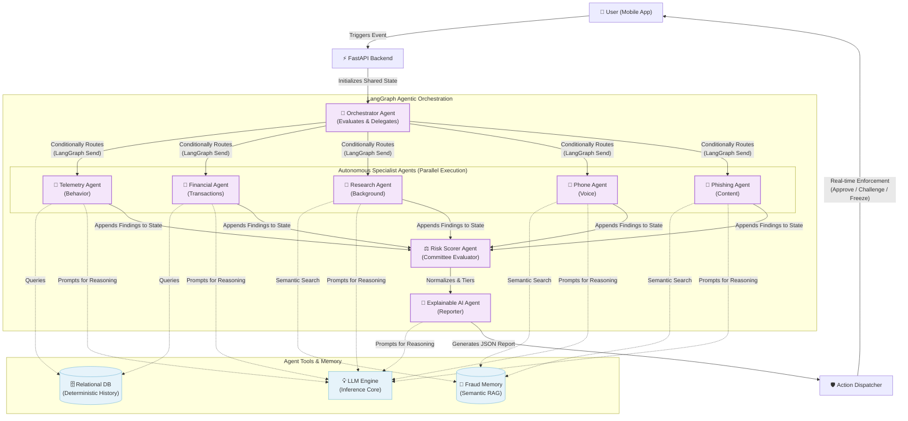
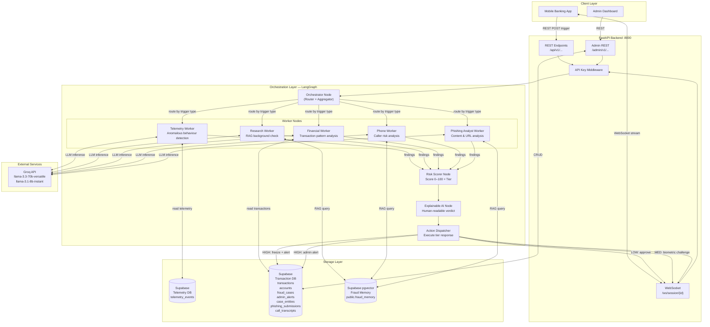
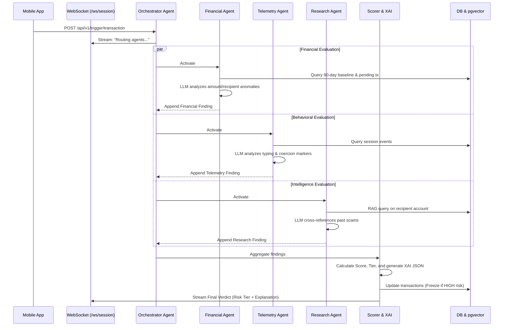
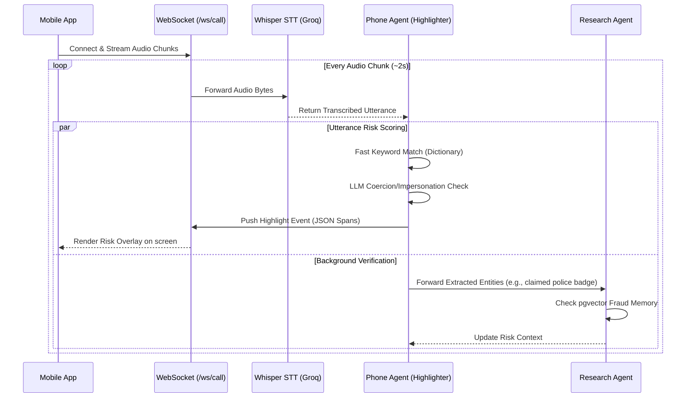
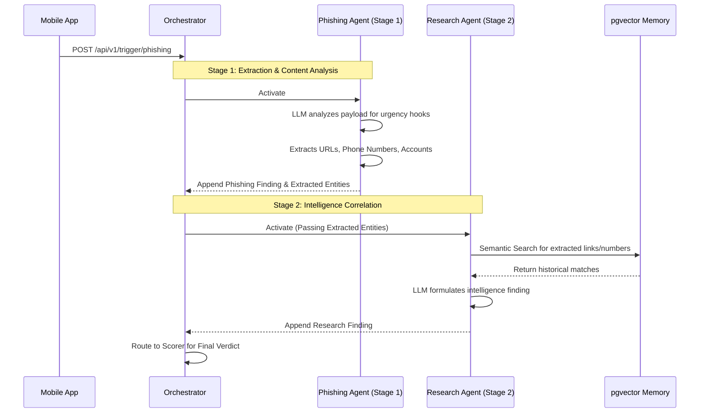
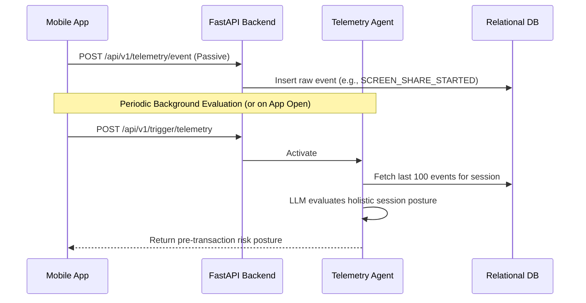
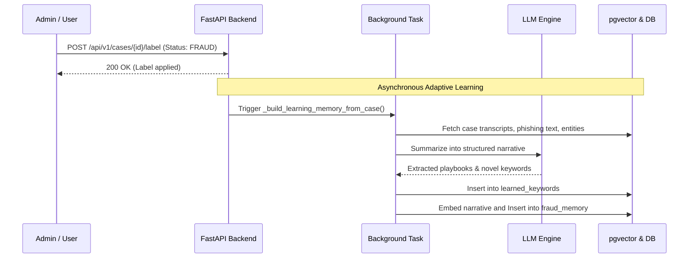

# TranSafe — System Architecture Document

**Version**: 1.0.0
**Date**: 2026-07-26
**Status**: Approved for Hackathon Implementation

---

## Table of Contents

1. [Architecture Overview](#1-architecture-overview)
2. [System Architecture Diagrams](#2-system-architecture-diagrams)
   - 2.1 [High-Level Functional Architecture](#21-high-level-functional-architecture)
   - 2.2 [Detailed System Architecture](#22-detailed-system-architecture)
3. [Component Descriptions](#3-component-descriptions)
4. [Technology Stack & Decision Rationale](#4-technology-stack--decision-rationale)
5. [Data Flow — End-to-End Sequence](#5-data-flow--end-to-end-sequence)
6. [Three-Tier Risk Response Mechanism](#6-three-tier-risk-response-mechanism)
7. [Explainable AI Output Format](#7-explainable-ai-output-format)
8. [Security Architecture](#8-security-architecture)
9. [Deployment Topology](#9-deployment-topology)

---

## 1. Architecture Overview

TranSafe follows a **layered multi-agent architecture** with four distinct layers:

```
┌─────────────────────────────────────────────────────┐
│                   INPUT LAYER                       │
│  Mobile App triggers → FastAPI REST / WebSocket     │
├─────────────────────────────────────────────────────┤
│              ORCHESTRATION LAYER                    │
│  LangGraph State Machine → Orchestrator + Workers   │
├─────────────────────────────────────────────────────┤
│                 STORAGE LAYER                       │
│  Supabase (Telemetry + Transactions + pgvector)     │
├─────────────────────────────────────────────────────┤
│                  ACTION LAYER                       │
│  Risk Scorer → XAI Node → 3-tier Response           │
└─────────────────────────────────────────────────────┘
```

**Core design principles:**

1. **Agent specialisation**: Each Worker has a single, well-defined responsibility — no Worker does another's job
2. **Dynamic routing**: The Orchestrator activates only the Workers needed for each trigger type, minimising unnecessary LLM calls
3. **Fail-open with degradation**: If a Worker fails, the system continues with remaining Workers and notes the gap in the XAI report
4. **Streaming-first**: Long-running agent analysis (5–15 s) streams intermediate progress via WebSocket; only fast admin operations use REST-only
5. **Adaptive memory**: Supabase pgvector ensures the system improves over time without code changes

---

## 2. System Architecture Diagrams

### 2.1 High-Level Functional Architecture (Agentic System Design)

This high-level functional diagram illustrates the core lifecycle of a fraud detection event in TranSafe, focusing on the Multi-Agent System (MAS) architecture and how specialized agents collaborate autonomously:



#### Detailed Agentic Workflow & Roles

TranSafe is engineered as a **Multi-Agent System (MAS)** orchestrated by LangGraph. Instead of relying on a monolithic prompt, it employs a team of specialized, autonomous agents that communicate via a shared memory state (`GraphState`).

**1. Orchestrator Agent (The Manager)**
* **Role**: Acts as the central router and manager. It does not perform fraud analysis itself; instead, it prevents LLM bloat by only waking up the specific agents needed for a given task.
* **Workflow**: When an event hits the backend (e.g., `TRANSACTION`, `CALL`, `TELEMETRY`), the Orchestrator evaluates the trigger payload and dynamically determines the routing paths. For example, a transaction trigger will activate the Financial, Research, and Telemetry agents, whereas a phone call will activate the Phone and Research agents. It uses LangGraph's `Send` API to fan-out execution to these agents in parallel.

**2. Autonomous Specialist Agents (The Workers)**
Woken up by the Orchestrator, these agents operate concurrently. Each agent possesses specific tools, domain knowledge, and a dedicated LLM prompt tailored to its responsibility.

* **Financial Agent**:
    * **Role**: Analyzes monetary anomalies.
    * **Tools**: `fetch_user_transaction_history` (Relational DB query).
    * **Workflow**: It retrieves the user's past 90-day transaction baseline (excluding pending cases) and compares the new transaction's amount, time, and recipient. It reasons about velocity and deviation to produce a financial anomaly score.
* **Telemetry Agent**:
    * **Role**: Detects behavioral anomalies and physical coercion markers.
    * **Tools**: `fetch_telemetry_events` (Relational DB query).
    * **Workflow**: It extracts device posture, typing speeds, location changes, and app navigation patterns. It uses a faster, lighter LLM (`llama-3.1-8b-instant`) to rapidly pattern-match these signals against known coercion indicators (e.g., sudden screen-sharing activation + erratic typing).
* **Research Agent**:
    * **Role**: Conducts background checks and historical RAG comparisons.
    * **Tools**: `search_fraud_memory` (pgvector semantic search), `lookup_scam_recipient` (Blacklist DB query).
    * **Workflow**: It embeds the target entities (phone numbers, account numbers, URLs) and queries the vector database for similar past fraud narratives. It cross-references these matches to determine if the current scenario matches a known scam playbook.
* **Phone Agent**:
    * **Role**: Analyzes live conversational context for coercion or impersonation.
    * **Tools**: WebRTC audio stream, Whisper STT integration.
    * **Workflow**: It listens to the transcription chunks of a live call, reasoning over the caller's tone, urgency keywords ("police", "arrest", "transfer immediately"), and dialogue structure to detect social engineering tactics.
* **Phishing Agent**:
    * **Role**: Evaluates suspicious messages and URLs.
    * **Tools**: `search_fraud_memory` (pgvector).
    * **Workflow**: It breaks down submitted text or URLs, looking for spoofed domains, urgency hooks, and malicious payloads, comparing the attack vector against known phishing campaigns in the memory store.

**3. The Review Committee (Scorer & XAI)**
Once the parallel workers complete their tasks, they append their findings (score + evidence) back to the `GraphState`.
* **Risk Scorer Agent**: Acts as the quantitative judge. It applies dynamic weights to the findings (e.g., Financial anomalies might carry a 30% weight, while Research matches carry 25%), normalizing them into a final 0-100 risk score and tier (`LOW`, `MEDIUM`, `HIGH`). It also enforces deterministic overrides (e.g., a direct hit on a police blacklist forces a HIGH score regardless of other agents).
* **Explainable AI (XAI) Agent**: Acts as the reporter. It takes the mathematical score and the raw evidence arrays from all workers and synthesizes them into a cohesive, human-readable JSON narrative. This ensures that every automated decision can be transparently explained to the user or an auditor.

**4. Action Dispatcher (Enforcement)**
Driven by the final risk tier, this deterministic node executes the system's response:
* **LOW (0-39)**: Writes a silent approval to the database.
* **MEDIUM (40-69)**: Triggers a contextual warning on the user's device and initiates a biometric step-up challenge.
* **HIGH (70-100)**: Immediately freezes the transaction, sets a 30-minute cooling-off timer (to disrupt live coercion), and generates an alert on the admin dashboard.

---

### 2.2 Detailed System Architecture



---

## 3. Component Descriptions

### 3.1 FastAPI Backend

| Endpoint Group | Protocol | Purpose |
|----------------|----------|---------|
| `/api/v1/trigger/*` | REST (POST) | Receive trigger events from mobile app |
| `/ws/session/{session_id}` | WebSocket | Stream agent progress and final verdict to app |
| `/admin/v1/*` | REST | Admin dashboard operations |

The FastAPI server runs a single process with async handlers. Each incoming trigger spawns a LangGraph graph execution in a background asyncio task, streaming updates back to the WebSocket connection.

### 3.2 LangGraph Orchestration

The LangGraph graph is a **directed state machine** where:
- Nodes = agent functions (Orchestrator, Workers, Risk Scorer, XAI Node, Action Dispatcher)
- Edges = conditional routing based on `GraphState`
- State = a `TypedDict` (see `03_agent_flow.md` for full schema)

The graph is compiled once at startup and invoked per trigger event.

### 3.3 Worker Nodes

| Worker | Primary Data Source | LLM Model | Typical Activation |
|--------|--------------------|-----------|--------------------|
| Telemetry Worker | Supabase `telemetry_events` | `llama-3.1-8b-instant` | App open, Transaction |
| Research Worker | Supabase pgvector `fraud_memory` | `llama-3.3-70b-versatile` | Transaction, Call, Phishing, Report |
| Financial Worker | Supabase `transactions` | `llama-3.3-70b-versatile` | Transaction |
| Phone Worker | Supabase pgvector `fraud_memory` | `llama-3.3-70b-versatile` | Call Interception |
| Phishing Analyst Worker | Input payload + Supabase pgvector | `llama-3.3-70b-versatile` | Phishing Material |

### 3.4 Risk Scorer Node

Aggregates Worker findings into a single score:

```
risk_score = weighted_average(
    telemetry_anomaly_score   * 0.15,
    research_blacklist_score  * 0.25,
    financial_anomaly_score   * 0.30,
    phone_risk_score          * 0.20,
    phishing_confidence_score * 0.10
) * active_worker_normalisation_factor
```

Weights are applied only for activated Workers; the score is re-normalised to 0–100 based on active Workers.

| Score Range | Tier | Label |
|-------------|------|-------|
| 0 – 39 | LOW | Silent Approval |
| 40 – 69 | MEDIUM | Contextual Warning + Biometrics |
| 70 – 100 | HIGH | Coercion Pause + Cooling-Off (30 min freeze) |

### 3.5 Explainable AI Node

Calls Groq with a structured prompt that includes all Worker findings and produces a JSON explanation (see Section 7).

### 3.6 Action Dispatcher

Executes the tier-specific backend action:

| Tier | Backend Action |
|------|----------------|
| LOW | Write `fraud_cases` record with status `approved`; return result to WebSocket |
| MEDIUM | Write `fraud_cases` record with status `pending_biometric`; return biometric challenge to WebSocket |
| HIGH | Set `transactions.status = frozen`, set `transactions.unfreeze_at = now + 30min`; create `admin_alerts` record; return freeze notice to WebSocket |

### 3.7 Supabase (PostgreSQL)

Two logical databases (same Supabase project, separate schemas):

- **`telemetry` schema**: `telemetry_events` table — stores raw app behavioural signals
- **`public` schema**: `accounts`, `transactions`, `fraud_cases`, `admin_alerts`, `case_entities`, `phishing_submissions`, `call_transcripts` — core banking mock and case correlation data

Full schema in `05_database_schema.md`.

### 3.8 Supabase pgvector (Fraud Memory)

Table: `public.fraud_memory` — in the same Supabase project as the transaction DB (no additional infrastructure).

Stores:
- Summarised fraud case narratives (`content` TEXT column used for embedding)
- Structured metadata: `phone_numbers TEXT[]`, `bank_accounts TEXT[]`, `urls TEXT[]`, `fraud_type`, `risk_tier`, `case_id` FK
- 768-dimensional embeddings via Groq `nomic-embed-text-v1.5`

Workers query the table via the `search_fraud_memory` PostgreSQL RPC (cosine similarity with `ivfflat` index). Blacklist lookups are performed by embedding the target phone number or URL and finding the nearest fraud cases above a 0.80 similarity threshold.

---

## 4. Technology Stack & Decision Rationale

### 4.1 Python 3.13 + uv

- **Why**: Project baseline already configured in `pyproject.toml`. `uv` provides fast dependency resolution ideal for Hackathon iteration speed.

### 4.2 FastAPI

- **Why**: Native async support matches LangGraph's async graph execution; automatic OpenAPI docs; WebSocket support built-in; well-suited for AI backend APIs.
- **Alternatives considered**: Flask (no native async), Django (too heavy for this scope).

### 4.3 LangGraph

- **Why**: Models the multi-agent workflow as an explicit state machine graph — ideal for TranSafe where routing logic (which Workers to activate) is conditional and the state must be passed coherently between steps. Provides first-class streaming support.
- **Alternatives considered**: LangChain (linear chains, harder to express conditional routing), CrewAI (opinionated role-based, less control), AutoGen (conversation-based, higher overhead).

### 4.4 Groq API (llama-3.3-70b-versatile)

- **Why**: Free tier with high throughput; extremely fast inference (100+ tokens/s) reduces agent analysis latency below 15 s even with 5 Workers. `llama-3.3-70b-versatile` is the best freely-available model on Groq for reasoning tasks.
- **Lightweight Workers**: `llama-3.1-8b-instant` used for Telemetry Worker (pattern matching, not complex reasoning) to save quota.
- **Alternatives considered**: OpenAI GPT-4o (cost), Anthropic Claude (cost), Ollama (latency on local hardware, not Hackathon-friendly).

### 4.5 Supabase (PostgreSQL)

- **Why**: Provides a hosted PostgreSQL instance with a generous free tier, REST API auto-generated from schema, and real-time subscriptions (future extension). Ideal for Hackathon: no local database setup required.
- **Alternatives considered**: SQLite (no concurrent access, not suitable for demo with multiple clients), Firebase (NoSQL, harder to express relational banking data).

### 4.6 Supabase pgvector (Fraud Memory)

- **Why**: Since all structured data already lives in Supabase, adding the `vector` extension keeps the entire data layer in a single hosted service — zero extra infrastructure. `nomic-embed-text-v1.5` (768-dim, via Groq free tier) gives higher-quality embeddings than local `all-MiniLM-L6-v2` (384-dim). The `ivfflat` index makes cosine ANN search fast enough for Hackathon scale (<1 000 rows). Supabase's `rpc()` client makes calling the `search_fraud_memory` function as simple as a standard table query.
- **Alternatives considered**: ChromaDB (local persistence only — requires separate process, complicates deployment); Pinecone (paid); Weaviate (complex setup).

### 4.7 REST + WebSocket Hybrid API

- **Why**: Agent analysis takes 5–15 seconds. A pure REST endpoint would time out on many client implementations. WebSocket allows streaming intermediate status (`Telemetry Worker analysing...`, `Research Worker found 2 matches...`) which creates a better demo experience and prevents frontend timeout.
- **REST for**: Admin operations (fast DB queries), fraud reports, account freeze/unfreeze.
- **WebSocket for**: All trigger events that invoke the LangGraph pipeline.

---

## 5. Detailed Trigger Workflows (End-to-End Sequences)

The following sequence diagrams illustrate the specific Agentic workflows triggered by different events from the mobile application.

### 5.1 TRANSACTION Trigger (Parallel Anomaly Detection)

This is the core financial workflow. It evaluates a pending transfer by spinning up three specialized agents in parallel to cross-reference behavior, financial history, and external intelligence.



#### Workflow Breakdown:
1. **Trigger & Routing**: The Mobile App sends the transaction payload. The Orchestrator receives this and concurrently activates the Financial, Telemetry, and Research Agents.
2. **Parallel Context Gathering**:
   - The **Financial Agent** fetches the user's 90-day transaction history to establish a baseline.
   - The **Telemetry Agent** retrieves the recent behavioral events (typing speed, app navigation) for the active session.
   - The **Research Agent** queries the fraud memory vector database using the recipient's account details.
3. **Agent Inference**: Each agent independently queries the LLM with its domain-specific context to identify anomalies and produce a finding (score and evidence).
4. **Scoring & Enforcement**: The Risk Scorer aggregates the findings, applying weighted averages. If the final tier is HIGH, the Action Dispatcher updates the database to freeze the transaction and initiates a 30-minute cooling-off period, alerting the user via the WebSocket stream.

### 5.2 CALL Trigger (Real-Time Voice Analysis)

The CALL trigger opens a persistent WebSocket connection to stream raw audio, performing sub-second analysis to protect users actively on the phone with a potential scammer.



#### Workflow Breakdown:
1. **Audio Streaming**: The user connects to a persistent WebSocket. Audio chunks are streamed continuously every ~2 seconds.
2. **Transcription**: The backend forwards these chunks to the Whisper STT engine, producing text utterances.
3. **Real-Time Highlighting**: The **Phone Agent** processes each utterance immediately. It performs a fast dictionary match for known scam phrases and a deeper LLM evaluation to detect coercion or impersonation. Annotated text spans (highlights) are pushed back to the app's UI instantly.
4. **Background Verification**: Concurrently, any entities mentioned during the call (e.g., a "police badge number" or "safe account") are extracted and forwarded to the **Research Agent**, which queries the pgvector fraud memory to enrich the overall risk context.

### 5.3 PHISHING Trigger (Sequential Two-Stage Pipeline)

Unlike transactions, phishing analysis requires a two-stage approach: the system must first extract entities from the raw screenshot/text before it can research them.



#### Workflow Breakdown:
1. **Stage 1 (Extraction)**: The Orchestrator activates the **Phishing Agent**, passing it the suspicious text or OCR'd screenshot. The agent uses the LLM to analyze the content for urgency hooks and extracts discrete entities (URLs, phone numbers, bank accounts) into the shared `GraphState`.
2. **Stage 2 (Intelligence Correlation)**: Waiting for Stage 1 to complete, the Orchestrator then activates the **Research Agent**. This agent takes the newly extracted entities and performs a semantic RAG search against the `pgvector` database to find historical scam matches.
3. **Verdict**: Both agents' findings are appended to the state, and the Risk Scorer calculates the final risk probability of the phishing attempt.

### 5.4 TELEMETRY Trigger (Passive Ingestion & Evaluation)

This trigger operates passively in the background of the mobile app to catch Device Takeover (DTO) or coercion before a transaction even begins.



#### Workflow Breakdown:
1. **Passive Ingestion**: As the user navigates the app, the Mobile App silently fires raw telemetry events (e.g., screen orientation changes, clipboard copy/paste, screen sharing flags) to a lightweight REST endpoint, storing them in the database.
2. **Active Evaluation**: Periodically, or right before a critical action (like opening the transfer screen), the app triggers an active evaluation. The **Telemetry Agent** is activated, pulling the last 100 events for the session.
3. **Posture Assessment**: The agent's LLM evaluates the holistic behavioral posture, looking for patterns indicative of remote access trojans (RATs) or physical coercion, returning a pre-transaction risk posture to the app.

### 5.5 REPORT Trigger (HITL Adaptive Learning)

When a user manually reports a fraud case (Human-In-The-Loop), the system bypasses the LangGraph analysis pipeline and directly leverages a background task to adapt its memory, making the system smarter for the next user.



#### Workflow Breakdown:
1. **Human-In-The-Loop Verification**: When users meet a true fraud,  they can confirms it by labeling the case status as "FRAUD" via a REST endpoint.
2. **Asynchronous Processing**: The API immediately acknowledges the request and kicks off a background task (`_build_learning_memory_from_case`) so the user isn't kept waiting.
3. **Adaptive Memory Generation**: The background task fetches all context related to the case (transcripts, entities, phishing text). The LLM summarizes the scam into a structured playbook narrative, extracting novel scammer keywords.
4. **System Learning**: The novel keywords are added to the `learned_keywords` table, and the embedded narrative is inserted into `public.fraud_memory`, instantly updating the RAG knowledge base for all future Research Agent queries.

---

## 6. Three-Tier Risk Response Mechanism

### Response Matrix

| Tier | Score | Backend Action | User-Facing Outcome | Admin Action |
|------|-------|----------------|---------------------|--------------|
| **LOW** | 0–39 | `fraud_cases` → `approved` | Transaction proceeds | No alert |
| **MEDIUM** | 40–69 | `fraud_cases` → `pending_biometric` | Warning screen + biometric prompt | Optional review queue |
| **HIGH** | 70–100 | `transactions.status = frozen` + `unfreeze_at` set + `admin_alerts` created | Cooling-off screen (30 min timer) | Real-time admin alert |

### Cooling-Off Period (HIGH Risk)

The 30-minute cooling-off period is designed to counter **coercion scams** where a fraudster is on the phone pressuring the victim to transfer immediately. During this period:

1. The transaction record in Supabase has `status = frozen` and `unfreeze_at = NOW() + 30 minutes`
2. The user can view the XAI explanation of why the transaction was paused
3. The admin dashboard receives an alert and can review/escalate
4. After 30 minutes, the system automatically updates the status to `cooling_off_expired` — the user can then re-attempt
5. Admin can manually unfreeze early if the case is reviewed and confirmed legitimate

### Explainable AI in Risk Response

Every risk response — regardless of tier — includes a structured `explanation` field in the WebSocket payload. See Section 7 for the full JSON schema.

---

## 7. Explainable AI Output Format

Every LangGraph pipeline execution produces a structured XAI report. This is returned as part of the WebSocket final message and stored in the `fraud_cases` table.

### JSON Schema

```json
{
  "xai_report": {
    "session_id": "string",
    "trigger_type": "TRANSACTION | CALL | PHISHING | REPORT | TELEMETRY",
    "risk_score": 82,
    "risk_tier": "HIGH",
    "verdict_summary": "string (1-2 sentences, plain English)",
    "verdict_summary_ms": "string (1-2 sentences, Bahasa Melayu)",
    "workers_activated": ["financial", "telemetry", "research"],
    "worker_findings": [
      {
        "worker": "financial",
        "score": 85,
        "confidence": 0.91,
        "evidence": [
          "Transfer amount (RM 9,800) is 47x higher than user's 90-day average (RM 208)",
          "Recipient account has no prior transaction history with this user",
          "Transfer initiated at 02:14 AM — outside user's typical activity window"
        ]
      },
      {
        "worker": "telemetry",
        "score": 22,
        "confidence": 0.78,
        "evidence": [
          "Device fingerprint matches known device",
          "Typing speed within normal range",
          "No screen sharing or remote access detected"
        ]
      },
      {
        "worker": "research",
        "score": 95,
        "confidence": 0.97,
        "evidence": [
          "Recipient account 1234-5678-9012 found in fraud database (3 prior cases)",
          "Associated with 'investment scam' category",
          "Most recent report: 2026-07-20"
        ]
      }
    ],
    "action_taken": "FREEZE_30_MIN",
    "unfreeze_at": "2026-07-26T15:45:00Z",
    "recommendation": "string (user-facing advice)",
    "case_id": "uuid"
  }
}
```

### Rendering Guidelines (for Frontend)

- `verdict_summary` → display as the headline alert message
- `worker_findings[].evidence[]` → display as a collapsible bullet list per Worker
- `action_taken` → drive the UI state (show timer for `FREEZE_30_MIN`)
- `recommendation` → display as a help text block with scam prevention advice

---

## 8. Security Architecture

### API Authentication

All endpoints require the `X-API-Key` header. For the Hackathon, a single static key is configured via the `API_KEY` environment variable.

```
X-API-Key: <value of API_KEY env var>
```

Admin endpoints additionally require an `X-Admin-Key` header.

### Data Privacy

- `user_id` in all tables is a UUID pseudonym — no real name or IC number stored
- Telemetry data contains only behavioural signals (event types, timestamps, scores) — no raw input content
- Phishing material submissions are stored only as summaries in `public.fraud_memory`, not as raw files

### Environment Variable Isolation

All secrets are loaded via `python-dotenv` from a `.env` file (never committed to git). See `06_deployment_guide.md` for the full `.env` template.

---

## 9. Deployment Topology

### Hackathon (Local Development)

```
Developer Machine
├── uvicorn (FastAPI)          → localhost:8000
└── .env                       → Supabase URL + Keys, Groq API Key

Cloud Services (free tier)
├── Supabase                   → Hosted PostgreSQL + pgvector (fraud_memory)
└── Groq API                   → LLM inference + nomic-embed-text-v1.5 embeddings
```

### Directory Layout (Target)

```
backend/
├── doc/                    ← Planning documents (this file lives here)
├── src/
│   ├── api/                ← FastAPI routers
│   │   ├── triggers.py     ← /api/v1/trigger/* endpoints
│   │   ├── websocket.py    ← /ws/session/{id} handler
│   │   └── admin.py        ← /admin/v1/* endpoints
│   ├── agents/             ← LangGraph graph + nodes
│   │   ├── graph.py        ← Graph definition and compilation
│   │   ├── state.py        ← GraphState TypedDict
│   │   ├── orchestrator.py ← Orchestrator node
│   │   └── workers/
│   │       ├── telemetry.py
│   │       ├── research.py
│   │       ├── financial.py
│   │       ├── phone.py
│   │       └── phishing.py
│   ├── db/
│   │   ├── supabase.py     ← Supabase client + structured DB queries
│   │   └── vector_store.py ← pgvector client + embed_text + search_fraud_memory + add_fraud_memory
│   └── models/             ← Pydantic request/response models
├── seeds/
│   └── seed_db.py          ← Mock data seeding script (Supabase + pgvector)
├── tests/
├── main.py                 ← Entry point (uvicorn app)
├── pyproject.toml
└── .env                    ← (gitignored)
```
