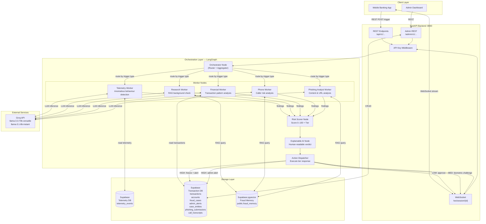
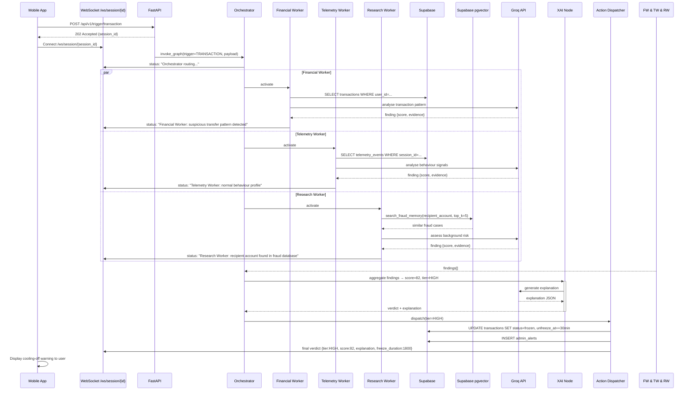
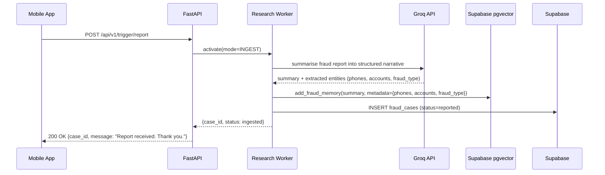

# TranSafe — System Architecture Document

**Version**: 1.0.0
**Date**: 2026-07-26
**Status**: Approved for Hackathon Implementation

---

## Table of Contents

1. [Architecture Overview](#1-architecture-overview)
2. [System Architecture Diagram](#2-system-architecture-diagram)
3. [Component Descriptions](#3-component-descriptions)
4. [Technology Stack & Decision Rationale](#4-technology-stack--decision-rationale)
5. [Data Flow — End-to-End Sequence](#5-data-flow--end-to-end-sequence)
6. [Three-Tier Risk Response Mechanism](#6-three-tier-risk-response-mechanism)
7. [Explainable AI Output Format](#7-explainable-ai-output-format)
8. [Security Architecture](#8-security-architecture)
9. [Deployment Topology](#9-deployment-topology)

---

## 1. Architecture Overview

TranSafe follows a **layered multi-agent architecture** with four distinct layers:

```
┌─────────────────────────────────────────────────────┐
│                   INPUT LAYER                       │
│  Mobile App triggers → FastAPI REST / WebSocket     │
├─────────────────────────────────────────────────────┤
│              ORCHESTRATION LAYER                    │
│  LangGraph State Machine → Orchestrator + Workers   │
├─────────────────────────────────────────────────────┤
│                 STORAGE LAYER                       │
│  Supabase (Telemetry + Transactions + pgvector)     │
├─────────────────────────────────────────────────────┤
│                  ACTION LAYER                       │
│  Risk Scorer → XAI Node → 3-tier Response           │
└─────────────────────────────────────────────────────┘
```

**Core design principles:**

1. **Agent specialisation**: Each Worker has a single, well-defined responsibility — no Worker does another's job
2. **Dynamic routing**: The Orchestrator activates only the Workers needed for each trigger type, minimising unnecessary LLM calls
3. **Fail-open with degradation**: If a Worker fails, the system continues with remaining Workers and notes the gap in the XAI report
4. **Streaming-first**: Long-running agent analysis (5–15 s) streams intermediate progress via WebSocket; only fast admin operations use REST-only
5. **Adaptive memory**: Supabase pgvector ensures the system improves over time without code changes

---

## 2. System Architecture Diagram



---

## 3. Component Descriptions

### 3.1 FastAPI Backend

| Endpoint Group | Protocol | Purpose |
|----------------|----------|---------|
| `/api/v1/trigger/*` | REST (POST) | Receive trigger events from mobile app |
| `/ws/session/{session_id}` | WebSocket | Stream agent progress and final verdict to app |
| `/admin/v1/*` | REST | Admin dashboard operations |

The FastAPI server runs a single process with async handlers. Each incoming trigger spawns a LangGraph graph execution in a background asyncio task, streaming updates back to the WebSocket connection.

### 3.2 LangGraph Orchestration

The LangGraph graph is a **directed state machine** where:
- Nodes = agent functions (Orchestrator, Workers, Risk Scorer, XAI Node, Action Dispatcher)
- Edges = conditional routing based on `GraphState`
- State = a `TypedDict` (see `03_agent_flow.md` for full schema)

The graph is compiled once at startup and invoked per trigger event.

### 3.3 Worker Nodes

| Worker | Primary Data Source | LLM Model | Typical Activation |
|--------|--------------------|-----------|--------------------|
| Telemetry Worker | Supabase `telemetry_events` | `llama-3.1-8b-instant` | App open, Transaction |
| Research Worker | Supabase pgvector `fraud_memory` | `llama-3.3-70b-versatile` | Transaction, Call, Phishing, Report |
| Financial Worker | Supabase `transactions` | `llama-3.3-70b-versatile` | Transaction |
| Phone Worker | Supabase pgvector `fraud_memory` | `llama-3.3-70b-versatile` | Call Interception |
| Phishing Analyst Worker | Input payload + Supabase pgvector | `llama-3.3-70b-versatile` | Phishing Material |

### 3.4 Risk Scorer Node

Aggregates Worker findings into a single score:

```
risk_score = weighted_average(
    telemetry_anomaly_score   * 0.15,
    research_blacklist_score  * 0.25,
    financial_anomaly_score   * 0.30,
    phone_risk_score          * 0.20,
    phishing_confidence_score * 0.10
) * active_worker_normalisation_factor
```

Weights are applied only for activated Workers; the score is re-normalised to 0–100 based on active Workers.

| Score Range | Tier | Label |
|-------------|------|-------|
| 0 – 39 | LOW | Silent Approval |
| 40 – 69 | MEDIUM | Contextual Warning + Biometrics |
| 70 – 100 | HIGH | Coercion Pause + Cooling-Off (30 min freeze) |

### 3.5 Explainable AI Node

Calls Groq with a structured prompt that includes all Worker findings and produces a JSON explanation (see Section 7).

### 3.6 Action Dispatcher

Executes the tier-specific backend action:

| Tier | Backend Action |
|------|----------------|
| LOW | Write `fraud_cases` record with status `approved`; return result to WebSocket |
| MEDIUM | Write `fraud_cases` record with status `pending_biometric`; return biometric challenge to WebSocket |
| HIGH | Set `transactions.status = frozen`, set `transactions.unfreeze_at = now + 30min`; create `admin_alerts` record; return freeze notice to WebSocket |

### 3.7 Supabase (PostgreSQL)

Two logical databases (same Supabase project, separate schemas):

- **`telemetry` schema**: `telemetry_events` table — stores raw app behavioural signals
- **`public` schema**: `accounts`, `transactions`, `fraud_cases`, `admin_alerts`, `case_entities`, `phishing_submissions`, `call_transcripts` — core banking mock and case correlation data

Full schema in `05_database_schema.md`.

### 3.8 Supabase pgvector (Fraud Memory)

Table: `public.fraud_memory` — in the same Supabase project as the transaction DB (no additional infrastructure).

Stores:
- Summarised fraud case narratives (`content` TEXT column used for embedding)
- Structured metadata: `phone_numbers TEXT[]`, `bank_accounts TEXT[]`, `urls TEXT[]`, `fraud_type`, `risk_tier`, `case_id` FK
- 768-dimensional embeddings via Groq `nomic-embed-text-v1.5`

Workers query the table via the `search_fraud_memory` PostgreSQL RPC (cosine similarity with `ivfflat` index). Blacklist lookups are performed by embedding the target phone number or URL and finding the nearest fraud cases above a 0.80 similarity threshold.

---

## 4. Technology Stack & Decision Rationale

### 4.1 Python 3.13 + uv

- **Why**: Project baseline already configured in `pyproject.toml`. `uv` provides fast dependency resolution ideal for Hackathon iteration speed.

### 4.2 FastAPI

- **Why**: Native async support matches LangGraph's async graph execution; automatic OpenAPI docs; WebSocket support built-in; well-suited for AI backend APIs.
- **Alternatives considered**: Flask (no native async), Django (too heavy for this scope).

### 4.3 LangGraph

- **Why**: Models the multi-agent workflow as an explicit state machine graph — ideal for TranSafe where routing logic (which Workers to activate) is conditional and the state must be passed coherently between steps. Provides first-class streaming support.
- **Alternatives considered**: LangChain (linear chains, harder to express conditional routing), CrewAI (opinionated role-based, less control), AutoGen (conversation-based, higher overhead).

### 4.4 Groq API (llama-3.3-70b-versatile)

- **Why**: Free tier with high throughput; extremely fast inference (100+ tokens/s) reduces agent analysis latency below 15 s even with 5 Workers. `llama-3.3-70b-versatile` is the best freely-available model on Groq for reasoning tasks.
- **Lightweight Workers**: `llama-3.1-8b-instant` used for Telemetry Worker (pattern matching, not complex reasoning) to save quota.
- **Alternatives considered**: OpenAI GPT-4o (cost), Anthropic Claude (cost), Ollama (latency on local hardware, not Hackathon-friendly).

### 4.5 Supabase (PostgreSQL)

- **Why**: Provides a hosted PostgreSQL instance with a generous free tier, REST API auto-generated from schema, and real-time subscriptions (future extension). Ideal for Hackathon: no local database setup required.
- **Alternatives considered**: SQLite (no concurrent access, not suitable for demo with multiple clients), Firebase (NoSQL, harder to express relational banking data).

### 4.6 Supabase pgvector (Fraud Memory)

- **Why**: Since all structured data already lives in Supabase, adding the `vector` extension keeps the entire data layer in a single hosted service — zero extra infrastructure. `nomic-embed-text-v1.5` (768-dim, via Groq free tier) gives higher-quality embeddings than local `all-MiniLM-L6-v2` (384-dim). The `ivfflat` index makes cosine ANN search fast enough for Hackathon scale (<1 000 rows). Supabase's `rpc()` client makes calling the `search_fraud_memory` function as simple as a standard table query.
- **Alternatives considered**: ChromaDB (local persistence only — requires separate process, complicates deployment); Pinecone (paid); Weaviate (complex setup).

### 4.7 REST + WebSocket Hybrid API

- **Why**: Agent analysis takes 5–15 seconds. A pure REST endpoint would time out on many client implementations. WebSocket allows streaming intermediate status (`Telemetry Worker analysing...`, `Research Worker found 2 matches...`) which creates a better demo experience and prevents frontend timeout.
- **REST for**: Admin operations (fast DB queries), fraud reports, account freeze/unfreeze.
- **WebSocket for**: All trigger events that invoke the LangGraph pipeline.

---

## 5. Data Flow — End-to-End Sequence

### 5.1 Transaction Risk Assessment (Happy Path)



### 5.2 Fraud Report → Adaptive Memory Update



---

## 6. Three-Tier Risk Response Mechanism

### Response Matrix

| Tier | Score | Backend Action | User-Facing Outcome | Admin Action |
|------|-------|----------------|---------------------|--------------|
| **LOW** | 0–39 | `fraud_cases` → `approved` | Transaction proceeds | No alert |
| **MEDIUM** | 40–69 | `fraud_cases` → `pending_biometric` | Warning screen + biometric prompt | Optional review queue |
| **HIGH** | 70–100 | `transactions.status = frozen` + `unfreeze_at` set + `admin_alerts` created | Cooling-off screen (30 min timer) | Real-time admin alert |

### Cooling-Off Period (HIGH Risk)

The 30-minute cooling-off period is designed to counter **coercion scams** where a fraudster is on the phone pressuring the victim to transfer immediately. During this period:

1. The transaction record in Supabase has `status = frozen` and `unfreeze_at = NOW() + 30 minutes`
2. The user can view the XAI explanation of why the transaction was paused
3. The admin dashboard receives an alert and can review/escalate
4. After 30 minutes, the system automatically updates the status to `cooling_off_expired` — the user can then re-attempt
5. Admin can manually unfreeze early if the case is reviewed and confirmed legitimate

### Explainable AI in Risk Response

Every risk response — regardless of tier — includes a structured `explanation` field in the WebSocket payload. See Section 7 for the full JSON schema.

---

## 7. Explainable AI Output Format

Every LangGraph pipeline execution produces a structured XAI report. This is returned as part of the WebSocket final message and stored in the `fraud_cases` table.

### JSON Schema

```json
{
  "xai_report": {
    "session_id": "string",
    "trigger_type": "TRANSACTION | CALL | PHISHING | REPORT | TELEMETRY",
    "risk_score": 82,
    "risk_tier": "HIGH",
    "verdict_summary": "string (1-2 sentences, plain English)",
    "verdict_summary_ms": "string (1-2 sentences, Bahasa Melayu)",
    "workers_activated": ["financial", "telemetry", "research"],
    "worker_findings": [
      {
        "worker": "financial",
        "score": 85,
        "confidence": 0.91,
        "evidence": [
          "Transfer amount (RM 9,800) is 47x higher than user's 90-day average (RM 208)",
          "Recipient account has no prior transaction history with this user",
          "Transfer initiated at 02:14 AM — outside user's typical activity window"
        ]
      },
      {
        "worker": "telemetry",
        "score": 22,
        "confidence": 0.78,
        "evidence": [
          "Device fingerprint matches known device",
          "Typing speed within normal range",
          "No screen sharing or remote access detected"
        ]
      },
      {
        "worker": "research",
        "score": 95,
        "confidence": 0.97,
        "evidence": [
          "Recipient account 1234-5678-9012 found in fraud database (3 prior cases)",
          "Associated with 'investment scam' category",
          "Most recent report: 2026-07-20"
        ]
      }
    ],
    "action_taken": "FREEZE_30_MIN",
    "unfreeze_at": "2026-07-26T15:45:00Z",
    "recommendation": "string (user-facing advice)",
    "case_id": "uuid"
  }
}
```

### Rendering Guidelines (for Frontend)

- `verdict_summary` → display as the headline alert message
- `worker_findings[].evidence[]` → display as a collapsible bullet list per Worker
- `action_taken` → drive the UI state (show timer for `FREEZE_30_MIN`)
- `recommendation` → display as a help text block with scam prevention advice

---

## 8. Security Architecture

### API Authentication

All endpoints require the `X-API-Key` header. For the Hackathon, a single static key is configured via the `API_KEY` environment variable.

```
X-API-Key: <value of API_KEY env var>
```

Admin endpoints additionally require an `X-Admin-Key` header.

### Data Privacy

- `user_id` in all tables is a UUID pseudonym — no real name or IC number stored
- Telemetry data contains only behavioural signals (event types, timestamps, scores) — no raw input content
- Phishing material submissions are stored only as summaries in `public.fraud_memory`, not as raw files

### Environment Variable Isolation

All secrets are loaded via `python-dotenv` from a `.env` file (never committed to git). See `06_deployment_guide.md` for the full `.env` template.

---

## 9. Deployment Topology

### Hackathon (Local Development)

```
Developer Machine
├── uvicorn (FastAPI)          → localhost:8000
└── .env                       → Supabase URL + Keys, Groq API Key

Cloud Services (free tier)
├── Supabase                   → Hosted PostgreSQL + pgvector (fraud_memory)
└── Groq API                   → LLM inference + nomic-embed-text-v1.5 embeddings
```

### Directory Layout (Target)

```
backend/
├── doc/                    ← Planning documents (this file lives here)
├── src/
│   ├── api/                ← FastAPI routers
│   │   ├── triggers.py     ← /api/v1/trigger/* endpoints
│   │   ├── websocket.py    ← /ws/session/{id} handler
│   │   └── admin.py        ← /admin/v1/* endpoints
│   ├── agents/             ← LangGraph graph + nodes
│   │   ├── graph.py        ← Graph definition and compilation
│   │   ├── state.py        ← GraphState TypedDict
│   │   ├── orchestrator.py ← Orchestrator node
│   │   └── workers/
│   │       ├── telemetry.py
│   │       ├── research.py
│   │       ├── financial.py
│   │       ├── phone.py
│   │       └── phishing.py
│   ├── db/
│   │   ├── supabase.py     ← Supabase client + structured DB queries
│   │   └── vector_store.py ← pgvector client + embed_text + search_fraud_memory + add_fraud_memory
│   └── models/             ← Pydantic request/response models
├── seeds/
│   └── seed_db.py          ← Mock data seeding script (Supabase + pgvector)
├── tests/
├── main.py                 ← Entry point (uvicorn app)
├── pyproject.toml
└── .env                    ← (gitignored)
```
