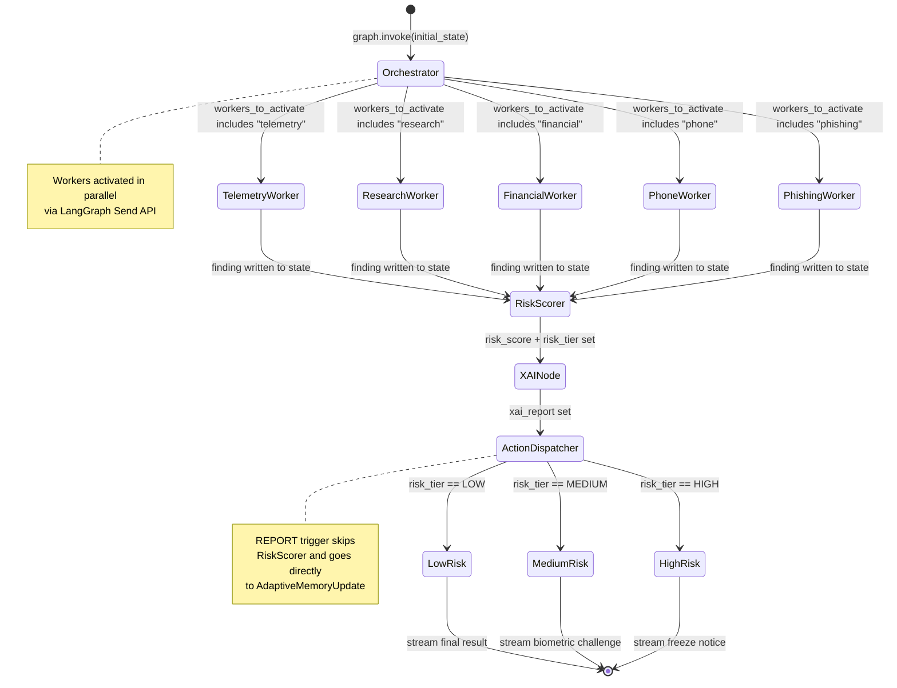
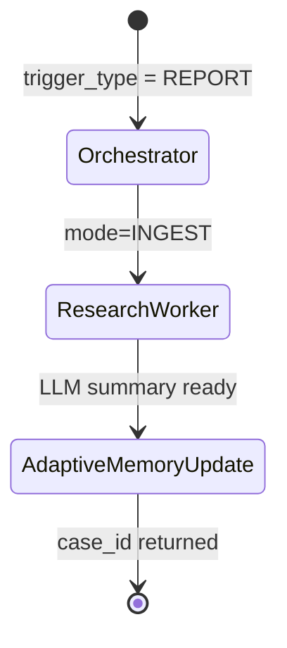
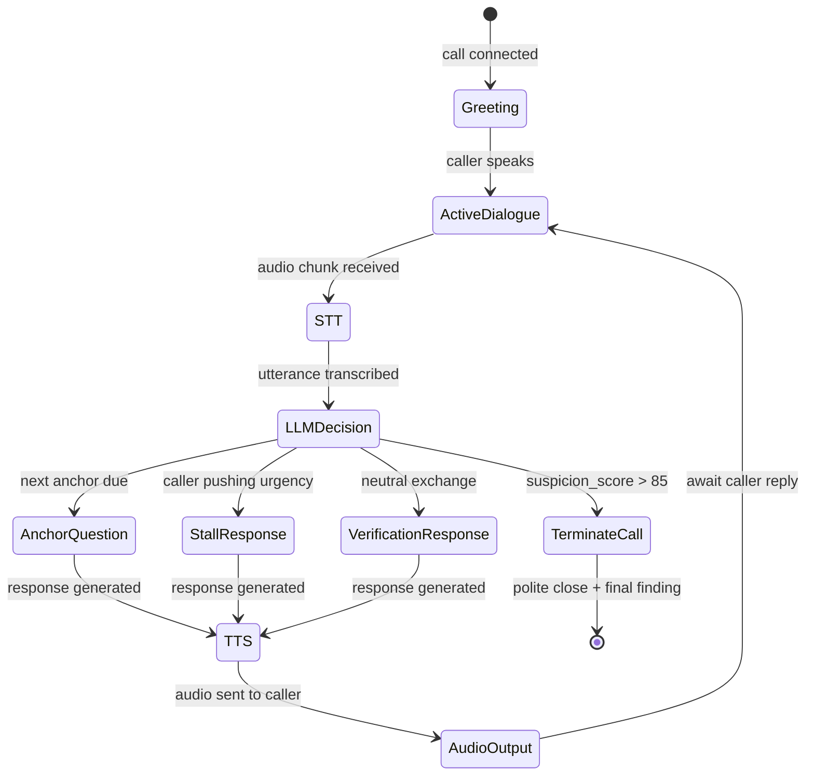
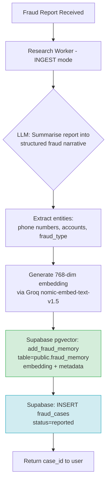

# TranSafe — Agent Flow Design Document

**Version**: 1.0.0
**Date**: 2026-07-26
**Status**: Approved for Hackathon Implementation

---

## Table of Contents

1. [LangGraph Overview](#1-langgraph-overview)
2. [GraphState Schema](#2-graphstate-schema)
3. [LangGraph State Diagram](#3-langgraph-state-diagram)
4. [Orchestrator Node — Routing Logic](#4-orchestrator-node--routing-logic)
5. [Worker Node Specifications](#5-worker-node-specifications)
6. [Risk Scorer Node](#6-risk-scorer-node)
7. [Explainable AI Node](#7-explainable-ai-node)
8. [Action Dispatcher Node](#8-action-dispatcher-node)
9. [Adaptive Memory Update Flow](#9-adaptive-memory-update-flow)
10. [Trigger-to-Worker Routing Table](#10-trigger-to-worker-routing-table)
11. [Error Handling & Graceful Degradation](#11-error-handling--graceful-degradation)

---

## 1. LangGraph Overview

TranSafe uses **LangGraph** to orchestrate its multi-agent pipeline as an explicit directed state machine. Unlike a simple sequential chain, LangGraph allows:

- **Conditional edges**: The Orchestrator routes to different Worker subsets based on trigger type
- **Parallel node execution**: Multiple Workers run concurrently using LangGraph's `Send` API
- **Shared typed state**: All nodes read from and write to a single `GraphState` object — no ad-hoc data passing
- **Streaming**: Graph emits state updates at each node completion, enabling WebSocket progress streaming

### Graph Lifecycle

```
compile_graph()          ← Called once at application startup
    └─→ CompiledGraph    ← Stored as a singleton in FastAPI app state

per_request:
    graph.astream(initial_state, config={"callbacks": [ws_streamer]})
```

---

## 2. GraphState Schema

```python
from typing import TypedDict, Literal, Optional
from datetime import datetime

# ── Worker Finding ──────────────────────────────────────────────
class WorkerFinding(TypedDict):
    worker: str                          # worker name
    score: int                           # 0-100 risk sub-score
    confidence: float                    # 0.0-1.0 LLM confidence
    evidence: list[str]                  # bullet-point evidence list
    error: Optional[str]                 # set if worker failed

# ── Graph State ─────────────────────────────────────────────────
class GraphState(TypedDict):
    # ── Input ──
    session_id: str
    trigger_type: Literal[
        "TELEMETRY", "TRANSACTION", "CALL", "PHISHING", "REPORT"
    ]
    trigger_payload: dict                # raw trigger data from API

    # ── Routing ──
    workers_to_activate: list[str]       # set by Orchestrator

    # ── Worker Outputs ──
    telemetry_finding:  Optional[WorkerFinding]
    research_finding:   Optional[WorkerFinding]
    financial_finding:  Optional[WorkerFinding]
    phone_finding:      Optional[WorkerFinding]
    phishing_finding:   Optional[WorkerFinding]

    # ── Risk Assessment ──
    risk_score: Optional[int]            # 0-100
    risk_tier: Optional[Literal["LOW", "MEDIUM", "HIGH"]]

    # ── Explainability ──
    xai_report: Optional[dict]           # full structured XAI JSON

    # ── Phone Session (CALL trigger only) ──
    phone_session: Optional[dict]        # PhoneSessionState (see Section 5.4)
    call_mode: Optional[Literal["LISTEN", "AUTO_TALK"]]

    # ── Action ──
    action_taken: Optional[str]          # e.g. "FREEZE_30_MIN"
    case_id: Optional[str]               # UUID of created fraud_case

    # ── Phishing Entity Relay ──
    extracted_entities: Optional[dict]   # set by Phishing Worker for Research Worker
                                         # {"phone_numbers": [], "urls": [], "bank_accounts": []}

    # ── Streaming ──
    status_messages: list[str]           # appended by each node for WS streaming

    # ── Case Correlation ──
    associated_case_id: Optional[str]    # explicitly linked case from frontend
    associated_case_context: Optional[dict] # fetched context (transcripts, phishing text, entities)

    # ── Metadata ──
    created_at: str                      # ISO 8601 timestamp
    user_id: str
```

---

## 3. LangGraph State Diagram



### Special Case: REPORT Trigger

The `REPORT` trigger has a simplified graph path — it does not go through the full risk pipeline:



---

## 4. Orchestrator Node — Routing Logic

```python
# Pseudocode for Orchestrator routing decision

TRIGGER_WORKER_MAP = {
    "TELEMETRY":   ["telemetry"],
    "TRANSACTION": ["financial", "telemetry", "research"],
    "CALL":        ["phone", "research"],
    "PHISHING":    ["phishing"],   # Research Worker runs AFTER Phishing Worker (see below)
    "REPORT":      ["research"],   # research in INGEST mode
}

def orchestrator_node(state: GraphState) -> GraphState:
    trigger = state["trigger_type"]
    workers = TRIGGER_WORKER_MAP[trigger]

    # Load associated case context if provided by client (confirmed/selected by user)
    associated_id = state["trigger_payload"].get("associated_case_id")
    if associated_id:
        state["associated_case_id"] = associated_id
        # Query database to fetch transcripts, phishing text, and entities for the case
        state["associated_case_context"] = supabase.fetch_case_context(associated_id)
        state["status_messages"].append(
            f"Orchestrator: linked active case {associated_id} context"
        )
    else:
        state["associated_case_id"] = None
        state["associated_case_context"] = None

    state["workers_to_activate"] = workers
    state["status_messages"].append(
        f"Orchestrator: routing {trigger} trigger to {workers}"
    )

    # Emit parallel Send commands to each worker node
    return [Send(worker, state) for worker in workers]
```

**Design note — PHISHING two-stage routing:**

For PHISHING triggers, Workers run in **two sequential stages** rather than fully in parallel:

```
Stage 1:  Phishing Worker (runs first)
          → Analyses content (TEXT / URL / IMAGE)
          → Extracts entities: phone_numbers, urls, bank_accounts
          → Writes entities to state["extracted_entities"]

Stage 2:  Research Worker (runs after Stage 1 completes)
          → Reads state["extracted_entities"]
          → Queries pgvector blacklist for each entity
          → Optionally triggers Tavily web search if confidence < 0.75
          → Writes research_finding to state
```

This ensures Research Worker has real extracted entities to query, rather than receiving an unprocessed payload.

For all other triggers (TRANSACTION, CALL), the Orchestrator uses LangGraph's `Send` primitive to fan out to Workers **in parallel**. All Workers write their findings back to the shared state. The graph waits for all active Workers to complete before proceeding to the Risk Scorer (via a join edge on all Worker terminal nodes).

---

## 5. Worker Node Specifications

### 5.1 Telemetry Worker

| Attribute | Value |
|-----------|-------|
| **Node name** | `telemetry_worker` |
| **LLM model** | `llama-3.1-8b-instant` |
| **Primary data source** | Supabase `telemetry.telemetry_events` |
| **Secondary data source** | None |
| **Activation triggers** | TELEMETRY, TRANSACTION |
| **Output field** | `state.telemetry_finding` |

**Responsibility**: Analyse the user's recent behavioural telemetry signals to detect anomalies that may indicate coercion, remote access, or unusual activity patterns.

**Tools & Skills**:
* **`fetch_telemetry_events(user_id: str, session_id: str) -> list[dict]`**: Query Supabase `telemetry.telemetry_events` for the last 100 events in the past hour for the specified session. Returns a list of events containing `event_type`, `event_value`, `device_id`, and `created_at`.

**Input data queried**:
```sql
SELECT event_type, event_value, device_id, created_at
FROM telemetry.telemetry_events
WHERE user_id = :user_id
  AND session_id = :session_id
  AND created_at > NOW() - INTERVAL '1 hour'
ORDER BY created_at DESC
LIMIT 100;
```

**Signals analysed**:
- Typing speed variance (unusually fast = script/bot inputs, unusually slow/jittery = coercion or manual dictation)
- App screen navigation sequence (abnormal jumps or bypasses of regular onboarding flow)
- Device ID mismatch within the same transaction session
- Copy-paste actions on recipient accounts or amounts (suggests user copying details from a chat screen controlled by a scammer)
- Active screen sharing / remote access active flags (e.g. `SCREEN_SHARE_DETECTED`)

**Full LLM System Prompt**:
```
You are an expert fraud behavioral biometrics analyst at a retail bank.
Your job is to analyze the sequence of telemetry events and behavioral biometrics from a user's session and output a risk assessment.
Look for the following signals:
1. Hesitation or Dictation: Typing cadence that is extremely slow (avg flight time > 500ms) or contains high backspace counts, indicating the user is typing under coercion/dictation.
2. Automation/Bots: Flight times near 0ms or highly constant typing speed, indicating automated inputs.
3. Instruction Following: Copy-pasting account numbers or names, erratic mouse cursor movements, and frequent tab switches (indicating user is copying details from WhatsApp/Telegram).
4. Direct Compromise: Orientations changing rapidly, screenshots taken, or active screen sharing flags indicating a remote scammer.

You must respond in strict JSON format with keys "score" (0-100), "confidence" (0.0-1.0), and "evidence" (list of strings).
```

**Full LLM Human Prompt Template**:
```
Analyze the following telemetry and behavioral biometric data:
User ID: {user_id}
Session ID: {session_id}
Device ID: {device_id}

Telemetry Sequence (Newest First):
{telemetry_json}

Provide your risk assessment. If the data is clean (e.g. normal flight times, known device, normal flow), score it below 20. If anomalous, increase score and explain why in evidence.
```

**Output example**:
```json
{
  "score": 15,
  "confidence": 0.82,
  "evidence": [
    "Device fingerprint matches known registered device",
    "Typing cadence within normal range (avg 320ms between keystrokes)",
    "No screen sharing flag detected"
  ]
}
```

**Output example**:
```json
{
  "worker": "telemetry",
  "score": 15,
  "confidence": 0.82,
  "evidence": [
    "Device fingerprint matches known registered device",
    "Typing cadence within normal range (avg 320ms between keystrokes)",
    "No screen sharing flag detected"
  ]
}
```

---

### 5.2 Research Worker

| Attribute | Value |
|-----------|-------|
| **Node name** | `research_worker` |
| **LLM model** | `llama-3.3-70b-versatile` |
| **Primary data source** | Supabase pgvector `public.fraud_memory`, `state.associated_case_context` |
| **Secondary data source** | Tavily web search (conditional — low-confidence fallback) |
| **Activation triggers** | TRANSACTION, CALL, PHISHING (stage 2), REPORT |
| **Output field** | `state.research_finding` |

**Responsibility**: Perform background investigation on suspicious entities (phone numbers, bank account numbers, URLs) by querying the internal fraud knowledge base via RAG. When confidence is low, fall back to Tavily web search to check if the entity is publicly reported as a scam. In REPORT mode, ingest new fraud data into pgvector.

**Tools & Skills**:
* **`hybrid_search_fraud_memory(query_text: str, bank_account: str = None, phone_number: str = None, threshold: float = 0.45, top_k: int = 5) -> list[dict]`**: Executes Hybrid Search combining BM25 Lexical / Exact Token Filtering (for accounts and phone numbers) with 768-dimensional pgvector dense semantic vector RAG. Guarantees 100% precision on discrete account tokens while maintaining broad semantic recall on fraud narratives.
* **`search_fraud_memory(query: str, threshold: float = 0.75, top_k: int = 5) -> list[dict]`**: Perform a semantic search on the `public.fraud_memory` table using a text query, mapping text to a 768-dimensional embedding. Returns matching cases with details on fraud type, phone numbers, bank accounts, and similarity scores.
* **`tavily_search(entities: list[str]) -> list[dict]`**: Query the Tavily Search API using clean brand/company queries targeting Malaysian forums and official blacklist domains (e.g. `bnm.gov.my`, `sc.com.my`, `lowyat.net`) to find public fraud complaints.
* **`add_fraud_memory(case_id: str, fraud_type: str, content: str, metadata: dict) -> dict`**: Insert a new record into `public.fraud_memory` with an automatically generated text embedding.

**QUERY mode** (TRANSACTION, CALL):
```python
from src.db.vector_store import hybrid_search_fraud_memory

# Execute Hybrid Search (BM25 Exact Token Match + Dense pgvector RAG)
internal_hits = hybrid_search_fraud_memory(
    query_text=recipient_name,
    bank_account=recipient_account,
    phone_number=phone_number,
    threshold=0.45,
    top_k=5,
)

# Extract entities from trigger payload
entities = extract_entities(state["trigger_payload"])
# e.g. ["01X-XXXXXXX", "1234-5678-9012-3456", "http://scam.example.com"]

# Enrich search query with any entities from user-associated case context (confirmed link)
case_context = state.get("associated_case_context")
if case_context:
    entities.extend(case_context.get("phone_numbers", []))
    entities.extend(case_context.get("bank_accounts", []))
    entities.extend(case_context.get("urls", []))

# RAG query against Supabase pgvector
results = search_fraud_memory(
    query=" ".join(entities),
    threshold=0.75,
    top_k=5
)

# API Cost Optimization Strategy (Tavily Conditional Short-Circuiting)
# If internal Hybrid Search max_sim >= 0.80, Tavily web search is short-circuited to conserve API quota and reduce latency:
if max_sim < 0.80:
    tavily_results = tavily_search(clean_search_terms)
```

> **API Cost Optimization Strategy**:
> External Tavily web search is conditionally triggered **only when** internal Hybrid Search returns `max_sim < 0.80`. If a high-confidence match (`≥ 0.80`) exists in internal DB, web search is short-circuited to save API costs and optimize transaction latency.

**QUERY mode — PHISHING (stage 2)**: Research Worker reads `state["extracted_entities"]` set by Phishing Worker in stage 1:
```python
entities_from_phishing = state.get("extracted_entities", {})
phones = entities_from_phishing.get("phone_numbers", [])
urls   = entities_from_phishing.get("urls", [])
accounts = entities_from_phishing.get("bank_accounts", [])

# Blacklist check for each entity
for phone in phones:
    hits = check_blacklist(phone=phone)
    ...
for url in urls:
    hits = check_blacklist(url=url)
    ...

# Tavily fallback if no pgvector hits and entity is high-suspicion
if not any_hits and (phones or urls):
    tavily_results = tavily_search(phones + urls)
```

**Tavily Web Search** (conditional fallback):
```python
from tavily import TavilyClient

tavily = TavilyClient(api_key=os.environ["TAVILY_API_KEY"])

def tavily_search(entities: list[str]) -> list[dict]:
    """
    Search the web for public scam reports on the given entities.
    Only triggered when pgvector similarity < 0.75 (low internal confidence).
    """
    query = f"Malaysia scam fraud report: {' '.join(entities)}"
    response = tavily.search(
        query=query,
        search_depth="basic",
        max_results=3,
        include_domains=["semak.my", "rmp.gov.my", "bnm.gov.my", "lowyat.net"],
    )
    return response.get("results", [])
```

**INGEST mode** (REPORT):
```python
from src.db.vector_store import add_fraud_memory

# LLM summarises the fraud report
summary = llm.invoke(summarise_prompt(payload))

# Extract structured entities
entities = llm.invoke(extract_entities_prompt(payload))

# Write to Supabase pgvector
add_fraud_memory(
    case_id=new_uuid,
    fraud_type=entities.fraud_type,
    content=summary,
    metadata={
        "phone_numbers": entities.phones,
        "bank_accounts": entities.accounts,
        "urls": entities.urls,
        "amount_lost_myr": entities.amount_lost_myr,
        "risk_tier": "HIGH",
        "source": "user_report",
        "language": "en",
    }
)
```

**Full LLM System Prompt (QUERY mode)**:
```
You are an expert financial fraud research intelligence agent.
Analyze the query entities (phone numbers, bank accounts, URLs) alongside the RAG search results from our internal fraud database and public web reports.
Your job is to determine:
1. If any of the query entities appear directly in the historical scam logs (high similarity matches > 0.80).
2. If there are close semantic matches describing similar fraud patterns involving these entities.
3. If public web reports (Tavily search) indicate these accounts or numbers are linked to online scams, police reports, or central bank warning lists in Malaysia.

Return your findings in strict JSON format:
{
  "score": integer (0-100, where 0 is clean/no matches and 100 is a confirmed match in active scam cases),
  "confidence": float (0.0-1.0),
  "evidence": ["bullet point 1", "bullet point 2"]
}
```

**Full LLM Human Prompt Template (QUERY mode)**:
```
Query Entities: {entities_list}

Internal pgvector Matches:
{internal_matches_json}

Tavily Web Search Results:
{tavily_results_json}

Analyze the match details and output your structured fraud intelligence risk finding.
```

**Fraud Report Summarization Prompt (`summarise_prompt`)**:
```
You are a fraud investigator. Summarize the following user-submitted fraud report into a concise, detailed narrative of exactly how the scam transpired. Focus on the scam method, the payment instructions, the platform used, and the scammer's behavior. Exclude personal victim details.

User Report:
"{description}"
```

**Entity Extraction Prompt (`extract_entities_prompt`)**:
```
You are a structured data extractor. Given the following user report, extract any entities. Output in JSON format with keys "fraud_type" (macau_scam, investment_scam, impersonation_scam, love_scam, phishing, parcel_scam, other), "phones" (list of strings), "accounts" (list of strings), "urls" (list of strings), and "amount_lost_myr" (float).

User Report:
"{description}"
```

**Output example (QUERY mode)**:
```json
{
  "worker": "research",
  "score": 95,
  "confidence": 0.97,
  "evidence": [
    "Recipient account 7653-1234-5678-9012 found in fraud database (pgvector similarity 0.93)",
    "Associated with 3 prior Macau scam cases",
    "Most recent report filed: 2026-07-20",
    "Also linked to phone number 016-XXXXXXX (flagged caller)"
  ]
}
```

**Output example (with Tavily fallback)**:
```json
{
  "worker": "research",
  "score": 72,
  "confidence": 0.68,
  "evidence": [
    "No match found in internal fraud database (pgvector similarity 0.41 — below threshold)",
    "Tavily web search: URL 'http://cimb-secure-login.net' reported on lowyat.net forum (2026-06-14) as phishing site",
    "Tavily web search: semak.my has 2 reports for this domain"
  ]
}
```

---

### 5.3 Financial Worker

| Attribute | Value |
|-----------|-------|
| **Node name** | `financial_worker` |
| **LLM model** | `llama-3.3-70b-versatile` |
| **Primary data source** | Supabase `public.transactions`, `public.accounts`, `state.associated_case_context` |
| **Secondary data source** | None |
| **Activation triggers** | TRANSACTION |
| **Output field** | `state.financial_finding` |

**Responsibility**: Analyse the current transaction against the user's historical transaction patterns to identify statistical anomalies in amount, timing, recipient, and frequency.

**Tools & Skills**:
* **`fetch_user_transaction_history(sender_account: str) -> dict`**: Query Supabase `public.transactions` for transaction history in the past 90 days. Aggregates data to calculate average amount, max amount, total transaction count, and compile a list of known recipient account numbers.

**Input data queried**:
```sql
-- Current transaction
SELECT * FROM transactions WHERE id = :transaction_id;

-- Historical pattern (last 90 days)
SELECT
    AVG(amount) as avg_amount,
    MAX(amount) as max_amount,
    COUNT(*) as tx_count,
    ARRAY_AGG(DISTINCT recipient_account) as known_recipients,
    EXTRACT(HOUR FROM created_at) as hour_bucket
FROM transactions
WHERE sender_account = :sender_account
  AND created_at > NOW() - INTERVAL '90 days'
GROUP BY hour_bucket;
```

**Context cross-checked**:
* Evaluates `associated_case_context` (if set) to check if the `recipient_account` appears in transcripts of active calls or text/OCR of submitted phishing screenshots. A match triggers an immediate high risk score override.

**Signals analysed**:
- Amount deviation from 90-day average (> 5x = high risk flag)
- First-time recipient account
- Unusual transaction hour (outside user's normal window)
- Round number amounts (common in scam-instructed transfers)
- Rapid succession of transfers (multiple transactions in < 10 minutes)

**Full LLM System Prompt**:
```
You are an expert financial fraud audit agent specialized in transactional behavior anomaly detection.
Your task is to analyze the details of a pending bank transfer against the customer's historical 90-day transaction patterns and any active, user-associated case context (which may include live call transcripts or phishing screenshot OCR text).

Analyze the transaction for the following indicators:
1. Deviations in Amount: Is the amount significantly higher than their typical average (e.g. > 5x avg amount)?
2. First-Time Recipient: Has the sender ever transacted with this recipient account before?
3. Unorthodox Timing: Is the transfer initiated at an unusual hour (e.g. between 12:00 AM and 5:00 AM) that deviates from historical peaks?
4. Round-Number/Scam Cadence: Scammers often request round numbers (e.g. RM 5,000, RM 10,000) or push for a series of rapid transfers in under 10 minutes.
5. Case Coercion Match: Check the `associated_case_context`. Does the recipient's account number, name, or bank match account details mentioned in the scam call transcripts or extracted from the phishing message? If so, this is a severe signal that the transaction is scammer-coerced (override score to 95+).

Return your findings in strict JSON format:
{
  "score": integer (0-100),
  "confidence": float (0.0-1.0),
  "evidence": ["bullet point 1", "bullet point 2"]
}
```

**Full LLM Human Prompt Template**:
```
Pending Transaction:
{pending_transaction_json}

Historical 90-Day Baseline:
{historical_baseline_json}

User-Associated Case Context (Call Transcripts & Phishing OCR):
{associated_case_context_json}

Perform your assessment and return the JSON findings.
```

**Output example**:
```json
{
  "worker": "financial",
  "score": 88,
  "confidence": 0.93,
  "evidence": [
    "Transfer amount RM 9,800 is 47x higher than 90-day average (RM 208)",
    "Recipient account has never been transacted with before",
    "Transfer initiated at 02:14 AM — outside user's normal 08:00–22:00 window",
    "Round number near RM 10,000 — common threshold in scam instructions"
  ]
}
```

---

### 5.4 Phone Worker

| Attribute | Value |
|-----------|-------|
| **Node name** | `phone_worker` |
| **LLM model** | `llama-3.3-70b-versatile` (reasoning) + STT/TTS APIs |
| **Primary data source** | Supabase pgvector `fraud_memory` (phone number metadata) |
| **Secondary data source** | Live audio stream via mobile app |
| **Activation triggers** | CALL |
| **Output field** | `state.phone_finding` |

**Responsibility**: A dual-mode phone assistant that either monitors a live call and highlights risky speech in real time (Listen Mode), or autonomously conducts a structured verification dialogue with the unknown caller (Auto-Talk Mode) to determine fraud likelihood — removing the burden of decision-making from the user.

---

#### Phone Worker Architecture Overview

```
Mobile App (audio stream)
    │
    ▼
STT Engine (Groq Whisper / free STT API)
    │  transcribed text (streaming, per-utterance)
    ▼
Phone Worker Core
    ├── [LISTEN MODE]  Real-time Risk Highlighter ──→ highlight_events via WebSocket
    │       └── lightweight keyword + LLM analysis per utterance
    │
    └── [AUTO-TALK MODE]  Dialogue Controller
            ├── Conversation State Machine (LangGraph sub-graph)
            ├── LLM: decides next response based on caller answers
            ├── Anchor Question Scheduler (pre-set verification questions)
            └── TTS Engine (Microsoft Edge Neural TTS via edge-tts, en-SG-LunaNeural / ms-MY-YasminNeural voices)
                    └── audio output → played to caller via mobile app

Both modes:
    ├── Phishing Analyst Worker (parallel): full transcript deep analysis
    └── Research Worker (parallel): cross-reference caller number + entities
```

---

#### Mode Selection

When an unknown incoming call is detected, the mobile app presents a modal to the user:

```
┌─────────────────────────────────────────┐
│  Unknown caller: +60161234567           │
│  ⚠ Not in your contacts                │
│                                         │
│  How would you like TranSafe to help?  │
│                                         │
│  [🎧 Listen & Analyse]  [🤖 AI Answers]  │
│                                         │
│  Or [Answer manually]                   │
└─────────────────────────────────────────┘
```

The selected mode is sent to the backend via `POST /api/v1/trigger/call` with `call_mode: "LISTEN" | "AUTO_TALK"`.

---

#### Mode 1: Listen Mode

**How it works:**

1. Mobile app streams audio from the call to backend via WebSocket (`/ws/call/{call_session_id}/audio`)
2. Backend pipes audio chunks to **Groq Whisper** (STT) in real time
3. Each recognised utterance is analysed by the **Real-time Risk Highlighter**:
   - **Lightweight pass** (< 300ms): keyword matching against a local scam phrase dictionary
   - **LLM pass** (< 1.5s, async): LLM scores the utterance and returns span-level risk annotations
4. Highlighted spans are pushed to the mobile app via WebSocket (`/ws/call/{call_session_id}`)
5. The running transcript is also sent to **Phishing Analyst Worker** in parallel for deep analysis
6. At call end, a final `phone_finding` is assembled from all utterance scores

**Real-time Highlight Event** (Server → Mobile App via WebSocket):
```json
{
  "type": "highlight",
  "call_session_id": "uuid-...",
  "utterance_id": "utt-007",
  "speaker": "CALLER",
  "text": "Your account has been flagged for money laundering. You must transfer RM 5,000 to a safe account immediately or face arrest.",
  "spans": [
    {
      "start": 0,
      "end": 61,
      "text": "Your account has been flagged for money laundering",
      "risk_level": "HIGH",
      "tag": "false_accusation"
    },
    {
      "start": 63,
      "end": 113,
      "text": "transfer RM 5,000 to a safe account immediately",
      "risk_level": "HIGH",
      "tag": "fund_transfer_request"
    },
    {
      "start": 117,
      "end": 134,
      "text": "or face arrest",
      "risk_level": "HIGH",
      "tag": "coercion_threat"
    }
  ],
  "utterance_risk_score": 97,
  "timestamp": "2026-07-26T10:02:15Z"
}
```

**Full LLM System Prompt (Utterance Highlighter)**:
```
You are an expert scam call analyst. Analyze the transcribed utterance from a live call and output a risk highlights JSON object.
Identify phrases indicating:
1. false_accusation: Caller accusing the victim of crime (e.g. money laundering, tax evasion).
2. coercion_threat: Threatening immediate arrest, police visits, or blacklisting.
3. fund_transfer_request: Demanding transfer of money to a "safe account" or "audit account".
4. credential_harvesting: Demanding passwords, OTPs, or credit card numbers.
5. impersonation: Pretending to represent government bodies (PDRM, Bank Negara, Customs) or commercial banks.

Respond in strict JSON format:
{
  "spans": [
    {
      "start": integer (character start index),
      "end": integer (character end index),
      "text": "the exact text span matching the risk",
      "risk_level": "MEDIUM" | "HIGH",
      "tag": "false_accusation" | "coercion_threat" | "fund_transfer_request" | "credential_harvesting" | "impersonation"
    }
  ],
  "utterance_risk_score": integer (0-100)
}
```

**Full LLM Human Prompt Template (Utterance Highlighter)**:
```
Transcribed Utterance:
"{text}"

Identify any scam indicators, calculate the risk score, and return the strict JSON spans.
```

**Scam Phrase Dictionary** (keyword fast-pass):
```python
HIGH_RISK_PHRASES = [
    "safe account", "akaun selamat",
    "money laundering", "pengubahan wang haram",
    "face arrest", "akan ditangkap",
    "OTP", "one time password",
    "transfer immediately", "pindah segera",
    "Bank Negara", "PDRM", "Jabatan Kastam",
    "your account suspended", "akaun anda digantung",
    "investment guarantee", "pulangan dijamin",
    "urgent", "mendesak",
]
```

**STT & TTS Core Tool Implementation Helpers**:
```python
async def transcribe_audio_chunk(audio_bytes: bytes) -> str:
    """Send PCM mono 16kHz audio bytes to Groq Whisper API for transcription."""
    response = groq_client.audio.transcriptions.create(
        file=("chunk.wav", audio_bytes, "audio/wav"),
        model="whisper-large-v3",
        language="en", # or "ms" depending on call settings
        response_format="json"
    )
    return response.text

import edge_tts

async def synthesize_text_to_audio(text: str, voice: str = "en-SG-LunaNeural") -> bytes:
    """Generate audio bytes using edge-tts."""
    communicate = edge_tts.Communicate(text, voice)
    audio_data = b""
    async for chunk in communicate.stream():
        if chunk["type"] == "audio":
            audio_data += chunk["data"]
    return audio_data
```

---

#### Mode 2: Auto-Talk Mode

**How it works:**

1. Mobile app mutes the user's microphone and routes the call audio through TranSafe
2. Caller's speech → **Groq Whisper STT** → transcribed text
3. Transcribed text → **Phone Worker Dialogue Controller** (LLM-based)
4. Dialogue Controller decides next response using:
   - Conversation history so far
   - Dynamic dialogue guide and anchor questions loaded from **external skill files**
   - Remaining unasked **Anchor Questions**
   - LLM reasoning about caller's intent
5. LLM response text → **edge-tts API** (Singapore/Malaysian English or Malay neural accent) → audio played to caller
6. Live highlight events still shown to user on app (same as Listen Mode)
7. At call end, a `phone_finding` is assembled

**Dynamic Skills Loading (Decoupled Approach):**

To ensure dialogue rules, safety protocols, and anchor questions can be adjusted independently of Python code changes, the Dialogue Controller loads instructions dynamically from:
* [phone_dialogue_guide.md](file:///D:/Github/transafe/backend/skills/phone_dialogue_guide.md)
* [anchor_questions.md](file:///D:/Github/transafe/backend/skills/anchor_questions.md)

These are parsed at session start and injected directly into the LLM system prompt context.

**Strict Data Sandboxing & Privacy Guardrails:**

To prevent social engineering attacks where scammers try to trick the AI into confirming sensitive banking details (like balances, account numbers, names, or IC numbers), the Phone Worker operates under a strict data sandbox:
1. **No Data Access**: The Phone Worker is completely sandboxed from customer databases. The execution state `PhoneSessionState` contains zero personal user information.
2. **Explicit LLM System Prompt Bans**: The LLM prompt enforces that the agent has no access to any details and must decline confirmation requests using a standardized template.

**Dialogue Controller — Anchor Question Schedule:**

The Dialogue Controller must ask these verification questions at natural points in the conversation. The LLM decides when and how to weave them in:

```python
ANCHOR_QUESTIONS = [
    {
        "id": "AQ-1",
        "intent": "Verify institution identity",
        "question_example": "Could you please tell me the full name of your organisation and your employee ID?",
        "scam_signal_if": "Cannot provide employee ID, gives vague institution name, or gets defensive"
    },
    {
        "id": "AQ-2",
        "intent": "Test call-back verification",
        "question_example": "I'd feel more comfortable if I hang up and call your official hotline to reach you. What is your direct extension?",
        "scam_signal_if": "Insists I must not hang up, provides unofficial number, shows urgency"
    },
    {
        "id": "AQ-3",
        "intent": "Probe for financial request",
        "question_example": "Will this call result in any transfer of funds or sharing of account credentials?",
        "scam_signal_if": "Answers yes, or deflects — confirms financial intent"
    },
    {
        "id": "AQ-4",
        "intent": "Challenge urgency pressure",
        "question_example": "I'd like to take some time to consult my family before proceeding. Is that possible?",
        "scam_signal_if": "Insists on urgency, says no time to consult, escalates pressure"
    },
]
```

**Dialogue Controller LLM Prompt Template:**
```
You are TranSafe Phone Assistant — a calm, polite AI speaking on behalf of a bank customer
to an unknown caller. Your goal is to determine if this caller is legitimate or a scammer,
while buying time for background checks.

Conversation history:
{conversation_history}

Remaining anchor questions to ask (weave them in naturally when appropriate):
{remaining_anchor_questions}

Caller's latest utterance:
"{latest_utterance}"

Rules:
1. Be polite and non-confrontational at all times
2. Never reveal you are an AI unless directly asked (say "I'd prefer not to say")
3. Never agree to transfer money, share OTP, or confirm account details
4. Use natural Singapore/Malaysian English (e.g. "lah", "can ah?" are acceptable in casual context)
5. Stall for time if needed — say you need to check something
6. If caller is confirmed scammer (score > 80), calmly end the call

Respond with JSON:
{
  "response_text": "What you will say to the caller",
  "anchor_question_asked": "AQ-1" | null,
  "suspicion_delta": -10 to +30,
  "reasoning": "Why you responded this way"
}
```

**Dialogue State Machine (LangGraph sub-graph within Phone Worker):**



---

#### Scam Detection — Parallel Architecture (Both Modes)

Per-call analysis is split between two workers running **concurrently**:

| Layer | Worker | Latency | Purpose |
|-------|--------|---------|---------|
| **Real-time (lightweight)** | Phone Worker | < 300ms per utterance | Keyword match → Live highlight events |
| **Real-time (LLM)** | Phone Worker | < 1.5s per utterance | Span-level risk scoring → Highlight with context |
| **Deep analysis (async)** | Phishing Analyst Worker | End-of-call or mid-call if HIGH | Full transcript LLM analysis + RAG cross-reference |
| **Entity lookup** | Research Worker | Per detected entity | Cross-reference phone numbers / accounts mentioned |

**Escalation logic:**
- If Phone Worker detects utterance risk score > 80 at any point → immediately dispatch Phishing Analyst with transcript so far (mid-call escalation, no need to wait for call end)
- Phishing Analyst result is folded into the `phone_finding` before returning to Risk Scorer

---

#### GraphState Extensions for Phone Worker

```python
class PhoneSessionState(TypedDict):
    call_session_id: str
    call_mode: Literal["LISTEN", "AUTO_TALK"]
    caller_number: str
    transcript: list[dict]          # [{speaker, text, utterance_id, timestamp}]
    highlight_events: list[dict]    # [{utterance_id, spans, risk_score}]
    suspicion_score: int            # 0-100, updated per utterance
    anchor_questions_asked: list[str]
    anchor_questions_remaining: list[str]
    dialogue_history: list[dict]    # AUTO_TALK mode only
    call_ended: bool
    call_duration_seconds: int      # updated every 30s; triggers timeout at 300s
    takeover_requested: bool        # set to True when user requests mid-call takeover
```

#### Call Timeout & Takeover Mechanism

**Call Timeout (5 minutes)**

If a CALL session exceeds **300 seconds** and is still in progress, the Phone Worker automatically triggers a timeout:

```python
CALL_TIMEOUT_SECONDS = 300  # 5 minutes

async def call_timeout_watchdog(state: GraphState, ws: WebSocket):
    """Background task — runs alongside the main call session."""
    await asyncio.sleep(CALL_TIMEOUT_SECONDS)
    if not state["phone_session"]["call_ended"]:
        # Force-end the call session and emit a timeout warning
        state["phone_session"]["call_ended"] = True
        state["phone_session"]["call_duration_seconds"] = CALL_TIMEOUT_SECONDS
        await ws.send_json({
            "type": "call_timeout",
            "session_id": state["session_id"],
            "message": "TranSafe has ended the call — maximum session duration (5 min) reached.",
            "suspicion_score": state["phone_session"]["suspicion_score"],
        })
        # Trigger final assessment
        await finalize_phone_finding(state)
```

**Mid-Call Takeover (Listen Mode → Auto-Talk Mode)**

When the user is in **LISTEN mode** and decides they want TranSafe to take over the conversation mid-call, they tap the **"Let AI Answer"** button in the app. The app sends:

```
POST /api/v1/call/{session_id}/takeover
```

The backend processes the takeover request:

```python
async def handle_takeover(session_id: str, state: GraphState):
    """Switches an active LISTEN mode call to AUTO_TALK mode."""
    state["phone_session"]["takeover_requested"] = True
    state["call_mode"] = "AUTO_TALK"

    # Notify mobile app
    await ws.send_json({
        "type": "takeover_confirmed",
        "session_id": session_id,
        "message": "TranSafe is now speaking on your behalf.",
        "call_mode": "AUTO_TALK",
    })

    # Phone Worker picks up from current transcript position
    # and initialises dialogue history from existing transcript
    await phone_worker_resume_as_autotalk(state)
```

The transition is seamless — the call remains connected, and the Dialogue Controller initialises its `dialogue_history` from the existing `transcript` so it is aware of what has already been said.

---

#### Phone Worker — Initial Number Check (Both Modes)

Before any audio processing begins, Phone Worker performs an immediate pre-call check:

```python
from src.db.vector_store import check_blacklist

async def phone_worker_pre_check(caller_number: str) -> dict:
    # 1. Supabase pgvector blacklist lookup
    hits = check_blacklist(phone=caller_number)  # similarity threshold 0.80

    # 2. Prefix pattern matching (known spoofed bank numbers)
    SPOOFED_PREFIXES = [
        "1300", "1800",   # common toll-free spoofs
        "03-2612",        # spoofed CIMB prefix
        "03-2170",        # spoofed Maybank prefix
    ]
    prefix_match = any(caller_number.startswith(p) for p in SPOOFED_PREFIXES)

    return {
        "blacklisted": len(hits) > 0,
        "blacklist_cases": hits,
        "spoofed_prefix": prefix_match,
        "initial_risk": "HIGH" if (hits or prefix_match) else "UNKNOWN"
    }
```

If `initial_risk == "HIGH"`, the mobile app is immediately notified via WebSocket before the call is even answered, giving the user a strong warning banner.

---

#### Phone Worker Final Output

```json
{
  "worker": "phone",
  "score": 91,
  "confidence": 0.94,
  "evidence": [
    "Caller +60161234567 found in fraud database (2 prior impersonation reports)",
    "Auto-Talk Mode: caller refused to provide employee ID when asked (AQ-1)",
    "Auto-Talk Mode: caller insisted I must NOT hang up and call back (AQ-2) — strong scam signal",
    "Auto-Talk Mode: caller mentioned 'safe account transfer' within 90 seconds of call",
    "Phishing Analyst deep analysis: 97/100 — classic Macau scam script detected",
    "Call duration 4m12s with 3 high-risk utterances (score > 85)"
  ],
  "call_mode": "AUTO_TALK",
  "call_duration_seconds": 252,
  "transcript_summary": "Caller claimed to be from Bank Negara, accused account of money laundering, requested transfer to 'safe account'.",
  "anchor_questions_results": {
    "AQ-1": "FAILED — no employee ID provided",
    "AQ-2": "FAILED — resisted hang-up suggestion",
    "AQ-3": "CONFIRMED — financial transfer requested",
    "AQ-4": "FAILED — insisted on urgency"
  }
}
```

---

### 5.5 Phishing Analyst Worker

| Attribute | Value |
|-----------|-------|
| **Node name** | `phishing_worker` |
| **LLM model** | `llama-3.3-70b-versatile` |
| **Primary data source** | Input payload (TEXT / URL / IMAGE with Groq Vision) |
| **Secondary data source** | Supabase pgvector `public.fraud_memory` |
| **Activation triggers** | PHISHING (Stage 1); CALL (async deep transcript analysis) |
| **Output field** | `state.phishing_finding`, `state.extracted_entities` |

**Responsibility**: Parse user-submitted suspicious content, extract structured entities, and identify phishing characteristics. This worker runs as **Stage 1** in the PHISHING two-stage pipeline — it extracts entities (`phone_numbers`, `urls`, `bank_accounts`) and writes them to `state["extracted_entities"]` so the Research Worker (Stage 2) can query the blacklist.

**Tools & Skills**:
* **`extract_text_from_image(base64_image: str) -> str`**: Decode a base64-encoded screenshot and query the Groq Vision model (`llama-3.2-11b-vision-preview`) to extract the raw text content without comments.
* **`extract_entities_from_content(content: str) -> dict`**: Query `llama-3.3-70b-versatile` with structured output constraints to extract phone numbers, URLs, and bank accounts from raw text content.

#### Input Types Supported

```python
class PhishingPayload(TypedDict):
    content_type: Literal["TEXT", "URL", "IMAGE"]
    content: str           # raw text, URL string, or base64-encoded image
    submitted_by: str      # user_id
```

| `content_type` | `content` value | Processing |
|----------------|-----------------|------------|
| `TEXT` | Raw SMS / email / chat message text | Direct LLM analysis |
| `URL` | Suspicious URL string | URL metadata analysis + LLM assessment |
| `IMAGE` | Base64-encoded screenshot (JPG/PNG) | **Groq Vision text extraction first** → extracted text → LLM analysis |

#### IMAGE Processing — Groq Vision OCR

When `content_type == "IMAGE"`, the worker calls Groq's vision model (`llama-3.2-11b-vision-preview`) to extract the text from the screenshot before passing it to the main analysis step:

```python
def extract_text_from_image(base64_image: str) -> str:
    """
    Extract text from a base64-encoded screenshot using Groq's Vision model.
    """
    response = groq_client.chat.completions.create(
        model="llama-3.2-11b-vision-preview",
        messages=[
            {
                "role": "user",
                "content": [
                    {
                        "type": "text",
                        "text": (
                            "Extract all text content from this screenshot of a message. "
                            "Do not include any explanation, markdown formatting, or formatting tags. "
                            "Just return the exact text you find in the image."
                        )
                    },
                    {
                        "type": "image_url",
                        "image_url": {
                            "url": f"data:image/jpeg;base64,{base64_image}"
                        }
                    }
                ]
            }
        ],
        temperature=0.0
    )
    return response.choices[0].message.content.strip()

# In the worker:
if payload["content_type"] == "IMAGE":
    extracted_text = extract_text_from_image(payload["content"])
    analysis_content = f"[Extracted from screenshot via Groq Vision]\n{extracted_text}"
else:
    analysis_content = payload["content"]
```

> **Vision Model**: `llama-3.2-11b-vision-preview` (via Groq API).
> **Benefits**: Zero local binary/large package dependencies; high accuracy on bilingual (English/Malay) text.

#### Analysis Approach (all content types)

After pre-processing (OCR for IMAGE, passthrough for TEXT/URL), the worker runs a unified LLM analysis pipeline:

```
Step 1 — Content Analysis (LLM)
    Identify phishing indicators:
    - Urgency language ("suspend in 2 hours", "immediately")
    - Impersonation of banks / government agencies
    - Requests for credentials, OTP, or fund transfers
    - Suspicious domain names / lookalike URLs

Step 2 — Entity Extraction (LLM structured output)
    Extract from content:
    - phone_numbers: list[str]
    - urls: list[str]
    - bank_accounts: list[str]
    → Write to state["extracted_entities"]

Step 3 — pgvector Pattern Matching
    Semantic search against public.fraud_memory using the
    full content text as query (threshold 0.75, top_k=5)
    Checks if content matches known phishing templates

Step 4 — Assemble phishing_finding + extracted_entities
    Write findings to state
```

**Full LLM System Prompt (Content Analysis)**:
```
You are an expert cybersecurity phishing analyst.
Analyze the user-submitted content (which may be SMS text, email body, URL strings, or transcribed text from screenshots) and determine the risk of it being a phishing or scam attempt.

Look for the following signals:
1. Bank/Government Impersonation: Pretending to be Maybank, CIMB, Bank Negara, PDRM, LHDN, POS Malaysia, etc.
2. Urgent/Threatening Language: Claiming account suspension, immediate blocks, packages held, or legal actions unless action is taken in hours.
3. Call-to-Action Lookalikes: Providing links that mimic official bank domains (e.g. cimb-secure-login.net, maybank2u-verify.xyz) or asking the user to call suspicious mobile numbers.
4. Information Harvester: Requesting login credentials, card numbers, PINs, or OTPs.

Respond in strict JSON format:
{
  "score": integer (0-100),
  "confidence": float (0.0-1.0),
  "evidence": ["bullet point 1", "bullet point 2"]
}
```

**Full LLM Human Prompt Template (Content Analysis)**:
```
Material Source: {source}
Material Content:
"{content}"

Provide your structured risk finding.
```

#### Entity Extraction — Prompt Template

```python
ENTITY_EXTRACTION_PROMPT = """
Extract all suspicious entities from the following content.
Return a JSON object with these exact keys:

{
  "phone_numbers": ["list of phone numbers found"],
  "urls": ["list of URLs or domains found"],
  "bank_accounts": ["list of bank account numbers found"],
  "email_addresses": ["list of email addresses found"]
}

If none found for a category, return an empty list.

Content:
{content}
"""
```

#### State Output

```python
# Stage 1 output written by Phishing Worker
state["phishing_finding"] = WorkerFinding(
    worker="phishing",
    score=87,
    confidence=0.94,
    evidence=[...],
)

# Entity relay for Research Worker (Stage 2)
state["extracted_entities"] = {
    "phone_numbers": ["0123456789"],
    "urls": ["http://maybank2u-verify.xyz"],
    "bank_accounts": [],
}
```

**Output example**:
```json
{
  "worker": "phishing",
  "score": 87,
  "confidence": 0.94,
  "evidence": [
    "Message contains urgent language: 'Your account will be suspended in 2 hours'",
    "Requests OTP code — banks never request OTP via message",
    "URL 'http://maybank2u-verify.xyz' is not an official Maybank domain",
    "Domain registered 3 days ago (newly registered domains are high-risk)",
    "Phone number +60123456789 extracted and relayed to Research Worker for blacklist check"
  ]
}
```

---

## 6. Risk Scorer Node

```python
# Risk Scorer — Aggregation Logic

WORKER_WEIGHTS = {
    "telemetry":  0.15,
    "research":   0.25,
    "financial":  0.30,
    "phone":      0.20,
    "phishing":   0.10,
}

def risk_scorer_node(state: GraphState) -> GraphState:
    findings = {
        "telemetry":  state.get("telemetry_finding"),
        "research":   state.get("research_finding"),
        "financial":  state.get("financial_finding"),
        "phone":      state.get("phone_finding"),
        "phishing":   state.get("phishing_finding"),
    }

    active_findings = {k: v for k, v in findings.items() if v is not None}

    # Re-normalise weights for active workers only
    active_weight_sum = sum(WORKER_WEIGHTS[k] for k in active_findings)

    weighted_score = sum(
        (findings[worker]["score"] * WORKER_WEIGHTS[worker] / active_weight_sum)
        for worker in active_findings
        if not findings[worker].get("error")
    )

    score = round(weighted_score)

    if score < 40:
        tier = "LOW"
    elif score < 70:
        tier = "MEDIUM"
    else:
        tier = "HIGH"

    state["risk_score"] = score
    state["risk_tier"] = tier
    state["status_messages"].append(
        f"Risk Scorer: final score {score}/100 → {tier}"
    )
    return state
```

### Score Override Rules

The following conditions override the calculated score to HIGH regardless of weighted result:

| Condition | Reason |
|-----------|--------|
| Research Worker finds entity in blacklist with confidence > 0.90 | Direct database match is highly reliable |
| Financial Worker score > 90 AND Research Worker score > 80 | Two strong signals converge |
| Phone Worker finds blacklisted number with confidence > 0.95 | Known scammer calling during session |

---

## 7. Explainable AI Node

```python
XAI_PROMPT_TEMPLATE = """
You are an AI explainability specialist for a banking fraud prevention system.
Based on the following agent findings, generate a clear, non-technical explanation
of why this activity was flagged as {risk_tier} risk (score: {risk_score}/100).

Worker findings:
{findings_json}

Provide your response in JSON format:
{{
  "verdict_summary": "1-2 sentence plain English explanation",
  "verdict_summary_ms": "1-2 sentence Bahasa Melayu explanation",
  "recommendation": "Specific advice for the user given this situation"
}}

Keep the verdict_summary under 50 words. Use simple language a non-technical user can understand.
"""

def xai_node(state: GraphState) -> GraphState:
    active_findings = [f for f in [
        state.get("telemetry_finding"),
        state.get("research_finding"),
        state.get("financial_finding"),
        state.get("phone_finding"),
        state.get("phishing_finding"),
    ] if f is not None]

    prompt = XAI_PROMPT_TEMPLATE.format(
        risk_tier=state["risk_tier"],
        risk_score=state["risk_score"],
        findings_json=json.dumps(active_findings, indent=2)
    )

    response = groq_client.chat.completions.create(
        model="llama-3.3-70b-versatile",
        messages=[{"role": "user", "content": prompt}],
        response_format={"type": "json_object"}
    )

    xai_content = json.loads(response.choices[0].message.content)

    state["xai_report"] = {
        "session_id": state["session_id"],
        "trigger_type": state["trigger_type"],
        "risk_score": state["risk_score"],
        "risk_tier": state["risk_tier"],
        "verdict_summary": xai_content["verdict_summary"],
        "verdict_summary_ms": xai_content["verdict_summary_ms"],
        "workers_activated": [f["worker"] for f in active_findings],
        "worker_findings": active_findings,
        "recommendation": xai_content["recommendation"],
    }

    return state
```

---

## 8. Action Dispatcher Node

```python
async def action_dispatcher_node(state: GraphState) -> GraphState:
    tier = state["risk_tier"]
    payload = state["trigger_payload"]

    if tier == "LOW":
        # Approve transaction, create case record
        case_id = await supabase.insert_fraud_case({
            "session_id": state["session_id"],
            "user_id": state["user_id"],
            "trigger_type": state["trigger_type"],
            "risk_score": state["risk_score"],
            "risk_tier": "LOW",
            "status": "approved",
            "xai_report": state["xai_report"],
        })
        state["action_taken"] = "APPROVE"

    elif tier == "MEDIUM":
        # Create case, return biometric challenge
        case_id = await supabase.insert_fraud_case({
            ...
            "status": "pending_biometric",
        })
        state["action_taken"] = "BIOMETRIC_CHALLENGE"

    elif tier == "HIGH":
        # Freeze transaction for 30 minutes
        if payload.get("transaction_id"):
            await supabase.freeze_transaction(
                transaction_id=payload["transaction_id"],
                freeze_duration_seconds=1800
            )
        # Create case record
        case_id = await supabase.insert_fraud_case({
            ...
            "status": "frozen",
        })
        # Create admin alert
        await supabase.insert_admin_alert({
            "case_id": case_id,
            "alert_type": "HIGH_RISK_FREEZE",
            "details": state["xai_report"],
        })
        state["action_taken"] = "FREEZE_30_MIN"
        state["xai_report"]["unfreeze_at"] = (
            datetime.utcnow() + timedelta(seconds=1800)
        ).isoformat() + "Z"

    state["case_id"] = case_id
    state["xai_report"]["case_id"] = case_id
    state["xai_report"]["action_taken"] = state["action_taken"]
    return state
```

---

## 9. Adaptive Memory Update Flow

When a fraud report is submitted (`REPORT` trigger) or when a HIGH-risk case is confirmed:



### pgvector Document Format

```python
# Document stored in public.fraud_memory via add_fraud_memory()
content = """
Fraud Type: Investment Scam
Date: 2026-07-26
Description: Victim received WhatsApp message from unknown number claiming to be
financial advisor. Was asked to transfer RM 5,000 to account 7653-1234-XXXX
as 'initial investment'. No returns received. Caller continued to pressure
further transfers.
Outcome: Victim transferred total RM 15,000 before realising scam.
"""

metadata = {
    "fraud_type": "investment_scam",
    "phone_numbers": ["0161234567", "0197654321"],
    "bank_accounts": ["7653-1234-5678-9012"],
    "urls": [],
    "risk_tier": "HIGH",
    "amount_lost_myr": 15000.00,
    "source": "user_report",
    "language": "en",
}

# Embedding generated automatically by add_fraud_memory()
# using Groq nomic-embed-text-v1.5 (768 dimensions)
```

---

## 10. Trigger-to-Worker Routing Table

| Trigger | Telemetry Worker | Research Worker | Financial Worker | Phone Worker | Phishing Worker | Notes |
|---------|:---:|:---:|:---:|:---:|:---:|-------|
| **TELEMETRY** (App open) | ✅ | ❌ | ❌ | ❌ | ❌ | Lightweight background check only |
| **TRANSACTION** | ✅ | ✅ | ✅ | ❌ | ❌ | Core fraud prevention trigger |
| **CALL** | ❌ | ✅ | ❌ | ✅ | ✅ (async) | Phone Worker drives live session; Phishing Analyst does deep transcript analysis; Research Worker checks entities |
| **PHISHING** | ❌ | ✅ | ❌ | ❌ | ✅ | Content + cross-reference |
| **REPORT** | ❌ | ✅ (INGEST) | ❌ | ❌ | ❌ | Memory write, no risk scoring |

---

## 11. Error Handling & Graceful Degradation

### Worker Failure

If a Worker raises an exception (e.g. Groq API timeout, DB connection error):

1. The Worker catches the exception and writes an error finding to state:
   ```python
   state["telemetry_finding"] = WorkerFinding(
       worker="telemetry",
       score=0,
       confidence=0.0,
       evidence=[],
       error=f"Worker failed: {str(exception)}"
   )
   ```
2. The Risk Scorer **excludes failed Workers** from the weighted average
3. The XAI Node notes the failure: `"Note: Telemetry Worker unavailable — score based on remaining workers"`
4. The pipeline **continues** — a partial assessment is better than no assessment

### Groq API Unavailable (All Workers Fail)

If all LLM calls fail:
1. Risk Scorer falls back to **rule-based scoring** using raw data signals only (e.g. amount deviation formula)
2. XAI report includes `"ai_unavailable": true` and a simplified rule-based explanation
3. Response time SLA is reduced to < 2 seconds in this fallback mode

### Supabase pgvector Unavailable

If the `search_fraud_memory` RPC or `public.fraud_memory` table is unreachable:
1. Research Worker, Phone Worker, and Phishing Worker skip the RAG/blacklist step
2. Workers proceed with LLM analysis on the raw input data only
3. XAI report notes: `"fraud_memory_unavailable": true — pgvector cross-reference skipped`
4. Tavily web search fallback is still attempted for PHISHING/CALL triggers

### Supabase Unavailable

If Supabase writes fail:
1. Risk assessment still completes and is returned to the client via WebSocket
2. The failed DB write is logged for retry
3. A `"db_write_failed": true` flag is included in the response
