# TranSafe — Complete System Workflow Documentation

**Version**: 1.0.0
**Date**: 2026-07-29
**Based on**: Backend source code at `backend/`

---

## Table of Contents

1. [System Overview](#1-system-overview)
2. [Architecture Layers](#2-architecture-layers)
3. [Directory Structure & Module Map](#3-directory-structure--module-map)
4. [End-to-End Request Lifecycle](#4-end-to-end-request-lifecycle)
5. [Trigger-Specific Workflows](#5-trigger-specific-workflows)
   - 5.1 [TELEMETRY Trigger](#51-telemetry-trigger)
   - 5.2 [TRANSACTION Trigger](#52-transaction-trigger)
   - 5.3 [CALL Trigger](#53-call-trigger)
   - 5.4 [PHISHING Trigger](#54-phishing-trigger)
   - 5.5 [REPORT Trigger](#55-report-trigger)
6. [LangGraph Pipeline Deep Dive](#6-langgraph-pipeline-deep-dive)
   - 6.1 [Graph Compilation](#61-graph-compilation)
   - 6.2 [GraphState Schema](#62-graphstate-schema)
   - 6.3 [Orchestrator Node Routing Logic](#63-orchestrator-node-routing-logic)
   - 6.4 [Worker Node Execution](#64-worker-node-execution)
   - 6.5 [Risk Scorer Node](#65-risk-scorer-node)
   - 6.6 [XAI Node](#66-xai-node)
   - 6.7 [Action Dispatcher Node](#67-action-dispatcher-node)
7. [Worker Agent Internal Workflows](#7-worker-agent-internal-workflows)
   - 7.1 [Telemetry Worker](#71-telemetry-worker)
   - 7.2 [Financial Worker](#72-financial-worker)
   - 7.3 [Research Worker](#73-research-worker)
   - 7.4 [Phone Worker](#74-phone-worker)
   - 7.5 [Phishing Worker](#75-phishing-worker)
8. [Database Interaction Flow](#8-database-interaction-flow)
9. [External Service Interaction Flow](#9-external-service-interaction-flow)
10. [Risk Scoring & Tier Decision Algorithm](#10-risk-scoring--tier-decision-algorithm)
11. [Action Dispatching & Side Effects](#11-action-dispatching--side-effects)
12. [WebSocket Streaming Protocol](#12-websocket-streaming-protocol)
13. [Phone Call Session Protocol](#13-phone-call-session-protocol)
14. [Admin Operations Workflow](#14-admin-operations-workflow)
15. [Error Handling & Graceful Degradation](#15-error-handling--graceful-degradation)
16. [Startup Sequence & Configuration](#16-startup-sequence--configuration)
17. [Seed Data & Mock Data Generation](#17-seed-data--mock-data-generation)
18. [Testing Structure](#18-testing-structure)

---

## 1. System Overview

TranSafe is a **real-time AI-powered scam protection system** for online banking. It uses a **multi-agent LLM architecture** orchestrated via **LangGraph** running on a **FastAPI** backend, backed by **Supabase** (PostgreSQL + pgvector).

### What It Does

1. **Monitors** user behavioral telemetry, transactions, calls, and phishing submissions
2. **Assesses** risk by activating specialised AI agent workers based on the trigger type
3. **Responds** with a proportional three-tier action: silent approval, biometric challenge, or 30-minute transaction freeze
4. **Learns** continuously by storing confirmed fraud cases into vector memory (pgvector)

### Core Technology Stack

| Component | Technology | Purpose |
|---|---|---|
| API Framework | FastAPI (Python 3.13+) | REST + WebSocket endpoints |
| Agent Orchestration | LangGraph 0.2+ | Directed state machine for multi-agent pipeline |
| LLM Inference | Groq API (llama-3.3-70b, llama-3.1-8b) | Worker reasoning, XAI generation |
| Database | Supabase (PostgreSQL) | Relational data + pgvector embeddings |
| Vector Store | Supabase pgvector | Fraud memory RAG (768-dim embeddings) |
| Embeddings | Groq nomic-embed-text-v1.5 | Text-to-vector conversion |
| Speech-to-Text | Groq Whisper (whisper-large-v3) | Call transcription |
| Text-to-Speech | edge-tts (Microsoft Neural) | AI voice synthesis for call interception |
| Web Search | Tavily API | External scam report lookup |
| Vision/OCR | Groq Llama-3.2-11b-vision | Screenshot text extraction |

---

## 2. Architecture Layers

```
┌─────────────────────────────────────────────────────────────────────┐
│                           INPUT LAYER                               │
│                                                                     │
│   Mobile App / Web App                                              │
│        │                                                            │
│        ├── REST POST /api/v1/trigger/*  (trigger events)            │
│        ├── WebSocket /ws/session/{id}   (pipeline stream)           │
│        ├── WebSocket /ws/call/{id}/audio (audio binary stream)      │
│        └── WebSocket /ws/call/{id}/events (call event stream)       │
├─────────────────────────────────────────────────────────────────────┤
│                       FASTAPI BACKEND                                │
│                                                                     │
│   ┌──────────────┐  ┌────────────────┐  ┌──────────────────────┐   │
│   │ REST Triggers│  │ WebSocket Hubs │  │ Admin REST API       │   │
│   │ (triggers.py)│  │ (websocket.py, │  │ (admin.py)           │   │
│   │              │  │  websocket_call│  │                      │   │
│   └──────┬───────┘  │  .py)          │  └──────────────────────┘   │
│          │          └────────────────┘                              │
│          │                    │                                      │
│          └────────┬───────────┘                                      │
│                   ▼                                                  │
├─────────────────────────────────────────────────────────────────────┤
│                    ORCHESTRATION LAYER (LangGraph)                    │
│                                                                     │
│   ┌──────────┐  ┌───────────────────────────────────────────────┐   │
│   │ Compiled │  │  StateGraph Pipeline                          │   │
│   │ Graph    │  │                                               │   │
│   │ (once at │  │  Orchestrator → Workers → Scorer → XAI → Act  │   │
│   │ startup) │  │       │            │         │     │    │      │   │
│   └──────────┘  └───────┼────────────┼─────────┼─────┼────┘      │   │
│                          │            │         │     │           │   │
│                   ┌──────┴────┐ ┌─────┴──────┐  │     │           │   │
│                   │  Workers  │ │ DB/Services │  │     │           │   │
│                   │ -telemetry│ │ -Supabase   │  │     │           │   │
│                   │ -financial│ │ -pgvector   │  │     │           │   │
│                   │ -research │ │ -Tavily     │  │     │           │   │
│                   │ -phone    │ │ -Groq LLM   │  │     │           │   │
│                   │ -phishing │ └─────────────┘  │     │           │   │
│                   └───────────┘                  │     │           │   │
├─────────────────────────────────────────────────────────────────────┤
│                         STORAGE LAYER                                │
│                                                                     │
│   ┌────────────────────────────────────────────────────────────┐    │
│   │                    Supabase (PostgreSQL)                     │    │
│   │                                                              │    │
│   │  telemetry schema:  telemetry_events                         │    │
│   │  public schema:     users, accounts, transactions,           │    │
│   │                     fraud_cases, admin_alerts,               │    │
│   │                     case_entities, phishing_submissions,     │    │
│   │                     call_transcripts, fraud_memory (pgvector)│    │
│   └────────────────────────────────────────────────────────────┘    │
├─────────────────────────────────────────────────────────────────────┤
│                       EXTERNAL SERVICES LAYER                        │
│                                                                     │
│   ┌──────────┐  ┌──────────┐  ┌───────────┐  ┌───────────┐        │
│   │ Groq LLM │  │ Groq     │  │ Tavily    │  │ edge-tts  │        │
│   │ (Chat)   │  │ Whisper  │  │ Web Search│  │ (TTS)     │        │
│   │          │  │ (STT)    │  │           │  │           │        │
│   └──────────┘  └──────────┘  └───────────┘  └───────────┘        │
└─────────────────────────────────────────────────────────────────────┘
```

---

## 3. Directory Structure & Module Map

```
backend/
│
├── main.py                        # FastAPI app creation, lifespan, CORS, router mounting
│   │                                # Compiles LangGraph graph on startup
│   │                                # Routes: triggers_router, websocket_router,
│   │                                #         call_ws_router, admin_router
│   └── lifespan() → compile_graph()
│
├── pyproject.toml                  # Project metadata & dependencies
├── schema.sql                      # Full Supabase schema DDL
│
├── src/
│   ├── agents/                     # ★ Core Agent Pipeline
│   │   ├── graph.py                # StateGraph construction, node registration, edge wiring
│   │   │   └── compile_graph() → CompiledStateGraph
│   │   ├── state.py                # GraphState TypedDict + WorkerFinding(BaseModel)
│   │   ├── orchestrator.py         # OrchestratorNode: evaluates trigger_type, maps to workers,
│   │   │                              loads associated_case_context via fetch_case_context()
│   │   ├── graph_nodes.py          # risk_scorer_node(), xai_node(), action_dispatcher_node()
│   │   ├── prompts.py              # Skill loaders: load_skill_file(), get_anchor_questions(),
│   │   │                              get_phone_dialogue_guide()
│   │   │                           # Prompt builders: build_telemetry_prompt(),
│   │   │                              build_financial_prompt(), build_research_prompt(),
│   │   │                              build_phishing_analysis_prompt(),
│   │   │                              build_phone_highlighter_prompt(), build_xai_prompt()
│   │   └── workers/                # ★ Individual Worker Agent Implementations
│   │       ├── __init__.py         # Re-exports all worker nodes
│   │       ├── telemetry.py        # TelemetryWorker: behavioral biometrics analysis
│   │       ├── financial.py        # FinancialWorker: transaction pattern analysis
│   │       ├── research.py         # ResearchWorker: pgvector RAG + Tavily web search
│   │       ├── phone.py            # PhoneWorker: LISTEN/AUTO_TALK call modes
│   │       └── phishing.py         # PhishingWorker: content analysis + Groq Vision OCR
│   │
│   ├── api/                        # ★ API Layer
│   │   ├── triggers.py             # REST trigger endpoints + biometric + takeover + recent-cases
│   │   ├── websocket.py            # Main pipeline WebSocket stream (/ws/session/{id})
│   │   ├── websocket_call.py       # Phone call WebSockets: audio + events streams
│   │   ├── admin.py                # Admin REST endpoints for dashboard
│   │   ├── dependencies.py         # API key authentication (verify_api_key, verify_admin_key)
│   │   └── session_store.py        # In-memory SessionStore (active sessions, calls, recent cases)
│   │
│   ├── db/                         # ★ Database Layer
│   │   ├── supabase.py             # Supabase CRUD: insert_fraud_case, fetch_case_context,
│   │   │                              fetch_telemetry_events, fetch_user_transaction_history,
│   │   │                              freeze_transaction, insert_admin_alert, etc.
│   │   └── vector_store.py         # pgvector operations: embed_text(), search_fraud_memory(),
│   │                                  check_blacklist(), add_fraud_memory()
│   │
│   ├── models/
│   │   └── schemas.py              # Pydantic models for all API request/response schemas
│   │
│   └── services/                   # ★ External Service Integrations
│       ├── stt.py                  # transcribe_audio_chunk() → Groq Whisper
│       ├── tts.py                  # synthesize_text_to_audio() → edge-tts
│       ├── tavily.py               # tavily_search() → Tavily API (scam domain targeted)
│       └── vision.py               # extract_text_from_image() → Groq Vision
│
├── seeds/
│   └── seed_db.py                  # Mock data generator + Supabase/pgvector seeding
│
├── scripts/
│   └── verify_live_integrations.py # Live API connection verifier
│
├── skills/                         # External prompt skill files
│   ├── anchor_questions.md          # 4 anchor questions for AUTO_TALK mode
│   └── phone_dialogue_guide.md      # Dialogue guidelines for phone worker
│
└── tests/
    ├── unit/
    │   ├── test_api.py              # API endpoint tests
    │   ├── test_db.py               # Database layer tests
    │   ├── test_graph.py            # LangGraph orchestrator/scorer/dispatcher tests
    │   ├── test_services.py         # Service integration tests
    │   ├── test_skills.py           # Skill file loading tests
    │   └── test_workers.py          # Individual worker unit tests
    └── integration/
        └── test_e2e_scenarios.py    # End-to-end scenario tests
```

---

## 4. End-to-End Request Lifecycle

The following diagram shows the complete lifecycle of a trigger event from mobile app to final action:

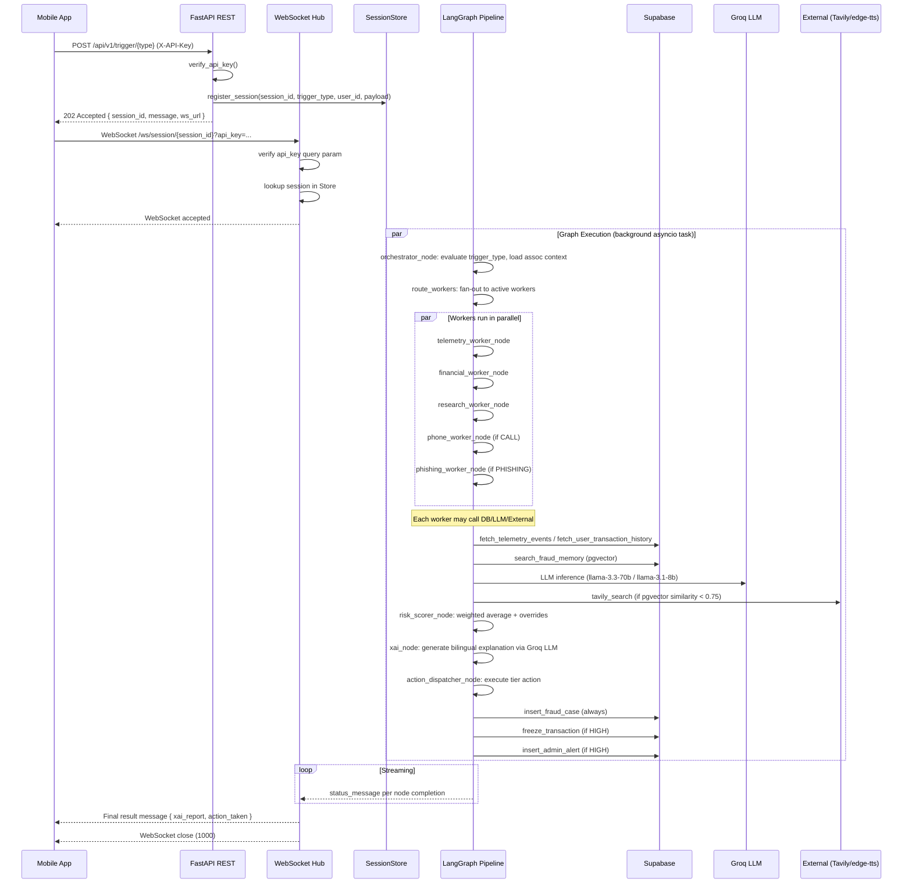

---

## 5. Trigger-Specific Workflows

### 5.1 TELEMETRY Trigger

**Purpose**: Silently track user behavioural signals to establish baseline for anomaly detection.

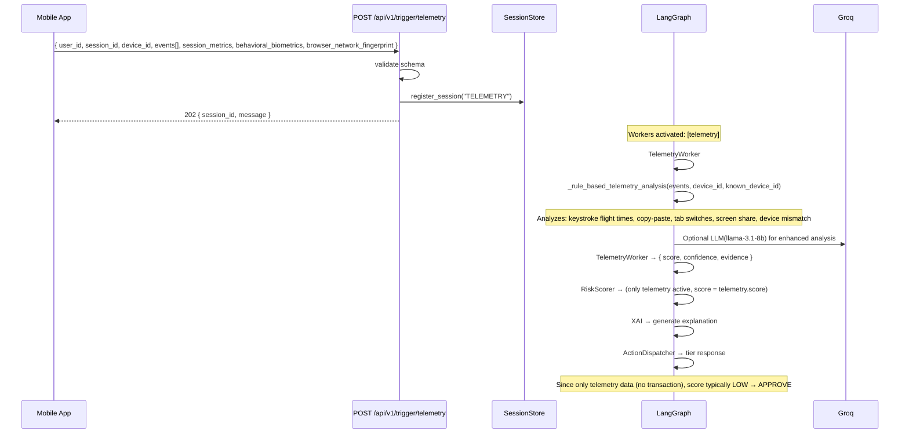

**Worker Activation**: `["telemetry"]`

**Key Analysis Signals**:
- **Keystroke flight times**: avg > 500ms = hesitation/dictation; avg < 10ms = automation/bot
- **Copy-paste events**: indicates user copying details from external source (WhatsApp/Telegram)
- **Tab switches**: user switching between apps during transaction
- **Screen sharing**: remote access software detected (strong coercion signal)
- **Device mismatch**: active device differs from registered device

---

### 5.2 TRANSACTION Trigger

**Purpose**: Pre-execution risk assessment of a funds transfer. The most complex trigger.

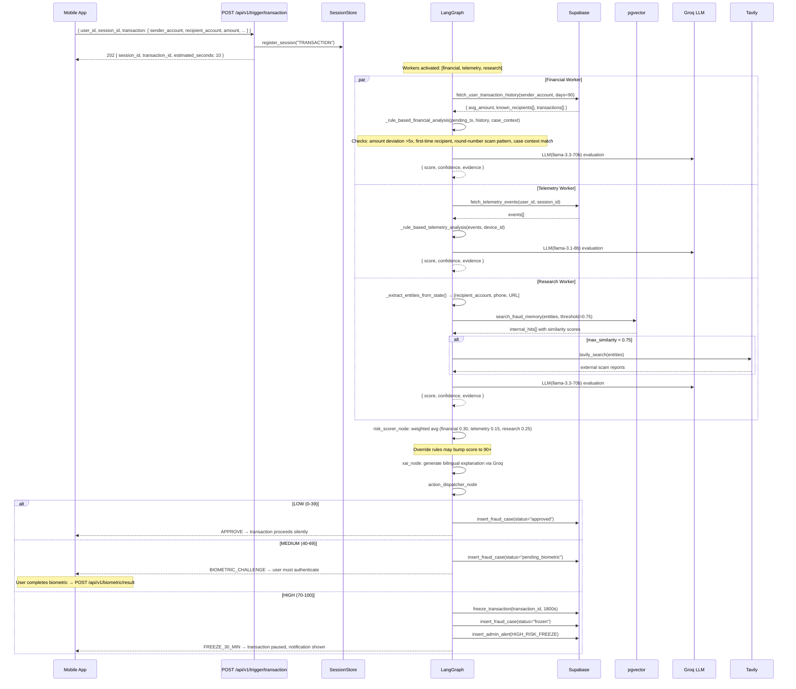

---

### 5.3 CALL Trigger

**Purpose**: Detect and intercept scam phone calls. Two modes: LISTEN (passive monitoring) and AUTO_TALK (AI takes over conversation).

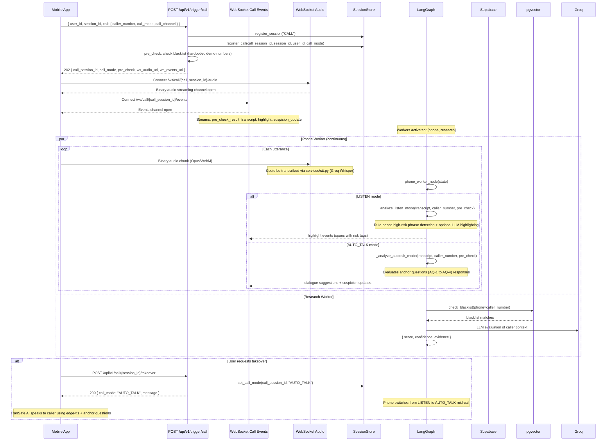

**Call Modes**:

| Mode | Behavior | When Used |
|---|---|---|
| `LISTEN` | Passive: transcribes & highlights scam phrases, no AI speech | Initial state, user talks to caller |
| `AUTO_TALK` | Active: AI speaks to caller using anchor questions | User triggers takeover mid-call |

**Anchor Questions (AUTO_TALK)**:

| ID | Intent | Question Template | Scam Signal |
|---|---|---|---|
| AQ-1 | Verify identity | "May I know your department/organisation and employee ID?" | Cannot provide ID, vague answers |
| AQ-2 | Call-back test | "I'd feel safer calling your official number directly. What's your extension?" | Refuses hang-up, claims line is secure |
| AQ-3 | Financial probe | "Will this involve transferring my funds to another account?" | Confirms transfer to safe account |
| AQ-4 | Urgency challenge | "I need to consult my family first. Is that okay?" | Pressures for immediate action |

**Pre-Check Logic**:
- Checks caller number against pgvector blacklist via `check_blacklist()`
- Checks if number starts with known spoofed bank prefixes: `1300`, `1800`, `03-2612`, `03-2170`
- Returns initial risk: `HIGH` if blacklisted/spoofed, else `UNKNOWN`

---

### 5.4 PHISHING Trigger

**Purpose**: Analyze submitted phishing content (SMS text, email, URL, or screenshot).

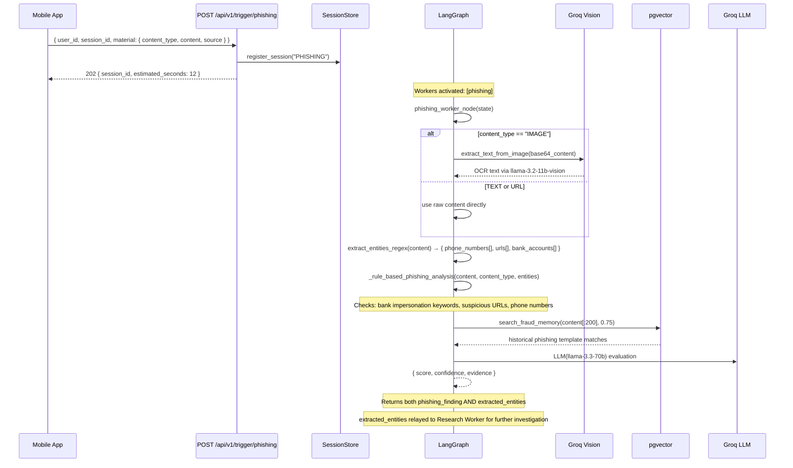

**Phishing Detection Signals**:

| Category | Keywords / Patterns |
|---|---|
| Bank Impersonation | maybank, cimb, rhb, public bank, bank negara |
| Government Impersonation | pdrm, lhdn, pos malaysia, kastam |
| Urgent Language | account suspended, gantung akaun, urgent, tindakan undang-undang |
| Credential Harvesting | otp, one time password, verify account, kemaskini |
| URL Lookalikes | domains mimicking official banks (e.g., `maybank2u-verify.xyz`) |

---

### 5.5 REPORT Trigger

**Purpose**: Store confirmed fraud reports into adaptive memory for future RAG retrieval.

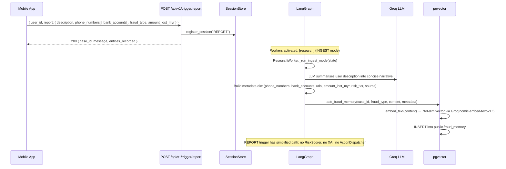

**Key Difference**: REPORT is the only trigger that **skips** the risk scoring → XAI → action dispatch chain. It goes directly from Orchestrator → ResearchWorker (INGEST) → AdaptiveMemoryUpdate → END.

---

## 6. LangGraph Pipeline Deep Dive

### 6.1 Graph Compilation

The LangGraph state machine is compiled **once at application startup** inside the FastAPI lifespan:

```python
# backend/main.py
@asynccontextmanager
async def lifespan(app: FastAPI):
    app.state.compiled_graph = compile_graph()  # ← called once
    yield

# backend/src/agents/graph.py
def compile_graph() -> CompiledStateGraph:
    builder = StateGraph(GraphState)

    # Register nodes
    builder.add_node("orchestrator", orchestrator_node)
    builder.add_node("telemetry", telemetry_worker_node)
    builder.add_node("research", research_worker_node)
    builder.add_node("financial", financial_worker_node)
    builder.add_node("phone", phone_worker_node)
    builder.add_node("phishing", phishing_worker_node)
    builder.add_node("scorer", risk_scorer_node)
    builder.add_node("xai", xai_node)
    builder.add_node("dispatcher", action_dispatcher_node)

    # Entry point
    builder.set_entry_point("orchestrator")

    # Conditional fan-out from orchestrator
    builder.add_conditional_edges(
        "orchestrator",
        route_workers,
        ["telemetry", "research", "financial", "phone", "phishing", "scorer"],
    )

    # Each worker converges at scorer
    builder.add_edge("telemetry", "scorer")
    builder.add_edge("research", "scorer")
    builder.add_edge("financial", "scorer")
    builder.add_edge("phone", "scorer")
    builder.add_edge("phishing", "scorer")

    # Linear evaluation path
    builder.add_edge("scorer", "xai")
    builder.add_edge("xai", "dispatcher")
    builder.add_edge("dispatcher", END)

    return builder.compile()
```

**Graph State Diagram**:

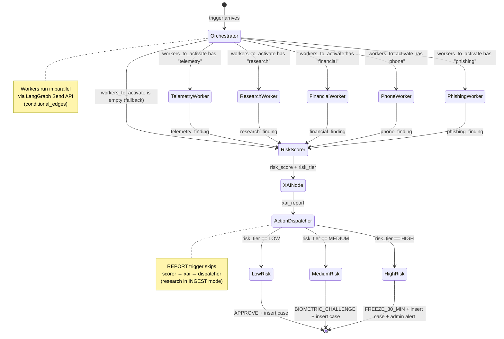

### 6.2 GraphState Schema

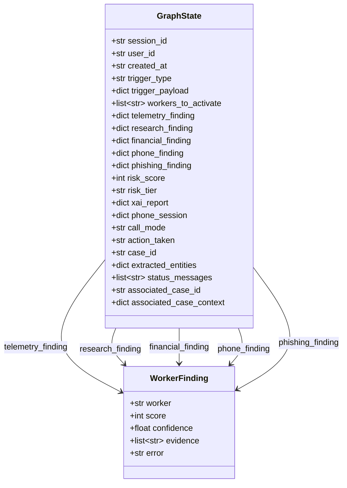

Each node receives the full `GraphState` and returns a **partial state update** dictionary. LangGraph merges these updates into the shared state.

### 6.3 Orchestrator Node Routing Logic

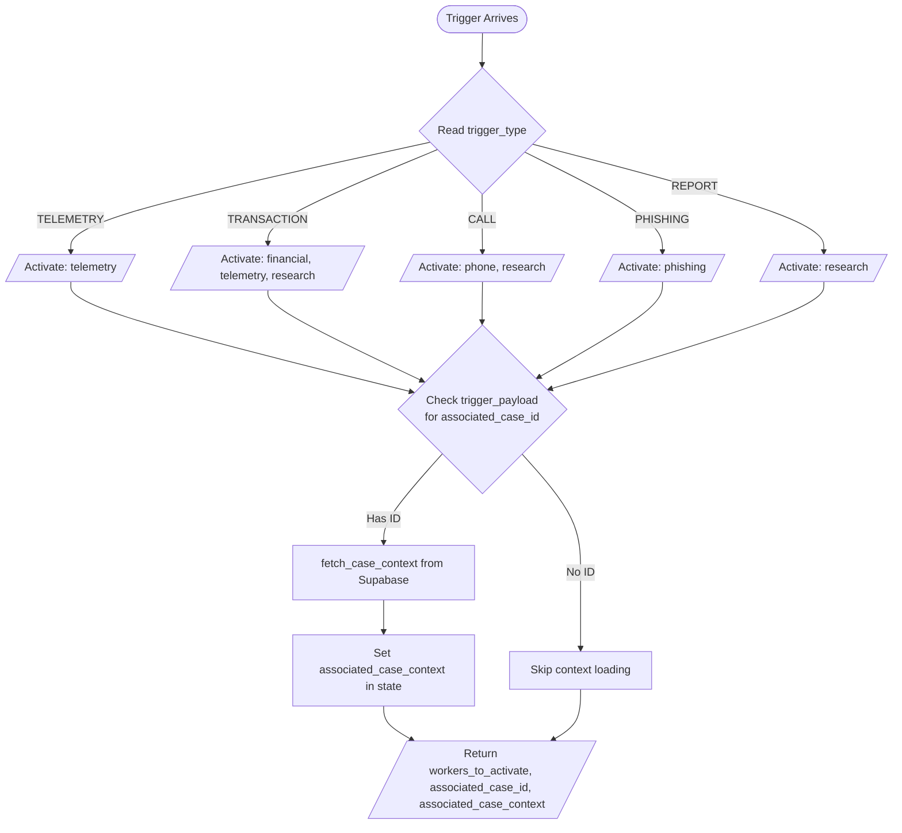

**`TRIGGER_WORKER_MAP`** (defined in `orchestrator.py`):

```python
TRIGGER_WORKER_MAP = {
    "TELEMETRY":   ["telemetry"],
    "TRANSACTION": ["financial", "telemetry", "research"],
    "CALL":        ["phone", "research"],
    "PHISHING":    ["phishing"],
    "REPORT":      ["research"],
}
```

### 6.4 Worker Node Execution

Workers execute **in parallel** via LangGraph's `add_conditional_edges` with the `route_workers` router function. Each worker:

1. Reads relevant data from `GraphState` (payload, DB records, etc.)
2. Runs **rule-based analysis** first (deterministic baseline)
3. Optionally invokes **LLM** for enhanced scoring
4. Returns a `WorkerFinding` dict: `{ worker, score, confidence, evidence, error? }`

**Parallel execution**:

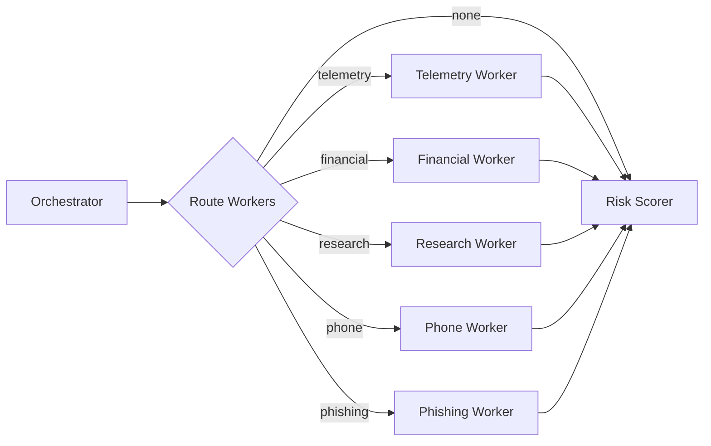

### 6.5 Risk Scorer Node

The `risk_scorer_node` in `graph_nodes.py` aggregates worker findings into a single `risk_score` (0–100):

```python
WORKER_WEIGHTS = {
    "telemetry": 0.15,
    "research":  0.25,
    "financial": 0.30,
    "phone":     0.20,
    "phishing":  0.10,
}

# Normalized weighted average over ACTIVE workers only
active_weight_sum = sum(WORKER_WEIGHTS[k] for k in active_findings)
weighted_score = sum(
    (active_findings[worker]["score"] * WORKER_WEIGHTS[worker] / active_weight_sum)
    for worker in active_findings
)
```

**Override rules** (bump score to 90+ in specific high-confidence scenarios):

```mermaid
flowchart TD
    Start[Weighted Score Calculated] --> Check1{Research score >= 80\nAND confidence > 0.90?}
    Check1 -->|Yes| Bump1[Bump score to max(score, 90)]
    Check1 -->|No| Check2

    Check2{Financial score > 90\nAND Research score > 80?}
    Check2 -->|Yes| Bump2[Bump score to max(score, 90)]
    Check2 -->|No| Check3

    Check3{Phone score >= 90\nAND confidence > 0.95?}
    Check3 -->|Yes| Bump3[Bump score to max(score, 90)]
    Check3 -->|No| Clamp

    Bump1 --> Clamp
    Bump2 --> Clamp
    Bump3 --> Clamp

    Clamp[Clamp score 0-100] --> Tier{Determine Tier}
    Tier -->|0-39| LOW
    Tier -->|40-69| MEDIUM
    Tier -->|70-100| HIGH
```

### 6.6 XAI Node

The `xai_node` generates a **bilingual (English/Malay) explainable AI report**:

```python
def xai_node(state):
    # Collect all active worker findings
    active_findings = [f for f in [...worker findings...] if f is not None]

    # Build prompt for Groq LLM
    prompt = f"""
    Based on worker findings, generate explanation for {risk_tier} risk (score: {risk_score}/100).
    Worker findings: {json.dumps(active_findings)}
    Respond in JSON: {{ verdict_summary, verdict_summary_ms, recommendation }}
    """

    # Call Groq llama-3.3-70b-versatile with response_format="json_object"
    response = groq_client.chat.completions.create(
        model="llama-3.3-70b-versatile",
        messages=[...],
        response_format={"type": "json_object"},
    )

    # Falls back to default text if LLM unavailable
```

**Output structure**:

```json
{
  "session_id": "sess-xxx",
  "trigger_type": "TRANSACTION",
  "risk_score": 82,
  "risk_tier": "HIGH",
  "verdict_summary": "This transaction shows multiple signs of a scam...",
  "verdict_summary_ms": "Transaksi ini menunjukkan beberapa tanda penipuan...",
  "workers_activated": ["financial", "telemetry", "research"],
  "worker_findings": [...],
  "recommendation": "Do not proceed with this transfer.",
  "case_id": "case-xxx",
  "action_taken": "FREEZE_30_MIN",
  "unfreeze_at": "2026-07-29T...Z"
}
```

### 6.7 Action Dispatcher Node

The `action_dispatcher_node` executes the tier-appropriate response:

```mermaid
flowchart TD
    Start[action_dispatcher_node] --> ReadTier{Read risk_tier}

    ReadTier -->|LOW| Low[action = APPROVE, status = approved]
    ReadTier -->|MEDIUM| Med[action = BIOMETRIC_CHALLENGE, status = pending_biometric]
    ReadTier -->|HIGH| High

    Low --> Insert[insert_fraud_case in Supabase]
    Med --> Insert
    High --> Freeze

    subgraph High[FREEZE_30_MIN]
        Freeze["freeze_transaction(transaction_id, 1800s)"]
        Alert["insert_admin_alert(HIGH_RISK_FREEZE)"]
    end

    Freeze --> Insert
    Alert --> Insert

    Insert --> Update[Update xai_report with case_id & action_taken]
    Update --> Return[Return { action_taken, case_id, xai_report, status_messages }]
```

---

## 7. Worker Agent Internal Workflows

### 7.1 Telemetry Worker

**File**: `backend/src/agents/workers/telemetry.py`
**LLM Model**: `llama-3.1-8b-instant` (faster/cheaper)

```mermaid
flowchart TD
    Start[telemetry_worker_node] --> GetData[Read state: user_id, session_id, device_id, payload]
    GetData --> Fetch{Has telemetry_events\nin payload?}

    Fetch -->|Yes| UsePayload[Use events from payload]
    Fetch -->|No| QueryDB[fetch_telemetry_events from Supabase]

    UsePayload --> RuleAnalysis
    QueryDB --> RuleAnalysis

    RuleAnalysis[Run _rule_based_telemetry_analysis]
    
    RuleAnalysis --> CheckFlight{Check keystroke\nflight times}
    CheckFlight -->|avg > 500ms| Hesitation[+35 score: hesitation/dictation]
    CheckFlight -->|avg < 10ms| Bot[+40 score: automation/bot]
    CheckFlight -->|normal| SkipFlight

    CheckCopy{Check copy-paste events}
    CheckCopy -->|yes| Copy[+25 score]
    CheckCopy -->|no| SkipCopy

    CheckTab{Check tab switches}
    CheckTab -->|yes| Tab[+15 score]
    CheckTab -->|no| SkipTab

    CheckSS{Check screen share}
    CheckSS -->|yes| SS[+50 score]
    CheckSS -->|no| SkipSS

    CheckDevice{Device ID match?}
    CheckDevice -->|mismatch| Dev[+20 score]
    CheckDevice -->|match| SkipDev

    Hesitation --> TryLLM
    Bot --> TryLLM
    Copy --> TryLLM
    Tab --> TryLLM
    SS --> TryLLM
    Dev --> TryLLM
    SkipFlight --> TryLLM
    SkipCopy --> TryLLM
    SkipTab --> TryLLM
    SkipSS --> TryLLM
    SkipDev --> TryLLM

    TryLLM[Attempt LLM invocation]
    TryLLM -->|Success| ParseLLM[Parse JSON response]
    TryLLM -->|Fail/Fallback| UseRule[Use rule-based finding]
    ParseLLM --> UseLLM[Use LLM-enhanced finding]
    UseRule --> Return
    UseLLM --> Return

    Return[Return { telemetry_finding: WorkerFinding }]
```

### 7.2 Financial Worker

**File**: `backend/src/agents/workers/financial.py`
**LLM Model**: `llama-3.3-70b-versatile`

```mermaid
flowchart TD
    Start[financial_worker_node] --> GetTx[Read pending_tx from payload]
    GetTx --> FetchHist[fetch_user_transaction_history from Supabase]
    FetchHist --> RuleAnalysis

    RuleAnalysis[Run _rule_based_financial_analysis]

    RuleAnalysis --> CheckAmount{Amount > 5x avg?}
    CheckAmount -->|Yes| AmountFlag[+35 score]
    CheckAmount -->|No| SkipAmount

    CheckRecipient{First-time recipient?}
    CheckRecipient -->|Yes| RecipientFlag[+25 score]
    CheckRecipient -->|No| SkipRecipient

    CheckRound{Round number >= RM1000?}
    CheckRound -->|Yes| RoundFlag[+15 score: scam pattern]
    CheckRound -->|No| SkipRound

    CheckCaseContext{Recipient in\ncase_context?}
    CheckCaseContext -->|Yes| CaseOverride[Score = 98! CRITICAL match]
    CheckCaseContext -->|No| SkipCase

    AmountFlag --> TryLLM
    RecipientFlag --> TryLLM
    RoundFlag --> TryLLM
    CaseOverride --> SkipLLM[Use rule result with override]
    SkipAmount --> TryLLM
    SkipRecipient --> TryLLM
    SkipRound --> TryLLM
    SkipCase --> TryLLM

    TryLLM[Attempt LLM llama-3.3-70b]
    TryLLM -->|Success| ParseLLM[Parse JSON]
    TryLLM -->|Fail| UseRule
    ParseLLM --> UseLLM

    UseRule --> HardEnforce{Recipient in case_context\nAND score < 95?}
    UseLLM --> HardEnforce
    SkipLLM --> HardEnforce

    HardEnforce -->|Yes| Override[Force score=98, confidence=0.95, add evidence]
    HardEnforce -->|No| Return

    Override --> Return
    Return[Return { financial_finding: WorkerFinding }]
```

**Critical override**: If the recipient account matches an account in `associated_case_context` (from a linked case's call transcripts or phishing OCR), the score is forced to **98** with high confidence. This is the system's strongest coercion-detection mechanism.

### 7.3 Research Worker

**File**: `backend/src/agents/workers/research.py`
**LLM Model**: `llama-3.3-70b-versatile`

```mermaid
flowchart TD
    Start[research_worker_node] --> CheckTrigger{trigger_type?}

    CheckTrigger -->|REPORT| IngestMode[Run _run_ingest_mode]
    CheckTrigger -->|TRANSACTION/CALL/PHISHING| QueryMode[Run _run_query_mode]

    IngestMode --> Summarize[LLM summarises user description]
    Summarize --> StoreMem[add_fraud_memory to pgvector]
    StoreMem --> ReturnIngest[Return finding + store case_id]

    QueryMode --> Extract[_extract_entities_from_state]
    Extract --> Entities{Any entities found?}

    Entities -->|No| NoEntities[Return finding: score=0, no evidence]
    Entities -->|Yes| VectorSearch

    VectorSearch[search_fraud_memory in pgvector]
    VectorSearch --> Hits{Max similarity?}

    Hits -->|>= 0.80| HighMatch[Score = sim*100, conf=0.95]
    Hits -->|0.75 - 0.79| MedMatch[Score = sim*90, conf=0.85]
    Hits -->|< 0.75| LowMatch

    LowMatch --> Tavily[tavily_search fallback]
    Tavily --> TavilyHits{Results found?}
    TavilyHits -->|Yes| TavilyBoost[Score=max(70, score), conf=max(0.88, conf)]
    TavilyHits -->|No| NoTavily[No external matches]

    HighMatch --> TryLLM
    MedMatch --> TryLLM
    TavilyBoost --> TryLLM
    NoTavily --> TryLLM

    TryLLM[Attempt LLM llama-3.3-70b]
    TryLLM --> UseLLMOrRule[Use LLM result or fall back to rule]
    UseLLMOrRule --> ReturnQuery

    ReturnQuery[Return WorkerFinding]
    ReturnIngest[Return WorkerFinding]
```

**Tavily Search**: Only triggered when pgvector similarity is below 0.75. Searches targeted Malaysian scam-reporting domains: `semak.my`, `rmp.gov.my`, `bnm.gov.my`, `lowyat.net`.

### 7.4 Phone Worker

**File**: `backend/src/agents/workers/phone.py`
**LLM Model**: `llama-3.3-70b-versatile`

```mermaid
flowchart TD
    Start[phone_worker_node] --> ReadState[Read call_mode, phone_session, caller_number, transcript]
    ReadState --> PreCheck[_pre_check_caller_number]

    PreCheck --> Blacklist{Caller blacklisted?}
    Blacklist -->|Yes| BlackScore[+50 score]
    Blacklist -->|No| SpoofCheck

    SpoofCheck{Spoofed prefix?}
    SpoofCheck -->|Yes| SpoofScore[+30 score]
    SpoofCheck -->|No| ModeCheck

    BlackScore --> ModeCheck
    SpoofScore --> ModeCheck

    ModeCheck{call_mode?}

    ModeCheck -->|LISTEN| ListenMode
    ModeCheck -->|AUTO_TALK| AutoTalkMode

    ListenMode --> PhraseCheck[Scan for HIGH_RISK_PHRASES]
    PhraseCheck --> Phrases{High-risk\nphrases found?}
    Phrases -->|Yes| Highlight[Generate highlight_events with spans]
    Phrases -->|No| Normal[Score=15, evidence: normal parameters]

    Highlight --> ScoreCalc[Score += min(count*30, 75)]
    ScoreCalc --> ReturnListen

    AutoTalkMode --> EvalAQ[Evaluate anchor questions in transcript]
    EvalAQ --> AQ1{AQ-1: identity?\n"employee id","organisation"}
    AQ1 -->|Failed/Refused| AQ1Score[+25]
    AQ1 -->|Not found| AQ2

    AQ2{AQ-2: call-back?\n"hang up","hotline"}
    AQ2 -->|Resisted| AQ2Score[+30]
    AQ2 -->|Not found| AQ3

    AQ3{AQ-3: financial?\n"transfer","safe account"}
    AQ3 -->|Confirmed| AQ3Score[+30]
    AQ3 -->|Not found| AQ4

    AQ4{AQ-4: urgency?\n"family","branch"}
    AQ4 -->|Pressured| AQ4Score[+30]
    AQ4 -->|Not found| ReturnAuto

    AQ1Score --> ReturnAuto
    AQ2Score --> ReturnAuto
    AQ3Score --> ReturnAuto
    AQ4Score --> ReturnAuto

    ReturnListen[Return finding + highlight_events]
    ReturnAuto[Return finding + updated phone_session]

    ReturnListen --> UpdateSession[Update phone_session state dict]
    ReturnAuto --> UpdateSession
    UpdateSession --> FinalReturn[Return { phone_finding, phone_session }]
```

**High-Risk Phrases Detected (LISTEN mode)**:

```
"safe account", "akaun selamat",
"money laundering", "pengubahan wang haram",
"face arrest", "akan ditangkap",
"otp", "one time password",
"transfer immediately", "pindah segera",
"bank negara", "pdrm", "jabatan kastam",
"your account suspended", "akaun anda digantung",
"investment guarantee", "pulangan dijamin"
```

### 7.5 Phishing Worker

**File**: `backend/src/agents/workers/phishing.py`
**LLM Model**: `llama-3.3-70b-versatile`

```mermaid
flowchart TD
    Start[phishing_worker_node] --> ReadPayload[Read content_type, raw_content]
    ReadPayload --> IsImage{content_type == IMAGE?}

    IsImage -->|Yes| OCR[extract_text_from_image via Groq Vision]
    IsImage -->|No| UseRaw[Use raw content directly]

    OCR --> ExtractEntities
    UseRaw --> ExtractEntities

    ExtractEntities[extract_entities_regex: phones, URLs, bank accounts]
    ExtractEntities --> RuleAnalysis

    RuleAnalysis[Run _rule_based_phishing_analysis]
    RuleAnalysis --> CheckKeywords{Match phishing\nkeywords?}
    CheckKeywords -->|Yes| KeywordScore[+35]
    CheckKeywords -->|No| CheckURLs

    CheckURLs{Has suspicious URLs?}
    CheckURLs -->|Yes| URLScore[+30]
    CheckURLs -->|No| CheckPhones

    CheckPhones{Has phone numbers?}
    CheckPhones -->|Yes| PhoneScore[+15]
    CheckPhones -->|No| VectorSearch

    KeywordScore --> VectorSearch
    URLScore --> VectorSearch
    PhoneScore --> VectorSearch

    VectorSearch[search_fraud_memory against pgvector]
    VectorSearch --> Hits{Similar > 0.75?}
    Hits -->|Yes| BoostScore[score = max(score, sim*95)]
    Hits -->|No| TryLLM

    BoostScore --> TryLLM
    TryLLM[Attempt LLM llama-3.3-70b]
    TryLLM --> UseLLMOrRule
    UseLLMOrRule --> Return

    Return[Return { phishing_finding, extracted_entities }]
```

**Entity extraction relay**: The `extracted_entities` dict is returned in the state update so the downstream Research Worker (in PHISHING trigger's subsequent execution) can use them for blacklist lookup.

---

## 8. Database Interaction Flow

```mermaid
flowchart TD
    subgraph Supabase[Supabase PostgreSQL]
        direction TB
        USERS[public.users]
        ACCOUNTS[public.accounts]
        TXNS[public.transactions]
        CASES[public.fraud_cases]
        ALERTS[public.admin_alerts]
        ENTITIES[public.case_entities]
        PHISH[public.phishing_submissions]
        TRANS[public.call_transcripts]
        MEMORY[public.fraud_memory<br/>+ pgvector]
        TELE[telemetry.telemetry_events]
        
        MEMORY --> VEC[vector(768) embedding]
        CASES --> XAI[jsonb xai_report]
    end

    subgraph Operations[CRUD Operations]
        direction TB
        OP1[fetch_telemetry_events]
        OP2[fetch_user_transaction_history]
        OP3[fetch_case_context]
        OP4[insert_fraud_case]
        OP5[insert_admin_alert]
        OP6[insert_case_entities]
        OP7[insert_phishing_submission]
        OP8[insert_call_transcript]
        OP9[update_transaction_status]
        OP10[freeze_transaction]
        OP11[search_fraud_memory]
        OP12[add_fraud_memory]
        OP13[check_blacklist]
    end

    OP1 --> TELE
    OP2 --> TXNS
    OP3 --> TRANS
    OP3 --> PHISH
    OP3 --> ENTITIES
    OP4 --> CASES
    OP5 --> ALERTS
    OP6 --> ENTITIES
    OP7 --> PHISH
    OP8 --> TRANS
    OP9 --> TXNS
    OP10 --> TXNS
    OP11 --> MEMORY
    OP11 --> VEC
    OP12 --> MEMORY
    OP12 --> VEC
    OP13 --> MEMORY
```

**Database Functions** (`backend/src/db/supabase.py` and `backend/src/db/vector_store.py`):

| Function | Input | Output | Used By |
|---|---|---|---|
| `fetch_telemetry_events(user_id, session_id, limit)` | User + Session | `list[dict]` events | Telemetry Worker |
| `fetch_user_transaction_history(sender_account, days)` | Account number | `dict` with avg_amount, known_recipients | Financial Worker |
| `fetch_case_context(case_id)` | Case UUID | `dict` with transcripts, phishing, entities | Orchestrator |
| `insert_fraud_case(case_data)` | Case dict | `str` case_id | Action Dispatcher |
| `insert_admin_alert(alert_data)` | Alert dict | `str` alert_id | Action Dispatcher |
| `insert_call_transcript(case_id, speaker, utterance, risk_score)` | Transcript data | `str` record_id | Phone Worker |
| `update_transaction_status(transaction_id, status, unfreeze_at)` | Status update | None | Action Dispatcher |
| `freeze_transaction(transaction_id, freeze_duration)` | Freeze params | None | Action Dispatcher |
| `insert_case_entities(case_id, entities)` | Entities list | None | Post-processing |
| `insert_phishing_submission(submission_data)` | Submission dict | `str` record_id | Post-processing |
| `search_fraud_memory(query, threshold, top_k)` | Text query | `list[dict]` matches with similarity | Research, Phishing Workers |
| `check_blacklist(phone, url)` | Phone/URL | `list[dict]` matches | Phone Worker |
| `add_fraud_memory(case_id, fraud_type, content, metadata)` | Memory record | None | Research Worker (INGEST) |

**pgvector Search RPC** (defined in `schema.sql`):

```sql
CREATE FUNCTION search_fraud_memory(
    query_embedding vector(768),
    match_threshold FLOAT DEFAULT 0.75,
    match_count     INT   DEFAULT 5
)
RETURNS TABLE (
    id UUID, case_id UUID, fraud_type TEXT, content TEXT,
    phone_numbers TEXT[], bank_accounts TEXT[], urls TEXT[],
    amount_lost_myr NUMERIC, risk_tier TEXT, source TEXT,
    similarity FLOAT
)
LANGUAGE plpgsql AS $$
BEGIN
    RETURN QUERY
    SELECT fm.id, fm.case_id, fm.fraud_type, fm.content,
           fm.phone_numbers, fm.bank_accounts, fm.urls,
           fm.amount_lost_myr, fm.risk_tier, fm.source,
           1 - (fm.embedding <=> query_embedding) AS similarity
    FROM public.fraud_memory fm
    WHERE 1 - (fm.embedding <=> query_embedding) > match_threshold
    ORDER BY fm.embedding <=> query_embedding
    LIMIT match_count;
END;
$$;
```

---

## 9. External Service Interaction Flow

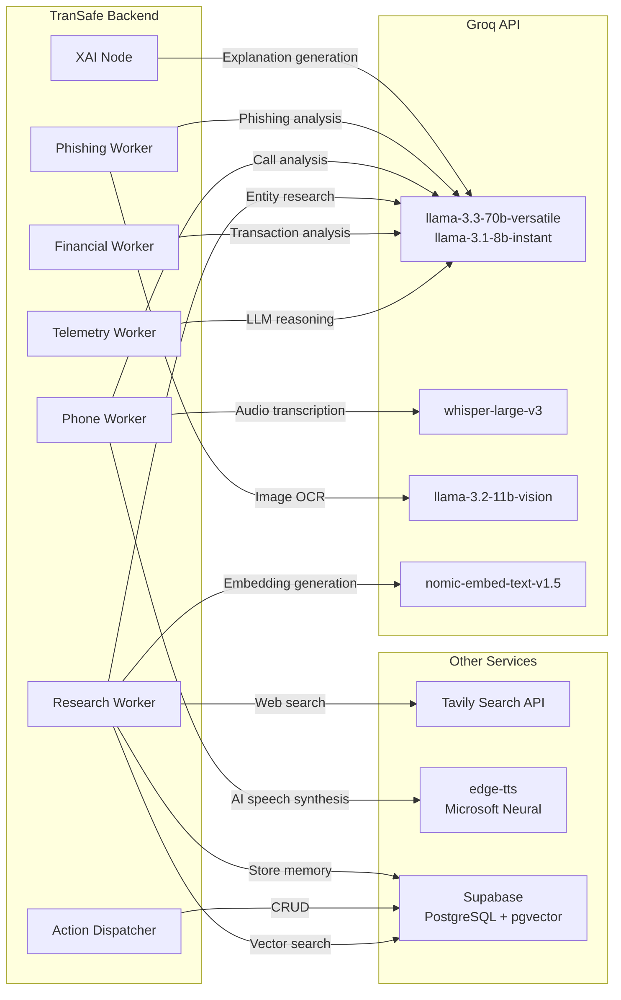

**Service call patterns**:

| Service | Client Library | Authentication | Fallback Behavior |
|---|---|---|---|
| Groq Chat | `langchain-groq` + `groq` SDK | `GROQ_API_KEY` env var | Rule-based fallback; status message logged |
| Groq Whisper | `groq.audio.transcriptions` | `GROQ_API_KEY` env var | Returns empty string on failure |
| Groq Vision | `groq.chat.completions` | `GROQ_API_KEY` env var | Returns original content on failure |
| Groq Embeddings | `groq.embeddings.create` | `GROQ_API_KEY` env var | Deterministic pseudo-embedding via MD5 hash |
| Supabase | `supabase` Python SDK | `SUPABASE_URL` + `SUPABASE_SERVICE_KEY` | RuntimeError if uninitialized |
| Tavily | `tavily` Python SDK | `TAVILY_API_KEY` env var | Empty results list on failure |
| edge-tts | `edge_tts` library | None (free, no auth) | Returns empty bytes on failure |

---

## 10. Risk Scoring & Tier Decision Algorithm

```mermaid
flowchart TD
    Start([Risk Scorer Node]) --> Collect[Collect all active WorkerFindings<br/>from state]
    Collect --> Filter[Filter out None findings<br/>and findings with error]

    Filter --> Count{Any active\nfindings?}
    Count -->|No| Zero[Score = 0]
    Count -->|Yes| Weights

    Weights[Sum weights of active workers]
    Weights --> Norm[Active weight sum normalization]

    Norm --> Calc[weighted_score = sum(score * weight / active_weight_sum)]
    Calc --> ApplyOverrides

    subgraph ApplyOverrides[Override Rules]
        O1{Research score >= 80\nAND conf > 0.90?}
        O1 -->|Yes| B1[score = max(score, 90)]
        O2{Financial score > 90\nAND Research score > 80?}
        O2 -->|Yes| B2[score = max(score, 90)]
        O3{Phone score >= 90\nAND conf > 0.95?}
        O3 -->|Yes| B3[score = max(score, 90)]
    end

    B1 --> Clamp
    B2 --> Clamp
    B3 --> Clamp
    O1 -->|No| Clamp
    O2 -->|No| Clamp
    O3 -->|No| Clamp
    Zero --> Clamp

    Clamp[Clamp score between 0 and 100]

    Clamp --> Decision{score range?}

    Decision -->|0-39| LOW[risk_tier = LOW]
    Decision -->|40-69| MEDIUM[risk_tier = MEDIUM]
    Decision -->|70-100| HIGH[risk_tier = HIGH]

    LOW --> Return
    MEDIUM --> Return
    HIGH --> Return

    Return[Return { risk_score, risk_tier, status_messages }]
```

**Weight table**:

| Worker | Weight | Rationale |
|---|---|---|
| `financial` | 0.30 | Highest — transaction is the core risk event |
| `research` | 0.25 | High — blacklist/vector memory match is strong signal |
| `phone` | 0.20 | Medium — call context adds coercion signal |
| `telemetry` | 0.15 | Lower — behavioral data is supplementary |
| `phishing` | 0.10 | Lowest — phishing context is indirect |

Weights are **normalized** to sum to 1.0 among only the active workers. If only `telemetry` (0.15) and `financial` (0.30) are active, they are re-weighted as 0.15/0.45 = 0.33 and 0.30/0.45 = 0.67.

---

## 11. Action Dispatching & Side Effects

| Tier | Action | DB Side Effects | User-Facing Effect |
|---|---|---|---|
| **LOW** (0–39) | `APPROVE` | Insert `fraud_cases` with `status="approved"` | Transaction proceeds silently |
| **MEDIUM** (40–69) | `BIOMETRIC_CHALLENGE` | Insert `fraud_cases` with `status="pending_biometric"` | User sees warning + must complete biometric auth |
| **HIGH** (70–100) | `FREEZE_30_MIN` | 1. `freeze_transaction()` → sets `transactions.status="frozen"`, `frozen_at=now`, `unfreeze_at=now+30min`<br/>2. Insert `fraud_cases` with `status="frozen"`<br/>3. Insert `admin_alerts` with `type="HIGH_RISK_FREEZE"` | Transaction paused 30 min, freeze notice shown |

**Biometric Result Callback** (POST `/api/v1/biometric/result`):

| User Action | Result | Transaction Status |
|---|---|---|
| Biometric passed | `PASSED` | `approved` |
| Biometric failed | `FAILED` / `DECLINED` | `blocked` |
| Biometric unavailable | other | `manual_review` |

---

## 12. WebSocket Streaming Protocol

**Endpoint**: `/ws/session/{session_id}?api_key=...`

The main pipeline WebSocket streams progress updates as the LangGraph executes:

```mermaid
sequenceDiagram
    participant Client as Mobile App
    participant WS as WebSocket Hub

    Client->>WS: Connect /ws/session/{session_id}?api_key=...
    WS->>WS: Verify API key
    WS->>WS: Lookup session in SessionStore
    WS-->>Client: WebSocket accepted

    Note over WS: Stream status updates as graph executes

    WS-->>Client: { type: "status", session_id, message: "Orchestrator: routing TRANSACTION trigger to [financial, telemetry, research]", worker: "orchestrator", timestamp }
    WS-->>Client: { type: "status", session_id, message: "Financial Worker: querying 90-day transaction history...", worker: "financial", timestamp }
    WS-->>Client: { type: "status", session_id, message: "Telemetry Worker: checking session behavioral biometrics...", worker: "telemetry", timestamp }
    WS-->>Client: { type: "status", session_id, message: "Research Worker: searching internal fraud memory and blacklists...", worker: "research", timestamp }
    WS-->>Client: { type: "status", session_id, message: "Risk Scorer: computing weighted risk score...", worker: "scorer", timestamp }
    WS-->>Client: { type: "status", session_id, message: "Explainable AI: compiling verdict explanation report...", worker: "xai", timestamp }

    WS-->>Client: { type: "result", session_id, trigger_type, xai_report: {...}, timestamp }

    Note over Client,WS: Client may send { type: "ping" } → server responds { type: "pong" }

    WS->>WS: Close (code 1000)
```

Currently the WebSocket handler emits **simulated/hardcoded** status messages for demo purposes. In production, these would be streamed from the actual LangGraph `astream()` execution.

---

## 13. Phone Call Session Protocol

**Endpoints**:
- `/ws/call/{call_session_id}/audio` — binary audio streaming (Opus/WebM)
- `/ws/call/{call_session_id}/events` — JSON event stream

### Audio Stream Protocol

```mermaid
sequenceDiagram
    participant App as Mobile App
    participant AudioWS as /ws/call/{id}/audio
    participant EventsWS as /ws/call/{id}/events
    participant Backend as Backend

    App->>AudioWS: Connect
    AudioWS-->>App: Accepted
    
    loop While call active
        App->>AudioWS: Binary audio chunk (bytes)
        Note over AudioWS: Could transcribe via Groq Whisper
        AudioWS->>EventsWS: Send transcript & highlight events
    end

    App->>AudioWS: { type: "call_end" }
    AudioWS-->>App: Close (code 1000)
```

### Events Stream Protocol

The events WebSocket sends the following message types:

1. **`pre_check_result`** — initial caller number blacklist check
2. **`transcript`** — per-utterance transcription with speaker role
3. **`highlight`** — risk span highlighting with tags and scores
4. **`suspicion_update`** — cumulative suspicion score updates

```mermaid
sequenceDiagram
    participant App as Mobile App
    participant Events as /ws/call/{id}/events

    Events-->>App: { type: "pre_check_result", caller_number, blacklisted, blacklist_case_count, spoofed_prefix, initial_risk, warning_text, warning_text_ms }

    Events-->>App: { type: "transcript", utterance_id, speaker: "CALLER"|"AI"|"USER", text, timestamp }

    Events-->>App: { type: "highlight", utterance_id, speaker, text, spans: [{ start, end, text, risk_level: "HIGH"|"MEDIUM", tag, tag_label }], utterance_risk_score, cumulative_suspicion_score }

    Events-->>App: { type: "suspicion_update", suspicion_score, risk_tier, trigger_escalation: true/false, escalation_reason }
```

### Call Takeover Flow

```mermaid
sequenceDiagram
    participant App as Mobile App
    participant API as POST /api/v1/call/{id}/takeover
    participant WS as WebSocket Events

    Note over App: User presses "AI Takeover" button

    App->>API: POST /api/v1/call/{session_id}/takeover (X-API-Key)
    API->>API: Lookup call session in SessionStore
    API->>API: Validate call not ENDED, not already AUTO_TALK
    API->>API: session_store.set_call_mode(call_session_id, "AUTO_TALK")
    API-->>App: 200 { call_mode: "AUTO_TALK", message, ws_events_url }

    Note over App,WS: TranSafe AI now speaks to caller using anchor questions
    Note over App,WS: Audio from AI generated via edge-tts + sent through audio WS
```

---

## 14. Admin Operations Workflow

```mermaid
flowchart TD
    subgraph Admin[Admin REST Endpoints /admin/v1]
        direction TB
        A1[GET /cases<br/>List cases with pagination & filters]
        A2[GET /cases/{id}<br/>Case detail]
        A3[PATCH /alerts/{id}<br/>Review/dismiss alert]
        A4[POST /accounts/{account}/freeze<br/>Admin freeze account]
        A5[POST /accounts/{account}/unfreeze<br/>Admin unfreeze account]
        A6[GET /analytics/summary<br/>Dashboard stats]
        A7[GET /analytics/trend<br/>Time-series chart data]
    end

    subgraph Auth[Authentication]
        XAK[X-Admin-Key header]
        VAK[verify_admin_key dependency]
    end

    Admin -->|All endpoints| Auth
    Auth -->|Valid| Handle
    Auth -->|Invalid| 401[401 Unauthorized]

    A1 --> Handle
    A2 --> Handle
    A3 --> Handle
    A4 --> Handle
    A5 --> Handle
    A6 --> Handle
    A7 --> Handle

    subgraph Handle[Return Data]
        Cases[Fraud cases list with pagination]
        Detail[Full case detail + XAI report]
        AlertUpdate[Updated alert status]
        FreezeResult[Account frozen confirmation]
        UnfreezeResult[Account unfrozen confirmation]
        Summary[Aggregated analytics]
        Trend[Daily trend series]
    end
```

**Note**: Admin endpoints currently return **mock data**. They are designed to query Supabase tables in production.

---

## 15. Error Handling & Graceful Degradation

The system is designed to **fail open** — if a worker fails, the pipeline continues without it:

```mermaid
flowchart TD
    Start[Worker Execution] --> Try[Attempt operation]
    Try -->|Success| Return[Return finding]
    Try -->|Exception| Catch[Catch Exception]

    Catch --> Log[Log warning]
    Log --> Continue[Return None finding]
    Continue --> Scorer[Risk Scorer continues<br/>with remaining workers]
    Scorer --> Normalize[Score re-normalized<br/>across active workers only]
    Normalize --> Note[Status message notes the gap]
    Note --> Complete[Pipeline completes<br/>with note in XAI report]
```

**Degradation scenarios**:

| Failure | Behavior |
|---|---|
| Supabase unavailable | `RuntimeError` caught by worker → worker returns None → scorer skips it |
| Groq LLM unavailable | Each worker falls back to rule-based analysis |
| Groq Embeddings unavailable | Deterministic pseudo-embedding via MD5 hash + random seed (768-dim) |
| Tavily unavailable | Research Worker skips web search, uses only pgvector results |
| edge-tts unavailable | Phone Worker returns empty audio bytes |
| Missing environment variables | Default values used for API keys (marked as placeholders) |

**HTTP Error Responses**:

```json
{
  "success": false,
  "data": null,
  "error": {
    "code": "UNAUTHORIZED",
    "message": "Missing or invalid X-API-Key header",
    "details": {}
  },
  "timestamp": "2026-07-29T10:00:00Z"
}
```

Error codes: `UNAUTHORIZED` (401), `NOT_FOUND` (404), `CALL_ENDED` (422), `ALREADY_AUTO_TALK` (409), `ERROR` (generic).

---

## 16. Startup Sequence & Configuration

```mermaid
flowchart TD
    Start[uvicorn main:app] --> LoadEnv[Load .env via python-dotenv]
    LoadEnv --> Init[FastAPI app creation]

    Init --> RouterMount[Mount routers:<br/>triggers_router (/api/v1)<br/>websocket_router (/ws)<br/>call_ws_router (/ws/call)<br/>admin_router (/admin/v1)]
    RouterMount --> CORS[Configure CORS middleware<br/>allow_origins=*]

    CORS --> Lifespan[Enter lifespan context manager]
    Lifespan --> Compile[compile_graph()<br/>→ Build StateGraph<br/>→ Register 9 nodes<br/>→ Wire conditional edges]
    Compile --> Store[Store compiled graph<br/>in app.state.compiled_graph]

    Store --> Ready[Server ready on :8000]

    subgraph ExternalInit[Lazy Initialization on First Use]
        Supabase[init_supabase()<br/>creates Supabase client]
        Vector[init_vector_store()<br/>creates Groq + Supabase clients]
    end
```

**Environment Variables** (from `.env` file):

| Variable | Default | Set In |
|---|---|---|
| `SUPABASE_URL` | — | `.env` |
| `SUPABASE_SERVICE_KEY` | — | `.env` |
| `GROQ_API_KEY` | — | `.env` |
| `TAVILY_API_KEY` | — | `.env` |
| `API_KEY` | `transafe-hackathon-key-2026` | `.env` or hardcoded |
| `ADMIN_API_KEY` | `transafe-admin-key-2026` | `.env` or hardcoded |
| `LANGCHAIN_API_KEY` | — | `.env` (optional tracing) |
| `LANGCHAIN_PROJECT` | `Transafe` | `.env` |

**Dependencies** (`pyproject.toml`):

```
fastapi>=0.115.0, uvicorn>=0.30.0,
langgraph>=0.2.0, langchain-groq>=0.1.0, langchain-core>=0.2.0,
groq>=0.9.0, supabase>=2.5.0, tavily-python>=0.3.0,
edge-tts>=6.1.0, pydantic>=2.7.0, faker>=25.0.0,
httpx>=0.27.0, python-dotenv>=1.0.0
```

Dev: `mypy`, `pytest`, `pytest-asyncio`, `ruff`

---

## 17. Seed Data & Mock Data Generation

**File**: `backend/seeds/seed_db.py`

```mermaid
flowchart TD
    Start[python seed_db.py] --> Init[Initialize Supabase + pgvector clients]
    Init --> Check{Supabase client\navailable?}
    Check -->|No| DryRun[Generate mock data only, print stats]
    Check -->|Yes| Generate

    Generate[generate_mock_data]
    Generate --> Users[Create 10 users with faker]
    Users --> Accounts[Create 1-2 accounts per user]
    Accounts --> Txns[Create 5-20 transactions per account<br/>over 90-day window]

    Txns --> ScamData[Include scam demo data]
    ScamData --> ScamPhones[3 known scammer phone numbers]
    ScamData --> ScamAccounts[2 known fraud accounts]
    ScamData --> ScamURLs[2 phishing URLs]
    ScamData --> FraudMemories[3 fraud memory entries<br/>- Macau Scam (RM 12,000)<br/>- Phishing SMS (RM 4,500)<br/>- Investment Scam (RM 25,000)]

    ScamData --> InsertDB[Insert into Supabase tables]
    InsertDB --> InsertUsers[Insert users]
    InsertUsers --> InsertAccounts[Insert accounts]
    InsertAccounts --> InsertTxns[Insert transactions]
    InsertTxns --> InsertMem[Insert fraud memories<br/>(with pgvector embeddings)]

    InsertMem --> Done[Seeding complete]
```

**Demo fraud memories** stored in pgvector:

| Fraud Type | Summary | Phone | Account | Amount |
|---|---|---|---|---|
| Macau Scam | PDRM impersonation call, told to transfer to safe account | 0161234567, 0197654321 | 7653-1234-5678-9012 | RM 12,000 |
| Phishing SMS | Fake Maybank2u login link | 0123456789 | — | RM 4,500 |
| Investment Scam | WhatsApp crypto group, promised 30% monthly | 0197654321 | 8888-0000-1111-2222 | RM 25,000 |

---

## 18. Testing Structure

```mermaid
flowchart TD
    subgraph Tests[backend/tests/]
        direction TB
        UNIT[unit/]
        INTEGRATION[integration/]
    end

    subgraph UnitTests[Unit Tests]
        T1[test_graph.py<br/>Orchestrator routing<br/>Risk scorer weighted scoring<br/>Action dispatcher tier logic]
        T2[test_workers.py<br/>Individual worker nodes]
        T3[test_api.py<br/>API endpoint validation]
        T4[test_db.py<br/>DB CRUD operations]
        T5[test_services.py<br/>Service integrations]
        T6[test_skills.py<br/>Skill file loading]
    end

    subgraph IntegrationTests[Integration Tests]
        E2E[test_e2e_scenarios.py<br/>End-to-end pipeline scenarios]
    end

    UNIT --> UnitTests
    INTEGRATION --> IntegrationTests

    UnitTests --> Run[pytest]
    IntegrationTests --> Run
    Run --> Report[Test results]
```

**Key test patterns** (from `test_graph.py`):

| Test | What it verifies |
|---|---|
| `test_orchestrator_routing_transaction` | TRANSACTION → `["financial", "telemetry", "research"]` |
| `test_orchestrator_routing_call_and_telemetry` | CALL → `["phone", "research"]`, TELEMETRY → `["telemetry"]` |
| `test_risk_scorer_node_weighted_scoring` | Weighted average with only 2 active workers = 63, tier = MEDIUM |
| `test_action_dispatcher_high_risk_freeze` | HIGH → FREEZE_30_MIN, calls freeze_transaction + insert_fraud_case + insert_admin_alert |

---

## Appendix: Quick Reference

### Key File Paths

| Component | File |
|---|---|
| Entry point | `backend/main.py` |
| Graph compilation | `backend/src/agents/graph.py` |
| GraphState | `backend/src/agents/state.py` |
| Orchestrator | `backend/src/agents/orchestrator.py` |
| Scorer/XAI/Dispatcher | `backend/src/agents/graph_nodes.py` |
| Telemetry Worker | `backend/src/agents/workers/telemetry.py` |
| Financial Worker | `backend/src/agents/workers/financial.py` |
| Research Worker | `backend/src/agents/workers/research.py` |
| Phone Worker | `backend/src/agents/workers/phone.py` |
| Phishing Worker | `backend/src/agents/workers/phishing.py` |
| Prompt builders | `backend/src/agents/prompts.py` |
| REST triggers | `backend/src/api/triggers.py` |
| Pipeline WebSocket | `backend/src/api/websocket.py` |
| Call WebSockets | `backend/src/api/websocket_call.py` |
| Admin API | `backend/src/api/admin.py` |
| Session store | `backend/src/api/session_store.py` |
| Auth dependencies | `backend/src/api/dependencies.py` |
| DB operations | `backend/src/db/supabase.py` |
| Vector store | `backend/src/db/vector_store.py` |
| Pydantic schemas | `backend/src/models/schemas.py` |
| STT service | `backend/src/services/stt.py` |
| TTS service | `backend/src/services/tts.py` |
| Tavily service | `backend/src/services/tavily.py` |
| Vision service | `backend/src/services/vision.py` |
| DB schema | `backend/schema.sql` |
| Seed data | `backend/seeds/seed_db.py` |
| Verification script | `backend/scripts/verify_live_integrations.py` |

### Trigger → Worker → Output Map

| Trigger | Workers | Scorer Weights | Expected Score Range |
|---|---|---|---|
| TELEMETRY | telemetry (1.0) | 0.15 → 1.0 normalized | 10–40 (LOW typically) |
| TRANSACTION | financial (0.30/0.70), telemetry (0.15/0.70), research (0.25/0.70) | Normalized to 1.0 | 10–100 |
| CALL | phone (0.20/0.45), research (0.25/0.45) | Normalized to 1.0 | 20–100 |
| PHISHING | phishing (1.0) | 0.10 → 1.0 normalized | 10–100 |
| REPORT | research (INGEST) | N/A (skip scorer) | N/A (store only) |

### Risk Tier Thresholds

```
Score:  0──────────────────────────────39───40──────────────────────────────69───70──────────────────────────────100
Tier:  │           LOW                │             MEDIUM                │              HIGH                │
Action:│     Silent Approval          │    Biometric Challenge            │     FREEZE_30_MIN + Admin Alert  │
```

---

> **End of System Workflow Documentation**
>
> This document was generated from the TranSafe backend source code at `backend/`. For the most up-to-date information, refer directly to the source files listed above.
