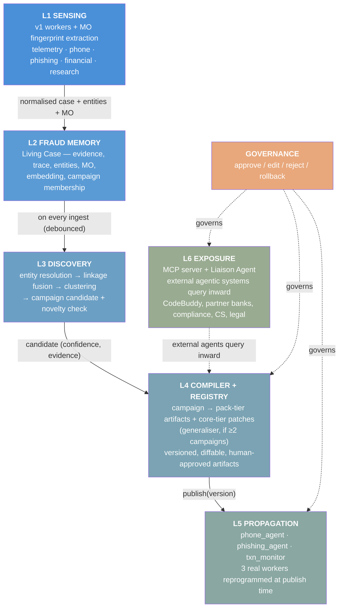
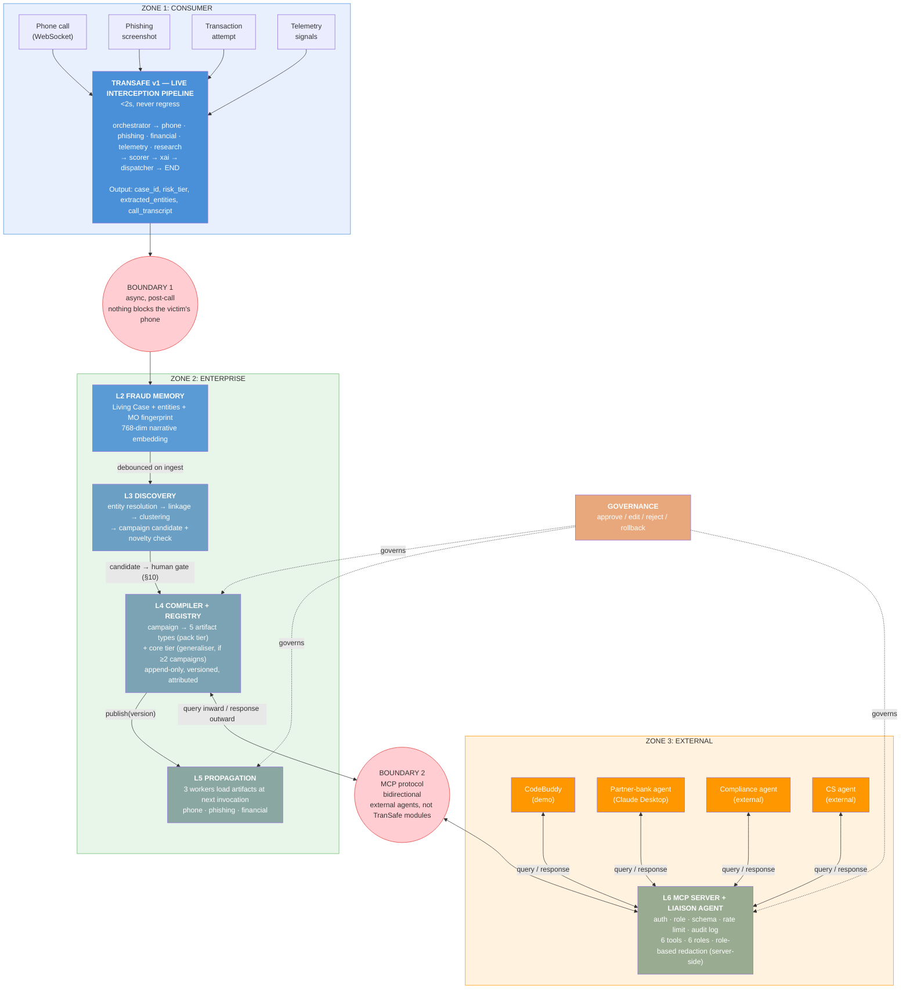
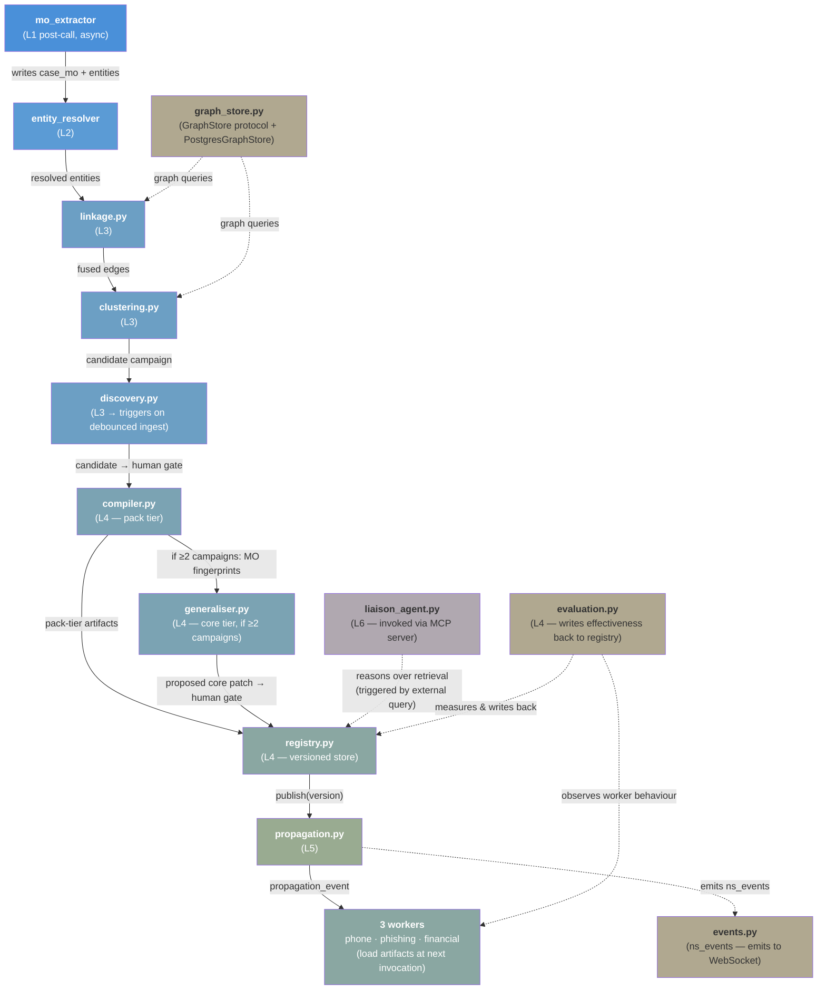

# TranSafe v2 — Enterprise Upgrade Master Plan

> **Status:** Authoritative plan. Supersedes nothing in `doc/transafe_v1/` — v1 docs remain the reference for the consumer product.
> **Scope:** The enterprise layer. The consumer app is *input*, not the subject of this upgrade.
> **Answers:** Finals **Scenario B** — a previously unseen scam targeting many customers within 24 hours.
> **Horizon:** 48 hours to final.

---

## 0. How to read this document

This is the single master document. It is written so that a reader who has never seen TranSafe can finish it and understand:

1. What v1 actually is today, in code (§1)
2. What "graph state" means right now and why it is not enough (§1.2)
3. Which parts of the system reason and which are deliberately deterministic (§1.4)
4. Which Finals scenario this answers, clause by clause, and the one-sentence thesis (§2)
5. The six layers, end to end (§3–§9)
6. How humans stay in control (§10) and how we prove it works (§11)
7. Exact tables, APIs, screens (§12–§14)
8. How the demo is run (§15) and how we build it in 48 hours (§17)

Every design choice that had a plausible alternative has a **Decision** block stating what we chose and *why the alternative was rejected*. Those blocks are the parts to memorise before judging.

---

## 1. Where v1 ends and v2 begins

### 1.1 What v1 is, grounded in the code

TranSafe v1 is a **real-time, multi-agent, per-incident fraud interceptor** for a single consumer.

```
backend/src/agents/
  orchestrator.py      → decides which workers to activate for a trigger
  graph.py             → compiles the LangGraph StateGraph
  state.py             → GraphState (the shared blackboard)
  graph_nodes.py       → risk_scorer_node, xai_node, action_dispatcher_node
  workers/
    telemetry.py       → device/behaviour signals
    phone.py           → LISTEN + AUTO_TALK call analysis, anchor questions
    phishing.py        → text/image (Groq Vision OCR) + pgvector RAG + planner-gated web research
    financial.py       → transaction/beneficiary risk
    research.py        → Tavily agentic web verification
    vector_memory_utils.py → confirmed case → fraud_memory + learned_keywords
```

The pipeline, as wired in `graph.py`:

```
                    ┌── telemetry ──┐
                    ├── financial ──┤
  orchestrator ─────┼── phone ──────┼──▶ scorer ──▶ xai ──▶ dispatcher ──▶ END
                    ├── phishing ───┼──▶ research ──┘
                    └── research ───┘
```

Supporting infrastructure that already exists and works:

| Capability | Where |
|---|---|
| Groq LLM w/ multi-key rotation | `agents/llm.py` — `invoke_groq_with_key_rotation`, `extract_json_object` |
| 768-dim embeddings | `db/vector_store.py` — `nomic-embed-text-v1.5`, `embed_text`, `search_fraud_memory` |
| STT / streaming STT / TTS | `services/stt.py`, `stt_streaming.py`, `tts.py` |
| Vision OCR | `services/vision.py` |
| Web research | `services/tavily.py` |
| Live call socket | `api/websocket_call.py` (~47 KB — the most complex surface in the repo) |
| Persistence | `db/supabase.py` — `fraud_cases`, `call_transcripts`, `case_entities`, `phishing_submissions`, `telemetry_events`, `beneficiaries`, `learned_keywords`, `fraud_memory`, `admin_alerts`, transaction freeze |

**This is a strong foundation and none of it is being thrown away.** v2 does not rewrite v1. v2 wraps it.

### 1.2 What "graph state" is right now — and why it exists

This is the concept most often misunderstood, so it gets its own section.

**`GraphState` is LangGraph's shared working memory for exactly one trigger event.**

```18:47:backend/src/agents/state.py
class GraphState(TypedDict, total=False):
    """LangGraph shared state schema across all agent nodes."""

    session_id: str
    user_id: str
    trigger_type: Literal["TELEMETRY", "TRANSACTION", "CALL", "PHISHING"]
    trigger_payload: dict[str, Any]
    workers_to_activate: list[str]
    telemetry_finding: dict[str, Any] | None
    ...
    risk_score: int | None
    risk_tier: Literal["LOW", "MEDIUM", "HIGH"] | None
    xai_report: dict[str, Any] | None
    extracted_entities: dict[str, Any] | None
    status_messages: list[str]
```

#### How it works, mechanically

1. A trigger arrives (a call starts, a screenshot is submitted, a transfer is attempted).
2. An initial `GraphState` dict is built: `session_id`, `user_id`, `trigger_type`, `trigger_payload`.
3. `orchestrator_node` reads `trigger_type` and writes `workers_to_activate`.
4. `route_workers()` fans out — LangGraph runs those worker nodes **in parallel**.
5. Each worker is a **pure function**: it receives the whole state, and returns a *partial dict* of only the keys it owns (`phone_worker_node` returns `{"phone_finding": ...}`). LangGraph merges those partials back into one state object.
6. `scorer` reads *all* `*_finding` keys and writes `risk_score` + `risk_tier`.
7. `xai` reads the score and findings, writes `xai_report`.
8. `dispatcher` reads everything, performs side effects (insert case, freeze transaction, raise admin alert), writes `case_id` / `action_taken`.
9. `END`. **The state object is garbage-collected.**

#### Why it is needed

Without it, five workers running concurrently would each need to know about the other four. `GraphState` is a **blackboard**: workers never call each other, they only read and write a shared structure. That gives you:

- **Parallel fan-out with a clean join** — the scorer waits for all branches automatically.
- **Sequential relay where needed** — `phishing` writes `extracted_entities`, `research` reads it (`_extract_entities_from_state`). Two agents cooperate with zero coupling.
- **Testability** — every node is `state -> partial state`. No mocks needed.
- **Traceability** — `status_messages` accumulates a human-readable audit trail of the run.

#### Why it is *not* memory

| | Scope | Lifetime | Storage | Shared across… |
|---|---|---|---|---|
| **`GraphState`** | One trigger event | Milliseconds → seconds | RAM | Nothing. Dies at `END`. |
| `fraud_cases` row | One incident | Permanent | Postgres | One customer's history |
| `fraud_memory` (pgvector) | Confirmed frauds | Permanent | Postgres + vector | Retrieval only, on request |

`GraphState` is **short-term working memory**. `fraud_memory` is the closest thing v1 has to long-term memory, but it is *passive*: it only helps if a future case happens to run a semantically similar query, and it changes no agent's behaviour, no rule, no threshold.

### 1.3 The structural gap

Run the v1 pipeline over 24 victims of the *same* scam campaign and you get:

- 24 independent `GraphState` lifecycles
- 24 independent `fraud_cases` rows
- 24 independent XAI reports saying roughly the same thing
- **0 recognition that it is one campaign**
- **0 change to how the 25th victim is protected**

The system detects. It does not **learn as an institution**. Every victim pays full price for a lesson the organisation already had 23 copies of.

> **The gap is not detection quality. It is the absence of an organisational memory and an organisational reflex.**

### 1.4 The determinism boundary — what reasons, and what must not

§1.3 is a real gap. This section addresses a different property of v1 that is often *mistaken* for a gap, and states it as a design decision that v2 inherits unchanged.

> **Reason where the action space is open. Stay deterministic where it is enumerable.**

#### Where the boundary sits in v1

| Decision | Action space | Mechanism | Reasoned? |
|---|---|---|---|
| Which workers run for a trigger | 4 trigger types → fixed worker sets | `orchestrator.py:9-18` — `TRIGGER_WORKER_MAP` dict lookup | No |
| Worker sequencing / fan-out | static DAG + one conditional edge | `graph.py:19-39`, `compile_graph():42-82` | No |
| Risk score and tier | weighted sum + override rules | `graph_nodes.py:21-27` (`WORKER_WEIGHTS`), `risk_scorer_node:41` | No |
| Dispatched action | tier ladder (`LOW`/`MEDIUM`/`HIGH` → approve / biometric / freeze) | `action_dispatcher_node:223` | No |
| **Whether to run a web search** | **unbounded** | **`phishing.py:420-452` — planner LLM returns `{search, queries, reasoning}`** | **Yes** |
| **What to search for** | **unbounded** | **planner LLM generates ≤3 entity queries** | **Yes** |
| **Whether to hit the fraud registry** | **unbounded** | **`research.py:340-350` — native Groq tool-calling over `search_malaysian_fraud_registry`** | **Yes** |

v1 is therefore **not** a fully deterministic pipeline. It is a deterministic *skeleton* with reasoning at the *leaves*: control flow is fixed, tool use is reasoned. That is the intended shape, and v2 preserves it.

#### Why deterministic orchestration is a requirement, not an unfinished feature

1. **Auditability.** The v2 pitch is consumption receipts, approval gates and role-based redaction (§8, §9.3, §10). "Why did this agent run?" must have a non-probabilistic answer. LLM-chosen control flow would contradict the product's own claim.
2. **Regulatory posture.** A supervisor asking *"does identical input always run identical checks?"* must be answerable with an unqualified yes.
3. **Evaluation validity — the load-bearing one.** §11 measures time-to-artifact and propagation lift by comparing runs with and without a compiled artifact. If routing were LLM-chosen, run-to-run path variance would contaminate every metric and no delta could be attributed to the artifact rather than to a differently sampled execution path. **Deterministic orchestration is the precondition that makes §11 measure anything at all.**

Reasoning over an enumerable action space also buys nothing: an LLM selecting among four fixed trigger→worker mappings is a dictionary lookup with added latency and a new failure mode.

#### The contract every reasoning site must satisfy

`_run_research_enhancement` (`phishing.py:380-490`) is the **reference implementation**. Any reasoning introduced in v2 must exhibit all four properties:

| Property | Reference implementation |
|---|---|
| **Gate** — cheap deterministic checks run first | skip if benign (no entities, score < 40, no RAG hits); skip if verdict already solid (score ≥ 70 AND similarity ≥ 0.80) — `:411-418` |
| **Bound** — hard cap on iterations and calls | at most one search round, at most 3 queries — `:390-391` |
| **Fallback** — deterministic path when the LLM fails | malformed/unavailable planner → `decision: "heuristic"`, entity-derived queries — `:453-467` |
| **Trace** — the decision is persisted as data, not just acted on | returns `{queried, decision, reasoning, queries, web_hits}` into the finding |

This converts "should this reason?" from a debate into a checklist.

#### Where v2 adds reasoning

Deliberately short:

| New decision | Action space | Verdict |
|---|---|---|
| Campaign linkage (§6.3) | scored similarity + shared-entity rules | **Deterministic** — a stated threshold is more defensible to a reviewer than an LLM asserting two cases "feel related" |
| Cluster → campaign candidate (§6.4) | graph clustering | **Deterministic** |
| Artifact compilation (§7.1) | templated from cluster evidence | **Deterministic** |
| Propagation targeting (§8) | subscription + severity rules | **Deterministic** |
| **`ask_transafe(question, role)` (§9)** | **unbounded questions × 6 tools × 5 roles** | **Reasoned** — the one genuinely open decision; gate/bound (≤4 iterations)/fallback/trace required |
| Generaliser proposing an artifact revision (§7) | open-ended drafting | **Optional reasoning** — acceptable because the §10 human approval gate catches a bad proposal before it propagates |

Everything in the discovery→compile→propagate path stays deterministic. Reasoning is added at exactly one new point, and it is the point where the action space genuinely is open.

---

## 2. The v2 thesis

### 2.0 The question we are answering — Finals Scenario B

> *A completely new scam appears, has never been seen before, and targets many customers within 24 hours. TranSafe must detect it, discover that separate incidents are related, learn the new pattern, adapt organisational workflows, and make that knowledge available across relevant departments.*

Every layer in this document maps to one clause of that sentence:

| Scenario B clause | Layer |
|---|---|
| "detect it" | L1 Sensing (v1, unchanged) |
| "never been seen before" | L2 `OBSERVED` — the system states that it does not recognise the pattern (§6.4) |
| "discover that separate incidents are related" | L3 Discovery |
| "learn the new pattern" | L4 Compiler + Registry, under human approval |
| "adapt organisational workflows" | L5 Propagation |
| "available across relevant departments" | L6 Exposure (MCP + Liaison Agent) |

### 2.1 Thesis

> **TranSafe v2 turns 24 isolated detections into one recognised campaign, compiles that campaign into executable defence artifacts, propagates them to its own agents, and exposes the knowledge via MCP so that external agentic systems — compliance, customer service, partner banks — can reason about it and act — all under human approval, in minutes instead of weeks.**

Named: **the Organisational Nervous System.**

- **Nerves** (sensing) — v1's workers, unchanged, now also extracting *behaviour*, not just identifiers.
- **Spinal cord** (Institutional Fraud Memory + discovery) — where signals converge and patterns emerge.
- **Brain** (compiler + governance) — where a pattern becomes a decision, with a human in the loop.
- **Motor neurons** (propagation) — where the decision becomes changed behaviour in TranSafe's own workers (phone, phishing, financial).
- **Voice** (exposure/MCP) — where TranSafe exposes what it knows so external agentic systems can query, reason, and produce their own artifacts.

The three claims that make this defensible to an enterprise audience:

1. **Detection is a solved-enough problem; institutional response latency is not.** Real Malaysian scam waves run for days. Bank countermeasures ship in weeks. We compress that to minutes.
2. **The unit of defence should be the campaign, not the transaction.** Blocking one mule account stops one payment. Recognising the campaign stops the script.
3. **Autonomy without governance is unshippable in banking.** Every artifact is versioned, attributed, diffable, approvable, and reversible.

---

## 3. Architecture — six layers



**Layer boundary rule:** L1 is v1 and must not regress. Every v2 component is *downstream and asynchronous* of the live path. Nothing added in v2 sits between a scam caller and the victim's phone.

### 3.1 System architecture — two boundaries, three zones



### 3.2 The two boundaries

| Boundary | What crosses it | Direction | Constraint |
|---|---|---|---|
| **Boundary 1** (Consumer → Enterprise) | `case_id` + entities + transcript + MO fingerprint | One-way, async | **Nothing here blocks the live call.** The v1 pipeline completes in <2s. The v2 enterprise layer runs post-call, debounced. |
| **Boundary 2** (Enterprise → External) | MCP tool calls + responses | Bidirectional | **TranSafe does not reason for external systems.** The Liaison Agent reasons about retrieval. The external agent reasons about action. Redaction is server-side, never prompt-level. |

### 3.3 Technology stack

| Concern | v1 (existing) | v2 (new) |
|---|---|---|
| LLM | DeepSeek (`deepseek-chat`) via `langchain-openai` | Same — reused for MO extractor, compiler, generaliser, Liaison Agent |
| Embeddings | DashScope `text-embedding-v3` (768-dim) | Same — reused for narrative embedding in fraud memory |
| STT | DashScope Paraformer | Same — unchanged |
| DB | Supabase (Postgres + pgvector) | Same — new tables in same DB via `v2_enterprise.sql` migration |
| Graph | — | Postgres + recursive CTEs (`GraphStore` protocol + `PostgresGraphStore`) |
| Backend framework | FastAPI (v1 routes) | Same — new routes under `/enterprise/` |
| WebSocket | `api/websocket_call.py` (v1 call socket) | New: `/enterprise/ws/events` for nervous-system event stream |
| MCP | — | `mcp/server.py` — stdio + HTTP/SSE, role-based auth |
| Frontend | React (consumer app) | React (enterprise console) — separate app |
| Real-time events | — | `ns_events` emitter → WebSocket → console |
| LLM key rotation | `agents/llm.py` (DeepSeek, 1 key) | Same — reused |

### 3.4 Module dependency graph



### 3.5 Data flow — end to end

```
1. Trigger (call/screenshot/txn/telemetry)
2. v1 pipeline runs (<2s) → case_id, risk_tier, entities, transcript
3. mo_extractor (async, post-call) → case_mo (fingerprint JSON + embedding)
4. entity_resolver → resolves phone/account/URL/domain/name → entities table
5. linkage.py → fuses edges (shared entities + narrative cosine ≥ threshold)
6. clustering.py → groups cases into candidate campaigns
7. discovery.py → novelty check (cosine <0.90 vs existing campaigns → NEW)
8. Human gate (§10) → approve/edit/reject
9. compiler.py → 5 artifact types from approved campaign (pack tier)
10. generaliser.py → if ≥2 other approved campaigns, proposes phone_agent_core patch (core tier)
11. Human gate → approve/reject generaliser proposal
12. registry.py → publishes new versions (append-only)
13. propagation.py → emits propagation_event to 3 subscribed workers
14. workers load artifacts at next invocation (in-process cache, keyed by version)
15. MCP server → external agents can query campaigns/artifacts/cases
16. Liaison Agent → reasons over retrieval for natural-language questions
17. evaluation.py → measures artifact effectiveness, writes back to registry
```

### 3.6 The three event surfaces

| Surface | Transport | What flows | Who sees it |
|---|---|---|---|
| **v1 call WebSocket** | `api/websocket_call.py` | Live call audio → STT → transcript utterances | Consumer phone UI |
| **Enterprise event stream** | `/enterprise/ws/events` | `ns_events`: case ingested, entity linked, campaign proposed, campaign approved, artifact published, propagation acknowledged, MCP query | Enterprise console (all screens) |
| **MCP** | stdio + HTTP/SSE | Tool calls + responses, role-redacted, audit-logged | External agents (CodeBuddy, partner-bank, etc.) |

### 3.7 Non-functional requirements

| NFR | Target | How |
|---|---|---|
| **Live call latency** | <2s (unchanged from v1) | L1 is untouched; all v2 components are async and downstream |
| **Discovery latency** | <30s from case ingest to campaign candidate | Debounced ingest (5s window), then linkage + clustering in Postgres |
| **Compile latency** | <10s from approval to published artifacts | Single LLM call (compiler) + registry write |
| **Propagation latency** | <2s from publish to all 3 worker acknowledgements | Fan-out via propagation events, in-process cache |
| **MCP query latency** | <5s for direct-tool calls, <15s for Liaison Agent loop | Direct tools bypass agent; agent bounded to ≤4 iterations |
| **REPLAY mode** | Identical to LIVE, minus external API calls | `ReplayEventSource` replays recorded `ns_events` with a `run_id` |
| **Auditability** | Every autonomous action traceable to a human approval | Governance gate (§10) on campaigns and artifacts; `mcp_access_log` on every external query |
| **Determinism** | Identical input → identical routing | Orchestrator, scorer, dispatcher, discovery, propagation are deterministic (§1.4) |

---

## 4. Layer 1 — Sensing

### 4.1 What stays exactly as-is

All five workers, the orchestrator, scorer, XAI node and dispatcher. The live call WebSocket. STT/TTS. **Zero changes to the latency-critical path.**

### 4.2 What is added: the MO Fingerprint extractor

v1 already stores the dialogue at utterance granularity — this is a rarer asset than it looks:

```162:184:backend/src/db/supabase.py
def insert_call_transcript(
    case_id: str, speaker: str, utterance: str, risk_score: int
) -> str:
```

Speaker-attributed, individually risk-scored utterances. And `websocket_call.py` already extracts identifiers from them into `case_entities` via deterministic pattern matching.

v2 adds one **post-call, asynchronous** node: `mo_extractor`.

#### Hard split — this is a safety rule, not a style preference

| Data | Extractor | Rationale |
|---|---|---|
| Phone, account number, URL, amount, IBAN | **Regex / deterministic only. Never an LLM.** | A hallucinated digit in an account number creates a false graph edge → a false campaign → a countermeasure justified by a number nobody said. Identifiers must be *quotable from the transcript verbatim*. |
| Impersonated entity, pretext, script phases, pressure tactics, novel phrasing, escalation timing | **LLM, schema-constrained JSON** | Regex fundamentally cannot represent behaviour. This is the layer that survives account rotation. |

#### Output schema

```json
{
  "case_id": "…",
  "impersonated_entity": "Bank Negara Malaysia",
  "pretext": "account implicated in money-laundering investigation",
  "script_phases": ["authority_claim","fear_induction","isolation","urgency","safe_account_instruction"],
  "pressure_tactics": ["arrest threat","do not tell family","stay on the line"],
  "novel_phrases": [
    {"text": "akaun selamat sementara", "lang": "ms", "utterance_idx": 14},
    {"text": "pegawai siasatan BNM",    "lang": "ms", "utterance_idx": 6}
  ],
  "languages": ["ms", "en"],
  "time_to_money_ask_sec": 187,
  "verification_evasion": "refused call-back to published BNM hotline",
  "evidence_utterances": [3, 6, 14, 22],
  "narrative": "Caller claims to be a BNM investigation officer, states the victim's account is used for money laundering, forbids contacting family, and instructs transfer to a temporary 'safe account'."
}
```

#### Three hard constraints

1. **Every field must cite `utterance_idx`.** The validator clicks a phrase and lands on the exact transcript line. Extraction becomes falsifiable; hallucinated MOs cannot silently become campaign evidence.
2. **Runs post-case, off the live path**, in the ingest worker. No latency regression on the phone agent.
3. **`narrative` is what gets embedded** (768-dim, `embed_text`, same pipeline as `fraud_memory`). This is the vector that powers narrative linkage in L3.

#### Why this is the enabling change

Identifiers give **precision**; scammers rotate mule accounts daily, so identifier-linkage goes blind the moment an account is burned. The MO fingerprint gives **recall** — two cases sharing zero identifiers but the same impersonated entity, script phases and Malay phrasing still link at cosine 0.89.

> **Pitch line:** *Most fraud systems see a transaction. Ours hears the script.*

#### Free by-product

Stored transcripts are also the **red-team corpus** for §11. Mutate real recorded transcripts (swap entity, swap language, reorder phases) to generate evaluation variants. The sensing layer produces its own test data.

#### Continuity with existing code

`vector_memory_utils.extract_novel_phrases()` is today an n-gram + stopword heuristic feeding `learned_keywords`. v2 **upgrades it in place** to consume `mo_fingerprint.novel_phrases` when present, falling back to the n-gram path otherwise. Nothing breaks; quality jumps.

---

## 5. Layer 2 — Institutional Fraud Memory ("Living Case")

A v1 case is a row. A v2 case is an object that keeps accumulating.

| Component | Source | New? |
|---|---|---|
| Trigger + payload | v1 | — |
| Risk score / tier / XAI report | v1 | — |
| Transcript (utterance-level, risk-scored) | v1 | — |
| Resolved entities (normalised) | v1 extraction + v2 normaliser | upgraded |
| **MO fingerprint** | v2 `mo_extractor` | **new** |
| **Narrative embedding (768)** | v2 | **new** |
| **Execution trace** (node timings, tokens, tool calls) | v2 | **new** |
| **Campaign membership + linkage score** | v2 L3 | **new** |
| **Human labels / validator notes** | v2 governance | **new** |

### Entity normalisation (prerequisite for the graph)

Linkage is worthless if `+60 11-2345 6789`, `011-23456789` and `60112345678` are three different nodes.

| Type | Normalisation |
|---|---|
| `PHONE` | strip non-digits → E.164 with MY default (`+60…`) |
| `ACCOUNT` | strip non-digits; retain bank code if present |
| `URL` | lowercase host, strip scheme/`www.`/trailing slash/query; also store registrable domain as a separate `DOMAIN` entity |
| `NAME` | casefold, collapse whitespace, strip honorifics |

Both `value_raw` (for display/audit) and `value_norm` (for matching) are stored. **Matching is only ever on `value_norm`.**

---

## 6. Layer 3 — Discovery (the Scam Graph)

The heart of v2.

### 6.1 Storage decision

> ### Decision: the Scam Graph is a **knowledge graph** stored in **Postgres**, behind a `GraphStore` interface. Not Neo4j.
>
> These are two separate questions and they get two different answers.
>
> | | What it is | Answer |
> |---|---|---|
> | **Knowledge graph** — entity-resolved nodes, typed weighted edges, community detection | the *data model* | ✅ **Yes, fully.** It is the core of L3. |
> | **Graph database** — Neo4j / Neptune / TigerGraph | the *storage engine* | ❌ Not at this scale, not in 48 hours. |
>
> **Why.** A graph DB's superpower is index-free adjacency for deep multi-hop traversal at scale — "every account within 5 hops across 50M nodes, under 100 ms". Our reality: ~200–400 nodes, ~500–1,500 edges, queries of depth 1–2, plus connected components. `networkx.connected_components()` on 1,500 edges runs in ~1 ms; a round-trip to a hosted Neo4j would be *slower than the entire computation*.
>
> **Costs we refuse to pay before final:** (a) dual-write consistency between Postgres and Neo4j — a failed graph write means the dashboard shows a campaign whose case does not exist; (b) a second cloud dependency that can be cold or rate-limited on stage; (c) Cypher debugging hours we need for propagation and rehearsal; (d) an unwinnable question — *"why two databases for 300 records?"*
>
> **What actually impresses is engine-independent:** the linkage logic, the force-directed visualisation, and edge-level explainability. Not one pixel changes based on where the bytes live.
>
> **The seam stays open:**
> ```python
> class GraphStore(Protocol):
>     def upsert_entity(self, entity_type: str, value_norm: str) -> str: ...
>     def upsert_link(self, src: str, dst: str, link_type: str,
>                     weight: float, evidence_case_ids: list[str]) -> None: ...
>     def neighbours(self, entity_id: str, depth: int = 1) -> list[Entity]: ...
>     def components(self, min_weight: float) -> list[set[str]]: ...
>
> class PostgresGraphStore(GraphStore):   # shipped
> class Neo4jGraphStore(GraphStore):      # documented, ~120 lines, not built
> ```
>
> **Answer to give a judge:** *"It is a knowledge graph — entity-resolved nodes, weighted typed edges, community detection. At 300 nodes, Postgres plus in-memory traversal is about a millisecond; a graph database adds a network hop and a dual-write consistency problem for zero gain. Storage sits behind a `GraphStore` interface, so the Neo4j adapter is roughly 120 lines when volume justifies it. We chose the engine for our scale, not for the slide."*
>
> **When this reverses:** if multi-hop mule-chain tracing (victim → mule → mule → cash-out, 10⁶+ edges) becomes a headline feature.

### 6.2 Graph shape

```
   (Case #7) ──has──▶ [ACCOUNT 1592…] ◀──has── (Case #19)
        │                    ▲                      │
      has                    │ shared_identifier  has
        ▼                    │  w=0.95              ▼
   [PHONE +6011…]            └──────────── [DOMAIN bnm-verify.online]
        │
        └── narrative_similarity(Case #7, Case #23) w=0.71 ──▶ (Case #23)
```

- **Nodes:** `Case`, `Entity{PHONE, ACCOUNT, URL, DOMAIN, NAME}`, `Campaign`
- **Edges:** `case→entity` (mention), `case↔case` (fused linkage score), `campaign→case` (membership)

### 6.3 Linkage signals

Case-pair score is computed from four independent signals:

| Signal | Computation | Weight | Notes |
|---|---|---|---|
| **Shared hard identifier** | same normalised `ACCOUNT` / `PHONE` | **0.95** | near-proof; the precision anchor |
| **Shared domain** | same registrable domain | 0.80 | strong; hosting is reused |
| **Narrative similarity** | cosine of MO `narrative` embeddings | 0.0–0.75, gated at cosine ≥ 0.82 | the recall engine; survives account rotation |
| **MO structural overlap** | Jaccard over `script_phases` ∪ `pressure_tactics` ∪ `impersonated_entity` | 0.0–0.50 | cheap, no LLM, robust |
| **Temporal proximity** | ±72 h | ×1.15 multiplier (capped) | modifier, never a standalone link |

**Fusion — noisy-OR**, so independent weak signals accumulate without any single one dominating:

```
combined = 1 − Π(1 − wᵢ)      then × temporal_multiplier, clamped to [0, 1]
```

Example: narrative 0.62 + MO overlap 0.40 + temporal → `1 − (0.38 × 0.60) = 0.772` → ×1.15 → **0.888**. Two cases with zero shared identifiers, correctly linked.

**Why noisy-OR and not a weighted sum:** a weighted sum lets one strong signal be diluted by missing ones, and requires weights to sum to 1 (they don't — the signals aren't mutually exclusive). Noisy-OR is the standard combiner for independent evidence and is explainable to a risk committee: *"each signal independently fails to explain the link with probability (1−w); the link exists unless all of them fail."*

**No LLM adjudicates a link** (§1.4). Every term above is a computed score against a stated threshold, so any edge in the graph can be recomputed and defended after the fact. An LLM asserting that two cases "appear related" is not reviewable evidence.

### 6.4 Clustering → campaign candidate

#### 6.4.0 Before any cluster exists: the `OBSERVED` case

Scenario B opens with *one* victim and *no* precedent. A system that stays silent until case #3 has nothing to say during the most important minute of the story. So a single case can be flagged on its own:

> A case is marked **`OBSERVED` (unrecognised pattern)** when it scores **HIGH** *and* its MO narrative matches **no** existing campaign (`max cosine < 0.75`) *and* shares **no** hard identifier with any known case.

```
Case #1 · Impersonation · HIGH 86
  Known campaign match : NONE
  Known indicator match: NONE
  → UNRECOGNISED PATTERN — 1 observation, monitoring for linkage
```

This is not a campaign and it triggers **no** compiler, **no** artifact, **no** propagation. It is an honest statement of ignorance, surfaced in the console header as `Unrecognised patterns: 1` and on the case detail page.

Why it earns its place:

1. **It is the Act 1 beat.** The system saying *"I have never seen this before"* is what makes the Act 3 recognition land. Without it, Act 1 is just v1 working normally.
2. **It is a real operational signal.** "High risk, matches nothing we know" is precisely the queue a fraud-ops analyst wants to read first.
3. **It costs ~15 lines** — the cosine and identifier lookups already run for linkage.

`OBSERVED` cases are the input pool for clustering below. When three of them link, the pool becomes a candidate.

#### 6.4.1 Promotion to candidate

1. Build the case-case graph with edges where `combined ≥ 0.60`.
2. Connected components (`networkx`, in-memory).
3. A component is promoted to **campaign candidate** only if **all** gates pass:

| Gate | Threshold | Why |
|---|---|---|
| Case count | ≥ 3 | two cases is a coincidence |
| **Distinct customers** | **≥ 2** | **critical** — blocks one confused user filing three reports from becoming a "campaign" |
| At least one edge ≥ 0.80 | yes | prevents clusters made only of weak narrative links |
| Time span | ≤ 14 days | older = archived pattern, not an active wave |
| **Novelty** | max cosine vs existing campaign MO embeddings < 0.90 | otherwise **merge into the existing campaign** instead of creating a duplicate |

4. Confidence = mean of intra-cluster edge weights, penalised if the cluster is chain-shaped rather than dense (`penalty = density^0.5`).

The novelty check is what stops the demo from spawning six near-identical campaigns as cases stream in. It is also the mechanism by which a campaign **grows**: case #7 doesn't create campaign #4, it joins campaign SCAM-027 and bumps its case count live on screen.

### 6.5 Discovery trigger policy

> ### Decision: **event-driven incremental on every case ingest, with a 30-second debounce, plus a 5-minute periodic sweep.**

Three candidate policies were considered:

| Policy | Verdict |
|---|---|
| Batch nightly | ❌ Defeats the entire thesis. Our headline metric is *minutes, not weeks*. A nightly job is weeks-thinking. |
| Pure on-ingest, no debounce | ❌ During a 14-case burst, re-clusters 14 times in 3 seconds. Wasteful, and the UI flickers between candidate states. |
| **On-ingest + debounce + sweep** | ✅ **Default.** |

**How it stays cheap — blocking.** Naïve all-pairs is O(n²) and calls the embedding comparison for every pair. Instead, on ingest of case *c*:

1. Compute **blocking keys** for *c*: every normalised entity value, the impersonated entity, and the coarse MO signature (`impersonated_entity` + first two `script_phases`).
2. Fetch only cases sharing ≥ 1 blocking key, within 14 days. Typically 0–20 candidates, not *n*.
3. Score only those pairs. Full similarity is computed on a handful of pairs, not thousands.
4. Push affected component ids onto a debounce set; after 30 s of quiet, re-cluster **only those components**.
5. A 5-minute sweep catches slow-forming clusters where blocking keys were too sparse at ingest time.

This makes discovery effectively O(k) per case with k ≈ 20, and keeps it real-time.

**Manual override:** a `POST /enterprise/discovery/run` endpoint forces an immediate full sweep. Used by the demo "Run Scenario" button and by the booth reset.

### 6.6 How others do this — and why our approach is defensible

| Domain | Standard practice | What we borrow |
|---|---|---|
| **Card/payment fraud (banks, networks)** | Rules + supervised models on transaction features; entity resolution over device/IP/card/account; "fraud ring" detection via connected components on shared attributes | Connected components on shared identifiers — the precision half |
| **Cyber threat intelligence (STIX 2.1 / MISP / TAXII)** | Indicators are grouped into `Campaign` and `Intrusion Set` objects by shared TTPs; sightings accumulate confidence; indicators are shared between organisations in a standard schema | **This is our closest prior art.** Campaign-as-first-class-object, confidence scoring, TTP-based grouping, and machine-readable sharing |
| **Platform anti-abuse (coordinated inauthentic behaviour)** | Temporal co-occurrence + content similarity clustering to find coordinated accounts despite no shared identity | Narrative-similarity clustering — the recall half |
| **AML / mule networks** | Multi-hop fund-flow graphs, community detection at scale | Deliberately *out of scope* — this is where a graph DB would be required |

**Our position, stated plainly:** TranSafe v2 applies **cyber-threat-intelligence campaign methodology to consumer fraud**, with two substitutions that are only now possible:

1. **LLM MO extraction replaces the human analyst** who traditionally hand-tags TTPs. That is the labour bottleneck that keeps bank fraud intel at weekly cadence.
2. **The campaign compiles to an executable artifact**, not a PDF bulletin. In threat intel, a campaign object informs humans. Here it *reprograms agents*.

That framing is honest (we are not claiming to invent campaign clustering), and it is the strongest possible answer to *"how is this different from what banks do?"* — banks do step 1 with humans at weekly cadence and stop at step 2's PDF.

### 6.7 Effectiveness levers

What makes the discovery mechanism *good* rather than merely present:

1. **Two-sided signals** — identifiers for precision, narrative for recall. Systems with only one are blind on one axis.
2. **Distinct-customer gate** — the single highest-value false-positive guard.
3. **Novelty/merge check** — prevents campaign proliferation, and gives the "campaign grows in real time" visual.
4. **Edge-level explainability** — every edge stores `evidence_case_ids` and the signal breakdown, so hovering an edge answers *why*. Unexplainable clusters are unusable in a bank.
5. **Human validation before any action** — discovery may be wrong; discovery *acting* may not.

---

## 7. Layer 4 — Compiler and Artifact Registry

### 7.0 The two-tier artifact model

> ### Decision: campaign knowledge goes into a **campaign pack** retrieved at runtime. The **core skill** changes only when something *generalisable* is learned.
>
> The naïve design appends every new scam's phrases into `phone_dialogue_guide.md`. At v7 that produces a beautiful diff. At v70 it produces an unmaintainable file, a prompt that no longer fits a context window, and an obvious question we could not answer: *"what does that file look like after a year?"*
>
> So artifacts are split into two tiers with different change rates:
>
> | Tier | Contains | Changes | Lives in |
> |---|---|---|---|
> | **Core skill** — `phone_agent_core.md` | *procedure*: identify caller → detect coercion → **consult fraud memory** → apply the matched strategy → escalate | rarely; only on a cross-campaign generalisation | registry, versioned |
> | **Campaign pack** — `SCAM-027.json` | *instance knowledge*: phrases, indicators, entities, response strategy for **one** campaign | once per campaign | Institutional Fraud Memory, retrieved at runtime |
>
> The core skill never names a campaign. It contains the instruction to *look one up*. That is the difference between a skill that scales to 100,000 scams and a file that collapses at 100.
>
> **Answer to give a judge:** *"Campaign specifics live in memory and are retrieved at runtime — that scales. The skill file only changes when we learn something that generalises across campaigns, which is rare. You are looking at both: a campaign pack published four minutes ago, and a core-skill revision driven by a pattern seen across three separate campaigns."*

#### When does the core skill actually change?

The core tier changes only when the resulting rule is **campaign-agnostic** — it names no campaign, no institution, no account. That is the test. There are two ways evidence reaches it, and both pass through the same approval gate (§10):

| | Condition | Evidence | Why it implies a campaign-agnostic rule |
|---|---|---|---|
| **C1** | **Recurrence-driven** (*Level 3 generalisation*) — a pattern observed across **≥ 2 approved campaigns** | the generaliser pass (§7.1) over the MO fingerprints of all approved campaigns | a pattern present in several campaigns is by construction specific to none |
| **C2** | **Failure-driven** — a red-team variant is missed (§11.3) | the mutation that evaded detection | a rule that failed on a mutation of its own campaign was overfitted to it; the correction must generalise |

Note that the gate is the *test*, not the count. The ≥ 2-campaign requirement in C1 is simply the most common way to establish campaign-agnosticism; C2 establishes the same property by a different route. A single new campaign never reaches the core tier on its own.

C1 is the common path and produces the Act 4 beat. C2 is the stretch beat — rarer, and the stronger argument, because the system found the gap itself instead of waiting for a victim to find it.

**Example (C1):**

```
Observed in SCAM-019, SCAM-024, SCAM-027:
  authority_claim + isolation + safe_account_instruction co-occur
→ Core skill rule (campaign-agnostic):
  "When these three phases co-occur in one call, escalate to enhanced
   verification regardless of the claimed institution."
```

That rule protects against campaign #4 **before it is discovered**. It is the strongest artifact the system can produce, and it is rare by construction — which is exactly why it is worth showing.

### 7.1 The compiler

Input: an **approved** campaign. Output: concrete, versioned, executable artifacts.

| Tier | Artifact type | Target | Format | Effect |
|---|---|---|---|---|
| pack | `campaign_pack` | `phone_worker` (retrieved) | JSON | phrases, indicators, entities, response strategy for one campaign |
| pack | `phishing_playbook_patch` | `phishing_worker` | JSON | new heavy/light keywords, new URL patterns |
| pack | `txn_rule` | `financial_worker` / txn monitor | JSON | block/step-up on named accounts or patterns |
| pack | `cs_advisory` | customer service (via MCP, `customer_service` role) | Markdown | verified script for inbound enquiries |
| pack | `compliance_brief` | compliance (via MCP, `compliance` role) | Markdown | regulator-facing summary with case citations |
| **core** | `phone_agent_core` | `phone_worker` | Markdown | procedural rule change — **only on a campaign-agnostic rule, §7.0 C1 or C2** |

The compiler is an LLM call with a strict output schema, given: campaign MO summary, novel phrases, entity list, and **the current version of each target artifact** (so it produces a *patch in context*, not a from-scratch rewrite that would clobber existing rules).

A second, separate compiler pass — the **generaliser** — runs only when a campaign is approved and ≥ 2 other approved campaigns exist. It is given the MO fingerprints of all approved campaigns and asked for cross-campaign invariants. Its output is a proposed `phone_agent_core` patch, which goes through the same human approval gate. If it finds nothing, it emits nothing; that is a normal outcome.

> ### Decision: artifacts are **real and consumed**, not display props.
> `phone_worker` and `phishing_worker` load their guide/playbook **from the registry at invocation time**, with an in-process cache keyed by version. When v7 publishes, the next worker invocation picks it up. This is verifiable live: change the artifact, re-run the scenario, watch the agent behave differently. A demo where the artifact is only rendered on screen collapses under one judge question.

**Continuity:** the existing `learned_keywords` table and `get_phishing_playbook_data()` already implement exactly this pattern at small scale. v2 generalises them into the registry; `learned_keywords` becomes one artifact type among six. The existing `backend/skills/phone_dialogue_guide.md` becomes the seed of `phone_agent_core` with its campaign-specific lines lifted out into packs. Nothing is retrofitted awkwardly — the codebase was already heading here.

### 7.2 The registry

Append-only, versioned, attributed. Both tiers live here; the diff view is the same for both.

**The frequent event — a campaign pack (the Act 4 beat):**

```
SCAM-027.json            v1        published 12:05:04   campaign SCAM-027   approved_by fraud_ops
─────────────────────────────────────────────────────────────────────────────
+ { "campaign": "SCAM-027",
+   "name": "Fake BNM Safe-Account Wave",
+   "high_risk_phrases": [
+     "akaun selamat sementara",          ← 6 cases
+     "pegawai siasatan BNM"              ← 6 cases
+   ],
+   "indicators": { "accounts": ["1592…"], "domains": ["bnm-*.online"] },
+   "anchor_question":
+     "Ask for the case reference and state that you will call back on the
+      published BNM hotline. BNM never requests transfers.",
+   "cited_cases": [7, 12, 19, 23, 24, 31] }
─────────────────────────────────────────────────────────────────────────────
effectiveness: 19/20 variants detected · 1/10 controls FP (flat) · measured 12:09
consumed_by: phone_worker ✅ 12:05:06 · phishing_worker ✅ 12:05:06
```

**The rare event — a core skill revision (the stronger beat):**

```
phone_agent_core.md      v6 → v7   published 12:05:05   source SCAM-019·024·027
─────────────────────────────────────────────────────────────────────────────
  ## Escalation rules
  R-3: Escalate when the caller requests OTP or full card details.
+ R-4: When authority_claim, isolation and safe_account_instruction co-occur
+      in one call, escalate to enhanced verification regardless of the
+      institution named. Generalised from 3 campaigns, 17 cases.
─────────────────────────────────────────────────────────────────────────────
```

> Note that v7 names **no campaign**. It is campaign-agnostic. That is the point — and it is the line to deliver on stage: *"this rule was learned from three campaigns and will catch the fourth one before we have discovered it."*

Properties: immutable versions, **diffable**, every version traces to the campaign(s) and cases that justified it, one-click **rollback** (publish v6 again as v8), consumption receipts proving agents actually loaded it, and an **effectiveness record** written back by the evaluation harness (§11) once the artifact has been measured.

---

## 8. Layer 5 — Propagation

Publishing an artifact emits a `propagation_event` per subscribed agent. Each agent acknowledges by writing a **consumption receipt** (`artifact_consumption`).

| Agent | Real or simulated | Consumes |
|---|---|---|
| `phone_worker` | **real** (v1 code) | `campaign_pack` (runtime retrieval) + `phone_agent_core` |
| `phishing_worker` | **real** (v1 code) | `phishing_playbook_patch` |
| `financial_worker` / txn monitor | **real** (v1 code) | `txn_rule` |

> ### Decision: TranSafe detects, compiles, and exposes. External agentic systems connect via MCP and reason for themselves.
>
> The original plan proposed two thin internal LLM agents (`compliance_agent`, `customer_service_agent`) that would load `compliance_brief` / `cs_advisory` as their system prompt. On reflection this is the wrong boundary. TranSafe's job is to detect fraud, discover campaigns, compile defence artifacts, and expose them. Compliance and customer service are **separate agentic systems** with their own reasoning, their own planning, and their own artifacts. They connect to TranSafe through the MCP gateway — not as internal modules.
>
> `compliance_brief` and `cs_advisory` are **still compiled** (§7.1) and stored in the registry like every other artifact. They are the MCP-retrievable artifacts that external agents query, reason about, and use to produce **their own** artifacts (regulatory filings, customer response scripts). In the demo (§9.4, Act 5), CodeBuddy plays this role — it is a fully agentic system that calls TranSafe via MCP, retrieves the compliance brief, reasons about it, and drafts a customer advisory. That is the external agent updating its own knowledge from TranSafe's output.
>
> This makes the organisational claim honest: TranSafe does not pretend to be a compliance system. It is a fraud intelligence system that exposes what it knows. External systems — compliance, customer service, legal — connect, query, and act.

**Propagation is the visual climax.** Three acknowledgements land in ~1 second and light up three worker nodes on the dashboard — TranSafe's own agents reprogrammed. Then the MCP gateway shows external agentic systems (demoed as CodeBuddy) querying the same knowledge and producing their own artifacts. Measure and display it: *"campaign approved → 3 workers updated in 0.8 s → external agents query via MCP and draft their own responses."*

---

## 9. Layer 6 — Exposure: MCP Gateway

### 9.1 The question: MCP server, or receptionist agent?

> ### Decision: **both, layered.** MCP server = the door. Liaison Agent = the receptionist behind it. External agentic systems (demoed as CodeBuddy) = the visitors who walk through the door, ask questions, and leave with their own conclusions.

| Option | Why it fails alone |
|---|---|
| **MCP server only** | Returns rows. It is a database with a fashionable wire protocol. `get_campaign(id)` → JSON blob is not intelligence, and a judge will say "that's just an API". |
| **Receptionist agent only** | Smart, but reachable only by our own UI. No standard interface means CodeBuddy, Claude Desktop or a partner bank's agent cannot call it. The "ecosystem" claim evaporates. |
| **MCP server + Liaison Agent** | The protocol makes us *callable by any agent*; the agent makes the answer *worth calling for*. |

```
  External agentic systems
  (CodeBuddy · Claude Desktop · partner-bank compliance agent · CS agent)
  Each has its own reasoning, its own planning, its own artifact store.
                    │  MCP (stdio + HTTP/SSE)
                    ▼
        ┌───────────────────────────┐
        │  TranSafe MCP Server      │  auth · role · schema · rate limit · audit log
        └────────────┬──────────────┘
                     ▼
        ┌───────────────────────────┐
        │  Liaison Agent            │  intent → retrieval plan → redact by role
        │  ("the receptionist")     │  → synthesise → cite cases/campaigns
        └────────────┬──────────────┘
                     ▼
     campaigns · cases · graph · artifacts · registry
```

**TranSafe does not reason for external systems.** The Liaison Agent reasons about *what to retrieve and how to present it*. The external agent (CodeBuddy in the demo) reasons about *what to do with the answer* — it may draft a compliance filing, write a customer advisory, or update its own internal procedures. That is the correct separation: TranSafe is the intelligence source; external systems are the actors.

**The Liaison Agent is the single new reasoning site in v2** (§1.4). It qualifies because its action space is genuinely open — arbitrary questions × 6 tools × 5 roles — and it must therefore satisfy the same four-property contract as the v1 phishing planner:

| Property | Liaison Agent |
|---|---|
| **Gate** | direct-tool questions (`check_indicator`, `get_artifact`) bypass the agent and hit the tool directly; only `ask_transafe` enters the loop |
| **Bound** | ≤ 4 retrieval iterations, then answer with whatever has been gathered |
| **Fallback** | on planning failure, degrade to a single `list_active_campaigns` + template response rather than erroring |
| **Trace** | every iteration's intent, tool, and arguments recorded to the MCP access log (§9.4, Screen G) and returned alongside the answer |

Note the redaction ordering in the diagram: retrieval happens first, **redaction by role is applied before synthesis**, so the reasoning step never sees fields the caller is not entitled to. Redaction cannot be prompt-injected away because it is not the model's job.

### 9.2 Exposed tools

| Tool | Purpose |
|---|---|
| `ask_transafe(question, role)` | natural-language entry point; routes through the Liaison Agent |
| `list_active_campaigns(status?)` | current campaign inventory |
| `get_campaign(campaign_id)` | MO, cases, entities, artifacts, timeline |
| `get_case_evidence(case_id)` | redacted evidence bundle |
| `get_artifact(name, version?)` | artifact content + diff vs previous |
| `check_indicator(type, value)` | is this account/phone/domain known to us? |

### 9.3 Role-based redaction (the enterprise credibility detail)

| Role | Sees | Never sees |
|---|---|---|
| `fraud_ops` | everything | — |
| `compliance` | campaign + aggregate + case ids + `compliance_brief` | raw transcripts, PII |
| `customer_service` | campaign pack + `cs_advisory` | raw transcripts, PII, compliance briefs |
| `legal` | campaign narrative, citations, counts | account numbers, customer identity |
| `partner_bank` | indicators + MO only | any customer data, case ids |
| `external_researcher` | aggregate statistics only | indicators, cases |

Redaction is enforced **server-side in the MCP layer**, not in the prompt. Prompt-level redaction is not a control; a bank auditor knows the difference.

Every call is written to `mcp_access_log` and rendered live on the dashboard (§14, Screen G).

### 9.4 Why CodeBuddy is the demo caller — and what it proves

Using CodeBuddy as the external MCP client is the cleanest possible proof that the boundary is real: the caller is a **fully agentic system we do not control**. CodeBuddy has its own reasoning, its own planning, its own tool-calling. It connects to TranSafe via MCP, queries what it needs, and **produces its own artifacts** from the answers — it does not just display TranSafe's output.

A judge watching CodeBuddy call `ask_transafe(role="legal")`, receive a cited redacted answer, and then **draft a customer advisory** has watched two things:
1. An interoperability claim tested rather than asserted (a third-party agent called TranSafe and got a structured, redacted, cited answer).
2. An organisational response demonstrated rather than faked (the external agent reasoned about TranSafe's intelligence and produced its own artifact — the advisory — which TranSafe never wrote or owned).

This is why compliance and customer service are not internal TranSafe agents (§8). They are external agentic systems like CodeBuddy. TranSafe compiles the `compliance_brief` and `cs_advisory`; external agents retrieve them via MCP and reason about them independently.

Demo prompt: *"Ask TranSafe what fraud campaigns are active, then draft a customer advisory for the highest-confidence one."* CodeBuddy calls the MCP server, the Liaison Agent answers with citations, **CodeBuddy reasons about the answer and writes the advisory as its own artifact** — not a TranSafe output, but a CodeBuddy output grounded in TranSafe's intelligence. This also naturally showcases the WorkBuddy/CodeBuddy integration requirement.

---

## 10. Governance — human in the loop

> **Nothing autonomous ever reaches a customer.** Discovery is autonomous; *action* is approved.

```
case (HIGH, no match) ──▶ [ OBSERVED ] ──┐
                                          │  ≥3 linked, ≥2 customers
                                          ▼
campaign candidate ──▶ [ PENDING_VALIDATION ] ──▶ Fraud Ops console
                                                    │
                        ┌───────────────────────────┼──────────────────────┐
                        ▼                           ▼                      ▼
                    Approve                       Edit                  Reject
                        │                           │                      │
                        ▼                           ▼                      ▼
              compile → publish          compile w/ human edits    archived + reason
                        │                           │                (feeds threshold review)
                        └───────────┬───────────────┘
                                    ▼
                              propagate → agents
                                    │
                              rollback available at any time
```

Case states: `NORMAL | OBSERVED (unrecognised) → CLUSTERED`
Campaign states: `CANDIDATE → PENDING_VALIDATION → APPROVED → ACTIVE → (SUPERSEDED | ARCHIVED | REJECTED)`

Recorded for every transition: who, when, what changed, what evidence was on screen. Rejections are as valuable as approvals — they are the labelled negatives for tuning thresholds, and showing a rejection in the demo proves the gate is load-bearing rather than decorative.

**Visual rule on the validation console:** deterministic evidence on the left, LLM hypothesis on the right, visually separated. An enterprise audience must be able to see which claims are computed and which are generated.

---

## 11. Evaluation — proving it works

An adaptive system with no measurement is a story. This section is what converts the story into a result.

### 11.1 Harness

1. **Corpus:** ~20 scam-script variants of the target campaign, generated by mutating real recorded transcripts (swap impersonated entity, swap language ms/en/mixed, reorder script phases, change mule account) + **10 legitimate control conversations** (real bank call, delivery call, family call).
2. **Run A (before):** artifacts pinned at v6 (pre-campaign). Record detection rate, mean time-to-detect, false positives on controls.
3. **Run B (after):** artifacts at v7 (post-campaign). Identical inputs, identical seed.
4. Store both in `eval_runs` / `eval_results` and render as a paired bar chart.

**This design depends on the determinism boundary (§1.4).** Run A and Run B differ in exactly one variable: the artifact version. Because orchestration, scoring and dispatch are deterministic, any measured delta is attributable to the artifact. Had worker selection been LLM-chosen, the two runs could take different execution paths on identical input and every number in §11.2 would become unattributable. The reasoned components that do exist (`phishing.py` planner, Liaison Agent) sit outside the scored path or are pinned by seed for the comparison.

### 11.2 Metrics

| Metric | Before (target) | After (target) | Why it's shown |
|---|---|---|---|
| Detection rate on variants | ~35% | ~90% | headline |
| Mean time-to-detect | ~4m 12s | ~8s | headline |
| **False positives on controls** | 1/10 | **1/10 (flat)** | **the credibility metric** |
| Cases before campaign recognised | 24 | 3 | the thesis metric |
| Campaign → all agents updated | n/a | ~1.2 s | the reflex metric |

> **The false-positive row is non-negotiable.** Any system can raise detection by lowering thresholds. Showing that detection tripled *while false positives stayed flat* is the difference between a demo and an argument. If controls do degrade, show it honestly and state the mitigation — that is still a stronger position than hiding it.

Every completed run writes its summary back onto the artifact versions it tested (`artifacts.effectiveness`), so the registry screen can display measured performance next to each diff rather than an unverified claim.

### 11.3 The adaptation loop — evaluation as a *second-order* learner

The harness above measures. This subsection is what makes the system **improve without another victim**, and it is the strongest thing in §11.

```
 20 red-team variants
        │
        ▼
  Run B  →  19/20 detected
        │
        └─ Variant 14 MISSED  ("Bank Negara" → "Suruhanjaya Sekuriti",
                                phases reordered, urgency dropped)
                    │
                    ▼
        Research agent inspects the miss
        → proposes indicator: regulator-impersonation + safe-account
          instruction, independent of the institution named
                    │
                    ▼
        Human approves (same gate, §10)
                    │
                    ▼
        phone_agent_core v7 → v8       ← core tier, not a pack: condition C2
                    │                     in §7.0 — a missed *variant* is by
                    ▼                     definition a generalisation failure.
        Re-run identical corpus → 20/20, controls still 1/10
```

Why this is worth the extra hour:

1. **It closes the loop the rest of the document opens.** L1–L6 learn from victims. This learns from *simulated attacks* — the system stress-tests its own new defence and patches the gap before a real victim finds it.
2. **It is the natural home of the core/pack split.** A missed mutation is precisely the signal that a rule was too campaign-specific. The loop and §7.0 reinforce each other.
3. **It reuses everything.** Corpus exists, approval gate exists, compiler exists, registry exists. The only new part is "feed misses back to the compiler as generaliser input."
4. **It answers the hardest judge question** — *"what happens when the scammer changes the script?"* — with a demonstrated mechanism instead of an assurance.

**Demo positioning:** this is a *stretch beat* (B7 in §17), shown after the main arc if time allows, or held as the answer to the Q&A question it is designed to pre-empt. It must never be on the critical path of the 6-minute run.

## 12. Data model

New tables only; all v1 tables untouched. `vector(768)` matches `nomic-embed-text-v1.5` used by `db/vector_store.py`.

```sql
-- ── Entities (resolved graph nodes) ─────────────────────────────────────────
create table entities (
  id            uuid primary key default gen_random_uuid(),
  entity_type   text not null check (entity_type in
                  ('PHONE','ACCOUNT','URL','DOMAIN','NAME','OTHER')),
  value_raw     text not null,
  value_norm    text not null,
  first_seen    timestamptz not null default now(),
  last_seen     timestamptz not null default now(),
  case_count    int  not null default 0,
  unique (entity_type, value_norm)
);
create index on entities (value_norm);

-- ── Case ↔ entity mentions ──────────────────────────────────────────────────
create table case_entity_links (
  case_id    uuid not null references fraud_cases(id) on delete cascade,
  entity_id  uuid not null references entities(id)    on delete cascade,
  source     text not null default 'regex',           -- regex | manual
  created_at timestamptz not null default now(),
  primary key (case_id, entity_id)
);

-- ── MO fingerprint + narrative embedding ────────────────────────────────────
create table case_mo (
  case_id      uuid primary key references fraud_cases(id) on delete cascade,
  fingerprint  jsonb not null,
  narrative    text  not null,
  embedding    vector(768),
  extractor    text  not null default 'llm-v1',
  extracted_at timestamptz not null default now()
);

-- ── Case discovery state (§6.4.0) ───────────────────────────────────────────
create table case_discovery_state (
  case_id        uuid primary key references fraud_cases(id) on delete cascade,
  state          text not null default 'NORMAL'
                 check (state in ('NORMAL','OBSERVED','CLUSTERED')),
  best_campaign_cosine numeric(4,3),   -- null = nothing to compare against
  matched_indicators   int not null default 0,
  updated_at     timestamptz not null default now()
);

-- ── Fused case-pair links ───────────────────────────────────────────────────
create table case_links (
  case_a     uuid not null references fraud_cases(id) on delete cascade,
  case_b     uuid not null references fraud_cases(id) on delete cascade,
  score      numeric(4,3) not null,
  signals    jsonb not null,        -- {shared_identifier:{...}, narrative:0.71, ...}
  created_at timestamptz not null default now(),
  primary key (case_a, case_b),
  check (case_a < case_b)
);

-- ── Campaigns ───────────────────────────────────────────────────────────────
create table campaigns (
  id             uuid primary key default gen_random_uuid(),
  code           text unique not null,               -- SCAM-027
  name           text not null,
  status         text not null default 'CANDIDATE'
                 check (status in ('CANDIDATE','PENDING_VALIDATION','APPROVED',
                                   'ACTIVE','SUPERSEDED','ARCHIVED','REJECTED')),
  confidence     numeric(4,3) not null,
  mo_summary     text,
  mo_embedding   vector(768),
  indicators     jsonb not null default '[]',
  case_count     int not null default 0,
  customer_count int not null default 0,
  first_seen     timestamptz,
  last_seen      timestamptz,
  created_at     timestamptz not null default now(),
  approved_by    text,
  approved_at    timestamptz,
  reject_reason  text
);

create table campaign_cases (
  campaign_id   uuid not null references campaigns(id) on delete cascade,
  case_id       uuid not null references fraud_cases(id) on delete cascade,
  linkage_score numeric(4,3) not null,
  joined_at     timestamptz not null default now(),
  primary key (campaign_id, case_id)
);

-- ── Artifact registry ───────────────────────────────────────────────────────
create table artifacts (
  id            uuid primary key default gen_random_uuid(),
  name          text not null,                        -- phone_agent_core | SCAM-027
  tier          text not null default 'pack'
                check (tier in ('core','pack')),      -- §7.0 two-tier model
  artifact_type text not null,
  target_agent  text not null,
  version       int  not null,
  content       text not null,
  content_json  jsonb,
  campaign_id   uuid references campaigns(id),        -- null for core-tier
  source_campaigns jsonb not null default '[]',       -- core-tier: the ≥2 campaigns generalised from
  status        text not null default 'DRAFT'
                check (status in ('DRAFT','PUBLISHED','ROLLED_BACK')),
  effectiveness jsonb,   -- {eval_run_id, detected:19, total:20, fp:1, fp_total:10, measured_at}
  created_by    text not null default 'compiler',     -- compiler | generaliser | human
  approved_by   text,
  created_at    timestamptz not null default now(),
  unique (name, version)
);

create table artifact_consumption (
  artifact_id uuid not null references artifacts(id) on delete cascade,
  agent_name  text not null,
  consumed_at timestamptz not null default now(),
  primary key (artifact_id, agent_name)
);

-- ── Nervous-system event stream (drives the live dashboard) ─────────────────
create table ns_events (
  id         bigserial primary key,
  ts         timestamptz not null default now(),
  layer      text not null,      -- sensing|case|discovery|compiler|registry|propagation|exposure
  event_type text not null,      -- case_ingested|entity_linked|campaign_proposed|...
  severity   text not null default 'info',
  payload    jsonb not null,
  run_id     uuid                -- groups a demo scenario run
);
create index on ns_events (ts desc);

-- ── MCP audit ───────────────────────────────────────────────────────────────
create table mcp_access_log (
  id         bigserial primary key,
  ts         timestamptz not null default now(),
  caller     text not null,      -- codebuddy | partner_bank | ...
  role       text not null,
  tool       text not null,
  params     jsonb,
  latency_ms int,
  citations  jsonb
);

-- ── Evaluation ──────────────────────────────────────────────────────────────
create table eval_runs (
  id           uuid primary key default gen_random_uuid(),
  label        text not null,        -- 'before-v6' | 'after-v7'
  artifact_ver jsonb not null,
  started_at   timestamptz not null default now(),
  summary      jsonb
);
create table eval_results (
  id         bigserial primary key,
  run_id     uuid not null references eval_runs(id) on delete cascade,
  variant_id text not null,
  is_scam    boolean not null,
  detected   boolean not null,
  score      int,
  latency_ms int
);
```

**`ns_events` is the backbone of the entire dashboard.** Every layer writes to it; the WebSocket streams it; the animations are driven by it; REPLAY mode replays it. One table, one event schema, one source of truth for both modes.

---

## 13. API surface

All under `/enterprise`, mounted alongside v1 routes. v1 endpoints are untouched.

| Method | Path | Purpose |
|---|---|---|
| `GET` | `/enterprise/overview` | header counters + latest metrics |
| `WS` | `/enterprise/ws/events` | live `ns_events` stream (the nervous system) |
| `GET` | `/enterprise/cases` | list w/ filters (tier, campaign, date, `state=observed`) |
| `GET` | `/enterprise/cases/{id}` | living case: transcript, MO, entities, trace, campaign |
| `GET` | `/enterprise/graph` | nodes + edges + campaign hulls for the visualiser |
| `GET` | `/enterprise/campaigns` | inventory |
| `GET` | `/enterprise/campaigns/{id}` | evidence + hypothesis + proposed artifacts |
| `POST` | `/enterprise/campaigns/{id}/approve` | approve → compile → publish → propagate |
| `POST` | `/enterprise/campaigns/{id}/reject` | reject + reason |
| `PATCH` | `/enterprise/campaigns/{id}` | human edits before approval |
| `GET` | `/enterprise/artifacts` | registry list (`?tier=core\|pack`) |
| `GET` | `/enterprise/artifacts/{name}/{version}` | content + diff vs previous |
| `POST` | `/enterprise/artifacts/{name}/rollback` | republish an earlier version |
| `POST` | `/enterprise/discovery/run` | force a full sweep |
| `POST` | `/enterprise/eval/run` | run before/after harness |
| `GET` | `/enterprise/eval/latest` | comparison payload |
| `GET` | `/enterprise/mcp/log` | MCP access log |
| `POST` | `/enterprise/demo/scenario` | start a scenario (mode: `live` \| `replay`, speed) |
| `POST` | `/enterprise/demo/reset` | reset to clean pre-campaign state |

---

## 14. Frontend — the Enterprise Console

> ### Governing principle: **every animation is driven by a real `ns_event` over the WebSocket. Never a CSS timer.**
> If a judge types a scam message at the booth, the dashboard reacts. This single rule is what separates the console from a Figma prototype, and judges test for it.

**Visual language:** dark ops console (`#0A0E14`), one amber accent for alerts, monospace for evidence, motion only when something real happened.

### Persistent shell

```
┌─ TRANSAFE ENTERPRISE ────────────── [● LIVE ⇄ REPLAY] [▶ Run Scenario] [↺ Reset] ─┐
│  Cases 47 │ Open 12 │ ⚠ Unrecognised 1 │ Campaigns 2 │ Core v7 │ RM 284,500      │
└───────────────────────────────────────────────────────────────────────────────────┘
```

The mode badge is **always visible**. Never hidden.

### Screen A — Overview (the presentation screen)

```
┌─────────────────────────┬──────────────────────────────────────────────────┐
│ LIVE EVENT FEED         │   ORGANISATIONAL NERVOUS SYSTEM                  │
│ 12:04:11 case #41 in    │                                                  │
│ 12:04:11 ⚡ entity link  │    ┌────────┐   ┌──────┐   ┌───────────┐        │
│          acct 1592…     │    │ SENSING│──▶│ CASE │──▶│ DISCOVERY │        │
│ 12:04:12 case #42 in    │    └────────┘   └──────┘   └─────┬─────┘        │
│ 12:04:13 🔴 CAMPAIGN     │                                   ▼              │
│          PROPOSED (3)   │    ┌────────────┐  ┌──────────┐  ┌──────────┐   │
│ 12:05:02 ✅ validated    │    │ PROPAGATION│◀─│ REGISTRY │◀─│ COMPILER │   │
│          by Fraud Ops   │    └─────┬──────┘  └──────────┘  └──────────┘   │
│ 12:05:04 📦 skill v6→v7  │          │                                       │
│ 12:05:06 → phone_agent  │   ┌───────┼────────┬─────────┐               │
│ 12:05:06 → fraud_ops    │   ▼       ▼        ▼         ▼               │
│ 12:05:06 → phishing     │ [Phone] [FraudOps] [Phishing] [Txn]            │
│ 12:05:06 → txn_monitor  │                                                  │
│ 12:05:14 🌐 CodeBuddy    │   external agentic system — reasons & produces  │
│          ask_transafe() │   own artifacts from TranSafe's intelligence    │
│          → drafts       │                                                  │
│          advisory.txt   │   nodes PULSE · edges animate on real events     │
├─────────────────────────┴──────────────────────────────────────────────────┤
│ TIME TO DISCOVERY    ▓▓▓▓▓▓▓▓▓▓▓▓▓▓▓▓  before: 24 victims / 9 days         │
│                      ▓▓                 after:   3 victims / 41 minutes    │
└─────────────────────────────────────────────────────────────────────────────┘
```

The centre panel is the product thesis rendered as a picture. Nodes are dim by default, **pulse amber** on their event, and edges animate a travelling dot when a real message passes. During Act 2 you stop talking and let it run.

### Screen B — Case detail (Living Case)

```
Case #24 · Impersonation · HIGH 87 · 🔗 Campaign "Fake BNM Safe-Account Wave"
┌ Transcript ──────────────────────┬ MO Fingerprint ─────────────────────────┐
│ 00:03 CALLER  Saya pegawai…  ▓48 │ Impersonates : Bank Negara Malaysia     │
│ 00:11 USER    Ya, kenapa?    ▓12 │ Pretext      : money-laundering probe   │
│ 00:22 CALLER  akaun selamat  ▓91 │ Phases       : authority▸fear▸isolation │
│               sementara ⚠ NOVEL  │                ▸urgency▸safe-account    │
│ 00:31 AI      Boleh saya…    ▓—  │ Money ask at : 03:07                    │
├──────────────────────────────────┼─────────────────────────────────────────┤
│ Entities  ACCT 1592… (7 cases)   │ Trace ──────────────────────────────────│
│           PHONE +6011… (4 cases) │ orchestrator  ▉ 12ms                    │
│           URL bnm-verify.online  │ phone_worker  ▉▉▉▉▉▉ 840ms  groq 612tok │
│           ↑ click → jump to graph│ research      ▉▉▉▉ 610ms   tavily 3 hits│
│                                  │ scorer ▉ 4ms · xai ▉▉▉ 430ms            │
└──────────────────────────────────┴─────────────────────────────────────────┘
```

The detail that sells it: the novel phrase is highlighted **on the exact transcript line it was said**, proving the extraction is grounded rather than invented.

### Screen C — Scam Graph

Force-directed, full-bleed. Victims = small grey dots; entities = squares coloured by type; campaigns = translucent hulls. Edge thickness = fused weight. **Hover any edge → why it exists**: `shared ACCOUNT 1592… · w 0.95 · cases #7, #19`. During the wave, nodes fly in and the cluster visibly tightens. Nobody needs to be told what is happening.

### Screen D — Campaign Validation Console

```
┌ CANDIDATE · confidence 0.87 · 6 cases · 4 customers · 41 min span ─────────┐
│ EVIDENCE (computed)             │ HYPOTHESIS (LLM)                        │
│ ✓ 6 cases, 4 distinct customers │ Name: Fake BNM "Safe Account" Wave      │
│ ✓ hard link: ACCT 1592… (×4)    │ MO: caller impersonates a BNM officer,  │
│ ✓ narrative cosine 0.89         │     claims the account is used for      │
│ ✓ span 41 min < 14 d → EMERGING │     laundering, forbids family contact… │
│ ✓ novelty 0.62 < 0.90 → NEW     │ Novel indicators:                       │
│ [mini graph]                    │   • "akaun selamat sementara"           │
│                                 │   • domain pattern bnm-*.online         │
│                                 │ Proposed artifacts:                     │
│                                 │   pack  SCAM-027.json      [view diff]  │
│                                 │   core  phone_agent_core v7 [view diff] │
│                                 │         ↳ generalised from 019·024·027  │
│                                 │   txn_monitor  → block ACCT 1592…       │
│                                 │   compliance  → brief (via MCP)          │
│                                 │   customer_svc → advisory (via MCP)      │
│              [ ✅ Approve ]  [ ✏ Edit ]  [ ❌ Reject ]                      │
└─────────────────────────────────────────────────────────────────────────────┘
```

### Screen E — Artifact Registry (the strongest single screen)

Two tabs — **CORE** and **CAMPAIGN PACKS** — plus a red/green diff (§7.2). Each version row carries its measured effectiveness once §11 has run:

```
┌ CORE ─────────────────────────────┬ CAMPAIGN PACKS ────────────────────────┐
│ phone_agent_core                  │ SCAM-027.json   v1  12:05:04  19/20 ✓  │
│   v7  12:05:05  from 3 campaigns  │ SCAM-024.json   v2  09:41     18/20 ✓  │
│       20/20 after adaptation ✓    │ SCAM-019.json   v1  Aug 30    17/20 ✓  │
│   v6  Aug 30    17/20             │                                        │
└───────────────────────────────────┴────────────────────────────────────────┘
```

You point at the green lines of the core diff:

> *"No engineer wrote that rule. The system generalised it from three campaigns four minutes ago, a human approved it, the phone agent is running it right now, and the bar on the right is it being measured against twenty attack variants."*

The tab split is doing argumentative work: the packs column grows every campaign, the core column barely moves. That is the scaling answer rendered as a screen rather than asserted in a sentence.

### Screen F — Evaluation

Paired before/after bars on identical inputs, with the false-positive row given equal visual weight (§11.2).

### Screen G — MCP Access Log

```
12:05:14 · codebuddy · ask_transafe(role=legal)  · 340 ms · cited SCAM-027 (6 cases)
12:05:31 · codebuddy · get_campaign(SCAM-027)    · 88 ms  · redacted: acct, PII
```

Rows appear live as CodeBuddy calls in — proof the protocol boundary is real because the caller is a third-party product.

### Frontend decision

> ### Decision: build the console as a **separate Vite + React app at `frontend/enterprise`**, deployed independently. Do not extend `frontend/transafe`.
>
> - **Different audience, different auth.** Consumer app = victim. Console = bank staff. Mixing them means route guards and role logic in a codebase that must not break before final.
> - **Blast-radius isolation.** A crash in the console cannot take down the v1 consumer demo. Two days out, that alone decides it.
> - **They must run side by side.** Acts 1 and 5 are split-screen: consumer phone on the left, console on the right. Two apps, two windows — trivial. One app, two modes — fiddly.
> - **Same stack as v1** (Vite + React + TS) so components, `services/` API helpers and `types/` can be copied over without a toolchain change. No Next.js: SSR, routing conventions and a new build pipeline buy us nothing for an internal dashboard and cost hours.
>
> Shared code is copied, not abstracted into a package. Two days is not the time to introduce a monorepo.

**Libraries:** `react-force-graph-2d` (graph), `recharts` (eval bars), `diff` + custom renderer (artifact diff), `framer-motion` (node pulses), native `WebSocket`.

---

## 15. Demo strategy — LIVE and REPLAY

> ### Decision: **build both. The instinct is correct and it is validated.**

| Mode | Use | Behaviour |
|---|---|---|
| **REPLAY** | The timed pitch (~6 min) | Streams a **recorded** `ns_events` sequence at controlled speed. No LLM calls, no network, no rate limits, deterministic runtime to the second. |
| **LIVE** | The booth | Full pipeline. A judge types their own scam message or plays a call; every layer runs for real. |

### How they stay honest

1. **Same UI, same event schema, same WebSocket.** The *only* difference is the event source — an `EventSource` abstraction with `LiveEventSource` and `ReplayEventSource`.
2. **REPLAY must be recorded from a real LIVE run.** We run the scenario live, persist `ns_events` with a `run_id`, and replay that. It is a *recording*, not a fabrication — and you can say exactly that on stage.
3. **The mode badge is always visible.** You can never accidentally imply live when replaying. Stating *"this is a recorded run; the booth version runs live and you can try it"* pre-empts the "is this real?" question instead of inviting it.
4. **One-key switch**, plus `↺ Reset` returning to clean pre-campaign state in under 2 seconds for back-to-back booth visitors.

**Risk this buys down:** the single most common hackathon failure is a live API being slow, rate-limited or down during the one run that counts. Groq key rotation already exists in `agents/llm.py`, but Tavily, STT and network are still exposed. REPLAY removes all of it from the timed pitch while LIVE preserves the credibility of the claim.

### The 5-act run (~6 minutes)

| Act | Screen | Beat |
|---|---|---|
| 1 | Split: consumer phone ⇄ Overview | Victim #1 is called. v1 catches it — and the console reads **`UNRECOGNISED PATTERN · 1 observation`**. *"The system is telling us the truth: it has never seen this. One case, nothing learned. This is where every fraud system stops."* |
| 2 | Overview | Press ▶. 14 cases stream in. Feed floods, nervous-system nodes light up. |
| 3 | Graph → Validation Console | Cluster forms live. Campaign proposed at case #3, not #24. Fraud Ops approves. |
| 4 | Artifact Registry | Two diffs: the **campaign pack** `SCAM-027` (new, instance knowledge) and the **core skill** v6 → v7 (campaign-agnostic rule generalised from three campaigns). Propagated to 3 workers in ~0.8 s; compliance and customer service can query via MCP immediately. |
| 5 | Split: consumer phone ⇄ Overview | Victim #24. Identical script. Caught in 8 s by a skill that did not exist in Act 1. CodeBuddy then calls in over MCP, retrieves the compliance brief, reasons about it, and drafts its own customer advisory. Close on the time-to-discovery bar. |

Acts 1 and 5 are the same frame with a different outcome. That symmetry is what people remember.

### Seed corpus

~45 cases: ~14 for the live campaign wave (SCAM-027), ~20 unrelated background noise (so the graph is not suspiciously clean), and ~11 forming **two** older, already-approved campaigns — SCAM-019 and SCAM-024.

The second older campaign is not decoration. Two prior approved campaigns are the **precondition for the Level 3 generalisation** in §7.0: the generaliser needs ≥ 2 other approved campaigns to find a cross-campaign invariant, and the core-skill diff in Act 4 must be able to cite three. Seeding only one campaign silently removes the strongest artifact from the demo.

---

## 16. Repository layout

```
backend/
  src/
    agents/            # v1 — unchanged
      workers/
    api/               # v1 routes + api/enterprise/ (new)
    db/
    services/
    enterprise/        # NEW — the whole v2 layer
      mo_extractor.py
      entity_resolver.py
      linkage.py
      clustering.py
      discovery.py
      compiler.py          # pack tier
      generaliser.py       # core tier — campaign-agnostic rules (§7.0 C1/C2)
      registry.py
      propagation.py
      graph_store.py       # GraphStore protocol + PostgresGraphStore
      events.py            # ns_events emitter
      liaison_agent.py
      evaluation.py
    mcp/
      server.py            # MCP tool definitions + role redaction
  skills/                  # artifact working copies (registry is source of truth)
  migrations/
    v2_enterprise.sql
frontend/
  transafe/            # v1 consumer app — unchanged
  enterprise/          # NEW console
doc/
  transafe_v1/
  transafe_v2/
    01_upgrade_plan.md     # ← this document
```

> ### Decision: **delete `backend/mock_frontend`.**
> It served its purpose — verifying backend behaviour before the v1 frontend existed. It is now a third UI to explain and a source of "which one is the real product?" confusion. Its replacement is the LIVE mode of the enterprise console plus `backend/scripts/verify_live_integrations.py`, which already covers integration smoke-testing properly.

---

## 17. 48-hour build plan

Ordered so that **at every checkpoint there is a demoable system**. If we run out of time, we stop at the last completed block and still have a coherent story.

| Block | Hours | Deliverable | Demoable if we stop here? |
|---|---|---|---|
| **B0** | 0–2 | Migration `v2_enterprise.sql`, `ns_events` emitter, `/enterprise/ws/events`, console shell + live feed | Yes — "the nervous system exists" |
| **B1** | 2–6 | `mo_extractor` + entity resolver; **`OBSERVED` state (§6.4.0)**; backfill seed corpus (3 campaigns) | Yes — case detail with MO fingerprint, and the system can say *"I don't recognise this"* |
| **B2** | 6–12 | `linkage` + `clustering` + `discovery` trigger; `GraphStore`; `/enterprise/graph` | Yes — **campaigns discovered.** This is the minimum viable thesis. |
| **B3** | 12–16 | Graph screen + Validation console + approve/reject | Yes — governed discovery |
| **B4** | 16–22 | `compiler` (pack tier) + `registry` + diff view; workers load artifacts from registry | Yes — **the system rewrites its own skills.** Strongest single moment. |
| **B4b** | 22–24 | `generaliser` (core tier) + core/pack tabs on Screen E | Yes — **the scaling answer**, and the campaign-agnostic rule |
| **B5** | 24–26 | `propagation` + consumption receipts (3 workers) | Yes — organisational reflex (3 workers reprogrammed, external roles query via MCP) |
| **B6** | 28–32 | MCP server + Liaison Agent + role redaction + CodeBuddy wiring | Yes — ecosystem claim |
| **B7** | 32–36 | Evaluation harness + eval screen + `effectiveness` write-back | Yes — measured claim |
| **B7b** | 36–38 | **Adaptation loop (§11.3):** miss → generaliser → approve → re-run | Yes — self-improving, the Q&A killer |
| **B8** | 38–41 | Overview polish: nervous-system animation, metric bars | — |
| **B9** | 41–44 | Record REPLAY from a real LIVE run; scenario runner; reset | — |
| **B10** | 44–48 | Rehearse ×5, fix, freeze. **No new features after H+44.** | — |

**Critical path:** B0 → B1 → B2 → B4. Everything else is enhancement.
**Cut list, in order, if behind:** adaptation loop (B7b) → eval screen (B7) → MCP role redaction beyond two roles (B6) → third seeded campaign (accepting that B4b then cites two).
**Never cut:** B2 (discovery) and B4 (artifact + diff). Those two *are* the product.

> **Note on B4b.** It is only two hours because the compiler, registry, diff view and approval gate all already exist by H+22 — the generaliser is a second prompt over the same plumbing. If B4 overruns, B4b is *not* the thing to cut before B5; a registry with two tiers and no propagation is still a better story than one tier propagated everywhere. Cut into B8 polish first. Removing the two internal thin agents (compliance, CS) freed ~4 hours and ~160 lines, which is absorbed into B6 (MCP + Liaison Agent) where those departments are now served honestly as external roles.

---

## 18. Risk register

| Risk | Impact | Mitigation |
|---|---|---|
| LLM rate limits during the pitch | Fatal | REPLAY mode (§15); Groq key rotation already in `agents/llm.py` |
| MO extractor returns malformed JSON | Discovery starves | `extract_json_object()` already exists; schema validation + regex/MO-structural fallback so linkage still works without the LLM |
| Discovery produces one giant blob cluster | Demo incoherent | Distinct-customer gate, edge threshold 0.60, ≥1 edge at 0.80, 14-day window; tune against the seed corpus in B2 |
| Campaign proliferation (6 near-duplicates) | Looks broken | Novelty check at cosine 0.90 → merge instead of create |
| Compiler clobbers existing rules | Agents regress | Compiler receives the current artifact version and emits a patch in context; diff is human-reviewed before publish |
| Two-app deployment confusion | Lost minutes on stage | Both pre-opened in separate windows before the session; reset script verified |
| Scope creep into the consumer app | Misses the point | **The enterprise layer is the submission.** v1 is input. Written here so it is not relitigated at 2 a.m. |
| Judge asks "is the artifact actually used?" | Credibility | Workers genuinely load from the registry (§7.1); demonstrate by rolling back to v6 live and showing the miss return |
| Judge asks "what does that skill file look like after 1,000 scams?" | Credibility — this is the question the naïve design loses on | Two-tier model (§7.0): packs scale in memory, core stays small. Screen E shows both columns side by side |
| `OBSERVED` fires on every ordinary HIGH case | Header noise, weakens Act 1 | Requires HIGH **and** zero campaign match **and** zero indicator match; tune the 0.75 cosine floor against the seed corpus in B1 so background noise stays `NORMAL` |
| Generaliser invents a vacuous "rule" | Worse than emitting nothing | Requires ≥2 other approved campaigns; schema-constrained output; may emit empty; human gate applies. An empty result is a normal, acceptable outcome |

---

## 19. Open decisions

| # | Decision | Default if unresolved |
|---|---|---|
| 1 | Campaign auto-approve threshold for LOW-impact artifacts (advisories only) | **No auto-approve.** Everything human-gated. Safer to demo, stronger governance story. |
| 2 | Whether partner-bank indicator sharing is shown | Show the *role* and redaction in the MCP log; do not build a second tenant |
| 3 | Second campaign in the seed corpus | Include — makes the console look like a system in service |
| 4 | Rollback demonstrated on stage | Only if Act 5 finishes with >45 s spare; otherwise mention it |

---

## 20. Companion documents to generate next

This document is the master. The following expand specific layers and should be generated from it:

| Doc | Contents |
|---|---|
| `02_discovery_design.md` | Linkage maths, thresholds, blocking strategy, tuning log against the seed corpus |
| `03_artifact_registry.md` | Two-tier model, artifact schemas, compiler **and generaliser** prompts, versioning/rollback semantics, consumption contract |
| `04_mcp_gateway.md` | Tool schemas, role matrix, redaction rules, Liaison Agent prompt, CodeBuddy setup |
| `05_frontend_spec.md` | Component tree, `ns_event` → UI mapping table, animation triggers |
| `06_demo_runbook.md` | Word-for-word script, timings, reset procedure, failure fallbacks, expected Q&A |
| `07_evaluation.md` | Corpus generation method, metric definitions, the adaptation loop (§11.3), results |

---

## Appendix — the five sentences to have ready

1. **What is it?** *"TranSafe v2 is an organisational nervous system for fraud: it turns isolated detections into recognised campaigns, compiles campaigns into executable defence artifacts, and propagates them to every agent in the bank — with a human approving each one."*
2. **Why does it matter?** *"Detection is largely solved. Institutional response latency is not. Malaysian scam waves run for days; bank countermeasures ship in weeks. We compress that to minutes, and we can show the before-and-after on identical inputs."*
3. **Why should I believe it?** *"Every artifact is versioned and diffable, every agent writes a consumption receipt, every campaign cites the cases that justify it, and the external interface is MCP — so a third-party product we don't control can call in and get a cited, role-redacted answer. You can try it at the booth."*
4. **Does this scale past the demo?** *"Campaign knowledge lives in memory and is retrieved at runtime — one pack per campaign, so a hundred thousand scams is a hundred thousand rows, not a hundred-thousand-line prompt. The agent's core skill only changes when we learn something that generalises across campaigns, and you can see on the registry screen that it has moved once in three campaigns."*
5. **Is the orchestration actually agentic, or just a dictionary?** *"Orchestration is deterministic by design — that is what makes it auditable and what makes our before/after evaluation valid, since only the artifact version changes between runs. Reasoning sits where the action space is genuinely open: the phishing worker's planner decides whether and what to search the web for, and the Liaison Agent plans multi-step retrieval for arbitrary questions. Both are gated, bounded, have deterministic fallbacks, and log their reasoning trace."*

---

## 21. Implementation deltas — as built

> This section records where the shipped code differs from the design above, and why. Where the two disagree, this section is authoritative: it describes what actually runs.

### 21.1 Provider migration reached v1 (supersedes §3.3 and the "Groq stays for v1" decision)

The design assumed v1 would keep Groq and only the v2 layer would use DeepSeek. That is not what shipped. China accessibility was a hard requirement, so the migration covered v1 as well:

| Surface | Designed | As built |
|---|---|---|
| Worker LLMs (all 5) + `agents/llm.py` | Groq `llama-*` | **DeepSeek `deepseek-chat`** via `ChatOpenAI` + `base_url`, multi-key rotation |
| STT (`services/stt.py`) | Groq Whisper `large-v3-turbo` | **DashScope Paraformer-v2**, Deepgram Nova-3 retained as fallback |
| Vision (`services/vision.py`) | Groq vision | DeepSeek-compatible path |

Consequences to state plainly rather than discover on stage:

- **§1.1's "v1 is unchanged" is now false in letter.** The *control flow* is untouched — orchestrator, graph, scorer, XAI and dispatcher are the same code, and the v1 API surface and tests are unchanged — but the model and speech providers are not.
- **The §7 determinism boundary is unaffected.** Provider choice changes which model answers, not which node runs. The evaluation in §11 remains attributable to the artifact version.
- **Groq is no longer a dependency of the live path**, so §18's "LLM rate limits during the pitch" mitigation is now DeepSeek key rotation (still present, still multi-key).

### 21.2 Embedding dimensionality is 768, not 1024

`IMPLEMENTATION_PROMPT.md` decision #2 said DashScope `text-embedding-v3` at 1024 dims. The shipped configuration requests **768** dims (`db/vector_store.py`), which is what `case_mo.embedding` and `campaigns.mo_embedding` are declared as and what the existing `fraud_memory` schema already used. §12's `vector(768)` is correct; the prompt's 1024 is stale.

### 21.3 Concurrent-call coalescing landed beyond the plan

`api/websocket_call.py` gained transcript coalescing and relay handling for concurrent calls. Not in the plan, not part of the enterprise layer, and it touches the live path — noted here so it is not mistaken for v2 work during review.

### 21.4 Artifact consumption is owned by the consumer

§7.2 claimed "consumption receipts proving agents actually loaded it". As originally built, `propagation.propagate_artifact()` wrote the receipt *and* the `propagation_acknowledged` event on each agent's behalf, before the agent had read anything. Only `campaign_pack → phone_worker` had a real reader; `phone_agent_core`, `phishing_playbook_patch` and `txn_rule` were published, acknowledged, and read by nobody. The console's `consumed_by: phishing_worker ✅` line was therefore unearned.

Now:

| Artifact | Consumer | Where |
|---|---|---|
| `campaign_pack` | `phone_worker` | `_scan_high_risk_phrases` folds pack phrases into live detection |
| `phone_agent_core` | `phone_worker` | preferred over `skills/phone_dialogue_guide.md` in the AUTO_TALK prompt |
| `phishing_playbook_patch` | `phishing_worker` | merged into the playbook `heavy`/`light`/`url_patterns` |
| `txn_rule` | `financial_worker` | `BLOCK` rules become a deterministic recipient deny set, enforced after the LLM |
| `cs_advisory`, `compliance_brief` | — | external via MCP, by design (§8) |

The propagator now emits `propagation_event` ("offered") only. The receipt and the `propagation_acknowledged` event come from `agents/workers/artifact_feed.py::_write_receipt`, i.e. from the agent that read the artifact. A receipt now means what §7.2 said it meant.

### 21.5 The seed corpus seeds the generaliser's precondition

§7.0 requires ≥ 2 *other* approved campaigns before a core-tier rule can be proposed. The original demo seed created **no campaign rows at all** — campaigns only appeared via discovery — so a LIVE run approving the SCAM-027 wave could never satisfy the gate, `maybe_generalise` always returned `None`, and the core-tier artifact existed only in the recorded replay. §15 warned about exactly this.

`src/enterprise/seed_prior.py` now seeds SCAM-019 and SCAM-024 as `APPROVED`, each with three cases, real transcripts, extracted identifiers, MO fingerprints and campaign membership — plus a published `phone_agent_core` **v6** baseline whose content deliberately encodes no structural escalation rule. A LIVE publish therefore reads `v6 → v7`, matching the replay's narration, and the generaliser has genuine cross-campaign evidence for the invariant it proposes.

### 21.6 Role set is nine, not six

§9.3 lists six roles and `04_mcp_gateway.md` §5.1 lists a different six. The shipped `mcp/redaction.py` implements nine: `fraud_ops`, `compliance`, `customer_service`, `legal`, `auditor`, `analyst`, `partner_bank`, `external_researcher`, `public`. Unknown roles deny by default. Tools exposed: eight (`ask_transafe`, `list_active_campaigns`, `get_campaign`, `get_case_evidence`, `get_artifact`, `check_indicator`, `query_stats`, `query_mcp_log`), plus the `query_*` aliases from the build brief.

### 21.7 Operational corrections

| Claim | Correction |
|---|---|
| `uvicorn src.api.main:app` (prompt quick-start) | The app is `backend/main.py`: `uvicorn main:app`. `06_demo_runbook.md` and `DEMO_GUIDE.md` are right. |
| MCP transport uses the `mcp` SDK | The stdio loop is hand-rolled JSON-RPC 2.0. The package is itself named `mcp`, so importing the SDK would shadow it on `sys.path`. |
| §16 "delete `backend/mock_frontend`" | Not done. It is still present. |


